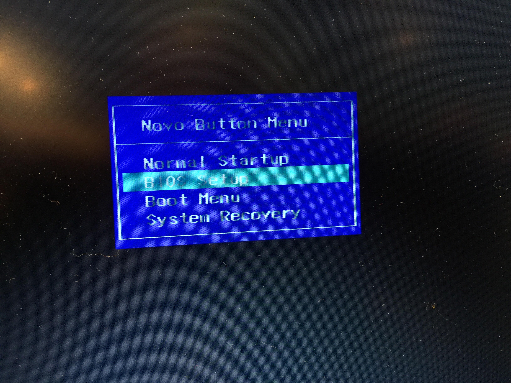
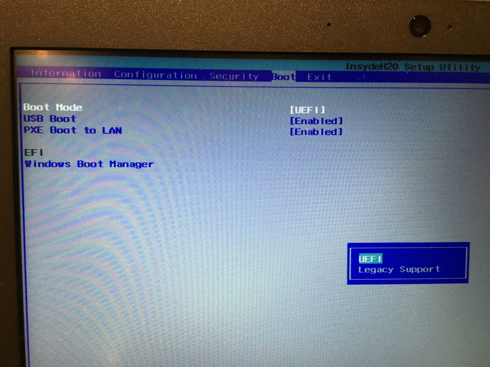
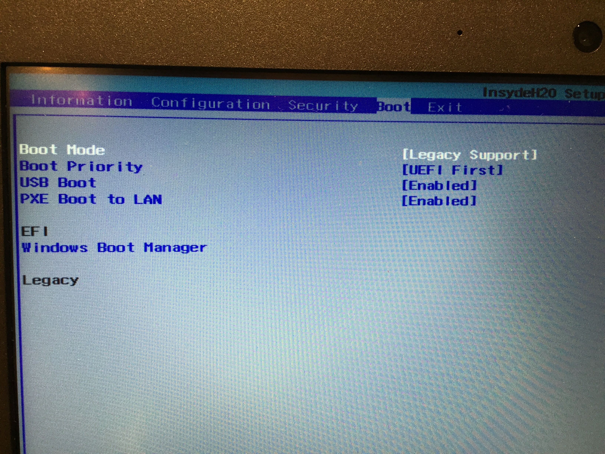

色々と基本機能を評価した後は他の使い道を考えたいということで、Ubuntu でも動かしてみようか？ということでまずは USB からブートする環境を作りたいと思います。そのためには、BIOS の設定を変更する必要があります。

<!--truncate-->

BIOS を立ち上げるには、電源が切れている状況で Fn キーと ESC キーを押しながら電源を入れると以下のような画面が起動します。

もちろん選択するのは BIOS setup の項目ですね。選んだら ENTER を押します。すると次の画面に。 

右のほうにある boot のメニューを開いて boot mode を選んでENTERを押すと、選択肢として legacy support の項目が出ます。

選択すると項目が変更されていることがわかります。これでexit を選択して設定を保存すれば普通のUSBブートもできるようになります。

Fn キーを押しながら F12キーを押すと、以前と違ってブートのメニューが増えていることがわかります。

これで USB メモリからブートできるようになりました。いろいろと遊べる形ですね。

