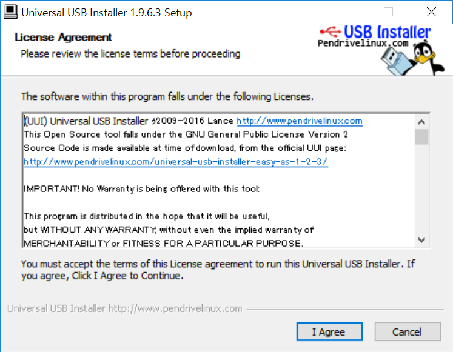
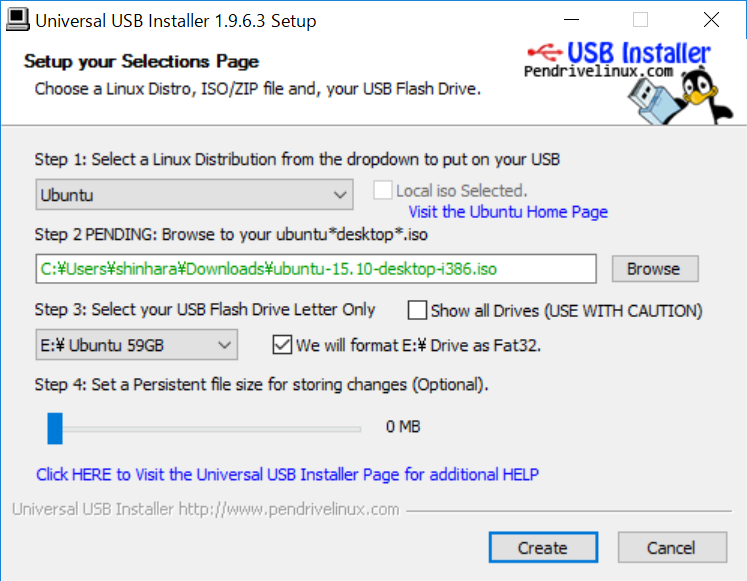
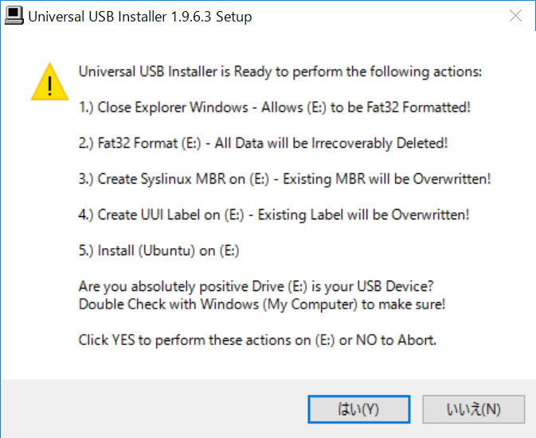
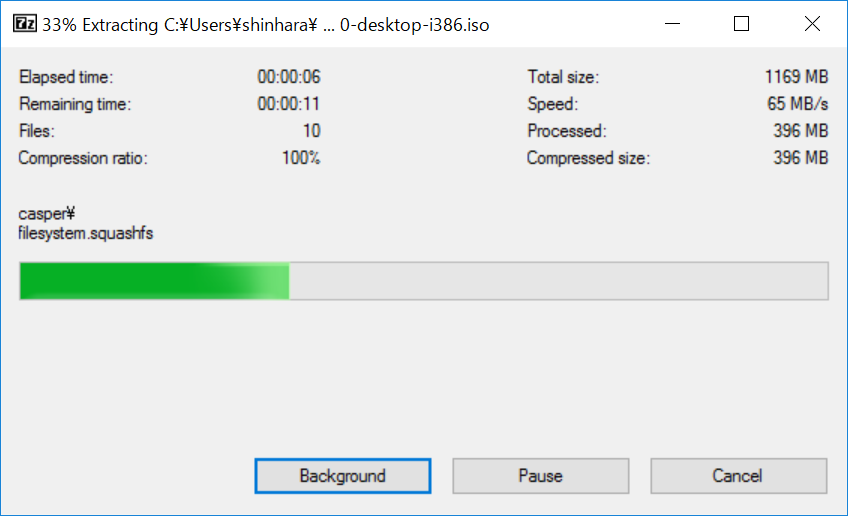
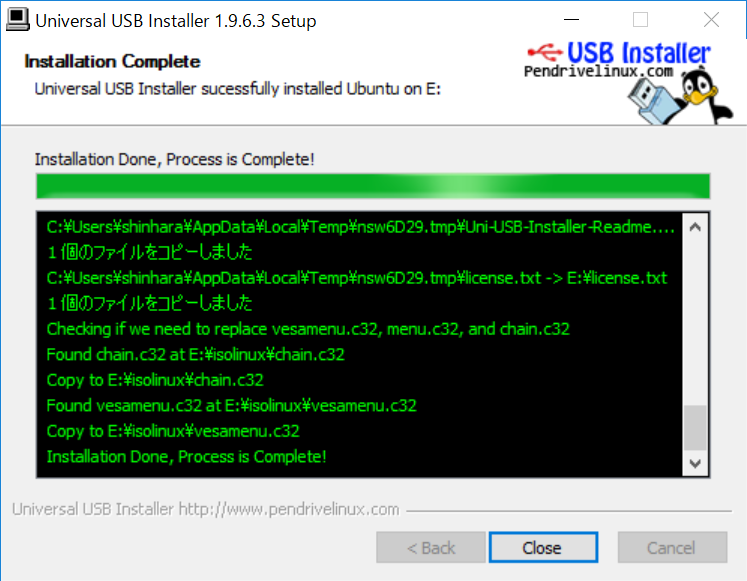
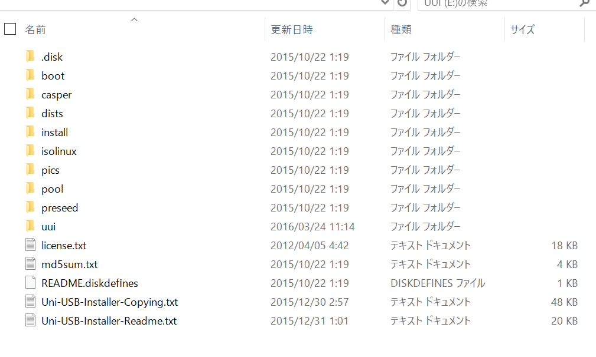

Lenovo s21e は Ubuntu マシンにしようと考えています。私が Linux を利用していたのはもう 10 年ぐらい前、だいぶ記憶がないのですがコマンドラインベースでの作業はそれほど嫌いではありません。ということで、リハビリがてら Ubuntu マシンを作ろう、というのが今回の企画です。

<!--truncate-->

まずはインストーラーですが、非常に簡単に作れます。まずは ISO ファイルを http://www.ubuntu.com/download/desktop からダウンロードします。

今回は Universal USB Installer を利用することにするため、続いて USB に焼くためのツールを http://www.pendrivelinux.com からダウンロードします。

まずはインストーラーを起動すると、以下の画面になります。

ここでは当然 I Agree を選択、続いてインストールイメージを選択します。今回は iso ファイルを指定して、以下のような感じで作成をしました。

Create をクリックするといろいろな警告が出てきます。USBがフォーマットされていいのを確認して、OKを実行しましょう。

すると USB メモリの作成に入っていきます。

USB の作成が完了したら以下のような感じの画面になります。

これで USB ブートすることができる Ubuntu が出来上がりました。

先日記載した [Lenovo s21e の BIOS の設定後](blog/2016/03/27/lenovo-s21e-bios/)、USB ブートで Ubuntu を USB から起動することができるのを確認しました。