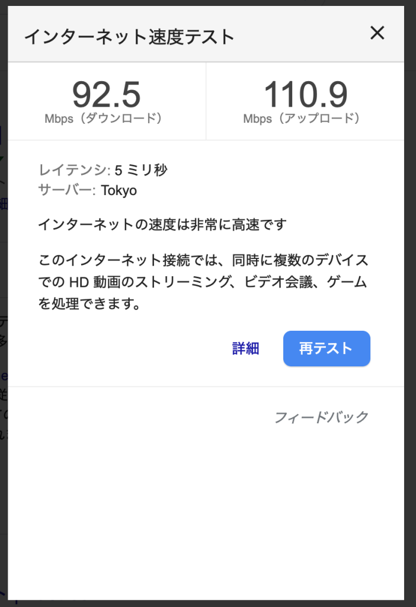
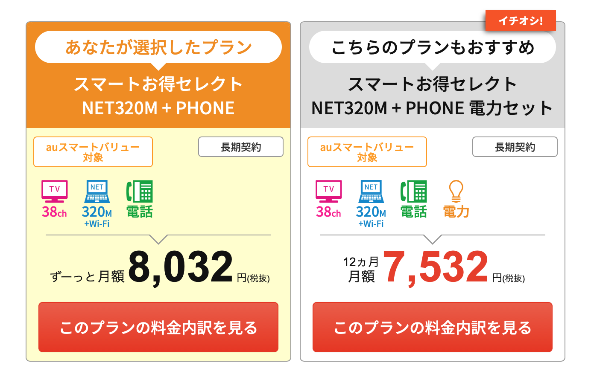

お引越しをしたあと、アンテナを建てるかケーブルテレビを契約するか、など色々と考えたのですが、工事の日程調整がアンテナ工事だと時間がかかること当時の課題になりました。JCOM だとすぐに工事ができてテレビもネットも一気に揃うから便利だ！と思って契約をしてみたものの、毎月 8,000円以上の支払いが来るのは、あまりケーブルテレビのチャンネルの番組をみてないし、むしろ BS とか録画することができず（できるのですが、めちゃ不便）、そして 4Kのサービスが始まったものの、やっぱりチューナーの部分を握られてしまって、なんだか悔しいので変更することにしました。

<!--truncate-->

まずはインターネットに関してどうするか？なのですが、 Nuro 光が調布にもやってきたのでネットはこれでいいだろう！ということで、実は 2019 年 4 月に契約しました。なんかキャッシュバックキャンペーンをやっていて工事費も無料だし、多少被ってもいいや、ってことで決断は早く、すでに我が家は Nuro 光です。スピードテストしてもそこそこ速いので満足しています。

Nuro 光のスピードテストの結果

続いてテレビに関してはアンテナの工事をしないといけないのですが、2019年9月が JCOM 契約2年縛りの解約をしても手数料がかからない期間、ということで9月頭にさっそく「解約します！」って連絡をしました。

このため毎月の費用の削減としては JCOM 8,482円 – Nuro 光 5,665円 = 2,817 円の削減ができました。実はアンテナ工事で 6万円ちょっとかかった形となります。一時的な支出が増えたものの、毎月の費用を抑えることができただけでなく、BS のチャンネルに関して全部の部屋で観れるようになり！録画も撮れるようになりました。って、一番観たかったランスマが闇営業の影響で放送されてない状況が続いていますが、、、グレートレースとかキーワードで予約撮れるようになるので便利！

アンテナが自前になったら、安心して 4K チューナーをどういう風にいれていくのか、なども検討ができるようになりました。ということで、アンテナ工事に関してはまた別のお話で（[つづく](2019-09-27-4k-bs-antenna.md)）
