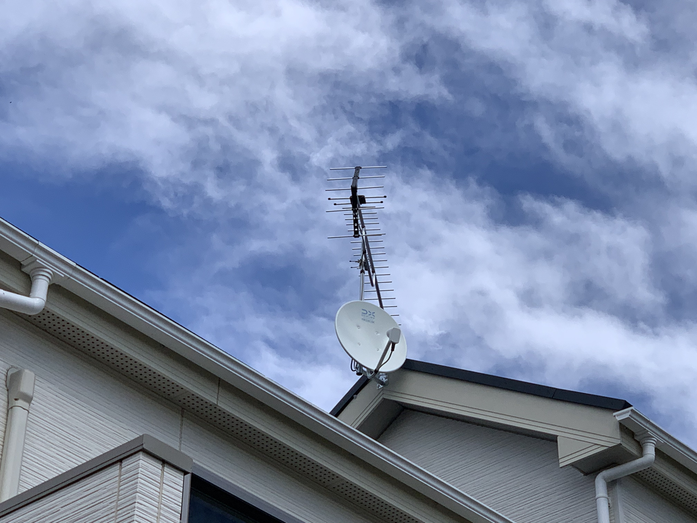

先日、JCOM からの離脱の話を書きましたが、インターネットは Nuro 光にしましたが、アンテナはどうしよう？という感じで7月ぐらいから色々と調査をしていました。

<!--truncate-->

某大手家電に行ってみたところ「見積もりは無料ですよ」という話になり、どういうアンテナを付けれるのかというのと電波の具合をチェックしてもらうことにしました。で、来たのは某大手家電の人かと思ったら、街の電気屋さんっぽい人がやってきます。ま、それはよしとしてざっと見積もりをしてもらったら設置とアンテナの部品などコミコミで10万円と言われます。うーん、なかなかいい値段だな、、、少し先にしようかな、とか思いました。

すると工事に来たおっちゃんが名刺を出して「直接、アンテナ工事を出していただけるなら、工事費無料にして部品代だけで設置します！」ということで、7万円ぐらいでやりますとのこと。それ、ええんかい！と思いながら、とりあえず名刺だけもらっておきました。

調べてみたのですが、普通のアンテナと BS アンテナ（ 4K 対応）を取り付けであれば 5 万〜6 万円ぽっきりでやります、という会社がネットでは色々と引っかかります。足りないのは 4K に関してはブースターが必要っぽくて、それを購入すればいい感じ、ということでネットで見つけた会社に連絡をしてみました。

* [みずほアンテナ](https://mizuho-a.com/)

工事の日程が決まったので、そのあとそそくさと JCOM に全部解約しまーすという連絡をしました（今月で契約終了ですが、撤去は月末の予定）。

工事の方が来て、電波の状況をみてもらったらデザインアンテナはちょっと弱くて拾えないとのこと、普通のアンテナなら OK ですよ、ということで（実は5000円安くなる）普通のアンテナにしてもらいました。電波の状況の確認が30分、工事は30分、という感じであっという間に工事が終わりました。線もきれいに隠してあるので、いい感じの工事をしてもらいました。

その後、Amazon で 4K のブースターを購入、それを自分でつけて完了。リビングでしか見えなかった BS が全ての部屋で観れるようになり、録画もできるようになりました。そうだよ！これだよ！！って感じで、なぜ最初にアンテナをつけなかったのだろう？って思うばかりです。トータルの費用的には一時的な支出を割ると来年末ぐらいまでの差額を一括で払ったような感じですが、トータルでは絶対にお得な工事をしたわけです。

と、JCOM の頃から１つダウングレードしたままなのは、4K チューナーが家になくなったので、4K の番組が見れなくなりました。リビングと寝室は 4K 対応のテレビなのに。ということで、年内に購入する予定に 4K チューナーが追加されるのでありました。

