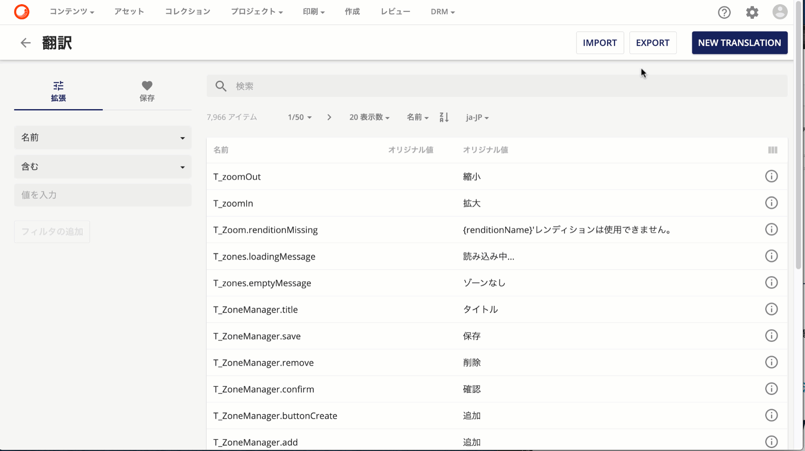
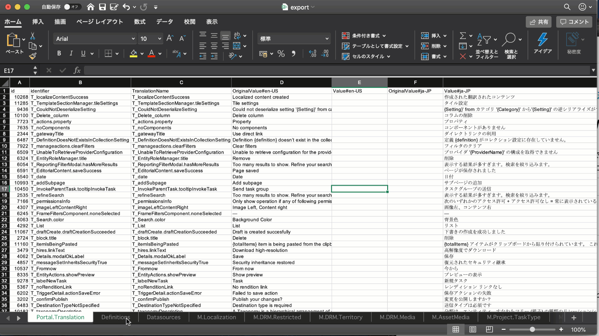

管理画面に「翻訳」というツールがあります。このツールは、ツール自体が翻訳をすることはありませんが、翻訳をしたデータを管理するためのツールとなっています。これを利用することで、管理画面で利用する様々なリソースを翻訳し、多言語展開をするためのベースとして利用できる形となっています。

<!--truncate-->

## 翻訳用語管理として

このツールでは、名前（ページの中で利用されている識別子）に対して多言語で管理をするための仕組みを提供しています。実際の管理画面は以下の通りです。

言語を追加する手順に関しては、以下の記事で既に取り上げていますので参考にしてください。

* [日本語リソースの追加](2020-03-13-sitecore-content-hub-jajp.md)

## インポート / エクスポート

Sitecore Content Hub で管理している様々なリソースに関して、この画面から Export （出力、ダウンロード）することができます。実際に Export のボタンをクリックすると、しばらくるとダウンロードに表示されます

実際にダウンロードした Excel ファイルを参照すると、以下のようなファイル形式となっています。

このように、すでに Sitecore Content Hub で管理している様々なリソースのうち、翻訳に対応している項目をすべてエクスポートされていることがわかります。

このツールを利用することで、対象となる言語を追加した場合の手順の簡略化、用語の取り扱いに関して社内での翻訳用語に合わせたい、というニーズに素早く対応することができます。また、追加のページやコンポーネントを作成した場合も、このツールを利用することができるようになっています。

## まとめ

翻訳を利用することで、Sitecore Content Hub で利用するリソースそれぞれに多言語でデータを持つことができるようになります。

## 関連情報

* [Sitecore Content Hub クイックガイド](/docs/Sitecore/Content-Hub-Quick-Guide)
* [Portal Translation](https://docs-partners.stylelabs.com/content/3.3.x/user-documentation/administration/portal/translations/portal-translations.html) （英語）
* [Exporting and Importing Translations](https://docs-partners.stylelabs.com/content/3.3.x/user-documentation/administration/portal/translations/translations-import-export.html) （英語）