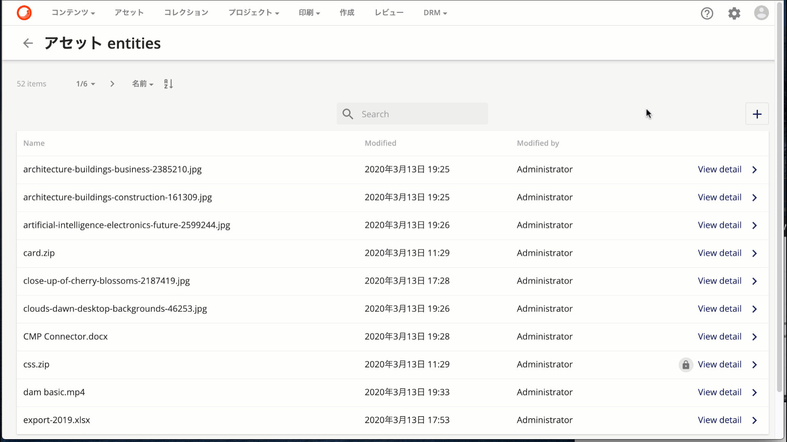
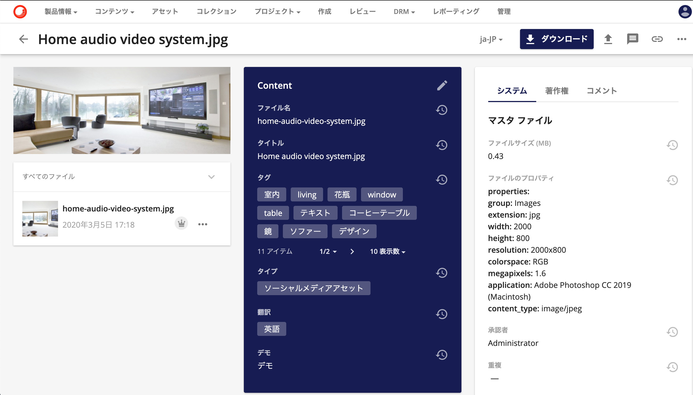
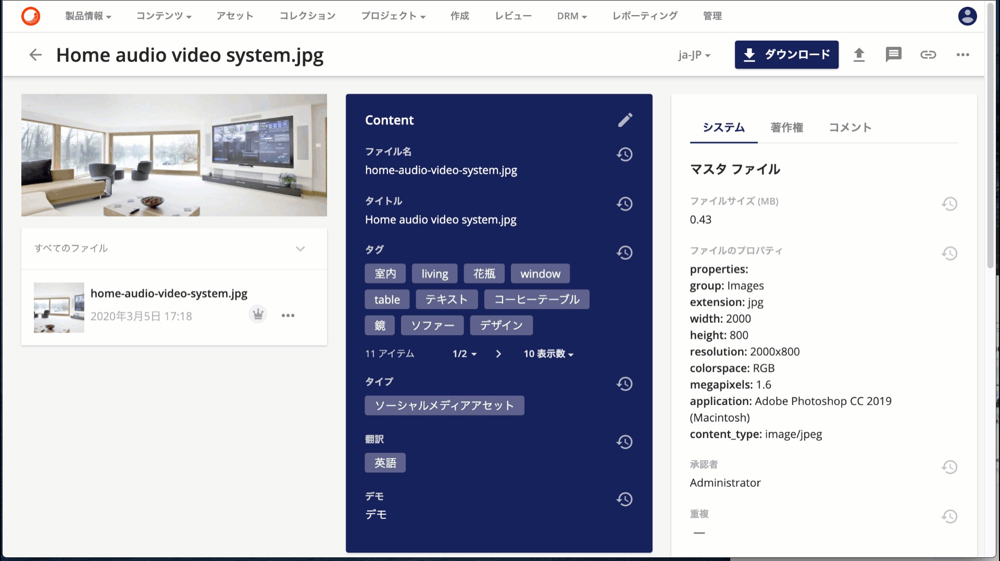

前回、データの定義の方法ということで「[スキーマの定義](2020-03-23-sitecore-content-hub-schema.md)」に関して紹介をしました。今回はその定義を利用したデータ、エンティティに関して紹介をします。

<!--truncate-->

## エンティティとは
エンティティとは Sitecore Content Hub で管理をするデータの単位となり、定義されているスキーマの構造によって、エンティティの管理するデータの構造が変わる形となります。

エンティティのツールを利用することで、データを確認することができます。

## エンティティの確認

では実際にエンティティツールで表示されている一覧から、View Detail をクリックして詳細を参照します。

データを見ると、スキーマの定義に対してどういうデータを設定しているか、という詳細の情報を見ることができます。検索では、タクソノミーで検索、文字列で検索などを実行できるため、対象となるエンティティを指定して、細かいデータを見ることができるようになります。

## Web サービス経由でアクセス

エンティティとして管理している情報は、アセットであれば以下のように画面で登録情報を確認することができます。

該当するエンティティに対して、Web サービス経由でアクセスをして JSON 形式のデータを取得することができます。

## まとめ

エンティティに入っているデータを確認することができました。データの構造をスキーマで定義をして、エンティティという形でデータを持つことができます。入力されたデータのステータスやワークフローの状態なども Entity の詳細を参照することで、現在の状況がどういうデータになっているのかを確認することができます。

## 関連情報

* [Sitecore Content Hub クイックガイド](/docs/Sitecore/Content-Hub-Quick-Guide)
* [スキーマ定義について](2020-03-23-sitecore-content-hub-schema.md)
* Schema – [Entity Definitions](https://docs-partners.stylelabs.com/content/user-documentation/administration/data/schema/intro.html?v=3.3.0) （英語）
* [Entities](https://docs-partners.stylelabs.com/content/user-documentation/administration/data/entities/intro.html?v=3.3.0) （英語）
