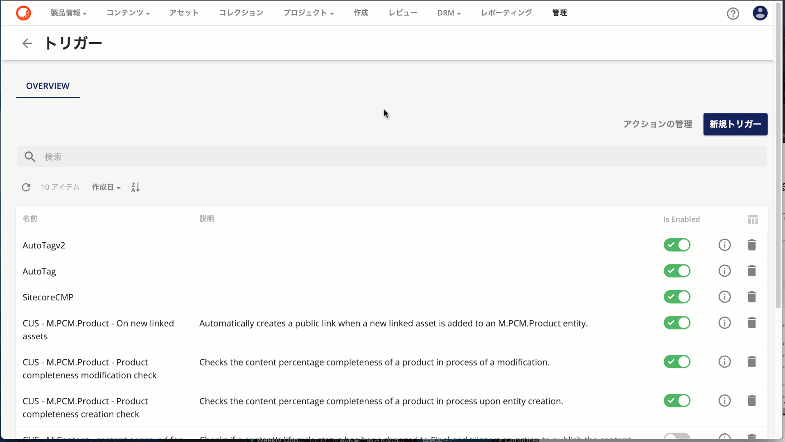
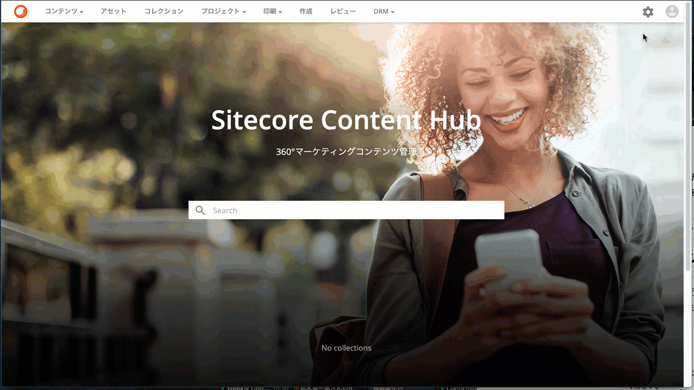
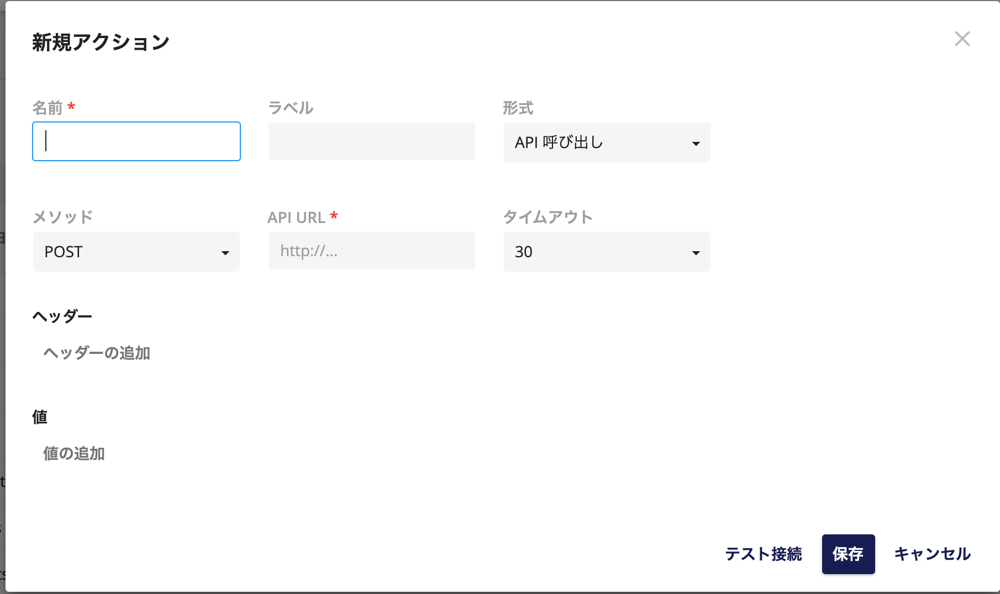
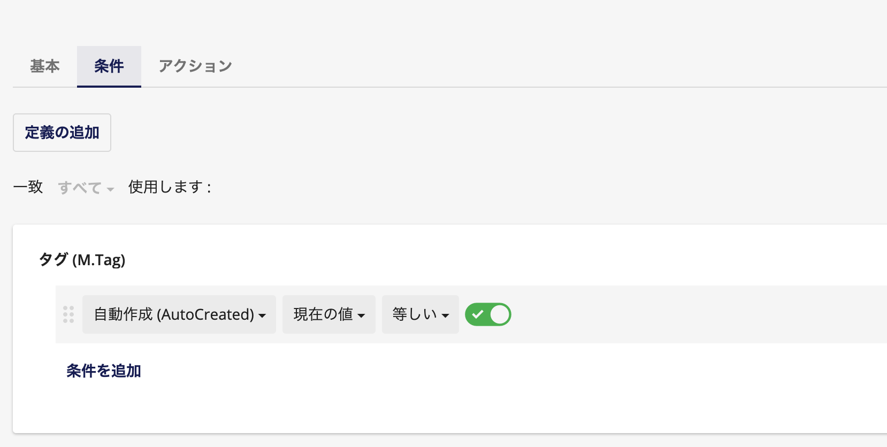
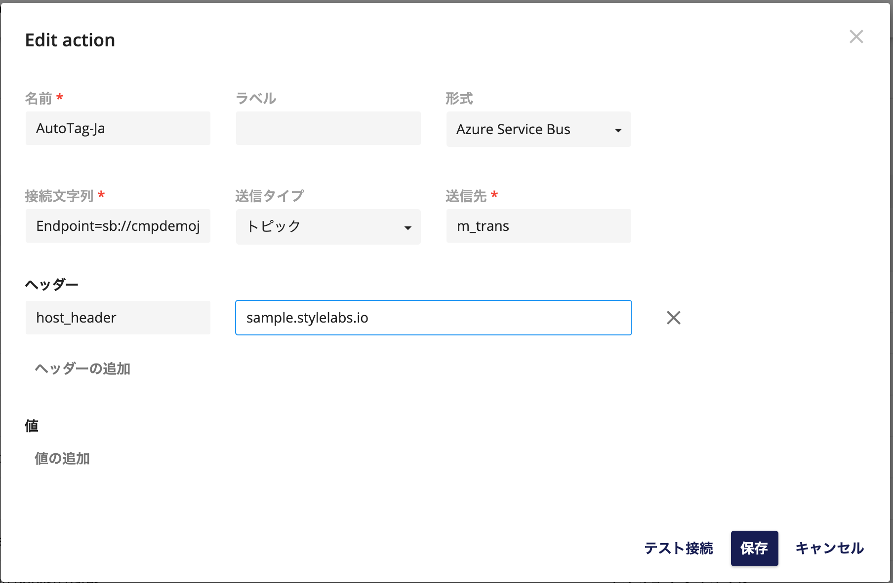

Sitecore Content Hub の基本機能として、エンティティの変更に合わせてトリガーとアクションを設定することができます。今回は、どのようにトリガーを設定して、アクションと連携させるのかに関して紹介をします。

<!--truncate-->

## トリガーとは

トリガーを設定するツールには、管理画面からアクセスすることができます。

トリガーでは、標準で設定されているものが契約によって含まれているケースがあります。この画面では、CMP で利用するトリガーが設定されていることがわかります。

トリガーの画面の新規作成は以下のような形で、どのエンティティが変更されたのか？という条件を設定し、それに紐づくアクションを設定する形です。

## アクションとは

何らかの処理を実行したい、という定義をするものがアクションとなります。アクションに関しても、管理画面からアクセスすることができます。

新規アクションを作成する場合、以下のようなダイアログが表示されます。

アクションで実行できる形式は以下のようになります。

* API 呼び出し
* Azure Event Hub
* Azure Service Bus
* M Azure Service Bus
* アクション スクリプト
* エンティティ生成ジョブのインサウt
* ステートマシーンの開始
* レポートチャンネル

このブログでよく紹介することになるのが、Azure Service Bus との連携になるかと思います。

## トリガーとアクション
設定の手順として以下のような形となります。まず、トリガーで条件を設定します。ここではアセットに対して自動タグが生成された場合のトリガーを作成しています。

このトリガーが呼び出しをしているアクションは以下のような形で定義をしています。

あとは Azure Service Bus にメッセージが送信された際に、Logic App のアプリケーションを動かして、タグで設定されている英語の情報を機械翻訳で自動的に日本語に変更する、という処理を自動的にできるようにしました（作り方に関しては後日紹介予定です）。

## まとめ
このように、トリガーとアクションを組み合わせることで、Sitecore Content Hub のエンティティの変更に合わせて、自動処理を実行することができる、というのを紹介しました。今後、この仕組みを利用したサンプルなども提供していきます。

## 関連情報

* [Sitecore Content Hub クイックガイド](/docs/Sitecore/Content-Hub-Quick-Guide)
