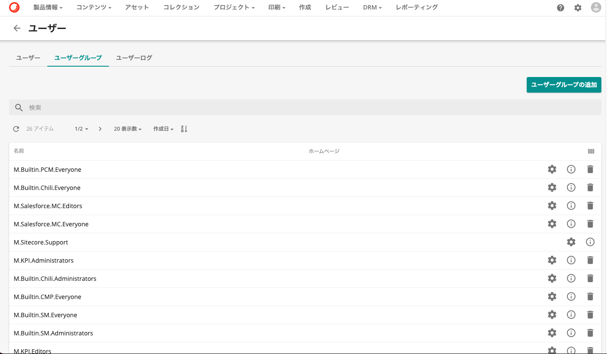
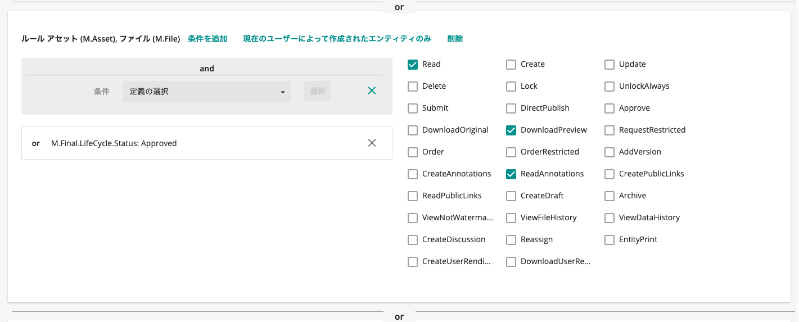
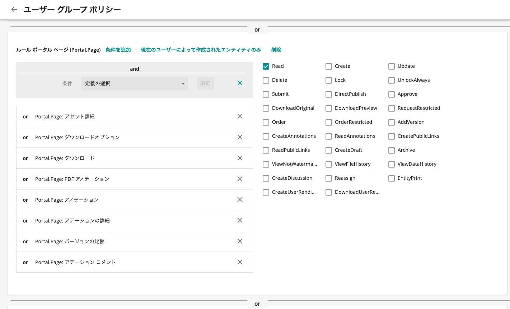
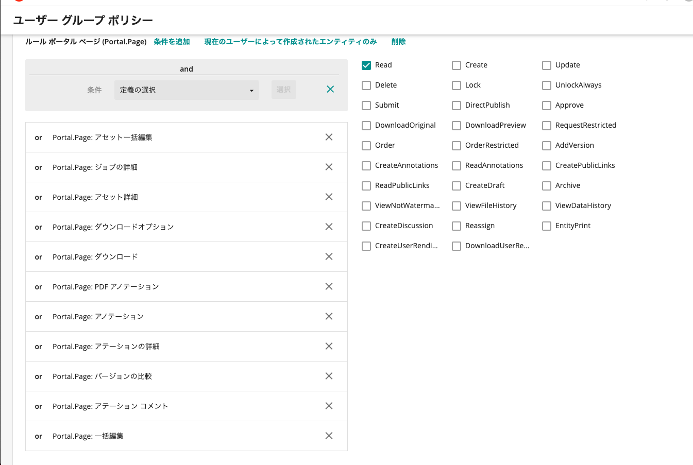
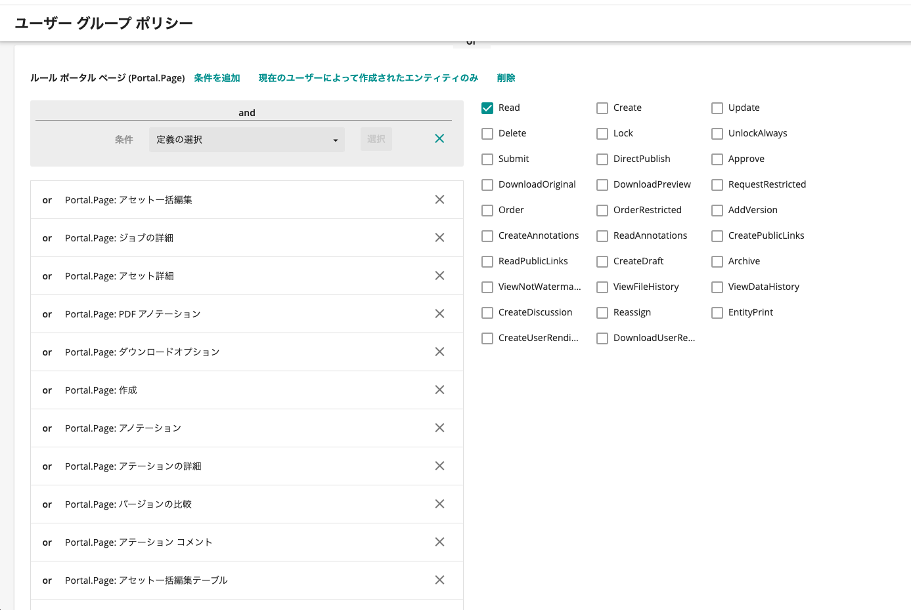

Sitecore Content Hub のユーザー権限は、ユーザーグループに所属する形で付与されます。権限に関しては追加されていく形の権限設定となります。今回はこれに関して簡単に紹介をします。

<!--truncate-->

## 事前に用意されている権限に関して

Content Hub のユーザーグループとしては、以下のような命名規則でユーザーグループが設定されています。

* M.Name1.Name2.Name3

M はシステムが用意している名前で、Name1 には Sitecore が提供しているコンポーネント、もしくはデフォルトで用意している（ Builtin）、そして権限という形です。この命名規則以外でも運用することは可能ですが、標準で入っている命名規則として提供されています。

例えば、以下のユーザーグループの名前、

* M.Salesfoce.MC.Editors

これは Salesforce Marketing Cloud 連携でアセットを編集することができるユーザーという形になります。

## 権限の確認方法

### アセットに関して権限

それぞれのユーザーグループがどのような権限を持っているのかを確認するためには、管理画面でユーザー、ユーザーグループの画面に切り替える形となります。

今回は、M.Builtin.Readers のユーザーグループを確認します。ユーザーグループの名前の横にある歯車のアイコンをクリックしてください。すると以下のような画面に切り替わります。

上の画像を見ていただくように、さまざまな権限を組み合わせた内容となっています。例えば、ということで１つ目のルールを参照します。

設定として、左側には条件を追加します。例えば、アセットであれば M.Asset が対象となり、M.Final.LifeCycle.Status: Approved が設定されている、という形です。これにより、

**承認済みのアセット**

に対する権限という形になります。一方、右側のチェックボックスに設定されているのが、そのアセットに対する権限です。今回のものでチェックされているのは

* Read
* DownloadPreview
* ReadAnnotatins

が設定されています。これにより

**承認済みのアセット に対して読み取り、プレビューのダウンロード、アノテーションの参照**

が可能となります。このため、**M.Builtin.Readers** の人が利用できるアセットに関する権限が設定されている形です。権限の一覧を見ると、DownloadOrigiral がチェックされていないため、オリジナルのコンテンツをダウンロードできない形になっているのがわかるかと思います。

### ページに関する権限

権限の組み合わせとして、もう一つ必要となるのがページに関する権限となります。

**M.Builtin.Readers** が Sitecore Content Hub で提供されているページのうち、アセットを表示、検索するなどの作業ができる必要があります。このため、必要となるページに対しての権限を付与しています。

## 組み込み済みのアカウントの確認

初期設定で提供されているユーザーグループのうち、以下のユーザグループを利用して設定していく形になります。実際の運用になった場合は、**M.Builting.xxx** というユーザーグループではなく、各企業で利用したいユーザーグループを作成して、権限の付与をするような運用を想定してください。

| ユーザーグループ名 | ユーザーの権限 | 概要 |
|-|-|-|
| M.Builtin.Readers | 利用者 | アセットを検索、プレビュー画像のダウンロードが可能 |
| M.Builtin.Editors | 編集者 | アセットの編集、削除、更新、リジェクト、作業中のオリジナルのアセットダウンロード |
| M.Builtin.Approvers | 承認者 | レビュー中のアセットへのアクセス、アセットの承認 |
| M.Builtin.Creators | 作成者 | アセットの登録、削除、更新、リジェクト、作業中のオリジナルのアセットダウンロード |

編集者と作成者の違いは利用できるページの違いになります。

*M.Builtin.Editors* は以下のようになります。

そして、*M.Builtin.Creators* には**作成**など、アセットを登録するページに対するアクセス権限がついています。

アセットを登録する人には *M.Builtin.Creators* を、承認する人には *M.Builtin.Approvers* を付与してください。

## まとめ

まずは標準の組み込みの権限を利用して運用していく形となりますが、例えば A というブランドに関するアセット、ページのみの権限、B というブランドに関するアセット、ページに関する権限というユーザーグループを作成、それをユーザーごとに割り当てる、といった運用が可能となります。ユーザーの権限に関しては足し算となりますので、複数の権限を与える場合は、ユーザーに複数のユーザーグループを割り当てる形となります。

## 参考資料

* [User group management](https://docs.stylelabs.com/content/3.4.x/user-documentation/administration/security/users/user-groups/intro.html)