[前回](2021-04-13-nextjs-sdk-part-1.md)は、Next.js のテンプレートからサンプルデータを削除して、日本語のコンテンツを表示するところまで紹介をしました。今回は、このサンプルのサイトを Sitecore Experience Platform と連携させる手順を紹介します。

<!--truncate-->

## 前提条件

今回は Sitecore と Next.js のアプリを接続するために、以下の環境を準備しました。

* Sitecore Experience Platform 10.1
* Sitecore PowerShell Extensions 6.2
* Sitecore Experience Accelerator 10.1
* Sitecore Headless Services Server for Sitecore 10.1.0 XP 16.0.0

また、作業をしやすくするためにドメイン名などは以下の様に設定、ワイルドカード証明書を利用しています。今回の作業をするサーバーは、パブリック クラウドに仮想マシンで立ち上げています（以下の名称は仮称ですので、実際に手元のマシンでは自前のドメイン名などを使うといいと思います）。

* jssdemo.cmsdemo.jp （Sitecore Experience Platform)
* iddemo.cmsdemo.jp ( Sitecore Identity Server )

## API Key の準備

JSS のアプリと Sitecore を連携させるための API キーをまず最初に作成します。

1. コンテンツエディターを開きます
2. sitecore - system - Settings - Services - API Keys のアイテムを選択します

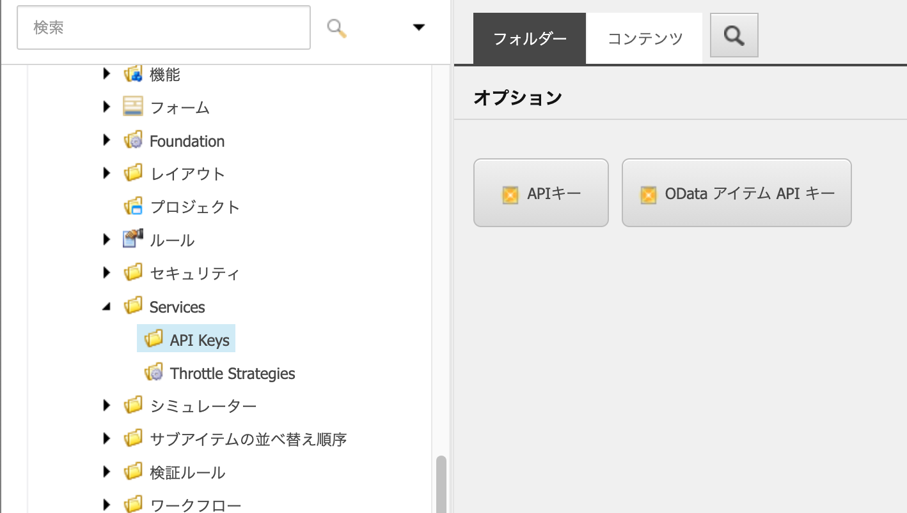

3. 上記の画面の場合は API キーのボタンを、画面が異なる場合はツリーにある API Keys を右クリックして新規 API キーを作成します
4. API キーの名前を入力します

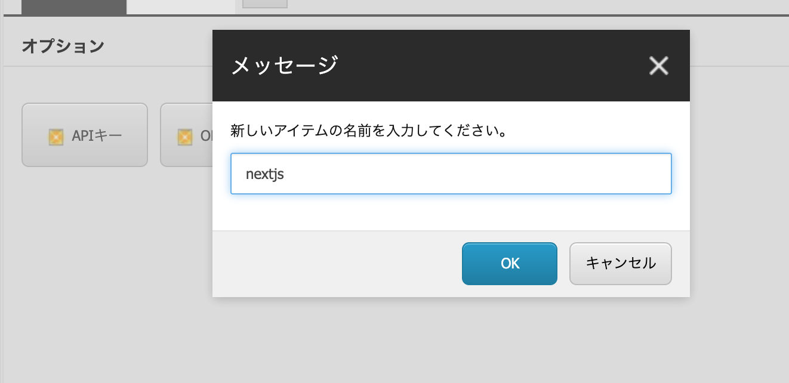

5. CORS Origins と認められたコントローラーのどちらの項目にも * を設定してください。

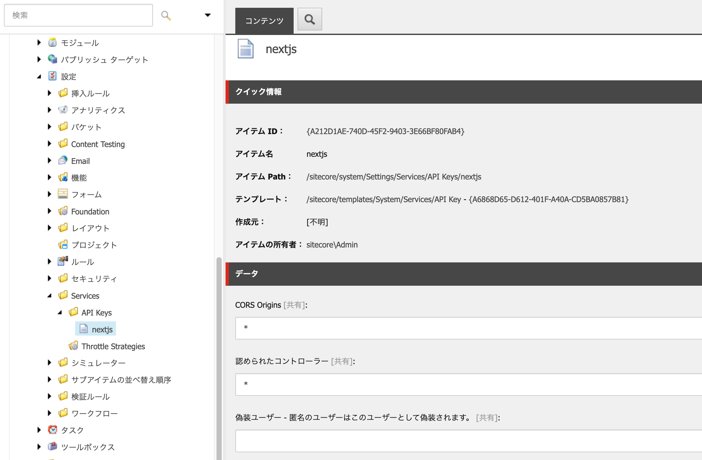

作成をした API Key の Item ID がキーになります。作成したアイテムは公開しておく必要がありますので、以下の手順で公開をしてください。

- **コンテンツエディター**で対象となるアイテムを選択します
- **パブリッシュ**タブを開きます
- **パブリッシュ**のアイコンの ▼ をクリック、**アイテムをパブリッシュ**をクリック

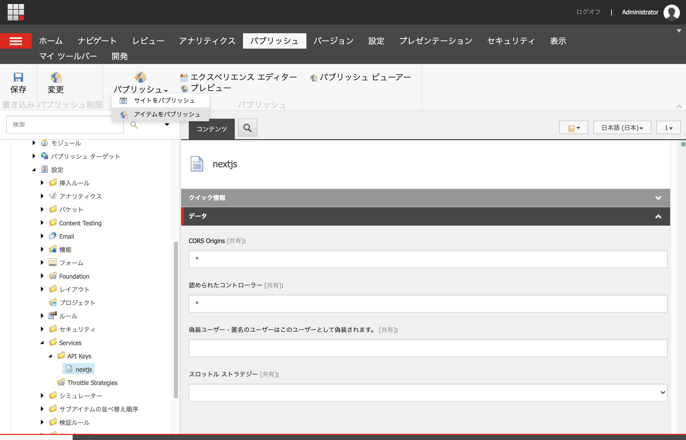

ダイアログで必要な項目をチェックして、パブリッシュを実行します。

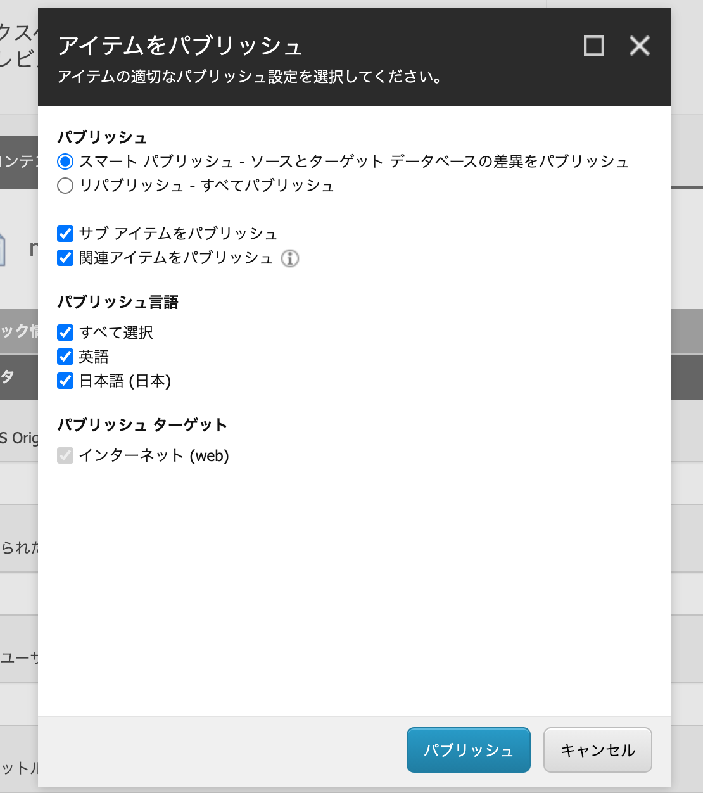

アイテムの公開が完了した際に、API Key が有効になっているかを確認するために、 https://yourhostname/sitecore/api/layout/render/jss?item=/&sc_apikey={YOUR_API_KEY_ID} とAPI キーを追加した URL でアクセスをして、JSON のデータが表示されるか確認をしてください。

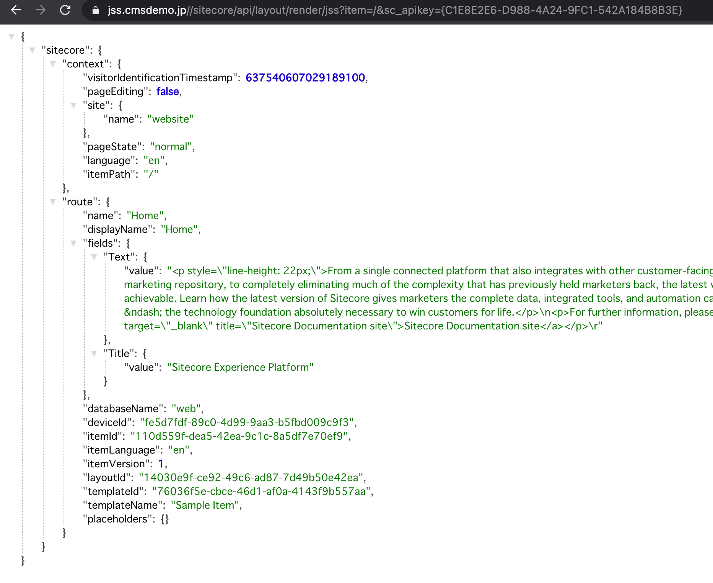

## Next.js アプリの設定

続いて作成した API キーを利用してセットアップを開始します。Next.js のアプリのフォルダーに移動して、JSS のコマンドを実行します。

```
jss setup
```

聞かれる項目は以下の通りです。

* Sitecore のインスタンスはこのマシン、もしくはネットワークで共有されているかを聞かれます。
    * 今回は別のマシンで動かしているため、n を選択します。
* 続いてホスト名に関する情報が表示されます。
    * 今回は、 https://jss.dev.local を入力します
* インポートのサービスの URL が表示されます
    * デフォルトのままで問題ありません
* API Key の確認となります
    * 事前に作成した API キーを入力します
* 展開用の秘密鍵の確認が表示されます
    * ランダムの文字列を自動生成するので空欄のまま

上記の作業が完了すると、必要なファイルが生成されます。

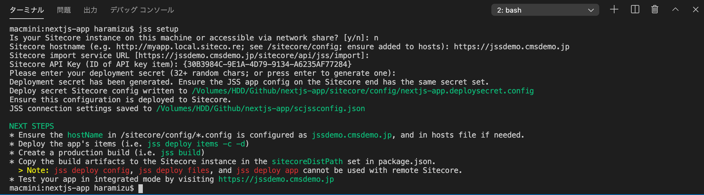

上記のメッセージを参照すると、展開のための秘密鍵は sitecore/config/nextjs-app.deploysecret.config の中のファイルに記載されていることがわかります。

## Sitecore に設定を反映させる

ネットワークで直接 Sitecore のインスタンスにアクセスできる場合は、以下のコマンドを実行すると設定ファイルがコピーされます。

```
jss deploy config
```

今回は、仮想マシンとの接続で繋がっていないため、 jss setup を実行したあとに作成される、/sitecore/config の 2 つの config ファイルをコピーします。

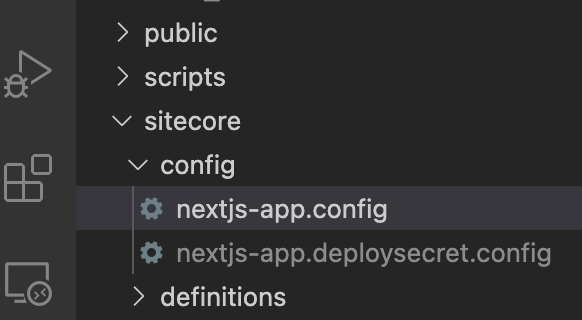

App_Config¥Include¥zzz のフォルダを作成し、2 つのファイルを Sitecore の設定フォルダにコピーすると jss deploy config と同じ作業をしたことになります。

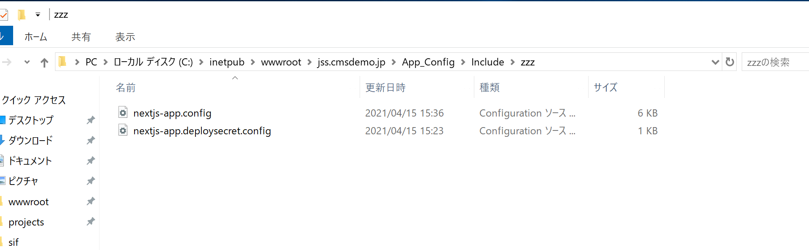

## インポート

上記の設定が完了していれば、後はコマンドを実行するだけとなります。

```
jss deploy items -c -d 
```

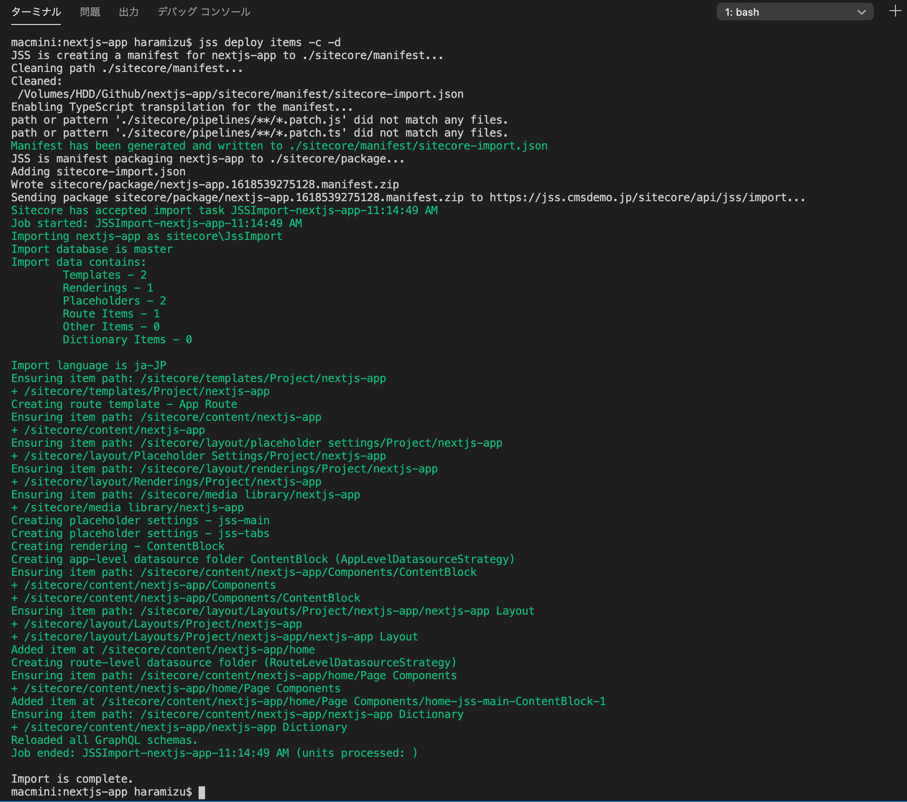

インポートが完了すると、以下のように Sitecore のコンテンツツリーにアイテムが表示されます。

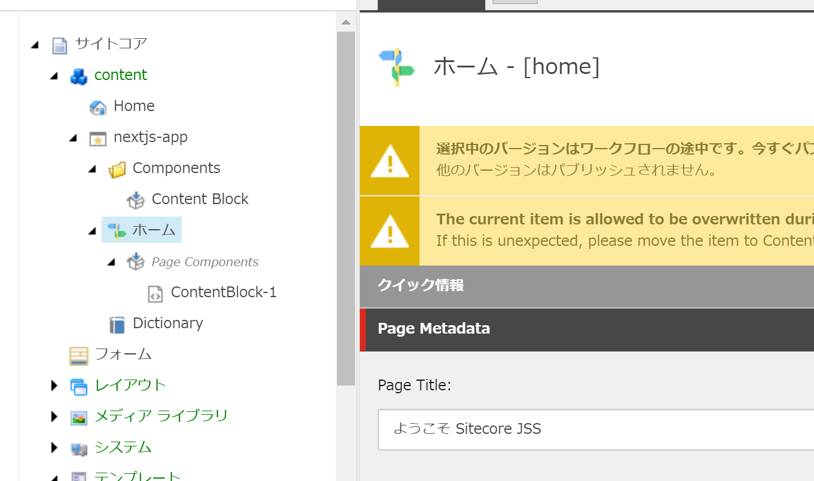

## まとめ

今回は Next.js のアプリで持っているデータを、Sitecore の中にインポートをする手順を紹介しました。Next.js と Sitecore の連携に関してはまだいくつか Tips がありますので、あと数回に分けて紹介をしていきます。

* [Sitecore JSS - Next.js SDK を利用してサンプルサイトを構築 - Part.3](2021-04-19-nextjs-sdk-part-3.md)