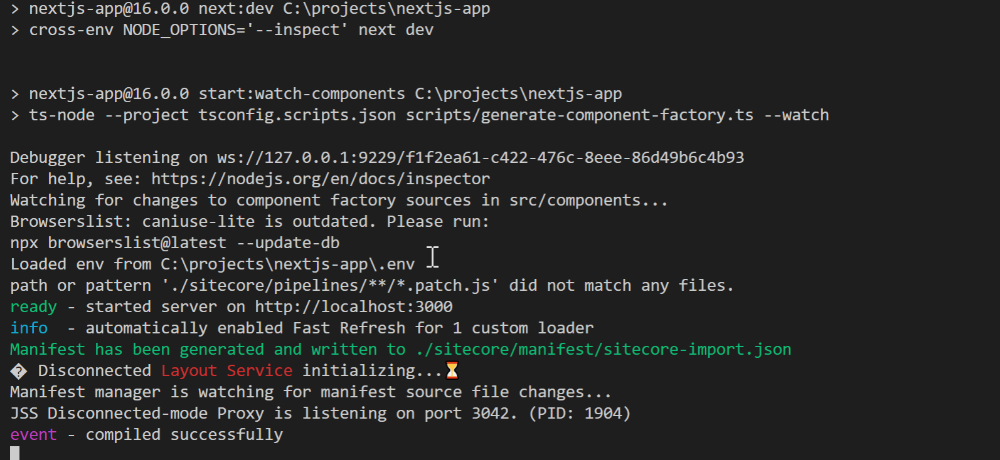
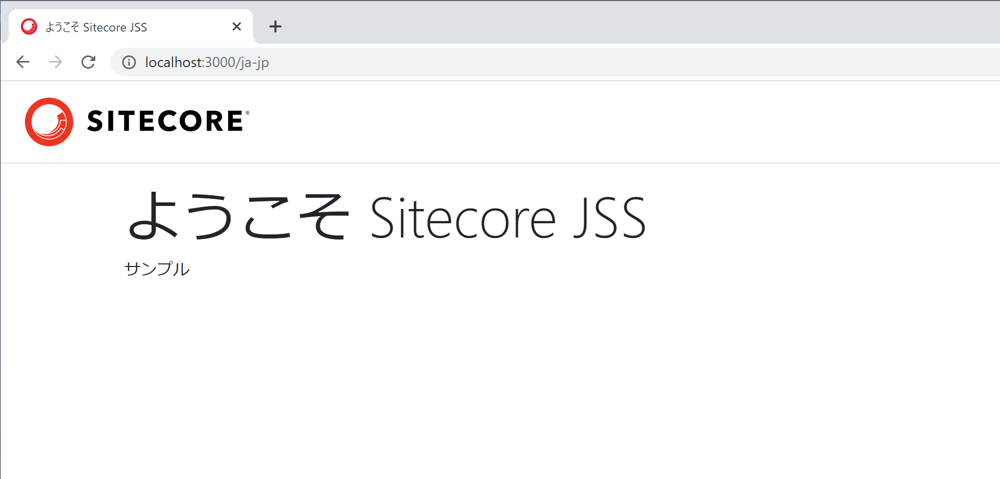
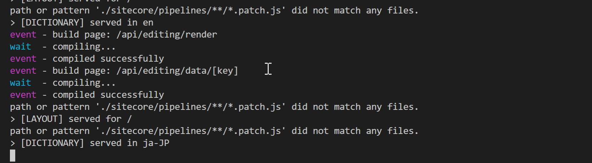
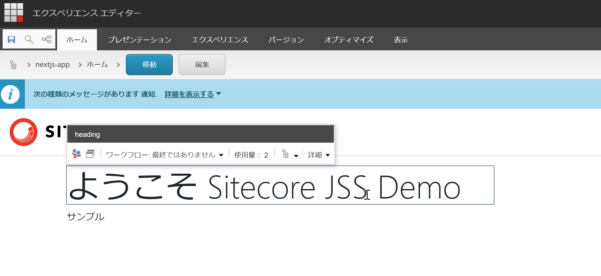
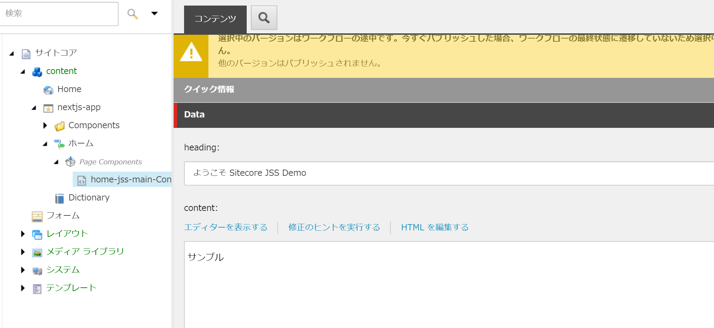

これまで2回にわたって基本的なポイントを紹介していましたが、今回は Next.js で作っているページを Sitecore のみたまま編集ツールであるエクスペリエンスエディターと組み合わせて動かす手順を紹介します。

<!--truncate-->

## 前提条件

Next.js のアプリと Sitecore を連携させている場合、Sitecore 単独ではエクスペリエンスエディターは動作せず、Next.js のアプリが起動している状態で Sitecore がアプリと連携をしてエクスペリエンスエディターが動くという仕組みになっています。

今回は、Sitecore と Next.js のアプリが同じマシン上で動かしていることを前提として紹介をします。

## Sitecore 側の設定

設定ファイルは、すべて App_Config\Include\zzz にコピーされている appname.config （appname は手元のアプリの名前です）を変更することになります。

Sitecore は動作している Next.js のアプリのレンダリングの URL が必要となります。例えば、デフォルトでは以下の様な形で記載されているかと思います。

```
<app name="appname"
    sitecorePath="/sitecore/content/appname"
    useLanguageSpecificLayout="true"
    graphQLEndpoint="/sitecore/api/graph/edge"
    inherits="defaults"
    serverSideRenderingEngine="http"
    serverSideRenderingEngineEndpointUrl="http://localhost:3000/api/editing/render"
    serverSideRenderingEngineApplicationUrl="http://localhost:3000"
/>
```

**serverSideRenderingEngineEndpointUrl** および **serverSideRenderingEngineApplicationUrl** が Next.js と連携させるための情報となります。今回は、同じホストで動かすので、このままの設定で進めていきます。

続いて、 **JavaScriptServices.ViewEngine.Http.JssEditingSecret** の項目あり、この項目に Next.js のアプリと接続するためのシークレットキーを設定してください。基本的には文字列になっていない難読なものものが良いのですが、今回は動作確認のため、サンプルの設定のままとします。

```
<setting name="JavaScriptServices.ViewEngine.Http.JssEditingSecret" value="MySuperSecret" />
```

## Next.js 側の設定

すでに動いている Next.js のディレクトリのトップレベルに .env というファイルが準備されています。このファイルの JSS_EDITING_SECRET に Sitecore に設定しているシークレットキーをそのまま適用してください。

```
JSS_EDITING_SECRET=MySuperSecret
```

## 起動方法

Sitecore は Next.js のアプリが起動していないとレイアウトサービスがない形となるため、まず最初に Next.js のアプリを起動してください。

```
jss start
```



http://localhost:3000 にアクセスしてページが見えているのを確認します。



起動しているのを確認したあと、コンテンツエディターで対象となるアイテムを選択、エクスペリエンスエディターを開いてください。コンソールには Sitecore からのアクセスがきていることがわかります。



しばらくすると、エクスペリエンスエディターが開いて、文字に関して編集することが可能となっています。



実際に編集を保存、その後コンテンツエディタを参照しにいくと、更新されていることがわかります。




## まとめ

Next.js を利用している場合でも、みたまま編集となるエクスペリエンスエディターを利用することができます。この機能を利用できる様に、設定を忘れずにしておきましょう。

* [Sitecore JSS - Next.js SDK を利用してサンプルサイトを構築 - Part.4](2021-04-20-nextjs-sdk-part-4.md)

## 参考ページ

* [Walkthrough: Connect your Next.js App to the Experience Editor](https://jss.sitecore.com/docs/nextjs/experience-editor/walkthrough)