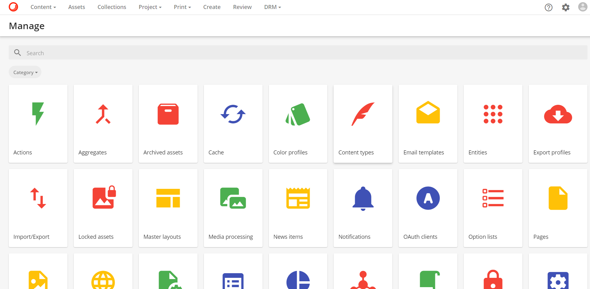
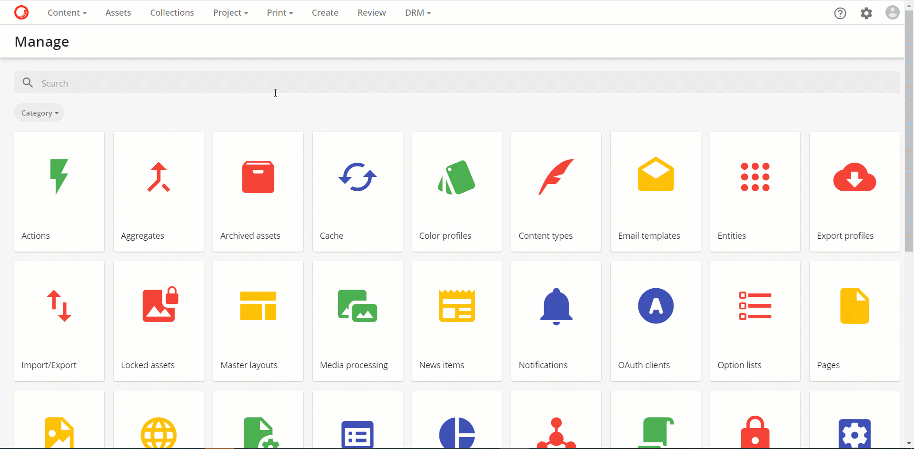
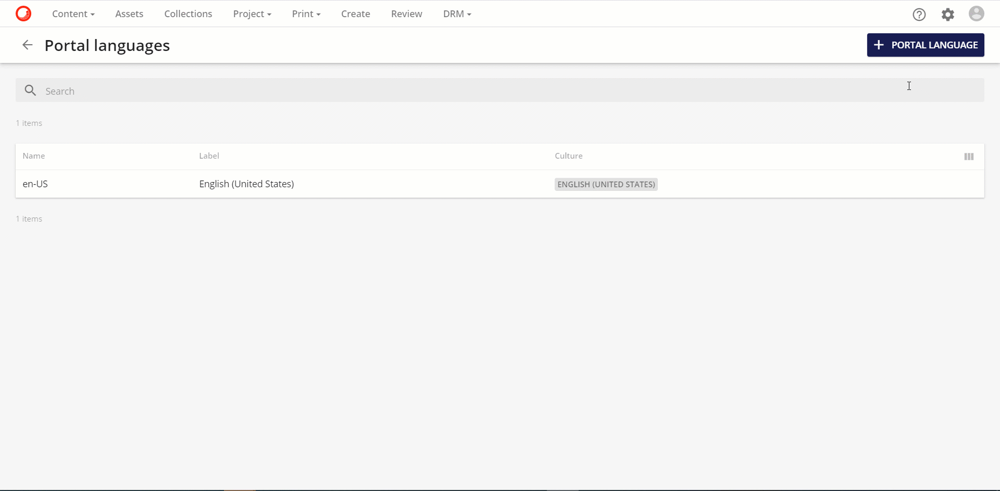
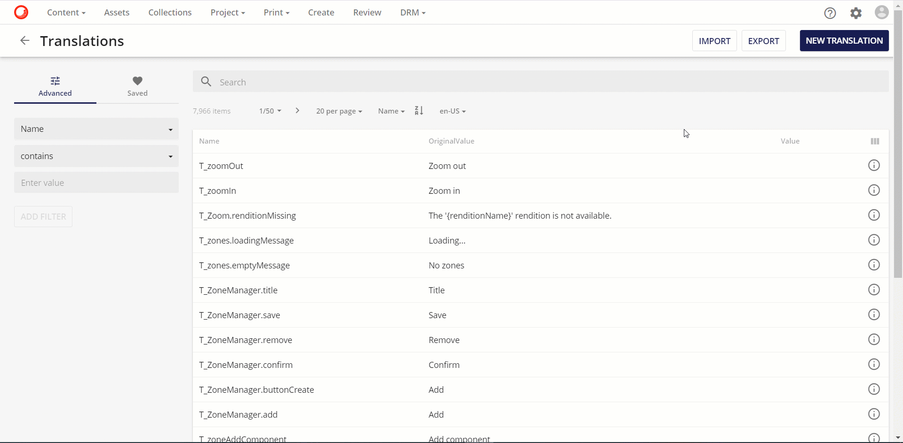
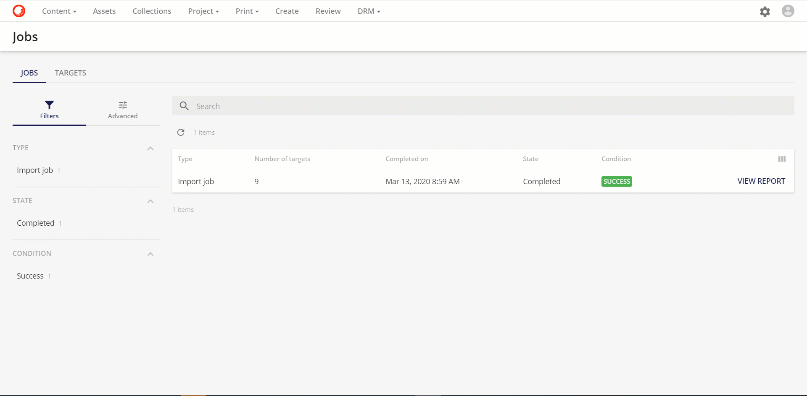

今回は Sitecore Content Hub の管理画面に関する手順を紹介します。Sitecore Content Hub は管理画面として、英語のユーザーインターフェイスを提供しています。今回は、日本語のユーザーインターフェイスを追加する手順を紹介します。

<!--truncate-->

## 言語の追加
Sitecore Content Hub の新しいインスタンスを立ち上げると、以下のように英語のユーザーインターフェイスになっています。

言語の追加に関しては、管理画面で実行することができます。右上にあるアイコンの右から2つ目のアイコンをクリックすることで、管理画面に移動することができます。

言語の追加は「Portal Language」のツールになります。アイコンから選択するのもよいですが、上の検索ボックスを利用すると素早く見つけることができます。

右上にある Portal Language のボタンをクリックして、 ja-JP の定義を追加します。

これで言語の追加手順は完了しました。

## リソースの追加
続いて日本語リソースを追加します。日本語のリソースファイルは Excel のファイル形式で提供しており、１つのファイルをインポートすることで、日本語の管理画面に切り替わります。

言語リソースの管理に関しては、管理画面にある Translation を選択します。

Translation の画面の右上に、Import / Export のボタンがあります。今回は Import をクリックして、Excel のリソースファイルをインポートします。

リソースの追加の実行状況に関しては、ユーザーの Jobs から確認することができます。

インポートが完了したあとは、次のステップに進んでください。

## キャッシュをクリアする

インポートしたリソースは随時反映されますが、キャッシュをクリアすることで即時反映させることができます。日頃の運用ではあまり利用しませんが、UI の変更やリソースの変更をした際には、キャッシュのクリアですぐに確認ができます。

手順は非常に簡単で、管理画面にある「Cache」ツールを起動して、クリアを実行するだけです。今回はすべてのキャッシュをクリアしました。

## 言語を切り替える
管理画面の言語に関しては、ユーザーが選択することができます。今回、日本語を追加したことで、言語選択のダイアログに日本語が追加されました。追加方法は、右上にあるプロファイルのアイコンをクリックして、「Change Language」をクリック、日本語を選択するだけです。

## まとめ

以上の手順で、Sitecore Content Hub の管理画面において、日本語を使うことができるようになりました。同様に他の言語のリソースを作成、インポートすることで、Sitecore Content Hub の管理画面を多言語で利用できるように拡張することができます。

## 関連情報

* [Sitecore Content Hub クイックガイド](/docs/Sitecore/Content-Hub-Quick-Guide)