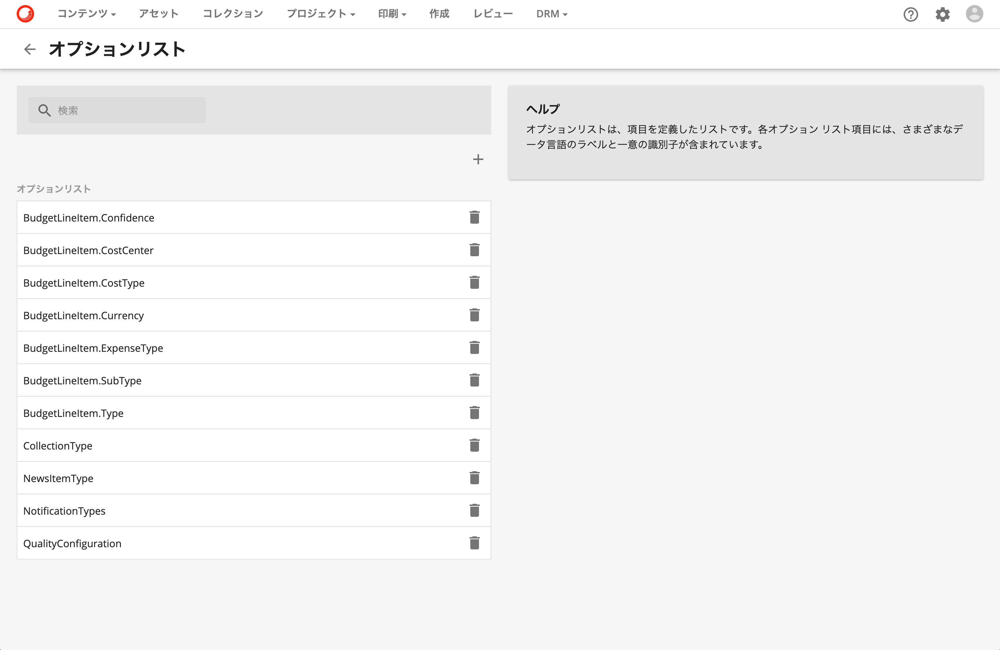
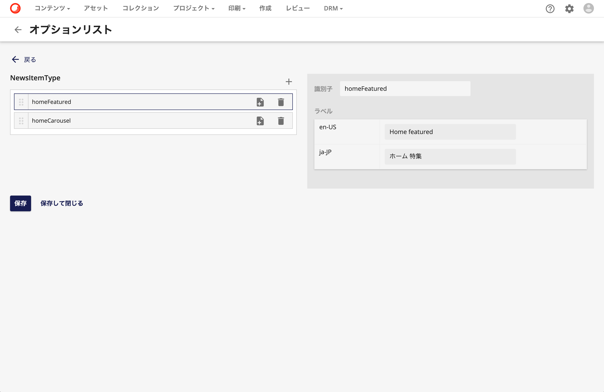
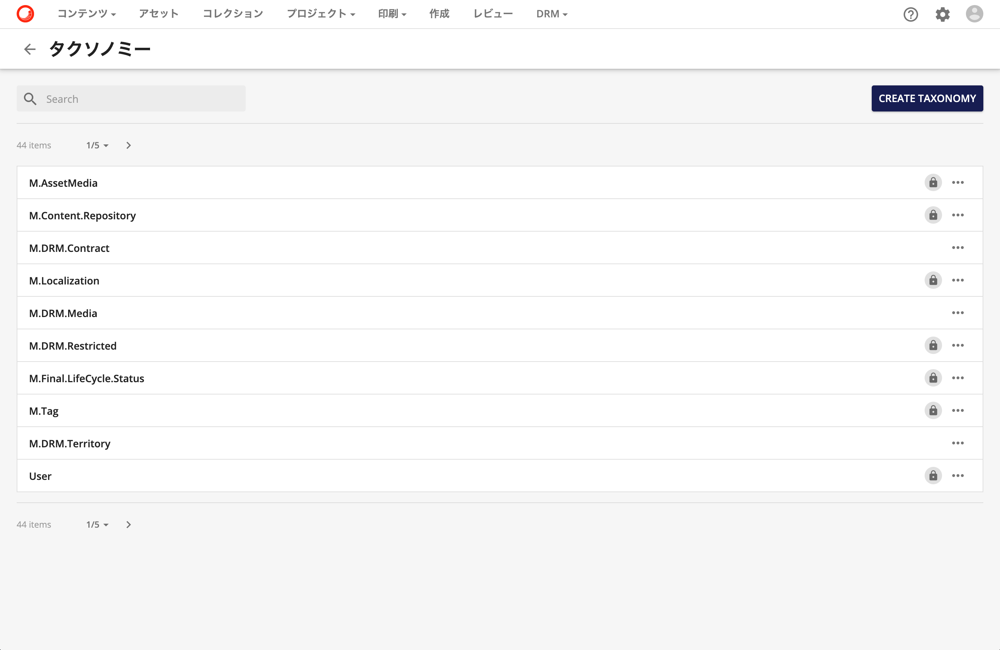
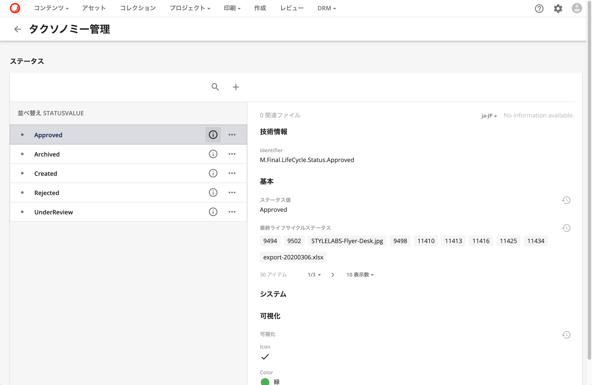
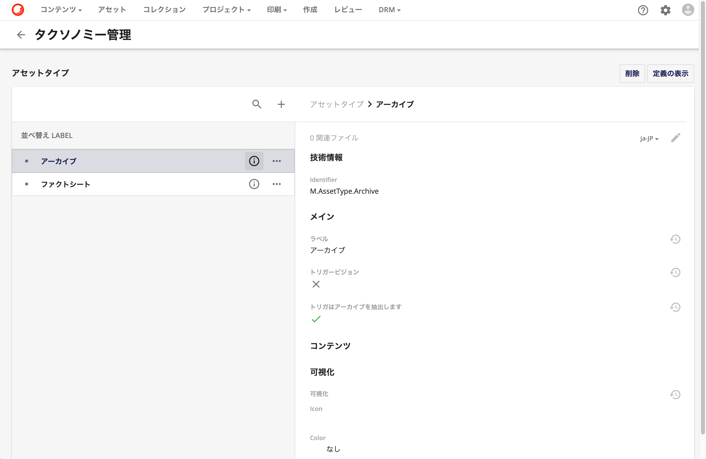

Sitecore Content Hub では定義済みのリストとしてはオプションリストとタクソノミーを提供しています。それぞれの仕組みに関して紹介をします。オプションリストとタクソノミーに関しては、管理画面からツールでアクセスすることができます。

<!--truncate-->

## オプションリスト

オプションリストのツールを開くと、以下のような画面になります。

オプションリスト一覧の参照、検索ができるようになっています。実際に個別のリストを参照するために、NewsItemType をクリックすると以下のような画面になります。

上の画面は、すでにhomeFeatured の項目を選択している状況です。このように、オプションリストの個別の項目に対して識別子が指定されており、その識別子を表示する際のラベルの設定ができています。リストを選択した際に、アセットやデータを表示する際に、その表示言語のデータが入っていることで、同じ識別子を多言語で表示できるようになっています。

## タクソノミー

ツールを立ち上げると、様々なタクソノミーの定義一覧がデフォルトで設定されています。

タクソノミーは、オプションリストのように一覧で管理するだけでなく、システムで利用しているものも多くあります。例えば、M.Final.LifeCycle.Status というタクソノミーを参照すると以下のような形です。

タクソノミーの識別子に関しては一定のルールで記載することを推奨しています。例えば、M.Final.LifeCycle.Status のタクソノミーではアセットの承認状況に関する識別子として利用しており、Approved （承認済）であれば、M.Final.LifeCycle.Status.Approved という識別子となります。このタクソノミーはシステムで利用しているため、変更をすることはできません。

では別のタクソノミーとして、M.AssetType を開きます。

このタクソノミーについては、「ラベル」が指定されています。ラベルを利用することができる識別子に関しては、定義されているデータに対して多言語での表示が可能となります。これを利用して、実際のタグで英語では Water、日本語では 水、という形でタグを持つことが可能となり、このタグで検索をするということができます。

## まとめ

Sitecore Content Hub で管理をするデータに関してはデータスキーマを拡張することができます。その際に、テキストなどの柔軟な項目ではなく、定義済みのリストを使ってその中から項目を選択する、という運用をするような場合、このオプションリストとタクソノミーを利用してください。

## 関連情報

* [Sitecore Content Hub クイックガイド](/docs/Sitecore/Content-Hub-Quick-Guide)
* [Option lists](https://docs-partners.stylelabs.com/content/3.3.x/user-documentation/administration/data/option-lists/option-lists.html) （英語）
* [Taxonomy](https://docs-partners.stylelabs.com/content/3.3.x/user-documentation/administration/data/taxonomies/taxonomy.html) （英語）
