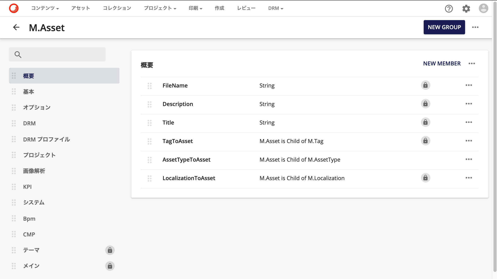
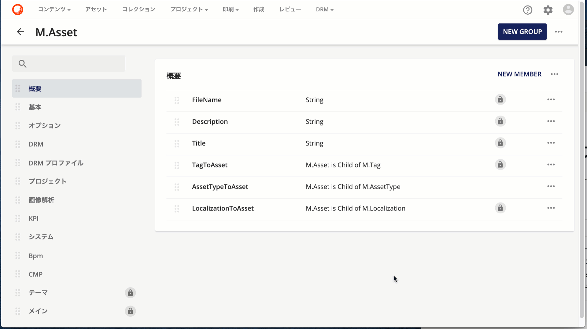
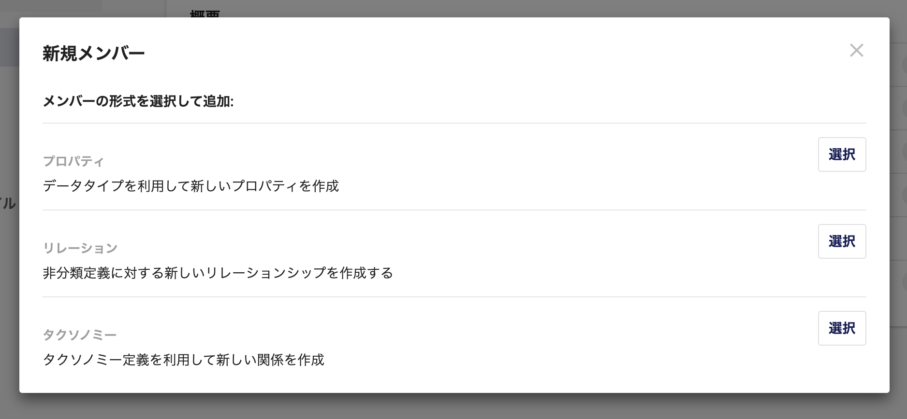
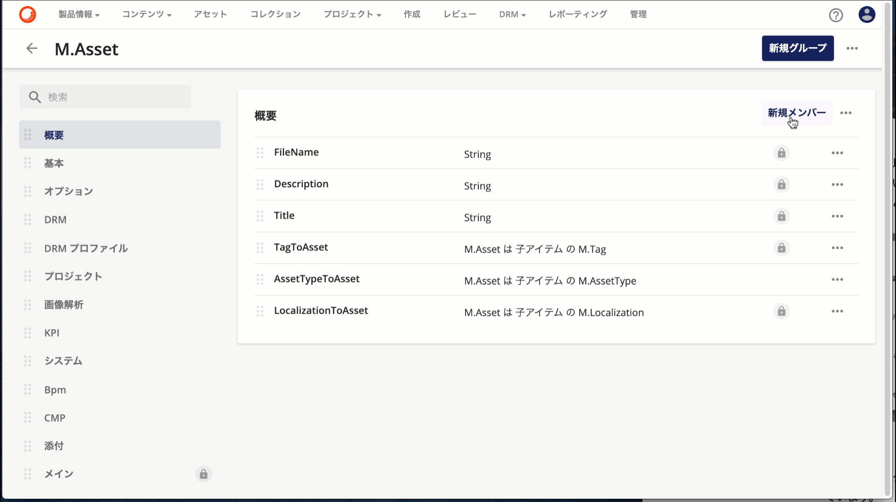
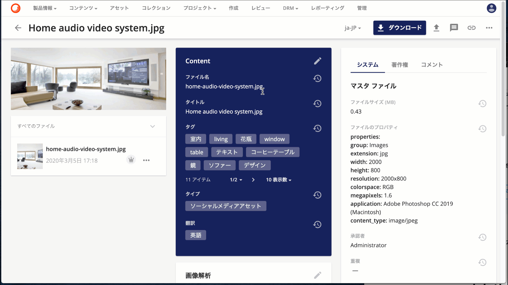

Sitecore Content Hub は拡張可能なスキーマ定義を提供しており、これにより企業が利用したいデータの構造に合わせた形で、データの定義ができます。今回はスキーマに関しての内容を簡単に紹介をします。

<!--truncate-->

## スキーマとは
Sitecore Content Hub ではデータを「エンティティ – Entity」という形で管理をします。このエンティティの定義を編集するツールが「スキーマ」となります。管理画面からスキーマのツールを開くと、定義されているスキーマが一覧で表示されます。

M.Asset のスキーマ定義が、DAM のアセット管理で利用されている定義となっています。画面は以下の通りです。

## グループとメンバー

上記に表示しているスキーマの定義に関して、利用している用語として２つ紹介をします。

### グループ
グループはデータとしてまとめて処理をするための定義となります。上記の画面では左側のメニューに表示されているものが「グループ」となり、そこにデータを保存するための項目が定義される形です。下の画像のように、グループを切り替えることでそれぞれの定義を参照することができます。

### メンバー
メンバーはデータを定義するための最小単位となります。メンバーとして利用できるものは、以前に紹介をした「オプションリストとタクソノミー」のように事前に定義しているものから選択するメンバー、もしくはテキスト（単一行、複数業、HTML など）を設定することができます。

このように、グループ、メンバーを利用してスキーマの定義ができるようになっています。

## スキーマの拡張

今回はスキーマの拡張ということで、「概要」の項目に対して文字列を追加するという手続きを実施します。まず、対象となるグループを選択して「新規メンバー」をクリックします。必要な項目を入力して、公開することで変更が反映されます。

実際にアセットの編集項目を参照しにいくと、「デモ」という項目が追加されていることがわかります。

## まとめ
今回は、Sitecore Content Hub で管理するデータ構造を定義するスキーマに関して紹介をしました。これにより、標準的なデータの持ち方＋各企業で定義をしたいデータの持ち方という点で拡張ができるようになります。

## 関連情報

* [Sitecore Content Hub クイックガイド](/docs/Sitecore/Content-Hub-Quick-Guide)
* Schema – [Entity definitions](https://docs-partners.stylelabs.com/content/user-documentation/administration/data/schema/intro.html?v=3.3.0) （英語）
