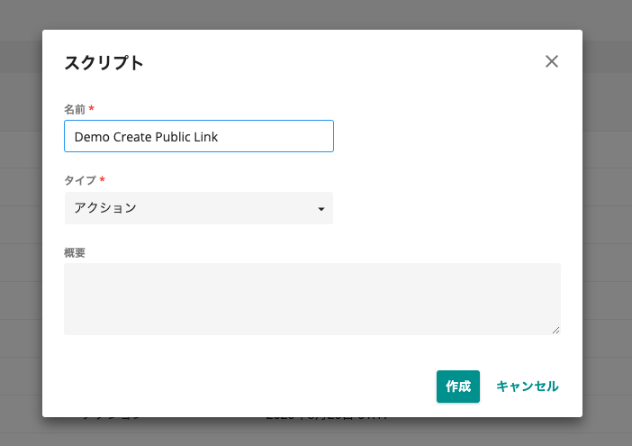
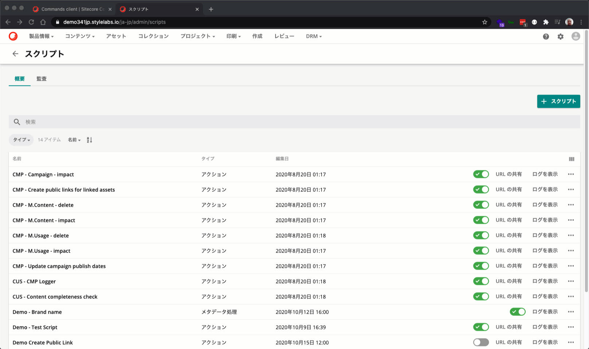
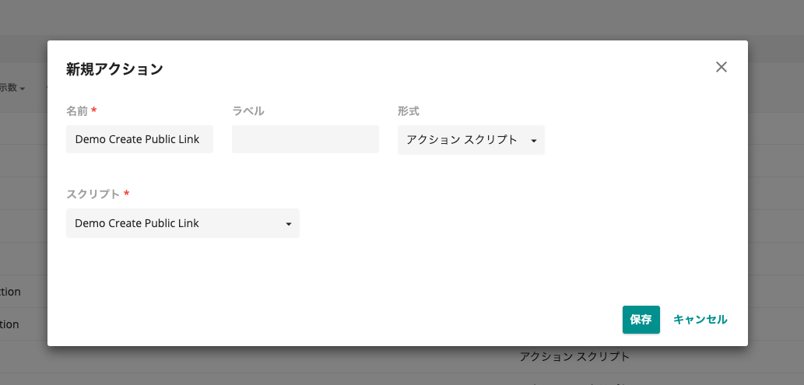
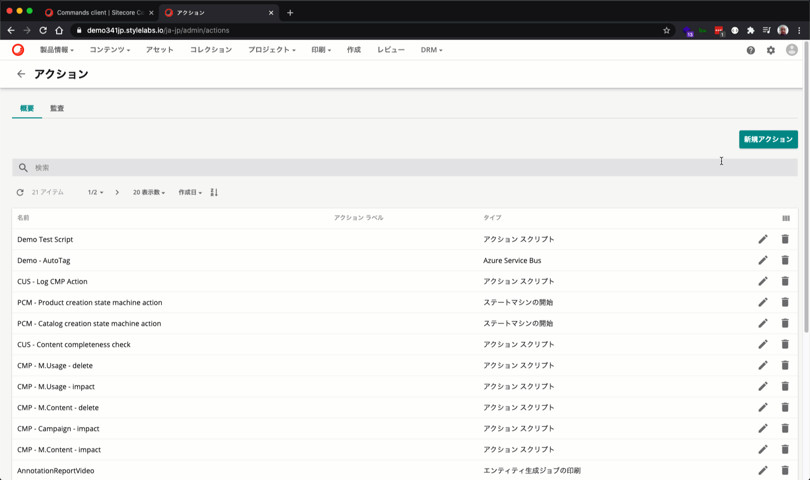
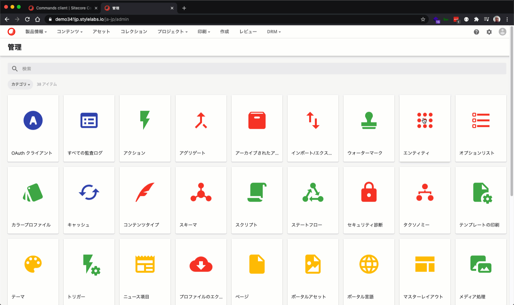
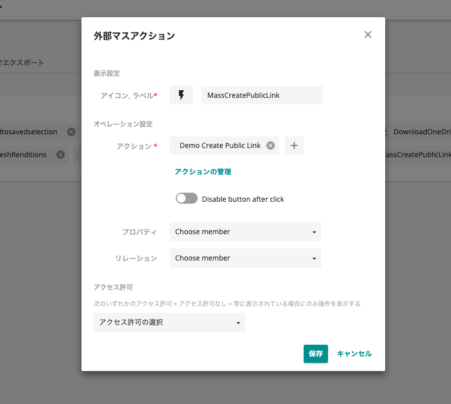
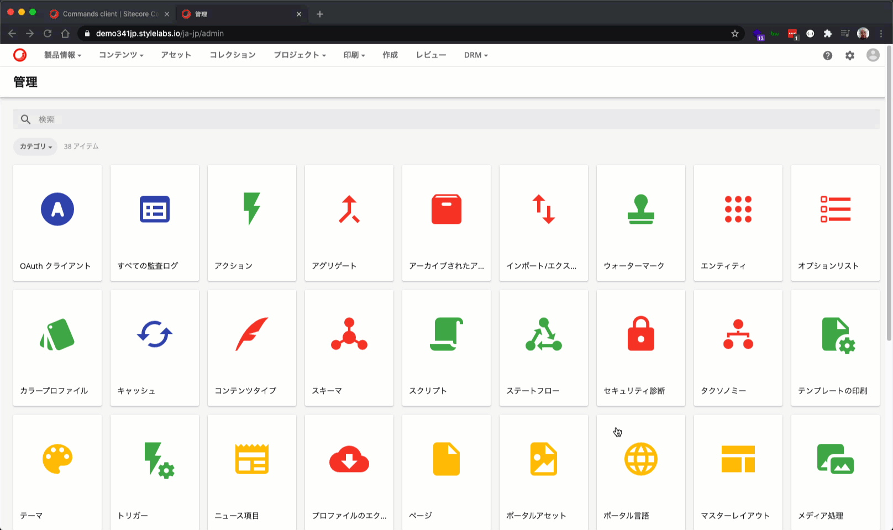

今回は、Sitecore Content Hub のスクリプトを実行するために、ページにボタンを配置して、スクリプトを実行するための手順を紹介します。これにより、定型的なタスクをスクリプトで作成し、簡単に処理することができるようになります。今回は、公開リンクを自動的に作るスクリプトを準備して、そのスクリプトのボタンを配置する手順を紹介する形です。

<!--truncate-->

## スクリプトを登録する

今回は、アセットの詳細ページにおいて、スクリプトが自動的に公開リンクを作成する、という非常にシンプルなスクリプトを利用します。本来であれば、公開リンクのボタンを押して、作成するという２つの手順が必要となりますが、スクリプトが自動的に生成するため、１クリックで完成します。

サンプルのソースコードは以下の通りです。

```C#
using Stylelabs.M.Sdk;

var entityId = Context.TargetId;

MClient.Logger.Info($"Creating public link for asset {entityId}.");

var publicLink = await MClient.EntityFactory.CreateAsync(Constants.PublicLink.DefinitionName).ConfigureAwait(false);
publicLink.SetPropertyValue(Constants.PublicLink.Resource, "preview");

// Link the public link to the asset
//var assetTopublicLinkRelation = publicLink.GetRelation(Constants.PublicLink.Relations.AssetToPublicLink, RelationRole.Child);
var assetTopublicLinkRelation = publicLink.GetRelation<IChildRelation>(Constants.PublicLink.AssetToPublicLink);
assetTopublicLinkRelation.SetIds(new long[] { entityId.Value });

// Save the public link
long publicLinkId = await MClient.Entities.SaveAsync(publicLink);

MClient.Logger.Info($"Public Link {publicLinkId} created.");
```

手順としては以下の通りです。

1. 管理画面で `スクリプト` を開きます
2. **+スクリプト** のボタンを押してスクリプトを追加します
3. スクリプトの名前を指定、タイプは **アクション** を選択して作成をします



作成されたスクリプトを開き、ソースコードとなるスクリプトを指定し、ビルドを実行します。ビルドでエラーが出ないのを確認して、スクリプトを公開します。


あとはスクリプトが有効になっているか確認をしてください。



## アクションを作成する

続いてスクリプトを実行するためのアクションを作成します。

1. 管理画面で `アクション` を選択して開きます
2. **新規アクション** をクリックしてアクションの登録を開始します
3. スクリプトの名前を入力します
4. 形式の項目は **アクションスクリプト** を指定、左下に出てくるスクリプトで、先ほど登録したスクリプトを選択します
5. **保存** をクリックして、アクションの登録を完了させます



まとめると、以下の画像のように進めて行く形となります。



## ページにボタンを配置する

### ページの編集

作成したアクションを、利用したいページに割り当てていきます。今回は、アセットを表示するページとなる `アセット詳細` のページにおいて、配置したボタンをクリックすると自動的に公開リンクが作成される、という実装にするために、以下のような手順でボタンを追加します。

1. ページを開く
2. 変更をしたいページを指定する、今回は `アセット詳細` を利用します
3. エンティティ操作のカスタマイズを有効にする
4. エンティティ操作のメニューから **編集** を選択します
5. **操作の追加** をクリックして、 **External action** を指定します
6. アイコン、ラベルに関してアクションに関する物に変更します
7. アクションとして、今回作成したスクリプトが割り当てられているアクションを指定します
8. 保存して閉じる

上記の作業で、ページに指定したボタンでスクリプトが動く設定ができました。



### 動作確認

上記のページの変更に関して、以下の手順で動作確認を行います。

1. 任意のアセットを開きます
2. アセットに対して公開リンクを確認します（空であるとわかりやすい）
3. ボタンをクリックします
4. しばらくすると公開リンクが作成されています

このように、ボタンを配置してスクリプトを実行するテストが完了しました。


## 複数のアイテムをまとめて処理する

上記の処理に関しては、１つのアセットの編集ということでこのボタンを配置しました。この処理に関して、複数のアセットを選択して実行することで、一括処理を効率よく実施することができるようになります。

### アセット選択のページを編集する

今回はアセットを表示しているページにおいて、一括処理ができるような手順を進めていきます。

1. 管理画面から `ページ` を選択します。
2. アセット一覧のページを選択するために、今回は **アセット** のページを編集します
3. アセットページのヘッダーゾーンにあるセレクションを選択、**編集** をクリックします
4. タブが複数表示されるため、**オペレーション** を選択します
5. **操作の追加** をクリックし、**外部マスアクション** の項目を選択します
6. アイコン、項目名を設定、アクションに関しては前回と同じアクションを指定します



登録の手順に関しては、次の画像を参考にしてください。



### 動作確認

動作確認に関しては、今回設定したアセット一覧のページを開いて、アイテムを選択していく形になります。

1. アセットのページにて、複数のアセットを選択します
2. 右上のメニュー項目に追加されているアイコンをクリックします
3. 選択したアイテムに対して、すべて公開リンクが追加されていることを確認します

これにより、アイテムを個別に選択する形ではなく、一括で処理をすることが可能となります。


## まとめ

今回は、作成したスクリプトの処理として公開リンクを自動的に作成するものを作りました。このスクリプトを、アセット詳細のページに割り当てることでアセットの公開リンクを自動的に作ることができました。例えば、Web でよく利用するサイズが決まっていれば、ボタンを押すだけで複数の公開リンクが自動的に出来上がる、という処理ができます。

合わせて、同じスクリプトを利用して一括処理をすることができるようになりました。これにより、複数のアセットに対してまとめて公開リンクを作成する、という処理を、比較的簡単に追加できたこともご理解いただけるかと思います。

## 参考サイト

* [Creating a single click action button for speeding up creation of a preview public link](https://support.stylelabs.com/hc/en-us/articles/360023244211-Creating-a-single-click-action-button-for-speeding-up-creation-of-a-preview-public-link)