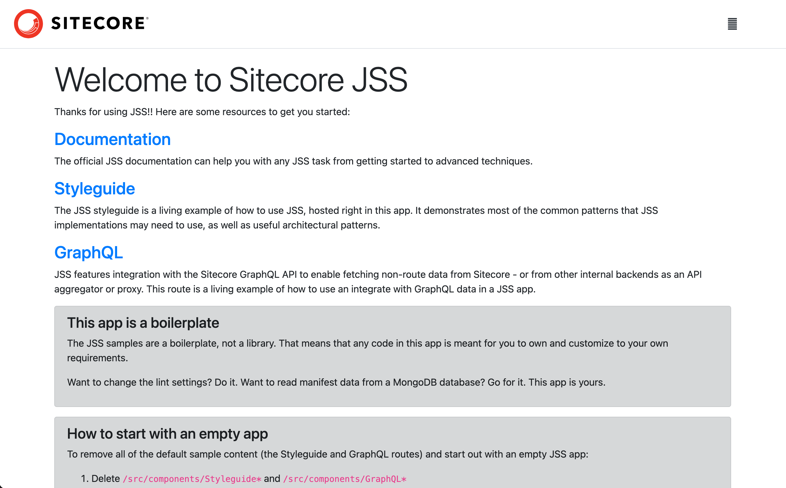
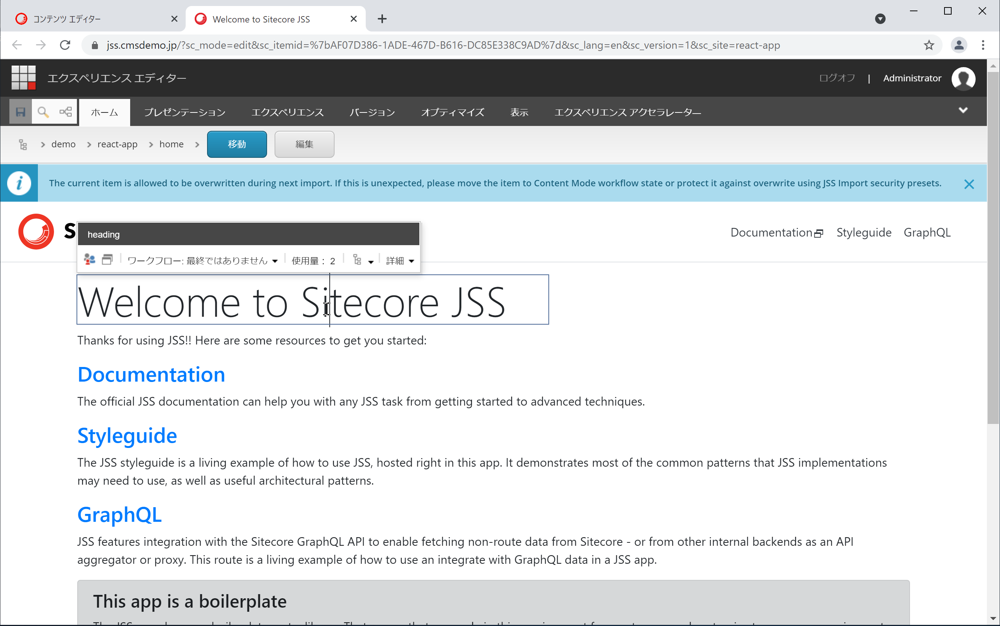
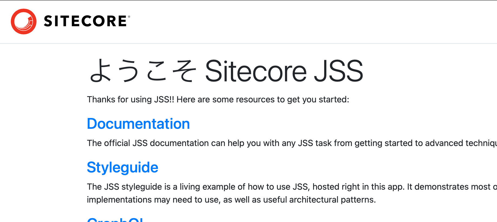
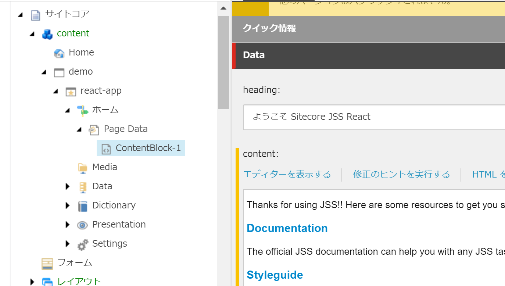
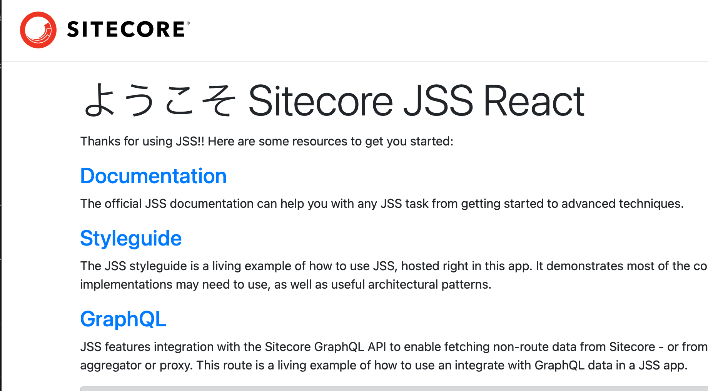

今回は、Sitecore JavaScript Services の動作モードに関して紹介をしていきます。サンプルは Part 2 で作成した空のテンプレートをベースに、接続モードを説明していく形です。

<!--truncate-->

## 接続モードに関して

JSS で開発をする際のモードとして、4 つのモードを用意しています。今回はこのモードに関して説明をしていきます。詳しくは、以下のページで紹介しています。。

* [JSS application modes](https://jss.sitecore.com/docs/fundamentals/application-modes)

接続モードに関しては４つ、それぞれ必要な環境は以下の通りです。

| 接続モード | 概要 | ローカル | Sitecore |
|-|-|-|-|
| Disconnected dev mode | ローカル環境だけで動作します | 必要 | 不要 |
| Connected dev mode | ローカルの環境から Sitecore のコンテンツにアクセスします | 必要 | 必要 |
| Integrated mode | Sitecore の環境で動作します | 不要 | 必要 |
| API-only mode | Sitecore が Headless で動作します。JSON の知識が必要。 | 不要 | 必要 |

それでは一つ一つの動作を見ていきます。

### Disconnected dev mode

これまで、何度かサンプルのアプリを立ち上げる時に、以下のコマンドを実行していました。

```
jss start
```

しばらくすると、ローカルホストでアプリが起動します。もちろんこのモードでは、コンテンツ編集して保存したタイミングでリロードされたりと、ローカルの開発環境として動作する形となります。



### Connected dev mode

このモードは、JSS のアプリのアイテムの同期、レイアウトの同期が完了している状況となります。手元の JSS アプリを Sitecore 側に展開している状況です。コマンドとしては、

```
 jss deploy app -c -d 
```

もしくは以下の手順で同期した場合です（このシリーズは一貫してこれでやっています）

```
jss deply items -c -d
jss build
```

build に含まれるファイルを Sitecore のインスタンスの /dist/appname のフォルダにコピーをすると、エクスペリエンスエディターも動作し、Sitecore だけで動作する形となります。




### Integrated mode

このモードでは、手元の JSS のアプリが Sitecore のコンテンツを参照してページを表示することができます。

まず最初に、scjssconfig.json に正しい API キーが設定されていることを確認してください。これが設定されていれば、以下の手順を進めていきます。

#### react-app.config の編集

**/sitecore/config/react-app.config** のファイルが設定ファイルとなります。変更する点としては、hostName (React のアプリがアクセスすることができる)、およびサイトの rootPath になります（JSS サイトを利用していない場合は、そのままでも大丈夫なパスになっていることもあります）。

```xml
<site patch:before="site[@name='website']"
    inherits="website"
    name="react-app"
    hostName="Sitecore ホスト名"
    rootPath="/sitecore/content/demo/react-app"
    startItem="/home"
    language="ja-JP" 
    database="master" />
```

同様に JavaScriptServices の項目の中にある app の設定を変更してください。JSS サイトを利用していない場合はそのままで大丈夫ですが、sitecorePath に関して、あっているか確認をしてください。

```xml
<app name="react-app"
        sitecorePath="/sitecore/content/demo/react-app"
        useLanguageSpecificLayout="true"
        graphQLEndpoint="/api/react-app"
        inherits="defaults"
/>
```

#### jss start:connected

Sitecore に繋げる形で起動するため、いつもと若干異なる形で以下のコマンドを実行します。

```
jss start:connected 
```

前回までのサンプルであれば、以下の様な画面が立ち上がります。



連携している Sitecore にログインをして、ホームの下にあるアイテムを指定し、タイトルを変更して保存します。



保存したあと、先ほど立ち上げていたアプリのページを再読み込みしてください。



ページが更新されました。このように、JSS アプリを起動しつつ、Sitecore のコンテンツを参照するという動きを作ることができます。これが、Integrated mode です。

## まとめ

今回紹介をするモードをうまく活用することで、オフラインでの開発は Visual Studio Code + Node.js で実施、出来上がったコンポーネントのテストは Integrated Mode で確認という形で、開発をしているモードに合わせて切り替えることが可能です。

また、Connected dev mode での動作確認は、その後の運用の際のみたまま編集に関する部分のテストにもなります。

全てのテストが完了したコードが、Github に統合されて展開していく、という形で開発を進めていくことができるようになります。