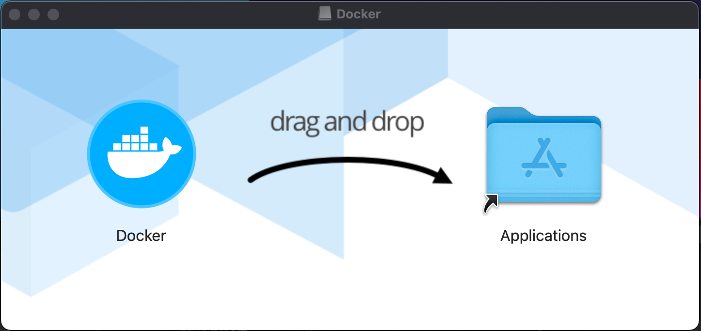
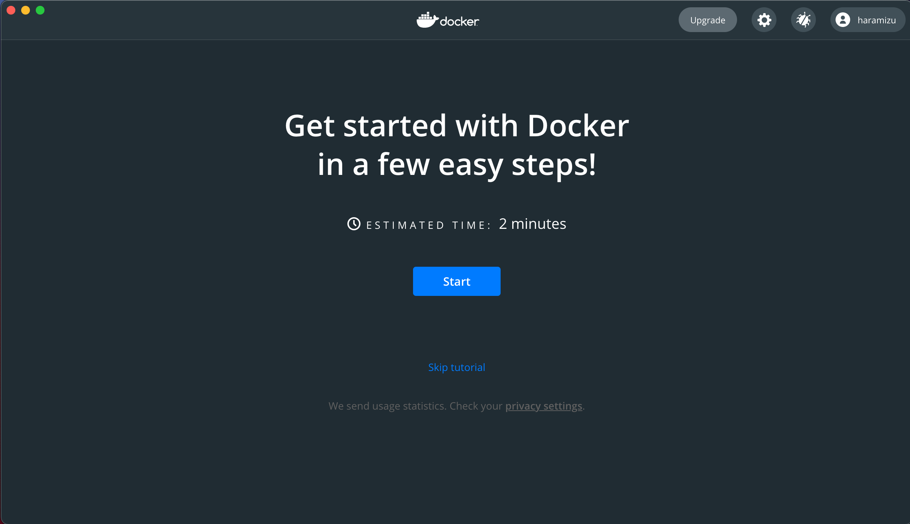
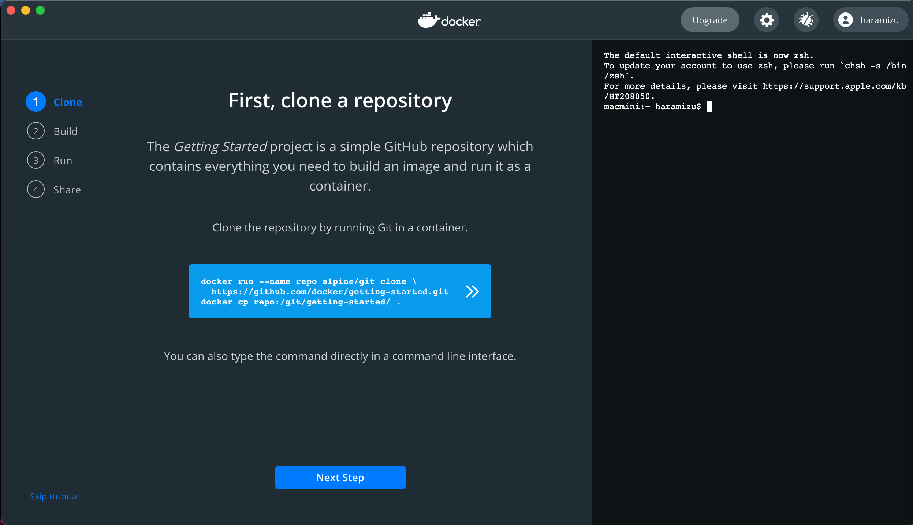
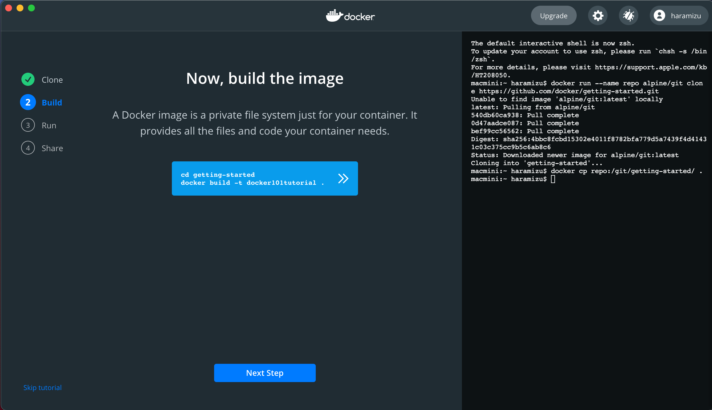
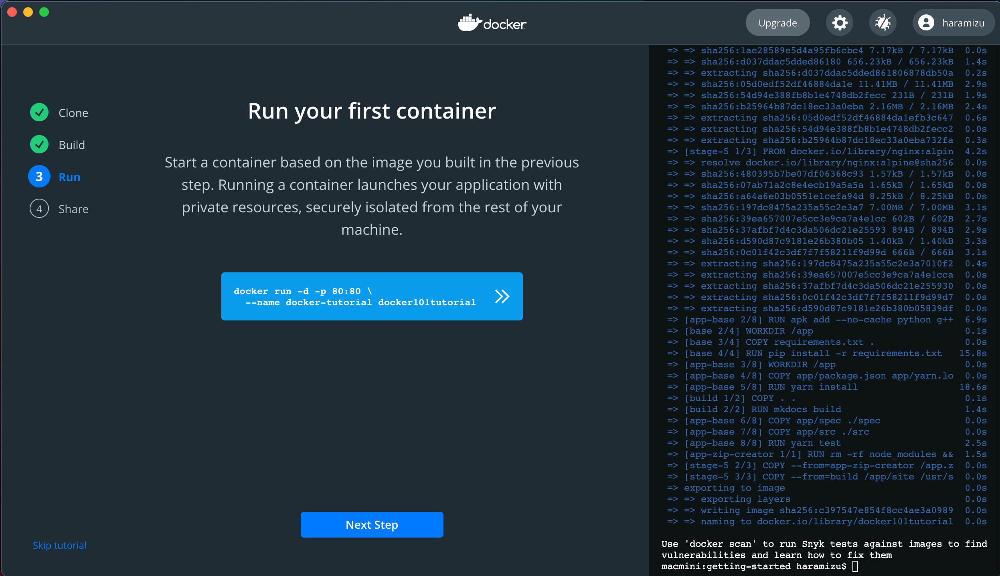
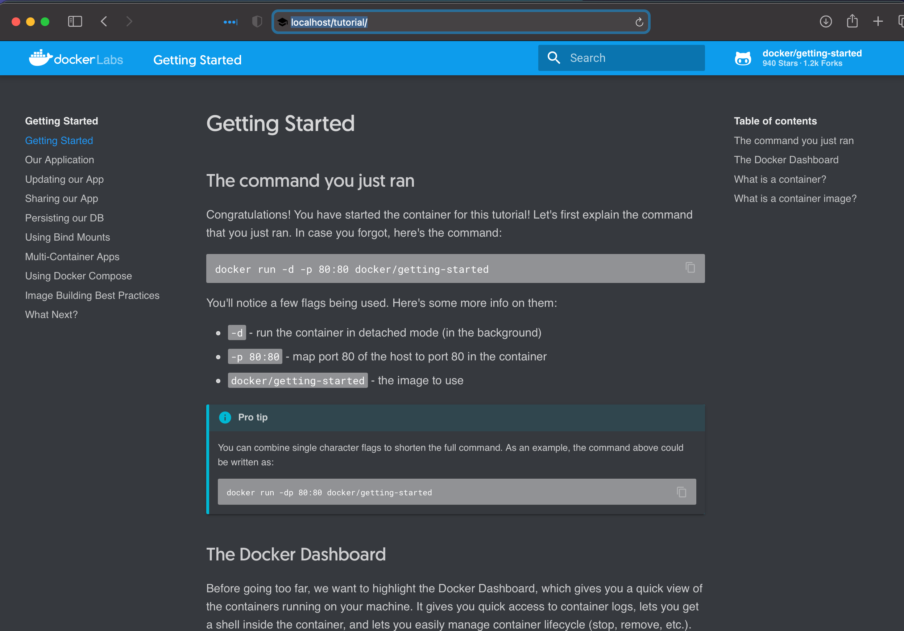
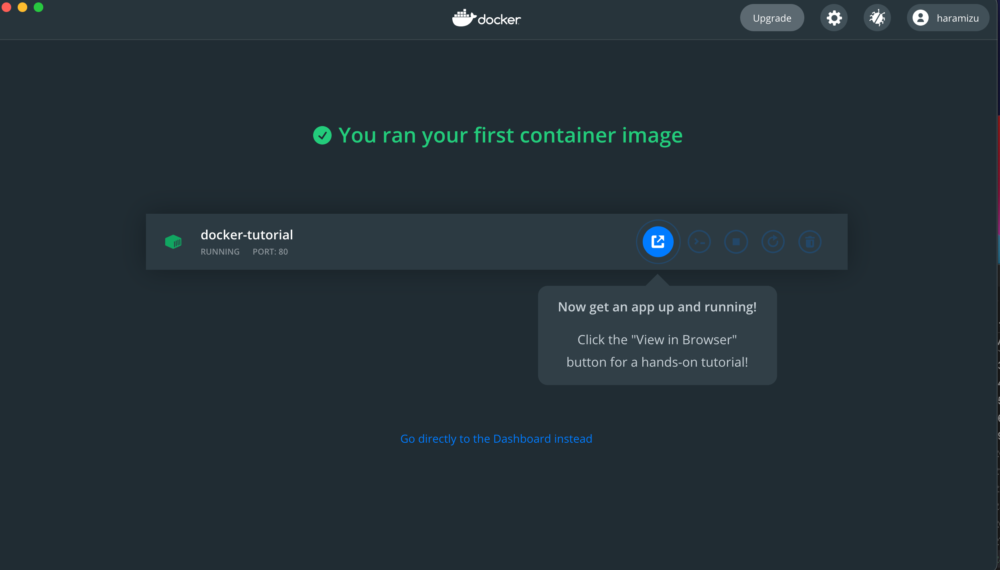
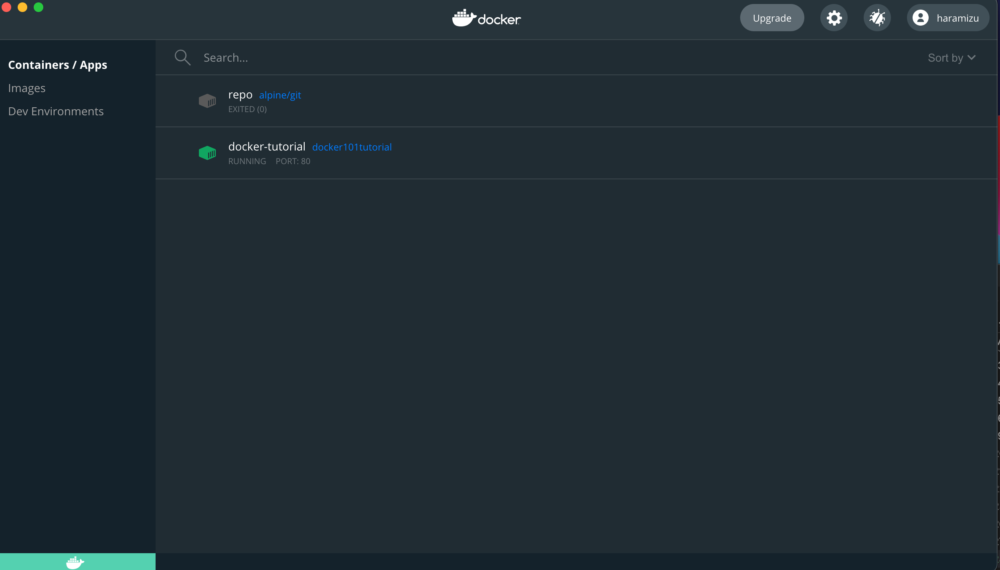

Headless SSR の3回目は、Docker コンテナを作成して展開したいと思います。

<!--truncate-->

## Docker の環境を整える

コンテナを動かすために、まずは Docker Desktop for Windows / macOS をインストールしてください。手元の環境は macOS のため、Docker Desktop for Mac で作業を進めていきます。

* [Docker Desktop](https://www.docker.com/products/docker-desktop)

起動をすると、何度かダイアログが表示されますが、権限を与えるために必要となりますので、設定を続けてください。しばらくすると以下の画面が表示されます。

動作確認のためにチュートリアルを実行します。Start ボタンをクリックします。すると、右側にコマンドラインが、中央にチュートリアルのコマンドが表示されます。

中央にコマンドが表示されているところをクリックすると、右側のコマンドラインにコピーされて実行します。内容は、リポジトリのクローン、そしてイメージのダウンロードです。**Next Step** のボタンをクリックします。

新しいコマンドが中央に表示されるので、これをクリックします。しばらくすると処理が終わります。**Next Step** のボタンをクリックすると、以下の画面に切り替わります。

コマンドを見ると、コンテナを実行することがわかります。それでは、クリックして実行し、ブラウザで http://localhost にアクセスしてください。以下のようなサイトを参照することができます。

また、Done をクリックすると Docker コンテナが動いていることがわかります。

ダッシュボードに切り替えると、以下の様な画面になります。

不要であれば、作成したイメージは一番右側に表示されているゴミ箱のマークをクリックすると削除できます。これで、環境は整いました。

## Docker ファイルの作成

続いて Docker ファイルの作成をおこないます。

## プロジェクトのパラメーターの変更

## 実行、確認

## まとめ

react-app の環境から docker コンテナを立ち上げて Headless SSR の確認をすることが出来る環境を手元で整備しました。
