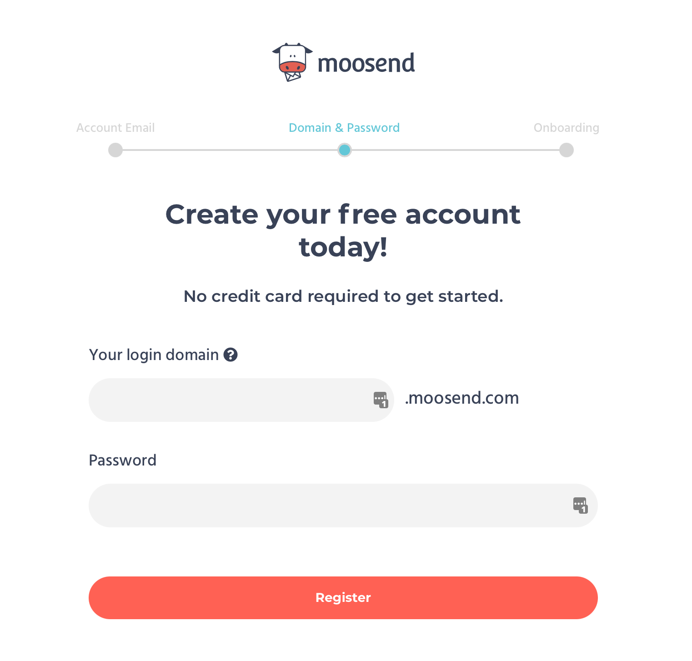
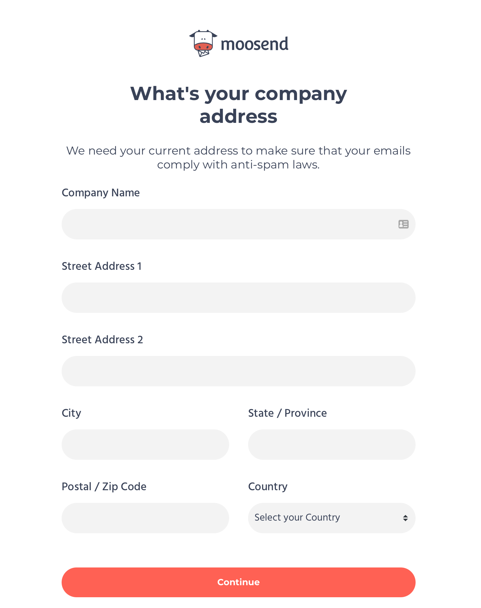
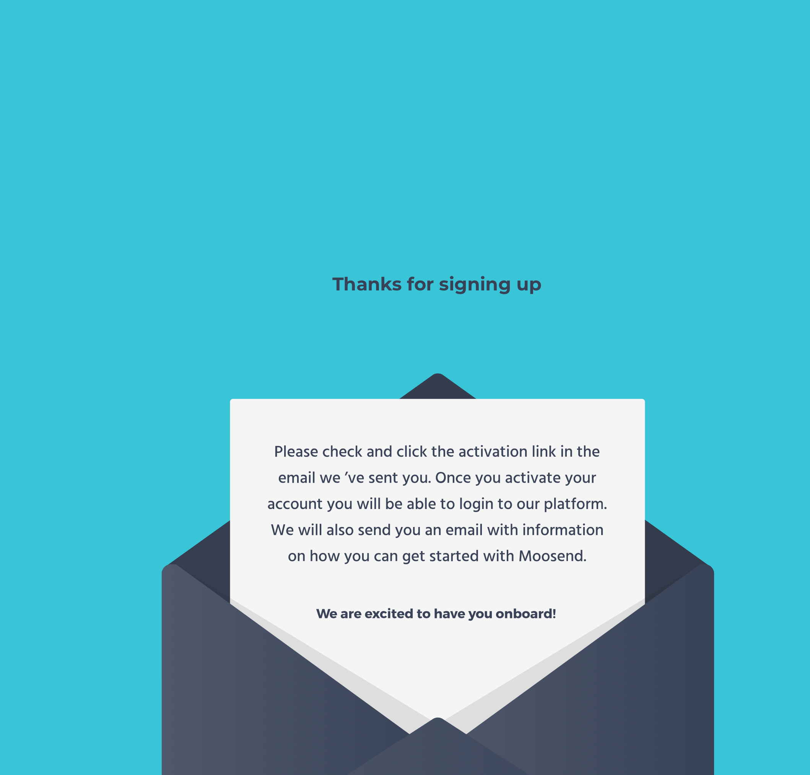
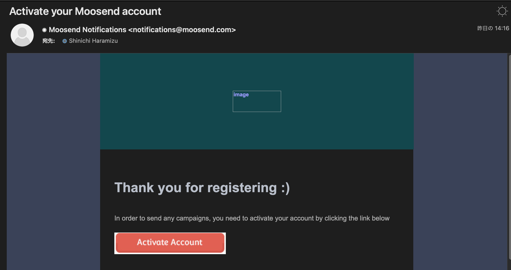
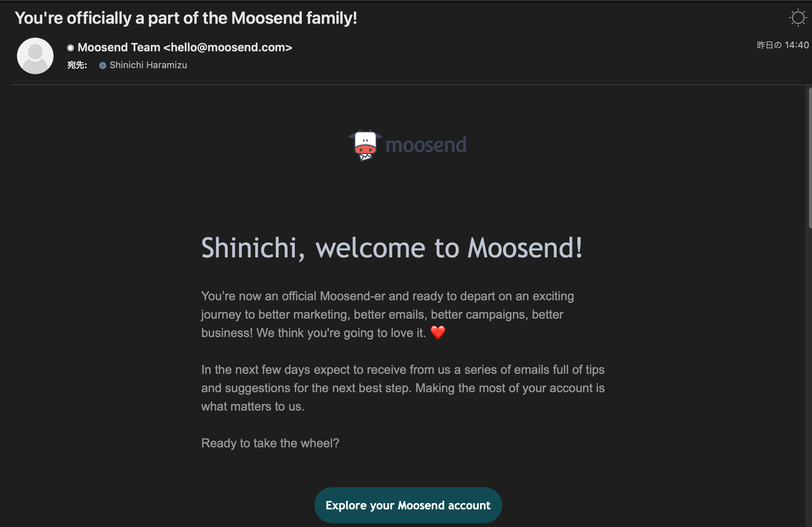
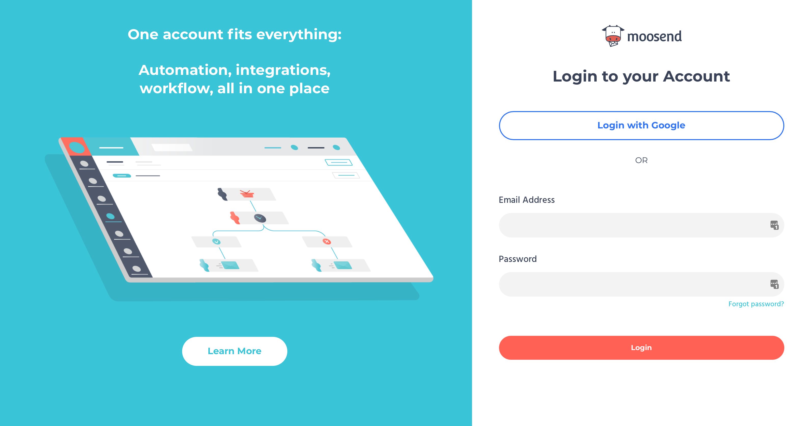
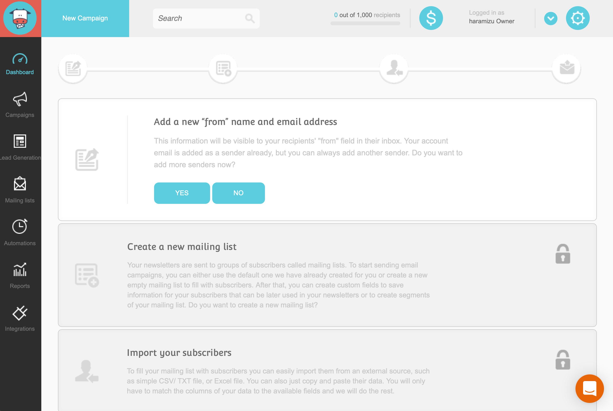

[前回](2021-05-07-moosend-overview-part-1.md)は Web サイトを見ながらどんなサービスか、というのを確認してみました。1000 Subscriber なら無料で利用できるということで、今回はアカウントを作成してみます。

## 無料登録

Web サイトの右上に、**Register for free** と記載されているアイコンがありますので、これをまずはクリックします。

まず申し込みをするメールアドレスの入力フォームが出てくるので、メールアドレスを入力してください。

続いて、ログインドメイン、およびパスワードの設定画面が表示されます。

続いてアカウントの名前を入力します。

会社に関する情報を入力する形となります。これは迷惑メール防止法に準拠したメールを送るのが目的とされています。

業種に関する情報を入力することができます。

入力はこれで完了です、

しばらくすると、登録したメールアドレスに対して、以下のような確認メールが届きます。

**Activate Account** のボタンをクリックして、ユーザー登録は完了です。ここまで、クレジットカードの入力もなく、登録することができました。しばらくして、Welcome メールが届けば、登録が完了という形です。

## ログイン

ログインをする際には、ユーザー登録の際に設定をしたドメインにアクセスすることになります。以下の画面で何を設定しているでしょうか？というのがポイントです。

今後は、ユーザー向けのドメイン飲みにアクセスすれば OK です。

ログインをすると、以下のような管理画面が表示されます。

これで無料プランのアカウントが出来ました。

## まとめ

クレジットカードの登録なしに無料プランにアクセスすることができました。これは評価するという点では非常に助かります。次回移行は、この無料プランを利用した内容に関して、少しづつ使っていきたいと思います。

