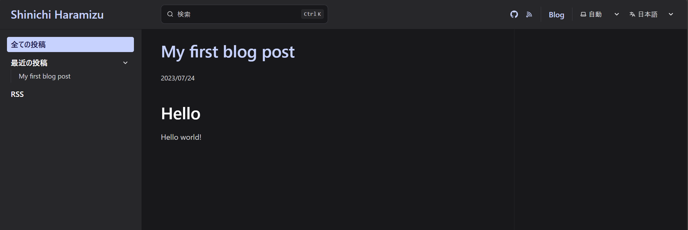

import { Steps, LinkCard } from '@astrojs/starlight/components';

このドキュメントでは、Starlight で立ち上げたサイトに対してブログを追加する手順を紹介しています。今回、採用をしているブログはコミュニティで提供されているプラグインを利用することにしました。

- [プラグインとインテグレーション](https://starlight.astro.build/ja/resources/plugins/)

## プラグインのインストール

インストールの手順に関しては、以下のサイトで紹介されています。

- [Starlight Blog - Getting Started](https://starlight-blog-docs.vercel.app/getting-started/)

<Steps>

1. Starlight のドキュメントサイトに対して、まずはプラグインをインストールします。

   ```bash title="プラグインインストール"
   npm i starlight-blog
   ```

2. インストールをしたプラグインを `astro.config.mjs` に対して追加します。

   ```diff lang="js"
   // astro.config.mjs
   import starlight from '@astrojs/starlight'
   import { defineConfig } from 'astro/config'
   +import starlightBlog from 'starlight-blog'

   export default defineConfig({
     integrations: [
       starlight({
   +      plugins: [starlightBlog()],
         title: 'My Docs',
       }),
     ],
   })
   ```

3. 続いて `src/content/config.ts` に対してブログのスキーマを追加します。

   ```diff lang="ts"
   // src/content/config.ts
   import { defineCollection } from 'astro:content';
   import { docsSchema } from '@astrojs/starlight/schema';
   +import { blogSchema } from 'starlight-blog/schema'

   export const collections = {
     docs: defineCollection({
       schema: docsSchema({
   +      extend: (context) => blogSchema(context)
       })
     }),
   };
   ```

4. 最後に、 `src/content/docs/blog/my-first-blog-post.md` のファイルを作成します。

   ```md
   // src/content/docs/blog/my-first-blog-post.md
   title: My first blog post
   date: 2023-07-24

   ---

   ## Hello

   Hello world!
   ```

</Steps>

これでプラグインのインストールは完了です。実際にアクセスをすると、上に Blog のメニューが追加されて、ブログの記事を参照することができるようになります。


## 日本語リソースの追加

上の画面を見ると、左側のメニューのところに対して、日本語のリソースが不足していることが分かります。これに対処する方法は以下のページに掲載されています。

- [Internationalization (i18n)](https://starlight-blog-docs.vercel.app/guides/i18n)

手順としては、Starlight で管理をしている i18n を利用すればよい形となっています。

- [Internationalization (i18n) - Translate Starlight’s UI](https://starlight.astro.build/guides/i18n/#translate-starlights-ui)

この機能を有効にする手順は以下の通りです。

<Steps>

1. `src/content/config.ts` の設定ファイルに対して `i18nSchema` の追加をします。

   ```diff lang="js" ins=/, (i18nSchema)/
   // src/content/config.ts
   import { defineCollection } from 'astro:content';
   import { docsSchema, i18nSchema } from '@astrojs/starlight/schema';

   export const collections = {
   docs: defineCollection({ schema: docsSchema() }),
   +	i18n: defineCollection({ type: 'data', schema: i18nSchema() }),
   };
   ```

2. src/content/i18n のディレクトリを作成して、 ja.json ファイルを作成します。

   ```json
   {
     "starlightBlog.authors.count_one": "{{count}} 投稿 by {{author}}",
     "starlightBlog.authors.count_other": "{{count}} 投稿 by {{author}}",
     "starlightBlog.pagination.prev": "新しい投稿",
     "starlightBlog.pagination.next": "古い投稿",
     "starlightBlog.post.lastUpdate": " - 最終更新日: {{date}}",
     "starlightBlog.post.draft": "下書き",
     "starlightBlog.post.featured": "注目",
     "starlightBlog.post.tags": "タグ:",
     "starlightBlog.rss.imageFallback": "オリジナルの画像はブログに掲載",
     "starlightBlog.sidebar.all": "全ての投稿",
     "starlightBlog.sidebar.featured": "注目の投稿",
     "starlightBlog.sidebar.recent": "最近の投稿",
     "starlightBlog.sidebar.tags": "タグ",
     "starlightBlog.sidebar.authors": "編集者",
     "starlightBlog.sidebar.rss": "RSS",
     "starlightBlog.tags.count_one": "“{{tag}}” の投稿: {{count}} 件",
     "starlightBlog.tags.count_other": "{{tag}}” の投稿: {{count}} 件"
   }
   ```

</Steps>

無事、日本語のリソースの追加ができました。



## まとめ

標準のプラグインを利用して、Starlight の中でもブログを書くことができるようになりました。このサイトでのブログの位置づけは Tips の提供というよりは、サイトの更新に関する情報をお届けする形で利用したいと思います。

## 参考情報

<LinkCard
  title="HiDeoo / starlight-blog"
  href="https://github.com/HiDeoo/starlight-blog"
  target="_blank"
/>

