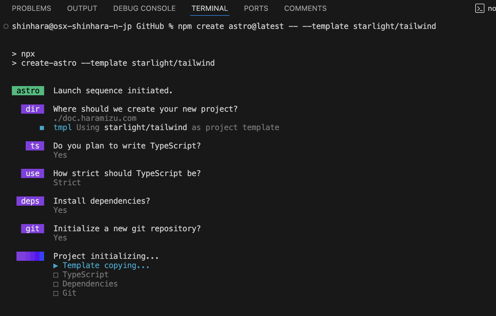
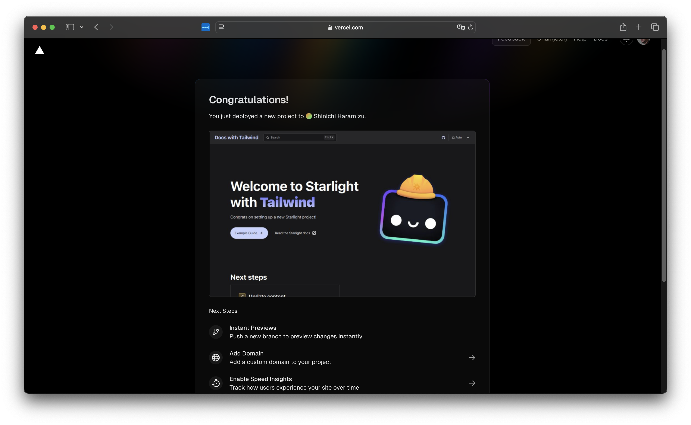

import { Steps, LinkCard } from '@astrojs/starlight/components';

ブログを Next.js を利用して作成しましたが、手軽に Markdown で記述ができ、GitHub に全て公開してフィードバックを貰うことができるドキュメントサイトを作りたいと考えました。このため、いくつかのフレームワークを検討しました。特に、手軽にカスタマイズができる SSG 対応のフレームワークが良いと考え、以下の候補を検討しました。

- [Gatsby](https://www.gatsbyjs.com) : Gatsby は、React ベースの静的サイトジェネレーターであり、高速でスケーラブルなウェブサイトやアプリケーションを構築するためのフレームワークです。Gatsby は、GraphQL を使用してデータを取得し、ビルド時に静的な HTML ファイルを生成します。これにより、ページの読み込み速度が向上し、SEO にも優れたパフォーマンスを発揮します。
- [Docusaurus](https://docusaurus.io) : Docusaurus は、Facebook が開発したオープンソースの静的サイトジェネレーターで、主にプロジェクトのドキュメントサイトを簡単に作成するために設計されています。React ベースで構築されており、モダンでインタラクティブなドキュメントサイトを作成することができます。
- [Astro](https://astro.build) : Astro は、最新のウェブ技術を活用して高速で最適化された静的サイトを構築するための静的サイトジェネレーターです。Astro は、コンポーネントベースのアーキテクチャを採用しており、React、Vue、Svelte、Solid などのフレームワークと互換性があります。[日本語](https://docs.astro.build/ja/)の情報も充実しています。

改めて色々と検討した結果、以前から Astro にも興味があり、Next.js のブログに加えて新しいサイトを立ち上げ、Tips をまとめることにしたのがこのドキュメントサイトになります。

そして、Astro のサイトを参照している時に、実際にこの文書の形式で出せればいいのではないか？と思って確認をしたところ、以下のドキュメントサイトが提供されていることに気がつきました。

<LinkCard title="Starlight" href="https://starlight.astro.build" target="_blank" />

結果、このサイトは Starlight を利用して作ることにしました。

## Starlight サイトを立ち上げる

サイトを立ち上げるに当たって、作成したいプロジェクトおよび現在の環境を以下のように設定します。

- Astro 4.16.10
- Starlight 0.29.0
- Tailwind CSS 3.4.4
- Node.js 20.15.0
- Visual Studio Code
- macOS or Windows 11

今回は使い慣れた Tailwind CSS を利用する形で立ち上げます。

### プロジェクトの作成

それでは実際にプロジェクトの作成を進めていきます。作成をするに当たって以下のページを参考にして開始します。

<LinkCard
  title="CSS とスタイリング - Tailwind CSS"
  href="https://starlight.astro.build/ja/guides/css-and-tailwind/#tailwind-css"
  target="_blank"
/>

<Steps>

1. 以下のコマンドでプロジェクトを作成します。

   ```bash title="プロジェクトの作成"
   npm create astro@latest -- --template starlight/tailwind
   ```

2. ウィザードが起動して、作成するプロジェクトの設定を確認してきます。今回は以下のように設定をしていきました。

   - dir: ./doc.haramizu.com
   - ts: Yes (Typescript)
   - use: Strict
   - Install dependencies?: Yes
   - Initialize a new git repository?: Yes

3. 上記の設定後、自動的にプロジェクトの初期化が進みます。

   

4. 設定が完了すると、以下のようなメッセージが表示されます。

   

</Steps>

プロジェクトが完成しました。画面に表示されているように、パスに移動をして起動すると、サンプルのコンテンツが含まれた形で立ち上がっているのが分かります。


### Vercel に展開する

作成をしたプロジェクトを GitHub に展開して、今回は Vercel にサイトを公開する手順を確認します。すでに GitHub にはプロジェクトのコードをアップロードしている状況と考えてください。

<Steps>

1. Vercel にログインをします

2. New project をクリックして、新しいプロジェクトを作成、アップロードをしている GitHub のリポジトリを指定します。

   

3. すでに Astro のプロジェクトとして指定されているのが分かります。Deploy のボタンをクリックすると、サイトの Build を実行します。しばらくするとサイトが立ち上がります。

   

</Steps>

今後は main リポジトリを更新すると、このサイトが更新されるようになりました。

### Vercel CLI で環境を連携させる

Vercel CLI を利用して、このプロジェクトと Vercel の環境を連携させます。Vercel CLI をインストールしていない場合は、以下のコマンドを実行します（必要に応じて sudo を追加してください）。

```bash title="Vercel CLI インストール"
npm i -g vercel
```

CLI が利用できるようになっている場合は、プロジェクトのトップで以下のコマンドでログインをします。

<Steps>

1. まず最初にどのアカウントでログインをするかの確認画面が表示されます。

   ```bash title="Vercel CLI でログイン"
   doc.haramizu.com % vercel login
   Vercel CLI 37.14.0
   ? Log in to Vercel (Use arrow keys)
   ❯ Continue with GitHub
     Continue with GitLab
     Continue with Bitbucket
     Continue with Email
     Continue with SAML Single Sign-On
   ─────────────────────────────────
     Cancel
   ```

   今回は GitHub を利用しているため、ブラウザが起動してログインが完了することで、Vercel CLI でのログインが完了します。

2. Vercel のプロジェクトとリンクをします。

   ```bash title="Vercel プロジェクトとリンク"
   doc.haramizu.com % vercel link
   Vercel CLI 37.14.0
   ? Set up “~/GitHub/doc.haramizu.com”? yes
   ? Which scope should contain your project? Shinichi Haramizu
   ? Found project “haramizu/doc-haramizu-com”. Link to it? yes
     Linked to haramizu/doc-haramizu-com (created .vercel and added it to .gitignore)
   ```

</Steps>

`.gitignore` のファイルに対して `.vercel` が追加されて、今後 `vercel env pull` などで development の環境変数を取得することができるようになります。

## サイトの多言語化

このサイトでの情報提供に関して、日本語と英語（機械翻訳を利用）で展開していく形で考えています。Starlight の基本機能に多言語機能が含まれているため、実際に言語の設定を進めていきます。

<LinkCard
  title="国際化（i18n）"
  href="https://starlight.astro.build/ja/guides/i18n/"
  target="_blank"
/>

この設定は、`astro.config.mjs` のファイルに設定を追加する形となります。今回はルートを日本語、英語は `/en` というパスで表示するようにします。

```ts {5-16}
// astro.config.mjs
export default defineConfig({
  integrations: [
    starlight({
      title: "Shinichi Haramizu",
      defaultLocale: "root",
      locales: {
        root: {
          label: "日本語",
          lang: "ja",
        },
        en: {
          label: "English",
          lang: "en",
        },
      },
```

上記の設定が終わったあと、`/content/docs/en` には既存のファイルをコピーして配置します。この際、`/en/index.mdx` の画像やリンクのパスに関して、調整をする必要があります。

ファイルの展開が終わったところで、以下のようにドロップダウンメニューが表示されて、言語を切り替えることが可能になりました。


## Sitemap / robots.txt の作成

作成したサイトのサイトマップを利用できるように、Sitemap の機能を有効にします。この設定は以下のページに紹介されています。

<LinkCard
  title="Starlightのカスタマイズ - サイトマップを有効化する"
  href="https://starlight.astro.build/ja/guides/customization/#サイトマップを有効化する"
  target="_blank"
/>

設定は、`astro.config.mjs` のファイルの `site` に対して URL を追加する形です。

```ts {2}
export default defineConfig({
  site: "https://doc.haramizu.com",
  integrations: [
    starlight({
```

この設定をした後、一度サイトの Build を実行してください。

```bash title="サイトの Build"
npm run build
```

実際に build を実行すると以下の２つのファイルが作成されています。

- dist/sitemap-index.xml
- dist/sitemap-0.xml

`sitemap-index.xml` のファイルに関しては、`robots.txt` に対して設定する必要が出てきます。今回は public/robots.txt のファイルを作成して、以下のように記述しました。

```txt
User-agent: *
Allow: /

Sitemap: https://doc.haramizu.com/sitemap-index.xml
```

これでサイトマップおよび robots.txt の設定が完了しました。

## Google Tag Manager の実装

ここでは Google Tag Manager の実装方法を案内します。これはサイト全体で利用する設定となるため、 `astro.config.mjs` に head を利用して記述する形となります。

<Steps>

1. Google Tag Manager の値を環境変数で管理することができるように、`.env.local` のファイルを作成して以下の定義を追加します。

   ```ts
   // .env.local
   GTM_ID=Your GTM ID
   ```

2. 設定ファイルを更新します。環境変数を読み込んで、タグに割り当てています。

   ```ts {2,7-25}
   // astro.config.mjs
   const GTM_ID = process.env.GTM_ID;

   export default defineConfig({
     integrations: [
       starlight({
         head: [
           {
             tag: 'script',
             attrs: {
               async: true,
               src: `https://www.googletagmanager.com/gtm.js?id=${GTM_ID}`,
             },
           },
           {
             tag: 'script',
             content: `
               (function(w,d,s,l,i){w[l]=w[l]||[];w[l].push({'gtm.start':
               new Date().getTime(),event:'gtm.js'});var f=d.getElementsByTagName(s)[0],
               j=d.createElement(s),dl=l!='dataLayer'?'&l='+l:'';j.async=true;j.src=
               'https://www.googletagmanager.com/gtm.js?id='+i+dl;f.parentNode.insertBefore(j,f);
               })(window,document,'script','dataLayer','${GTM_ID}');
             `,
           },
         ],
       }),
     ],
   });
   ```

</Steps>

これで Google Tag Manager が有効になりました。

## 各種ツールのインストール

メンテナンスを続けていく上で、いくつかの重要なツールをインストールしておくことがポイントとなります。

### Prettier

Prettier は、コードのフォーマットを自動的に整えるためのツールです。これにより、コードの一貫性を保ち、読みやすさを向上させることができます。以下のコマンドで Prettier をインストールします。

```bash
npm install --save-dev prettier prettier-plugin-astro
```

Tailwind CSS の設定も追加します。

```bash
npm install --save-dev prettier-plugin-tailwindcss
```

上記のパッケージをインストール後、プロジェクトのルートディレクトリに `.prettierrc.json` ファイルを作成し、設定を追加します。

```json
// .prettierrc.json
{
  "endOfLine": "crlf",
  "semi": true,
  "singleQuote": true,
  "tabWidth": 2,
  "trailingComma": "es5",
  "printWidth": 100,
  "plugins": ["prettier-plugin-astro", "prettier-plugin-tailwindcss"],
  "overrides": [
    {
      "files": "*.astro",
      "options": {
        "parser": "astro"
      }
    }
  ]
}
```

これで、Prettier を利用してコードのフォーマットを統一する準備が整いました。

## まとめ

今回は Astro / Starlight を利用してサイトを立ち上げる手順を紹介しました。基本的には公式サイトのガイダンスを参照しつつ進めただけです。

## 参考情報

<LinkCard title="Astro" href="https://astro.build/" target="_blank" />

<LinkCard title="Starlight" href="https://starlight.astro.build/" target="_blank" />

<LinkCard
  title="Starlight on GitHub"
  href="https://github.com/withastro/starlight"
  target="_blank"
/>

