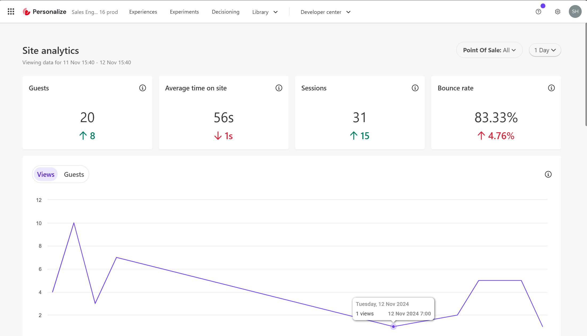
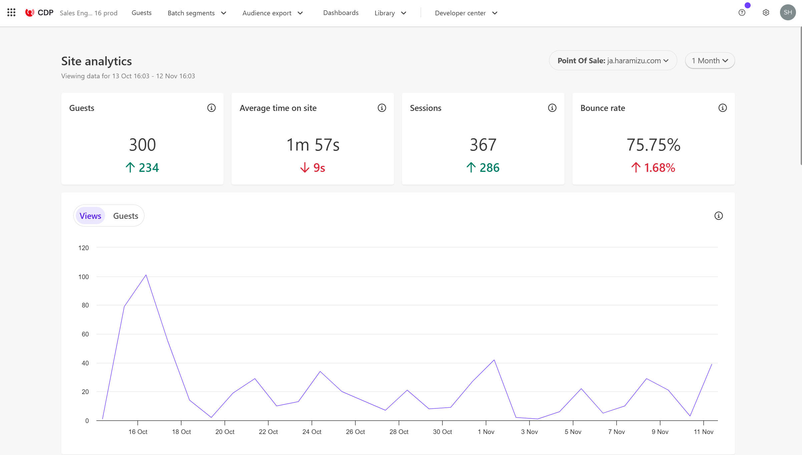
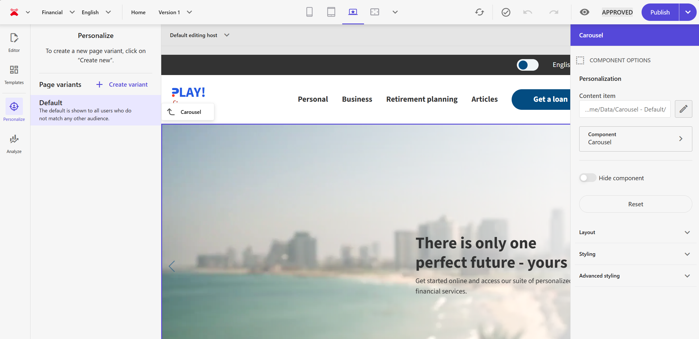
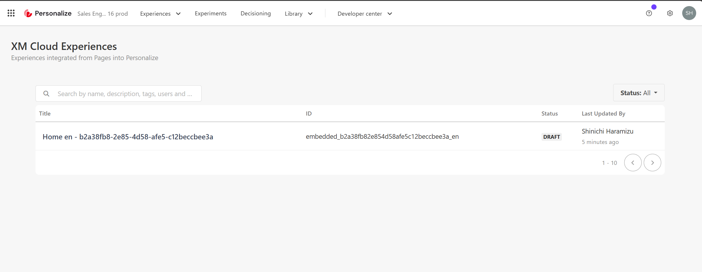

import { LinkCard } from '@astrojs/starlight/components';

Sitecore が提供する顧客のデータを一元管理するためのプラットフォーム Sitecore CDP、そして CDP に蓄積している情報を利用して顧客体験を改善するためのツール、Sitecore Personalize について紹介をします。

## Sitecore CDP + Personalize 概要

Sitecore CDP + Personalize は、個別の製品として利用したり、組み合わせて利用することができます。この製品は、もともと 2021 年 3 月まで Boxever という会社が提供していたサービスで、１つの製品として利用できました。現在はこれを２つの製品として提供している形です。

Sitecore CDP (Customer Data Platform) は、顧客のデータを一元管理し、統合された Guest - 顧客プロファイルを作成するためのプラットフォームです。これにより、企業は顧客の行動や嗜好を深く理解し、パーソナライズされた体験を提供することができます。

一方、Sitecore Personalize は、CDP に蓄積されたデータを活用して、リアルタイムでパーソナライズされたコンテンツやオファーを提供するためのツールです。これにより、顧客のエンゲージメントを高め、コンバージョン率を向上させることができます。

これらのツールを組み合わせることで、企業は顧客のライフサイクル全体にわたって一貫したパーソナライズされた体験を提供することが可能になります。

## Sitecore CDP 機能概要

Sitecore CDP にログインをすると、以下のような画面となります。ログインをしてすぐに表示される情報は、サイトの Analytics の情報を参照する形となります。

上に表示されているメニューからは以下の情報にアクセスすることができます。

- **Guest** : 匿名および認証済ユーザーの Guest - プロファイル情報を確認できます
- **Batch seguments**: リアルタイムの行動と過去の顧客データを融合させた、カスタムセグメントを作成
- **Data Browser**: フィールドを選択して、データを参照することができます
- **Audience export**: Sitecore CDP で蓄積したデータを外部で活用する際に利用できます
- **Dashborad**: サイトに蓄積しているアクセス状況、プロファイルのレポートを参照できます
- **Developer center**: 開発者向けの情報にアクセスすることができます

下の画面は、Guest で表示される一覧となります。

## Sitecore Personalize 機能概要

Sitecore Personalize にログインをすると、CDP と同じ Analytics の情報が表示されています。今回紹介をしている環境は、Sitecore CDP + Personalize と両方を契約している形となっているため、どちらも同じデータが表示されている形です。

上に表示されているメニューからは以下の情報にアクセスすることができます。

- **Experiences**: パーソナライズに関連する設定ができます
- **Experiments**: A/B テストを実施する場合に必要な設定ができます
- **Decisioning**: パーソナライズなどで利用するセグメンテーションを作成することができます
- **Developer center**: 開発者向けの情報にアクセスすることができます

なお、Personalize を単独で契約した場合、匿名のユーザーに対するルールであれば利用することができます。

## 本番環境と非本番環境の違い

Sitecore Cloud Portal にアクセスをすると、CDP および Personalize のアイコンの下に Prod という記載があります。これが本番環境として動作するようになっています。

例えば、非本番環境の CDP にアクセスをすると、Analytics に関しては全く別の結果が表示されます。

基本的には開発、テストの際には非本番環境を利用し、テストが完了したものを本番環境に適用して、本番環境からテストデータを排除する形にする運用が望ましい形となります。

## Point of Sale とは？

管理画面の右上に、CDP および Personalize を利用する上での環境設定のためメニューがあります。このメニューをクリックすると、以下のような項目が表示されます。

ここに表示される Point of Sale とは何でしょうか？ ツールにおいて、組織が商品を販売する際の店舗という位置づけとなっており、チャネルとしては Web サイトであり、また言語が異なれば異なる Point of Sale という形で利用します。

例えば、以下の画面は本番環境で利用している Point of Sale の一覧となります。

CDP にログインをした時に表示される Analytics も Point of Sale でフィルタをかけて結果を表示することが可能です。

## XM Cloud との連携

同じ組織に展開されている Sitecore XM Cloud と CDP + Personalize はどのように連携をしているでしょうか？これに関しては以下の 3 つの観点で確認をしていきます。

### Analytics に関して

Sitecore XM Cloud には Analytics の機能が標準で提供されています。実際の Analytics の画面を参照すると以下のようになります。

Point of sale の一覧を参照すると、まさに CDP および Personalize で共有されている項目がそのまま引き継がれています。実際に、XM Cloud 側で Point of Sale を追加すると、CDP そして Personalize に対しても Point of sale の項目が追加されるようになっています。

### Personalize に関して

XM Cloud には Personalize の機能が標準で提供されており、Page builder の左側のメニューから Personalize の設定ができるようになっています。

実際に Personalize の設定画面を参照すると、ルールとして右側に Out of the box のルールが並んでいます。

実はこの項目は、Personalize のメニュー `Developer center` - `conditions` をクリックすると一覧で表示されるようになっています。

また XM Cloud で作成をした Personalize に関する設定は、`Experiences` - `XM Cloud experiences` で、Personalize で作成する Experience とは別で管理されています。

このように XM Cloud で利用している情報は、Sitecore Personalize において管理されているのが分かります。

### 本番および非本番に関して

XM Cloud、CDP および Personalize には本番環境 ( prod ) と非本番環境が提供されています。それでは、XM Cloud の非本番環境にアクセスをして Analytics の画面を確認します。この際、Point of sale のドロップダウンを表示しているのが以下の画面です。

続いて CDP の非本番環境にアクセスをします。実際の画面は以下のようになります。

このように、Point of sale の項目は XM Cloud の非本番環境、CDP および Personalize の非本番環境で共有されていることを確認できました。実際に、新たに Point of sale を作成すると、それぞれの環境で追加された項目が表示されるようになっています。

つまり、XM Cloud の本番環境と CDP、Personalize の本番環境はデフォルトで連携しており、非本番環境でも同様に連携している形となります。

## まとめ

今回は Sitecore CDP + Personalize を使い始めるにあたって、基本的な機能および構成に関して紹介をしました。今回の環境は、一つの Organization の中に XM Cloud、CDP および Personalize が展開されているため、連携している部分を参照することができました。

実際に XM Cloud には簡易の CDP ( Analytics 部分 ) と Personalize （匿名となる機能限定版）が搭載されており、追加で契約をすれば特に追加で開発をすることなく、フルスペックの製品を利用できるようになっています。

## 参考情報

<LinkCard
  title="Introduction to Sitecore CDP"
  href="https://doc.sitecore.com/cdp/en/users/sitecore-cdp/introduction-to-sitecore-cdp.html"
  target="_blank"
/>
<LinkCard
  title="Manage a point of sale"
  href="https://doc.sitecore.com/cdp/en/users/sitecore-cdp/manage-a-point-of-sale.html"
  target="_blank"
/>
<LinkCard
  title="Introduction to Sitecore Personalize"
  href="https://doc.sitecore.com/personalize/en/users/sitecore-personalize/introduction-to-sitecore-personalize.html"
  target="_blank"
/>
<LinkCard
  title="Manage a point of sale in Sitecore Personalize"
  href="https://doc.sitecore.com/personalize/en/users/sitecore-personalize/manage-a-point-of-sale-in-sitecore-personalize.html"
  target="_blank"
/>

