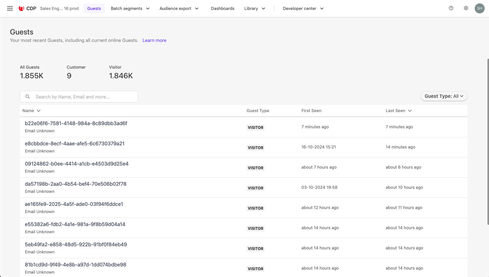
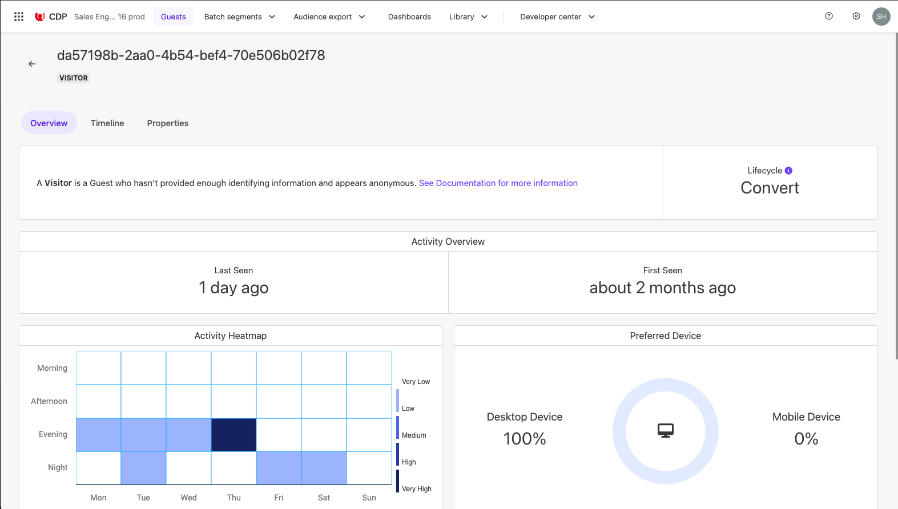
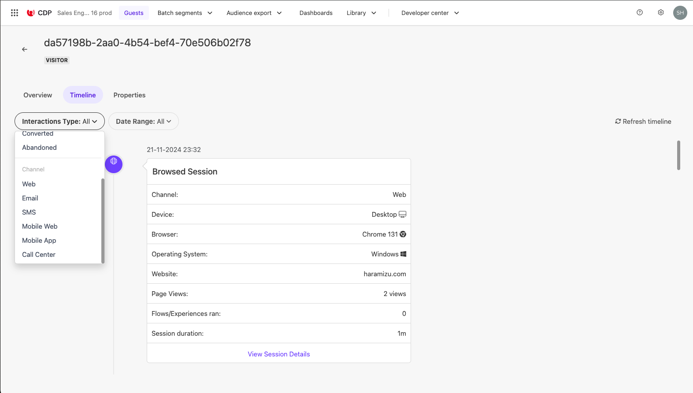
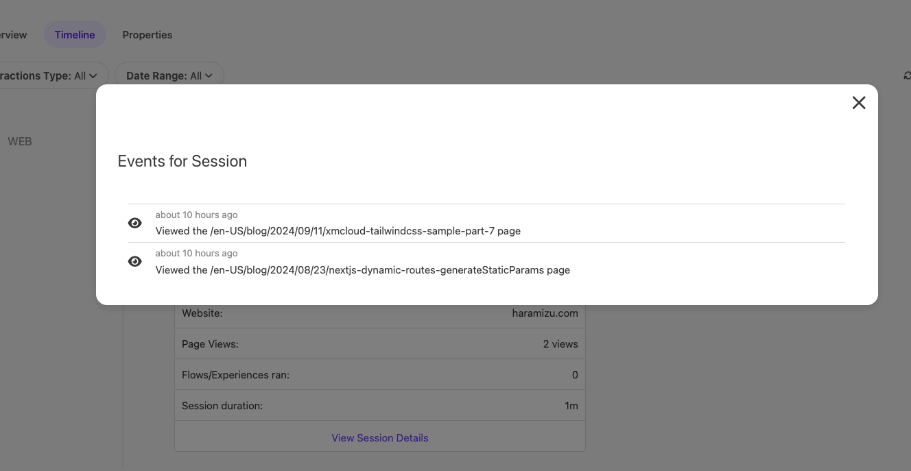
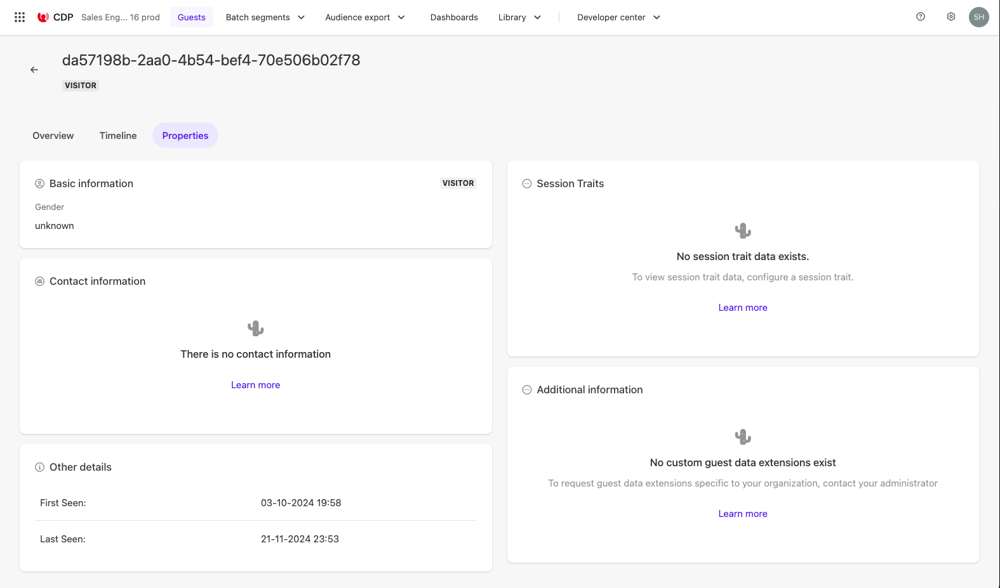
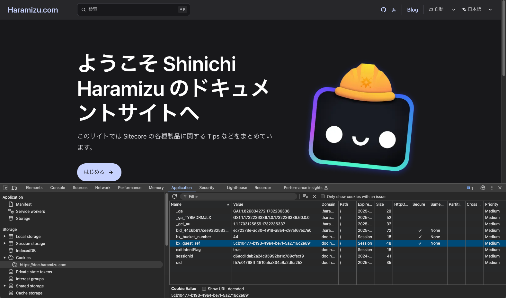
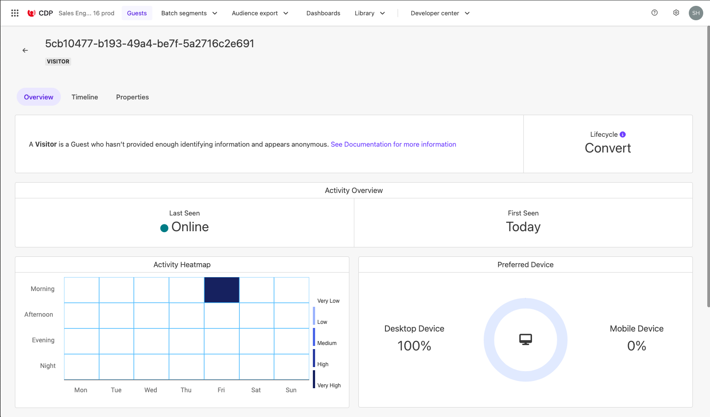
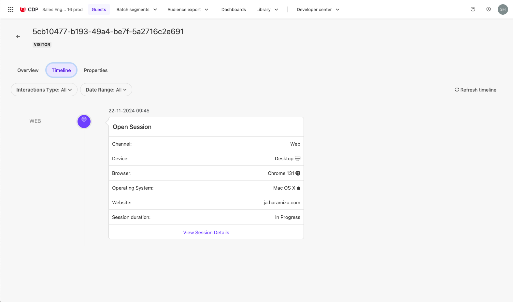
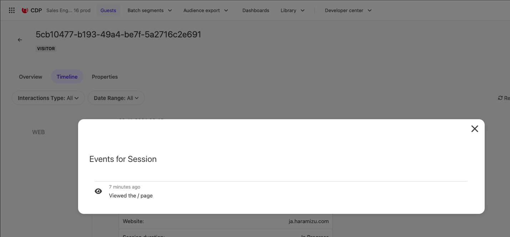
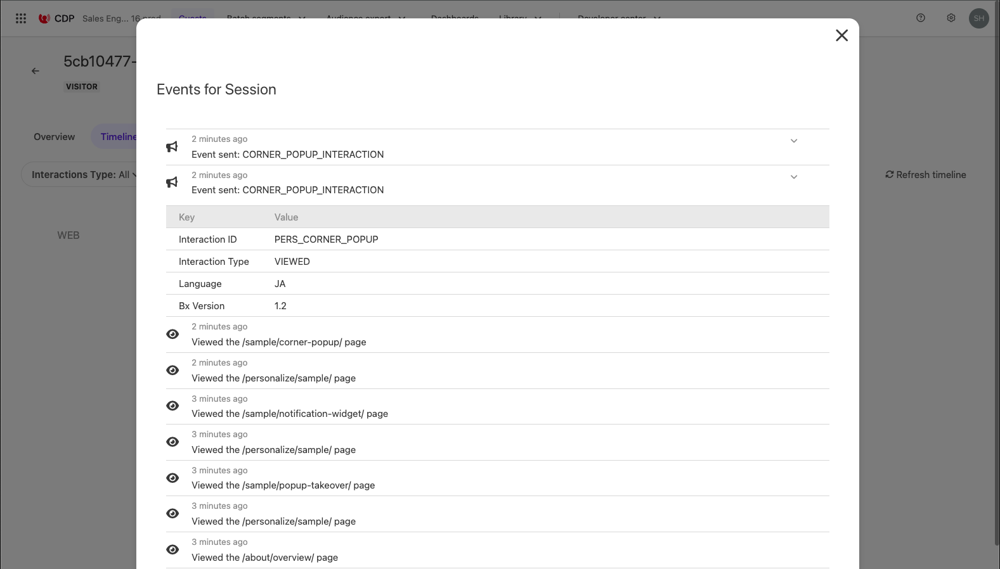

import { LinkCard } from '@astrojs/starlight/components';

このドキュメントでは Sitecore CDP と連携している Web サイトの訪問者の情報を、どのようにゲストとして追いかけているのか、ページを閲覧しながら確認をしていきます。

## Guest ゲストの確認

Sitecore CDP にアクセスすると、上に `Guest` のメニューが表示されています。ここで、実際のゲストの動きを確認することが可能です。この画面では、一覧の右側に表示されている **Guest Type** は **All** として設定しています。



任意の Guest のゲストを確認すると、以下のように概要が表示されます。ここではどの時間帯にアクセスが多いのか、またデバイスのタイプなどが表示されています。匿名のユーザーとして追いかける場合は、ブラウザの Cookie を利用して追いかける形となるため、デバイスは何らかのものに固定されます。下記のゲストの場合、初めて訪問したのは 2 ヶ月前で 1 日前にアクセスしていることがわかります。



Timeline のタブに切り替えると、これまでのセッションに関する情報を一覧で見ることができます。今回は Web のみとなりますが、CDP のゲストに紐づけるチャンネルとしては以下のものが表示されます。

- Web
- Email
- SMS
- Mobile Web
- Mobile App
- Call Center

すべて自動でトラックする形ではなく、他のシステム（ Email、SMS や Call Center ）との連携結果も入れることができることを確認しました。



Web のセッションに関しては、 View Sesion Details をクリックすると、どのページを参照したのかも確認することができます。



Properties のタブを開くと、ユーザーの情報を参照できるようになっています。この対象となるゲストに紐づいているデータは何も無いため、最初に参照した日、最後に見た日のみが表示されています。



## 新しいゲストでサイトに訪問

上記のゲストは、すでにサイトに何度もアクセスをしているゲストを参照した形です。それでは実際に、新しいゲストでアクセスをする場合はどうなるでしょか？まず、ブラウザの InPrivate モードでサイトにアクセスをしてみます。

実際にアクセスをしたあと、開発者ツールを起動してサイトで利用している Cookie の情報を確認すると以下のようになります。



この bx_guest_ref の値と同じゲストが Sitecore CDP の Guest として作成されています。



この画面では、現在 **Online** と表示されています。まだセッションは切れておらず、サイト参照中ということを確認することができます。Timeline のタブに切り替えると、１つめの Web セッションが作成されています。



上記の画面は以下のことを確認することができます。

- Web のセッションとして訪問
- デバイスは Desktop, Chrome 131 、macOS でアクセス、Web サイトとしては ja.haramizu.com （ haramizu.com の日本語コンテンツ）にアクセス
- Session はまだ In Progress

`View Session Details` をクリックして中身を参照します。



まだトップページのみを参照している形です。では、ブラウザの方でいくつかのページを参照します。Sitecore Pesonalize のサンプルのページも参照していきます。その後、ゲストのセッションの情報を改めて確認をすると、以下のようにセッション内容が更新されています。



- 参照したページが下から順に上にアクセスをしています
- いくつかの Personalize のサンプルを参照しました
- 最後に Corner Popup のサンプルページを参照しました。
- Corner popup は Event を CDP に送信をしています。
  - Event に関しては開くとその内容を確認することが可能です

サイトでの訪問に関しては、すべてのページに対して URL を取得するようにしており、また何らかのイベントがあれば記録されている形です。実はこのコードは、Corner Popup のコードの以下の JavaScript の部分になります。

```js {16,23}
// CornerPopup.js
// Adds a unique variant identifier to CSS when deployed to ensure CSS does not impact styling of other elements.
var compiledCSS = Engage.templating.compile(variant.assets.css)(variant);
var styleTag = document.getElementById('style-' + variant.ref);
if (styleTag) {
  styleTag.innerHTML = compiledCSS;
}
// End Adds a unique variant identifier to CSS when deployed to ensure CSS does not impact styling of other elements.

// make space in the body for the experience
insertHTMLAfter('body', 'pers-');
var persContent = document.querySelector('#pers-' + variant.ref + ' #pers-transition-card');

setTimeout(function () {
  persContent.classList.add('open');
  sendInteractionToPersonalize('VIEWED');
});

var persCardClose = document.body.querySelector(
  '#pers-' + variant.ref + ' #pers-transition-card--secondary'
);
persCardClose.onclick = function () {
  sendInteractionToPersonalize('DISMISSED');
  persContent.classList.remove('open');
};

var persCardCta = persContent.querySelector(
  '#pers-' + variant.ref + ' #pers-transition-card--primary'
);
persCardCta.onclick = function () {
  sendInteractionToPersonalize('CLICKED');
  window.location.href = '[[CTA destination URL | string || {required:true, group: CTA Button}]]';
};

function sendInteractionToPersonalize(interactionType) {
  const type = '[[ Experience ID | String | CORNER_POPUP | {required: true}]]_INTERACTION';
  const eventData = {
    channel: 'WEB',
    pointOfSale: Engage.settings.pointOfSale,
    interactionID: 'PERS_CORNER_POPUP',
    interactionType: interactionType,
  };

  window.engage.event(type, eventData);
}
```

このように Personalize を実行した後や、そのページでのイベントを JavaScript を利用してイベントを送ることで、ゲストに対して単なるページ参照ではなく、何らかの行動結果という形でイベントを記録することができます。

## 参考情報

<LinkCard
  title="Identifying guests in Sitecore CDP"
  href="https://doc.sitecore.com/cdp/en/users/sitecore-cdp/identifying-guests-in-sitecore-cdp.html"
  target="_blank"
/>

