import { LinkCard } from '@astrojs/starlight/components';

このドキュメントでは、Postman を利用してゲストに関する情報へのアクセス、更新をする方法を体験します。実際のこの手順は、外部システムと API 連携をする際の参考になります。

## Postman の設定

### Endpoint について

Sitecore CDP に対してデータ処理をするための API は、インスタンスを起動している環境によって異なる形です。今回、私の手元で検証をするのは日本のリージョンで起動している CDP に対してアクセスをするため、`https://api-engage-jpe.sitecorecloud.io` を利用する形です。現在は以下のように４つのリージョンでインスタンスを起動することができます。

| Environment | Base URL                                  |
| ----------- | ----------------------------------------- |
| AP Region   | `https://api-engage-ap.sitecorecloud.io​` |
| EU Region   | `https://api-engage-eu.sitecorecloud.io`  |
| JP Region   | `https://api-engage-jpe.sitecorecloud.io` |
| US Region   | `https://api-engage-us.sitecorecloud.io`  |

### 認証について

サーバーへの認証に関しては基本認証が提供されており、CDP の管理画面からログインをするための API キーを取得する必要があります。管理者の画面から `API access` をクリックします。

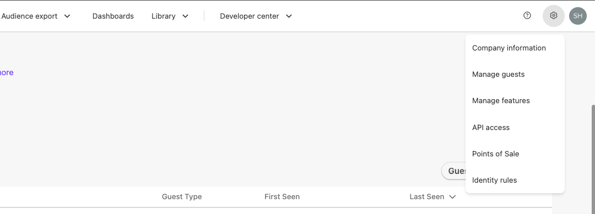

画面が切り替わると、`Client Key` および `API Token` を確認することができます。`Client Key` がユーザー名、`API Token` をパスワードとして利用することになります。

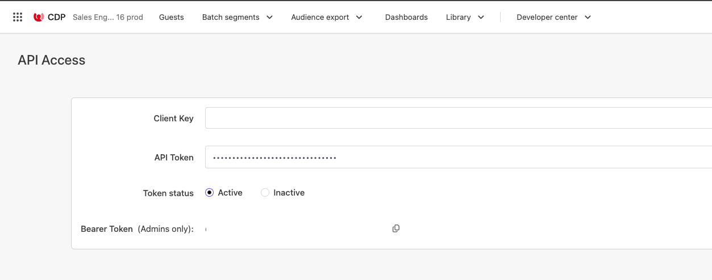

### コレクションの作成

Postman を起動して環境を整えていきます。今回は CDP のための新しいワークスペースを作るため、`Workspaces` - `Create workspace` を選択してワークスペース作成画面に切り替えます。

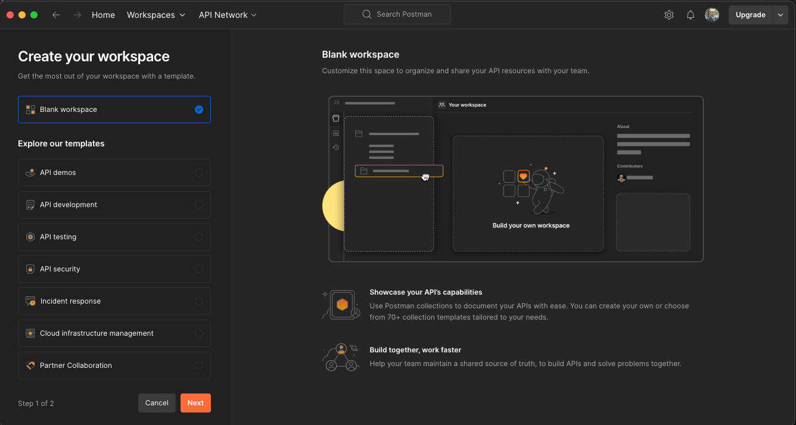

Blank workspace のまま、Next のボタンをクリックして、名前を `Sitecore CDP` と設定、グループの設定としては `Only me` いうワークスペースを作成しました。

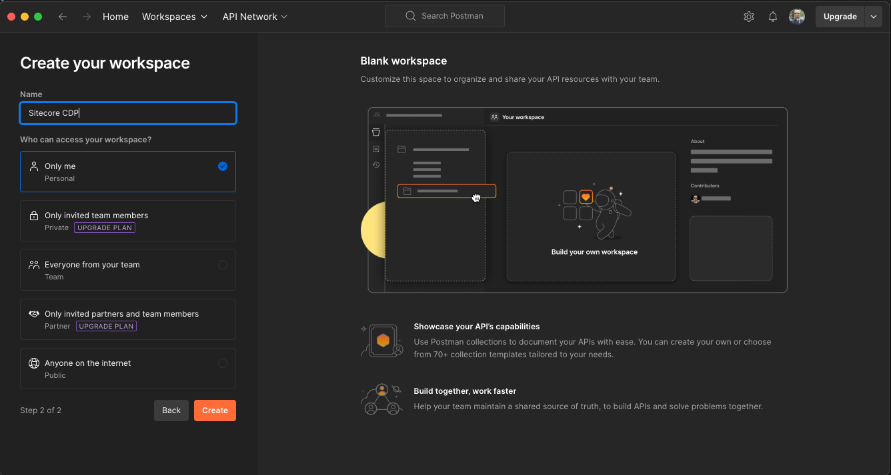

以下のように新しい Workspace が作成されます。

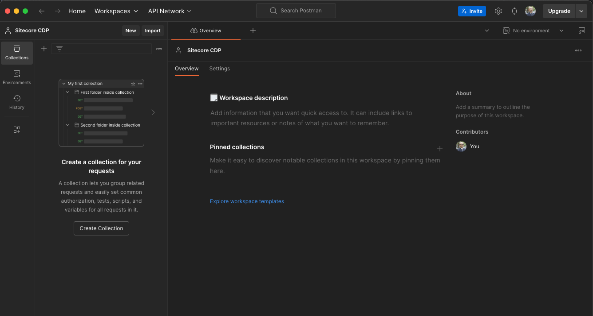

作成された Workspace に対して `Create Collection` のボタンをクリックして新しいコレクションを作成します。コレクションの名前は `Profile` としします。

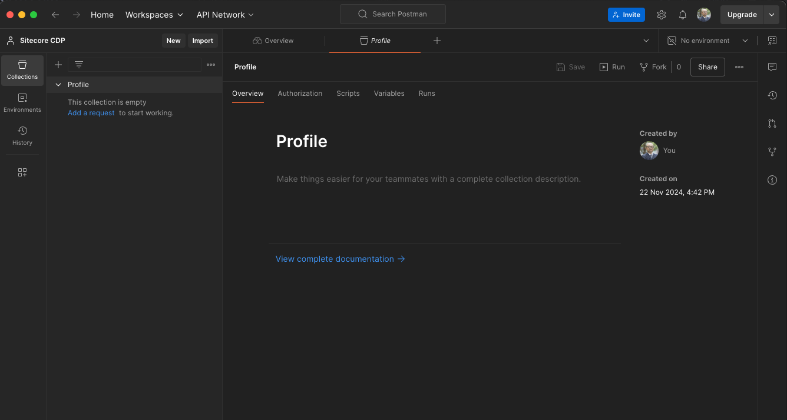

### 環境の作成

この Profile のコレクションに対して、 Authorization のタブが用意されています。これをクリックして、認証の設定をします。今回は基本認証を選択するため、設定は以下のように進めていきます。

- Auth Type: Basic Auth
- Username: Client Key
- Password: API Token

Client Key および API Token に関しては環境によって異なることがあり、かつセンシティブなデータとなります。

そこで、Postman の環境を管理する機能を利用するために、ウィンドウの右上に用意されている Environment のボタンをクリックしてください。`Create Environment` のボタンが表示されます。

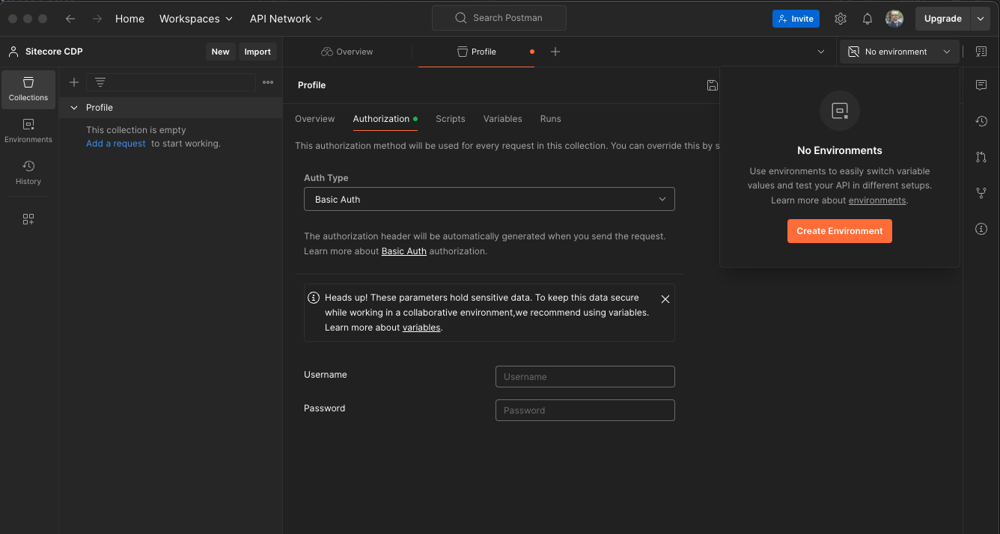

作成された環境に対して、今回は２つの環境変数を設定します。

- CDP_ENDPOINT: サーバーのエンドポイントを設定します
- CDP_CLIENT_KEY: CDP の Client Key を設定
- API_TOKEN: CDP の API Token を設定

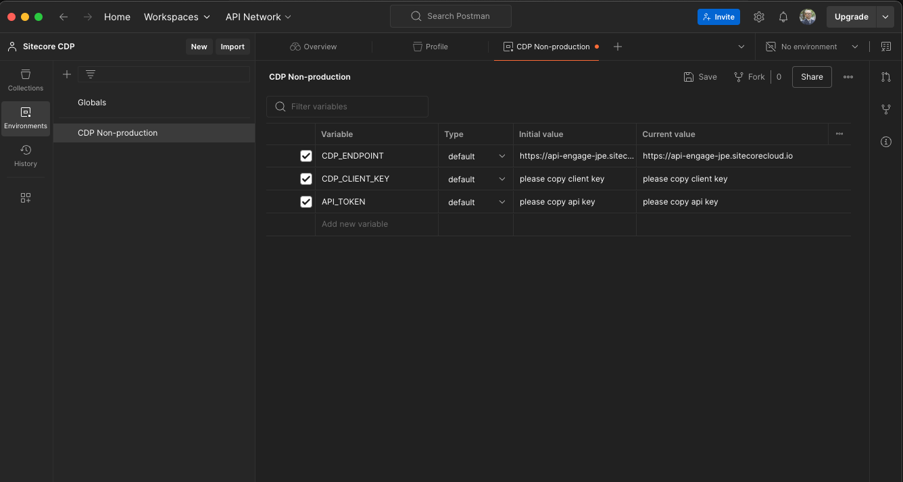

これで環境変数に関しての設定ができました。これを Profile の認証の Username と Password に設定します。

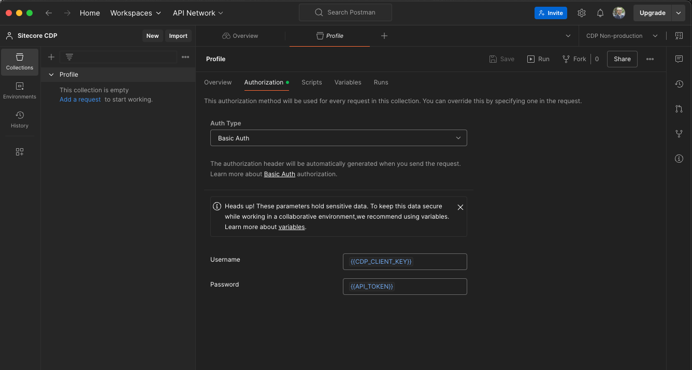

### 動作確認

実際に上記の設定が機能するのかどうかを確認するために、Postman の動作確認を進めていきます。すでに Collection として作成した Sitecore CDP に対して Add a request をクリックして新しい HTTP リクエストを作成します。今回はすでに含まれているゲストを表示したいため、以下のように設定を進めます。

なお、Guest の ID に関しては `{guestRef}` と記述していきます。

- Method: GET
- URL: `{{CDP_ENDPOINT}}/v2/guests/{guestRef}`

これで設定は完了です。以下が画面となります。

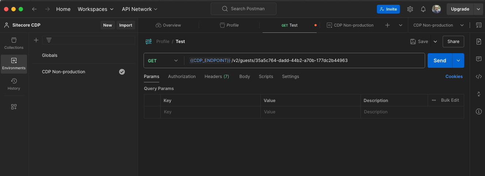

実行をすると、以下のように Json のデータが返ってきました。

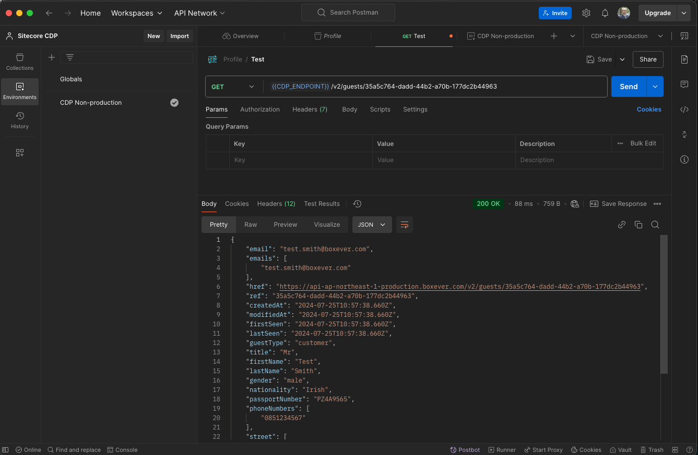

これで Postman の準備が整いました。

## ゲストの操作

ゲストの作成や更新に関しては、API として以下のドキュメントが公開されています。

<LinkCard
  title="Sitecore CDP Guest REST API (v2.1)"
  href="https://api-docs.sitecore.com/cdp/guest-rest-api"
  target="_blank"
/>

今回はこれを実際に利用して、ゲストの作成から更新、削除まで検証をしていきます。

### 作成

ゲストを新たに作成をする際には、以下のような処理を実行することになります。

- Method: POST
- URL: `{{CDP_ENDPOINT}}/v2/guests/`
- BODY: 作成をする JSON データを設定

では早速 Postman を利用して作成していきます。新しい HTTP リクエストを作成して、Body には以下の項目を埋めた Json のデータを作成します。

```json title="JSON"
{
  "guestType": "Customer",
  "title": "Mr",
  "firstName": "Shinichi",
  "lastName": "Haramizu",
  "gender": "male",
  "dateOfBirth": "1971-12-08T00:00:00.000Z",
  "emails": ["haramizu@outlook.com"],
  "phoneNumbers": ["0345236900"],
  "nationality": "Japan",
  "city": "Minato-ku",
  "country": "JP",
  "postCode": "1070062",
  "state": "Tokyo"
}
```

設定をした画面は以下のようになります。

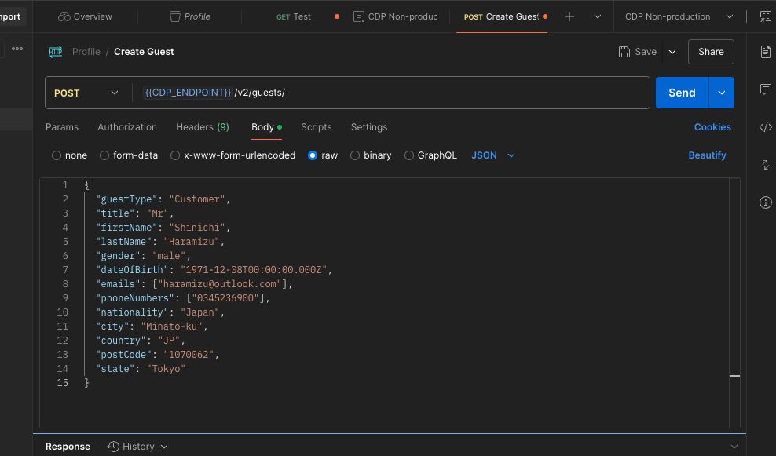

これを Postman で実行をすると、以下のように結果が返ってきます。

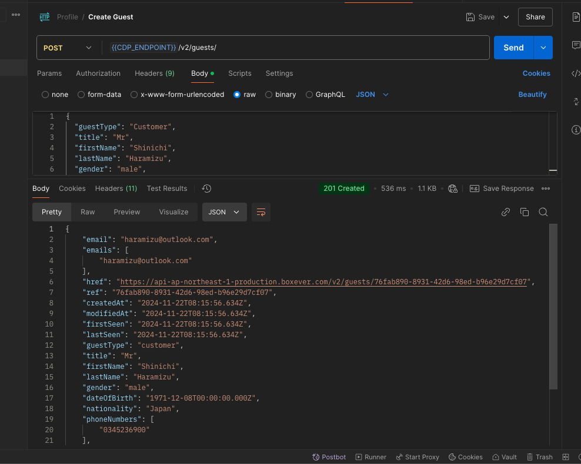

結果として返ってきている Json データは以下のようになります。

```json title="JSON"
{
  "email": "haramizu@outlook.com",
  "emails": ["haramizu@outlook.com"],
  "href": "https://api-ap-northeast-1-production.boxever.com/v2/guests/76fab890-8931-42d6-98ed-b96e29d7cf07",
  "ref": "76fab890-8931-42d6-98ed-b96e29d7cf07",
  "createdAt": "2024-11-22T08:15:56.634Z",
  "modifiedAt": "2024-11-22T08:15:56.634Z",
  "firstSeen": "2024-11-22T08:15:56.634Z",
  "lastSeen": "2024-11-22T08:15:56.634Z",
  "guestType": "customer",
  "title": "Mr",
  "firstName": "Shinichi",
  "lastName": "Haramizu",
  "gender": "male",
  "dateOfBirth": "1971-12-08T00:00:00.000Z",
  "nationality": "Japan",
  "phoneNumbers": ["0345236900"],
  "city": "Minato-ku",
  "country": "JP",
  "postCode": "1070062",
  "state": "Tokyo",
  "identityStatus": "customer",
  "zipCode": "1070062"
}
```

違いを見ると以下のデータが追加されています。

- href
- ref
- createdAt
- modifiedAt
- firstSeen
- lastSeen
- identityStatus
- zipCode

実際に作成されたゲストに対して、自動的に作成されたものも含めて結果が返っている形です。実際に CDP の方にアクセスをすると、以下のように新しいゲストが作成されています。

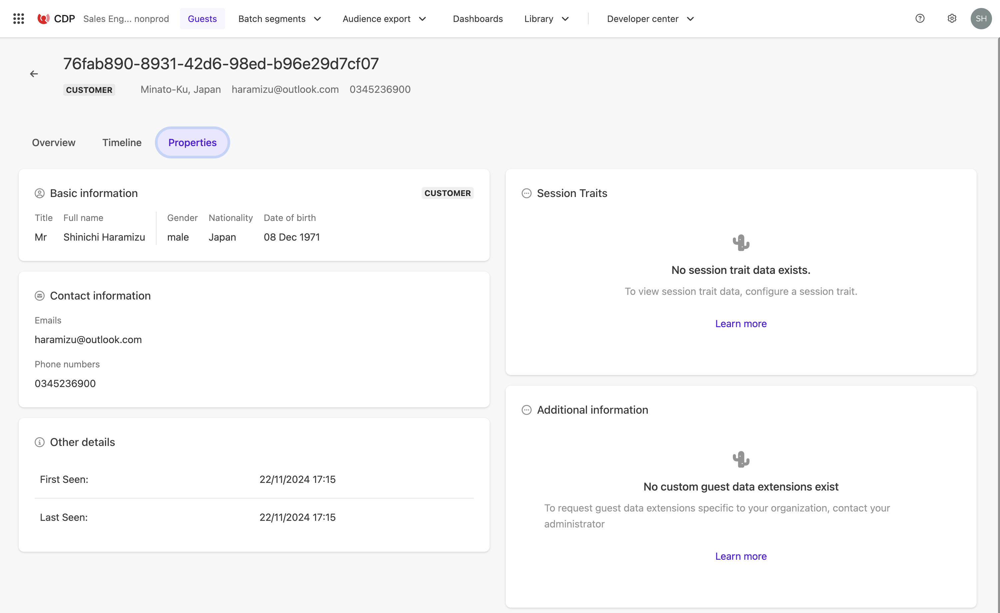

### 探す

Postman の動作検証の際には、CDP の管理画面から ID を取得してその結果を利用していました。実際の運用の際には、メールアドレスなどを利用して Guest の情報がないか確認する必要が出てきます。そこで今回は、Guest のデータに関して API を通じて確認していきます。

まず最初に、メールアドレスで検索をします。

- Method: GET
- URL: `{{CDP_ENDPOINT}}/v2/guests/` QueryString として email= を利用して実行する

実際に実行している画面は以下の通りです。

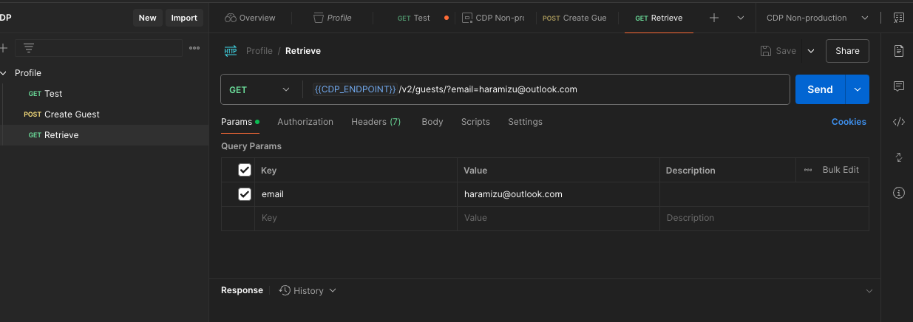

結果は以下のような JSON のデータが返ってきます。

```json TITLE="JSON"
{
  "href": "https://api-ap-northeast-1-production.boxever.com/v2/guests/?offset=0&limit=10&email=yourmail@example.com",
  "offset": 0,
  "limit": 10,
  "first": {
    "href": "https://api-ap-northeast-1-production.boxever.com/v2/guests/?offset=0&limit=10&email=yourmail@example.com"
  },
  "last": {
    "href": "https://api-ap-northeast-1-production.boxever.com/v2/guests/?offset=0&limit=10&email=yourmail@example.com"
  },
  "items": [
    {
      "href": "https://api-ap-northeast-1-production.boxever.com/v2/guests/aaaaaaaa-bbbb-cccc-dddd-eeeeeeee"
    }
  ]
}
```

今回はメールアドレスで検索をして、１つの item の結果を得ている形です。そして `items` : `href` の項目に、`{guestRef}`のついた URL が表示されており、このキーを利用することでこのユーザーの詳細情報を取得することができます。

### 更新

今回は作成をした Guest の情報を API を通じて更新をする手順を紹介します。すでに上の手順で作成しているプロファイルに対して、以下の手順で更新を実行します。

- Method: PUT
- URL: `{{CDP_ENDPOINT}}/v2/guests/{guestRef}`
- Body: 更新のための JSON データ

今回は、更新をしたい項目は firstname、LastName および postCode となりますが、そのほか関連するキーを設定しておきます。

```json
{
  "guestType": "customer",
  "title": "Mr",
  "firstName": "真一",
  "lastName": "原水",
  "postCode": "107-0062",
  "gender": "male",
  "identityStatus": "customer",
  "dateOfBirth": "1971-12-08T00:00:00.000Z",
  "emails": ["haramizu@outlook.com"],
  "phoneNumbers": ["0345236900"],
  "nationality": "Japan",
  "city": "Minato-ku",
  "country": "JP",
  "state": "Tokyo"
}
```

上記の設定後、実行した結果は以下のように表示されています。

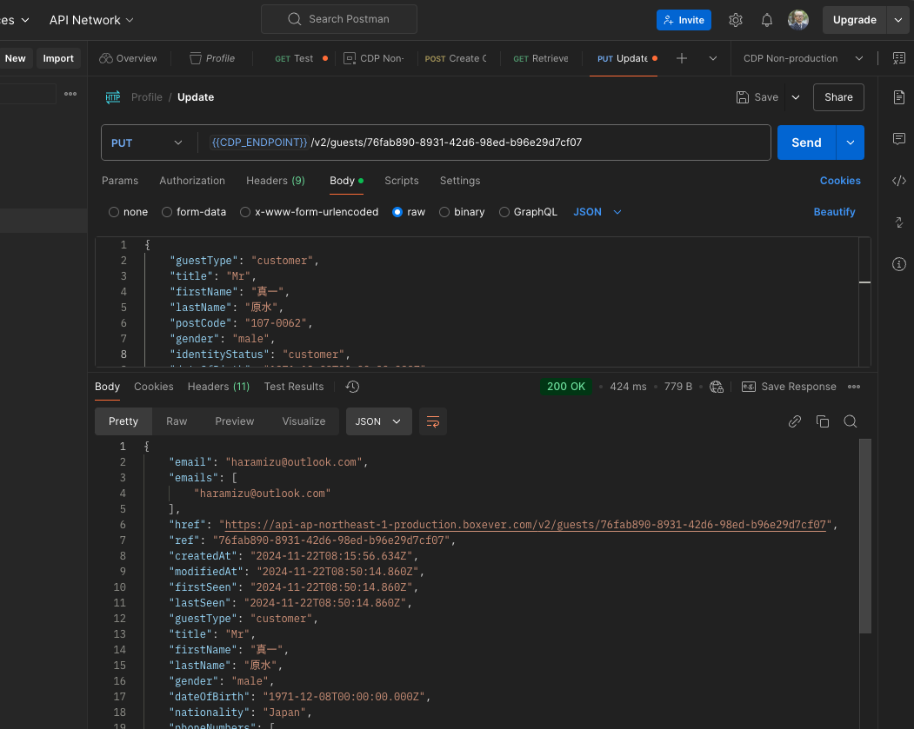

管理画面を見ると、名前が更新されていることを確認することができます。


### 削除

今回はテストで作成をした Guest のプロファイルのため、気軽に削除の手順を進めることができます。削除をするのは非常に簡単で、以下のような形で Postman からリクエストを送ります。

- Method: DELETE
- URL: `{{CDP_ENDPOINT}}/v2/guests/{guestRef}`

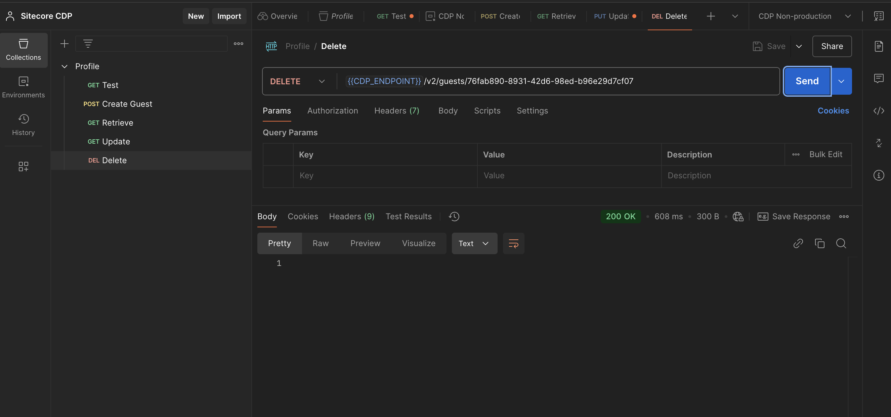

実行後、200 の結果が表示されていればデータは削除されています。

## まとめ

今回は Guest の制御を Postman を利用して API から実行していきました。この基本となる動きを理解していれば、Sitecore Connect を利用して外部のデータとの連携などでスムーズに作業をすることが可能になります。

## 参考情報

<LinkCard
  title="Sitecore CDP Guest REST API (v2.1)"
  href="https://api-docs.sitecore.com/cdp/guest-rest-api"
  target="_blank"
/>

<LinkCard
  title="SitecoreNA / Sitecore-CDP-Scripts"
  href="https://github.com/SitecoreNA/Sitecore-CDP-Scripts"
  target="_blank"
/>

