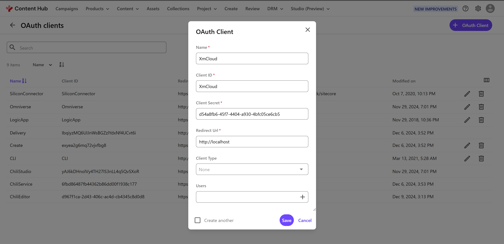
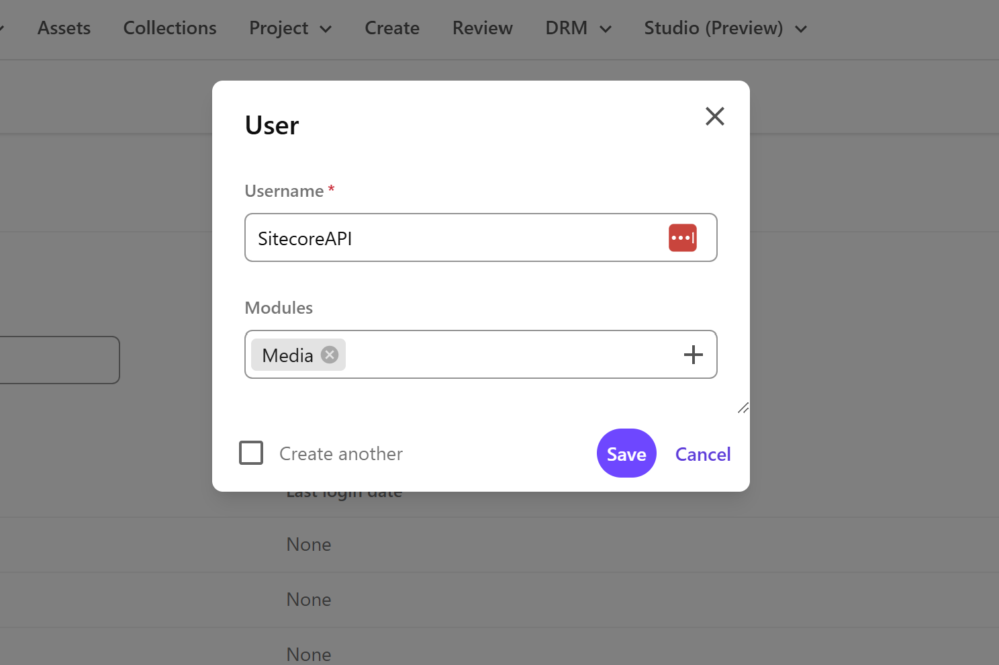
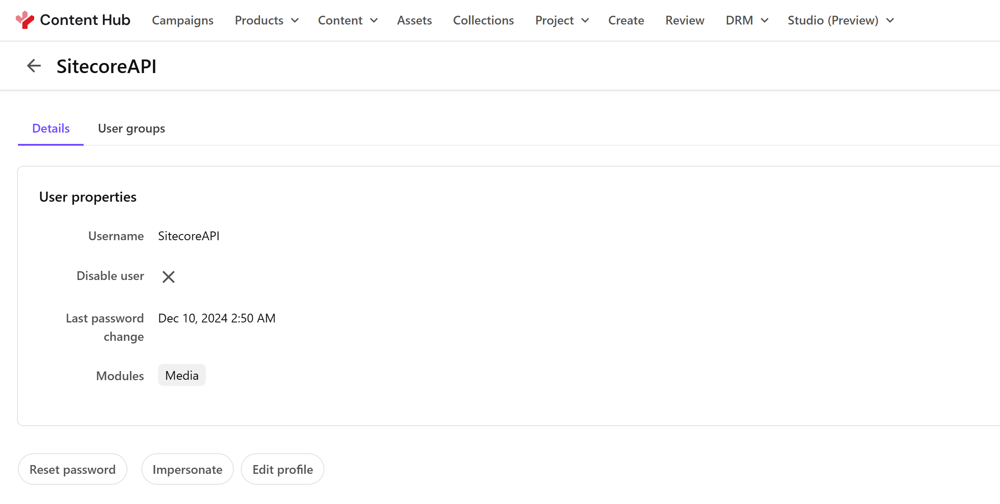
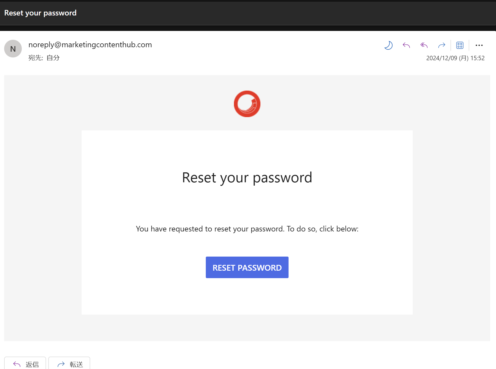
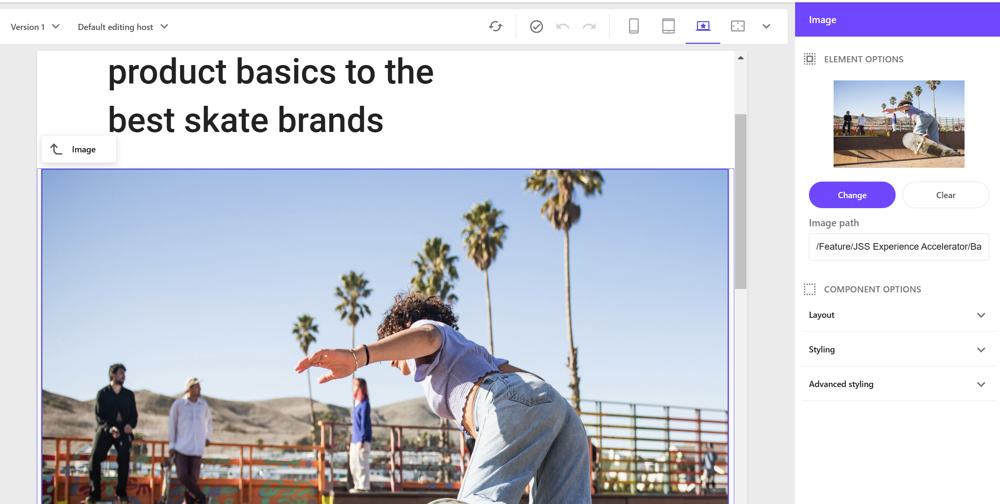
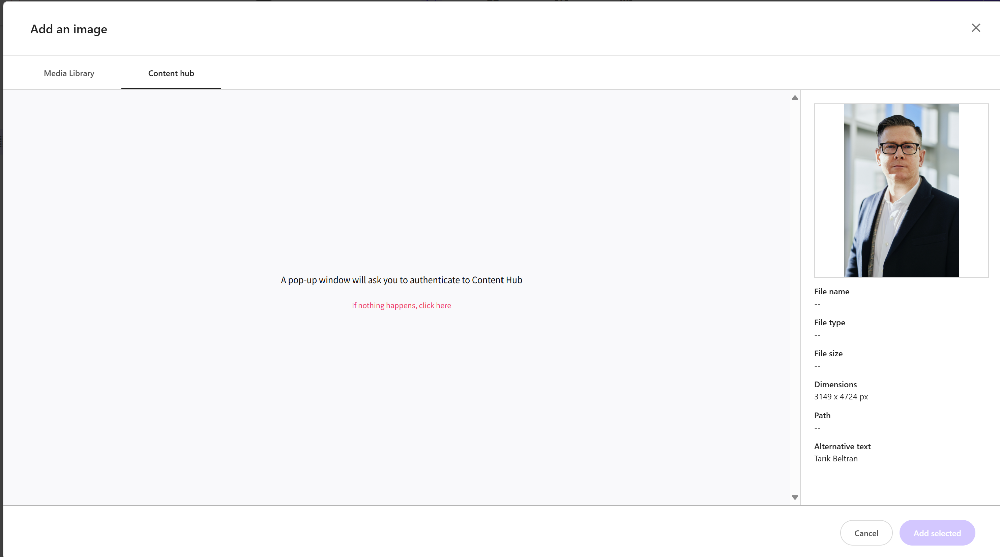
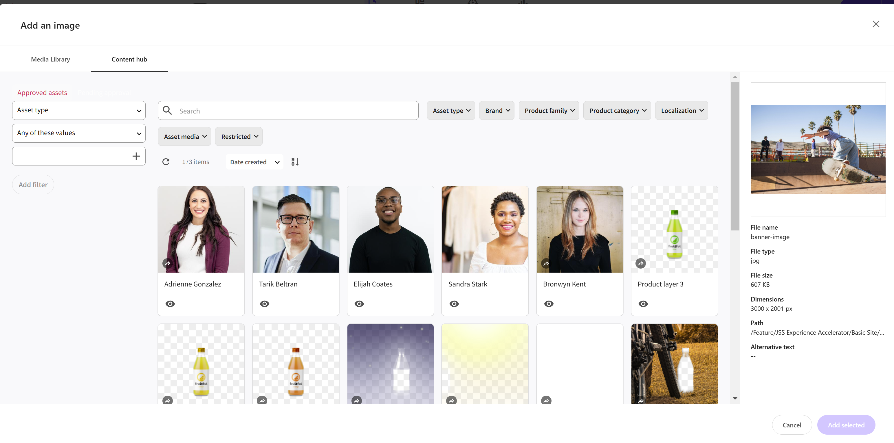
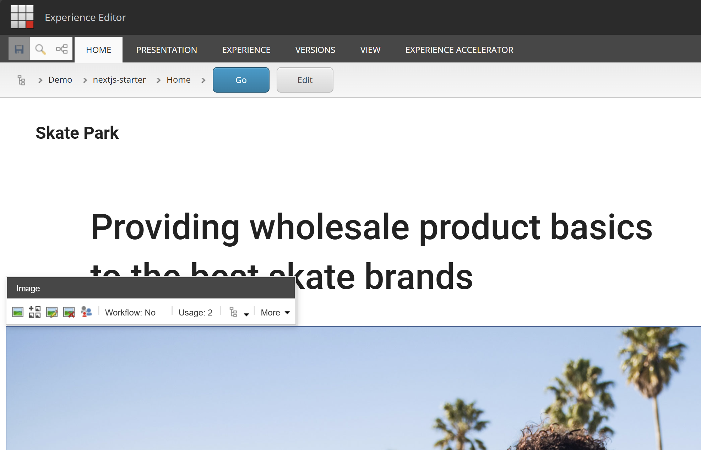
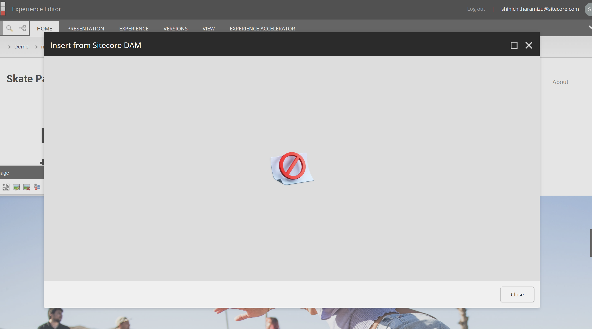

import { Steps, LinkCard } from '@astrojs/starlight/components';

{/* https://blog.haramizu.com/ja-JP/blog/2021/06/17/sitecore-connect-for-content-hub-4.0-part-1 */}
{/* https://blog.haramizu.com/ja-JP/blog/2021/06/18/sitecore-connect-for-content-hub-4.0-part-2 */}
{/* https://blog.haramizu.com/ja-JP/blog/2022/03/22/sitecore-connect-for-content-hub-5.0 */}
{/* https://blog.haramizu.com/ja-JP/blog/2023/07/12/content-hub-connector */}

このドキュメントでは、Sitecore XM Cloud の環境において Sitecore Content Hub を連携させる手順について紹介をしていきます。今回はモジュールのインストールおよび初期設定までの紹介とします。

## 前提条件

今回は Sitecore XM Cloud の環境と Content Hub DAM を連携させるにあたって、２つの環境での手順を紹介します。

- Sitecore XM Cloud + Sitecore Content Hub
- Docker 環境 + Sitecore Content Hub

SaaS の環境となる Sitecore XM Cloud の設定と、ローカルの環境となる Docker 版では連携に貸して異なる手順となるため、必要に応じてプロジェクトに対して設定を追加してください。

## Content Hub の準備

Sitecore XM Cloud と Content Hub を連携させるためには、Content Hub の設定をする必要があります。必要となる項目は、実際に連携をするサーバーの `URI` と以下の項目が必要となります。

- `client_id`
- `client_secret`
- `username`
- `password`

### クライアント情報

連携をする際に必要となる `client_id` と `client_secret` に関しては、Content Hub の管理ツール OAuth clients の画面から取得することが可能です。新しく OAuth Client を今回は準備をします。名前を XmCloud として以下のように作成します（Client Secret には GUID を割り当てるなどキーとして有効にしてください）。



これで、必要となる 2 つのキーを設定した OAuth Client の作成が出来ました。

### ログイン認証

次のステップで作成をするユーザーが Sitecore の認証で利用できるようにするために、認証モードを変更する必要があります。手順は以下の通りです。

<Steps>

1. 管理ツールの `Settings` をクリックします

2. `PortalConfiguration` - `Authentication` の設定を選択します

3. `ExternalAuthenticationProviders` - `saml` - `authentication_mode` を Active から Passive に変更します。

   

4. `Save` のボタンをクリックして設定を反映させます

</Steps>

これで Sitecore のローカルアカウントでのログインができるようになりました。

### ユーザー情報

接続文字列を作成するにあたって、ログインが可能なユーザー名とパスワードが必要となります。以下の手順でユーザーを作成していきます。

<Steps>

1. 管理画面から `Users` を選択します。

2. `+ User` のボタンをクリックしてい新しいユーザーを作成します。Modules には `Media` を設定します。

   

3. ユーザーの作成が完了すると、ユーザー情報のページとなります。標準のロールのままでは利用できないため、対象となるアカウントには以下のロールを追加してください。

   - M.Builtin.ContentAdministrators
   - M.Builtin.SitecoreDAM.Everyone
   - M.Builtin.Editors
   - M.Builtin.Readers
   - M.Builtin.DRM.Everyone

4. パスワードを指定するためには、パスワードリセットのためのメールアドレスが必要となるため、Edit Profile をクリックして、メールアドレスを設定します。

   

   メールアドレスを設定後、`Reset password` のボタンをクリックします。

5. しばらくするとメールが届きます。メールは日ごろ利用していなドメインからの送信で迷惑メールに入ることがあります。受信トレイにない場合は、迷惑メールフォルダを確認してください。

   

6. 新しいパスワードを設定します。

   

7. ユーザー名でログインが出来れば、ユーザーアカウントの作成が完了となります。

</Steps>

一度、作成をしたユーザー名とパスワードで入れるか確認をしてください。


上記の設定で、`username` と `password` の準備が出来ました。

### CORS の設定

Sitecore Content Hub のページは、CORS - Cross-Origin Resource Sharing の設定が有効となっており、許可されたサイトでのみアプリケーションとして動作するようになっています。ここでは、利用する Sitecore XM Cloud のツールなどの URL を指定して、Connector が動作するように設定をしていきます。

<Steps>

1. Content Hub の管理ツールの `Settings` を開きます

2. `PortalConfiguration` - `CORSConfiguration` を開きます

3. サイトとして `https://pages.sitecorecloud.io/` および XM Cloud のインスタンスの URL を追加します

   

</Steps>

これで Sitecore Content Hub 側の準備は完了となります。

## Sitecore XM Cloud

事前に準備をした値を利用して、Sitecore XM Cloud 側の設定を進めていきます。

### Connector を有効にする

XM Cloud と Content Hub の連携をする際には、コネクタの連携は従来の環境のようにモジュールをインストールする形ではありません。Sitecore Content Hub の DAM および CMP の連携に関しては、標準機能として提供しており、この機能を有効にするのは環境変数を設定するだけとなります。

公式の手順書は以下の通りです。

<LinkCard
  title="Walkthrough: Enabling the DAM connector in XM Cloud on Sitecore Cloud Portal"
  href="https://doc.sitecore.com/xmc/en/developers/xm-cloud/walkthrough--enabling-the-dam-connector-in-an-environment-deployed-to-xm-cloud.html"
  description="To use Sitecore DAM in an environment deployed to XM Cloud, you must configure and enable the DAM connector."
  target="_blank"
/>

まず、XM Cloud Deploy で設定をしたい環境を選択して、タブのメニュー項目から Variables を選択します。その後、以下の４つの項目を追加していきます。設定をする際、 `uri` には接続をしたい DAM の URI（例 : `https://frutifuljp.sitecoresandbox.cloud/` ）と、Sitecore Content Hub search page URI には URL + アセットのページ（例：

| Name                                                     | Value                                                                                                  |
| -------------------------------------------------------- | ------------------------------------------------------------------------------------------------------ |
| `SITECORE_AppSettings_damEnabled__define`                | Yes                                                                                                    |
| `Sitecore_ConnectionStrings_DAM_dot_ContentHub`          | `ClientId={client_id};ClientSecret={client_secret};UserName={username};Password={password};URI={uri};` |
| `Sitecore_ConnectionStrings_DAM_dot_SearchPage`          | `{Sitecore Content Hub search page URI}`                                                               |
| `Sitecore_ConnectionStrings_DAM_dot_ExternalRedirectKey` | `Sitecore`                                                                                             |

環境変数を変更した場合は、Rebuild をする必要がありますが、XM Cloud のプロジェクト側にも設定の変更が必要となります。次のステップに進んでください。

### Content Security Policy の更新

XM Cloud の環境では、セキュリティとして iFrame などで管理画面上で利用したいツールをすべて表示できるようにしていません。このため、Content Security Policy に関しての設定を変更する必要があります。

まず最初に、設定を変更するためのパッチファイルを作成します。今回は `authoring\platform\xdts\Web.config.xdt` にファイルを作成します。

```xml title="authoring\platform\xdts\Web.config.xdt"
<?xml version="1.0" encoding="utf-8"?>
<configuration xmlns:xdt="http://schemas.microsoft.com/XML-Document-Transform">
    <location path="sitecore">
        <system.webServer>
            <httpProtocol>
                <customHeaders>
                    <add xdt:Transform="SetAttributes" xdt:Locator="Match(name)" name="Content-Security-Policy" value="default-src 'self' 'unsafe-inline' 'unsafe-eval' https://apps.sitecore.net https://*.sitecorecloud.io https://*.stylelabs.io https://*.stylelabs.cloud https://*.stylelabsdemo.com https://*.stylelabsqa.com https://*.stylelabsdev.com https://*.sitecoresandbox.cloud https://*.azureedge.net https://stylelabs.eu.auth0.com https://login.windows.net https://login.microsoftonline.com https://*.boxever.com https://*.xmcloudcm.localhost wss://www.xmcloudcm.localhost https://ipv4.jsonip.com; img-src 'self' data: https://s.gravatar.com https://*.wp.com/cdn.auth0.com/avatars https://*.sitecorecloud.io https://*.stylelabs.io https://*.stylelabs.cloud https://*.stylelabsdemo.com https://*.stylelabsqa.com https://*.stylelabsdev.com https://*.sitecoresandbox.cloud https://*.azureedge.net https://*.xmcloudcm.localhost; style-src 'self' 'unsafe-inline' https://fonts.googleapis.com https://*.sitecorecloud.io; font-src 'self' 'unsafe-inline' https://fonts.gstatic.com https://*.sitecorecloud.io; frame-ancestors 'self' pages.sitecorecloud.io pages.sitecore.io symphony.sitecorecloud.io explorer.sitecorecloud.io https://pages.sitecorecloud.io https://*.xmcloudcm.localhost https://*.sitecoredemo.com; block-all-mixed-content"/>
                </customHeaders>
            </httpProtocol>
        </system.webServer>
    </location>
</configuration>
```

続いて上記のファイルを XM Cloud で展開する際に必要なファイルとしてインポートをするために、 `authoring\platform\Platform.csproj` のファイルの設定を変更します

```diff lang="xml" title="authoring\platform\Platform.csproj"
  <ItemGroup>
    <Content Include="App_Config\Include\zzz\languagefallback.config" />
    <Content Include="App_Data\items\core\localization\cmp.items.core.ja-JP.dat" />
    <Content Include="App_Data\items\core\localization\dam.items.core.ja-JP.dat" />
    <Content Include="App_Data\items\core\localization\items.core.ja-JP.dat" />
    <Content Include="App_Data\items\core\localization\items.core.jss.ja-JP.dat" />
    <Content Include="App_Data\items\core\localization\items.core.sxa.ja-JP.dat" />
    <Content Include="App_Data\items\master\localization\cmp.items.master.ja-JP.dat" />
    <Content Include="App_Data\items\master\localization\dam.items.master.ja-JP.dat" />
    <Content Include="App_Data\items\master\localization\items.master.ja-JP.dat" />
    <Content Include="App_Data\items\master\localization\items.master.jss.ja-JP.dat" />
    <Content Include="App_Data\items\master\localization\items.master.sxa.ja-JP.dat" />
    <Content Include="App_Data\localization\cmp.texts.ja-JP.xml" />
    <Content Include="App_Data\localization\dam.texts.ja-JP.xml" />
    <Content Include="App_Data\localization\texts.ja-JP.xml" />
    <Content Include="App_Data\localization\texts.jss.ja-JP.xml" />
    <Content Include="App_Data\localization\texts.sxa.ja-JP.xml" />
+    <Content Include="xdts\Web.config.xdt" />
```

最後に、XM Cloud が利用している設定ファイル xmcloud.build.json で上記の xdt ファイルを適用するように指定します。

```diff lang="json"
{
  "renderingHosts": {
    "xmcloudpreview": {

      ..

      "type": "sxa",
      "buildCommand": "build",
      "runCommand": "next:start"
    }
  },
+  "transforms": [
+    {
+      "xdtPath": "/xdts/",
+      "targetPath": "/"
+    }
+  ],
```

上記の設定を追加したあと、GitHub にコードを反映させて、XM Cloud のインスタンスを Rebuild で改めて展開をしてください。

### 動作確認

実際に Content Hub の環境にアクセスできるか、XM Cloud の Pages から確認をしていきます。

<Steps>

1. Pages を開きます

2. Image コンポーネントを選択、

   

3. `Change` のボタンをクリックしてメディアの選択画面に切り替えます

4. `Content Hub` のタブを開きます。この際、ログイン認証が表示されるため、今回指定したアカウントでログインをします。

   

5. 以下のように、画像が表示されれば設定が完了となります。

   

</Steps>

今回は、アカウントを作成してログインができるように設定をしました。SSO が有効になっていて、Content Hub にもアクセスできるようになっている場合は、ログインが表示されることはありません。

## Docker

今回はローカルで動作する docker の環境に対して Sitecore Connect for Sitecore Content Hub を有効にしていきます。公式の手順は以下のページで紹介されています。

<LinkCard
  title="Walkthrough: Enabling the DAM connector in a local development environment"
  href="https://doc.sitecore.com/xmc/en/developers/xm-cloud/walkthrough--enabling-the-dam-connector-in-a-local-development-environment.html"
  target="_blank"
/>

### Content Security Policy の更新

XM Cloud の Docker の環境もクラウドのサーバーと同様に、セキュリティとして iFrame などで管理画面上で利用したいツールをすべて表示できるようにしていません。このため、Content Security Policy に関しての設定を変更する必要があります。

この設定を変更するためのパッチファイルを作成します。今回は `local-containers\docker\build\cm\xdts\Web.config.xdt` にファイルを作成します。

```xml title="local-containers\docker\build\cm\xdts\Web.config.xdt"
<?xml version="1.0" encoding="utf-8"?>
<configuration xmlns:xdt="http://schemas.microsoft.com/XML-Document-Transform">
    <location path="sitecore">
        <system.webServer>
            <httpProtocol>
                <customHeaders>
                    <add xdt:Transform="SetAttributes" xdt:Locator="Match(name)" name="Content-Security-Policy" value="default-src 'self' 'unsafe-inline' 'unsafe-eval' https://apps.sitecore.net https://*.sitecorecloud.io https://*.stylelabs.io https://*.stylelabs.cloud https://*.stylelabsdemo.com https://*.stylelabsqa.com https://*.stylelabsdev.com https://*.sitecoresandbox.cloud https://*.azureedge.net https://stylelabs.eu.auth0.com https://login.windows.net https://login.microsoftonline.com https://*.boxever.com https://*.xmcloudcm.localhost wss://www.xmcloudcm.localhost https://ipv4.jsonip.com; img-src 'self' data: https://s.gravatar.com https://*.wp.com/cdn.auth0.com/avatars https://*.sitecorecloud.io https://*.stylelabs.io https://*.stylelabs.cloud https://*.stylelabsdemo.com https://*.stylelabsqa.com https://*.stylelabsdev.com https://*.sitecoresandbox.cloud https://*.azureedge.net https://*.xmcloudcm.localhost; style-src 'self' 'unsafe-inline' https://fonts.googleapis.com https://*.sitecorecloud.io; font-src 'self' 'unsafe-inline' https://fonts.gstatic.com https://*.sitecorecloud.io; frame-ancestors 'self' pages.sitecorecloud.io pages.sitecore.io symphony.sitecorecloud.io explorer.sitecorecloud.io https://pages.sitecorecloud.io https://*.xmcloudcm.localhost https://*.sitecoredemo.com; block-all-mixed-content"/>
                </customHeaders>
            </httpProtocol>
        </system.webServer>
    </location>
</configuration>
```

このファイルを Docker イメージを作成するときに適用するために、`local-containers\docker\build\cm\Dockerfile` のファイルで以下のように変更を適用します。

```diff lang="dockerfile" title="local-containers\docker\build\cm\Dockerfile"
# Copy developer tools and entrypoint
COPY --from=tools C:\tools C:\tools

+# Copy Xdts
+COPY .\Xdts\ .\Xdts

+# Perform transforms
+RUN (Get-ChildItem -Path 'C:\\inetpub\\wwwroot\\xdts\\web*.xdt' -Recurse ) | `
+    ForEach-Object { & 'C:\\tools\\scripts\\Invoke-XdtTransform.ps1' -Path 'C:\\inetpub\\wwwroot\\web.config' -XdtPath $_.FullName `
+    -XdtDllPath 'C:\\tools\\bin\\Microsoft.Web.XmlTransform.dll'; };
```

これで CSP に関しての変更が出来ました。

### 環境変数を設定する

続いてローカルで動作する Docker の環境に対して、クラウドの時と同様の設定を追加します。下記の値に関しては、

```.env title="local-containers.env"
SITECORE_DAM_ENABLED=Yes
Sitecore_DAM_ContentHub=ClientId={client_id};ClientSecret={client_secret};UserName={username};Password={password};URI={uri};
Sitecore_DAM_SearchPage={Sitecore Content Hub search page URI}
Sitecore_DAM_ExternalRedirectKey=true
```

上記の値を、docker の cm イメージで利用できるように、`local-containers\docker-compose.yml` に対して以下の項目を追加します。

```diff lang="yml"
//local-containers\docker-compose.yml
      SITECORE_FedAuth_dot_Auth0_dot_ClientSecret: ${SITECORE_FedAuth_dot_Auth0_dot_ClientSecret}
      SITECORE_FedAuth_dot_Auth0_dot_Domain: ${SITECORE_FedAuth_dot_Auth0_dot_Domain}
      SITECORE_FedAuth_dot_Auth0_dot_Audience: ${SITECORE_FedAuth_dot_Auth0_dot_Audience}
      SITECORE_FedAuth_dot_Auth0_dot_LogoutRedirect: ${SITECORE_FedAuth_dot_Auth0_dot_LogoutRedirect}
+      # Sitecore Connect for Content Hub
+      Sitecore_ConnectionStrings_DAM_dot_ContentHub: ${Sitecore_DAM_ContentHub}
+      Sitecore_ConnectionStrings_DAM_dot_SearchPage: ${Sitecore_DAM_SearchPage}
+      Sitecore_ConnectionStrings_DAM_dot_ExternalRedirectKey: ${Sitecore_DAM_ExternalRedirectKey}
+      SITECORE_AppSettings_damEnabled__define: ${SITECORE_DAM_ENABLED}
    healthcheck:
```

これで Connector が有効になります。サンプルサイトの画像をクリックすると、左から2つ目に DAM を利用するアイコンが表示されているのがわかります。



これをクリックした後、エラー画面が表示されます。



### CORS を追加する

上記のエラーが発生する理由は、Content Hub DAM 側の CORS の設定として、Docker のインスタンスが指定されていないためです。そこで、以下の手順で Content Hub の CORS の設定を変更します。

<Steps>

1. Content Hub の管理ツールの `Settings` を開きます

2. `PortalConfiguration` - `CORSConfiguration` を開きます

3. サイトとして `https://xmcloudcm.localhost/` および XM Cloud のインスタンスの URL を追加します

   

</Steps>

これで設定が完了となります。ログインをすると以下のように DAM の素材を選択できるようになります。


## 参考情報

<LinkCard
  title="Enabling Sitecore CMP and DAM in XM Cloud"
  href="https://doc.sitecore.com/xmc/en/developers/xm-cloud/enabling-sitecore-cmp-and-dam-in-xm-cloud.html"
  target="_blankd"
/>

<LinkCard
  title="Walkthrough: Enabling the DAM connector in a local development environment"
  href="https://doc.sitecore.com/xmc/en/developers/xm-cloud/walkthrough--enabling-the-dam-connector-in-a-local-development-environment.html"
  target="_blank"
/>

