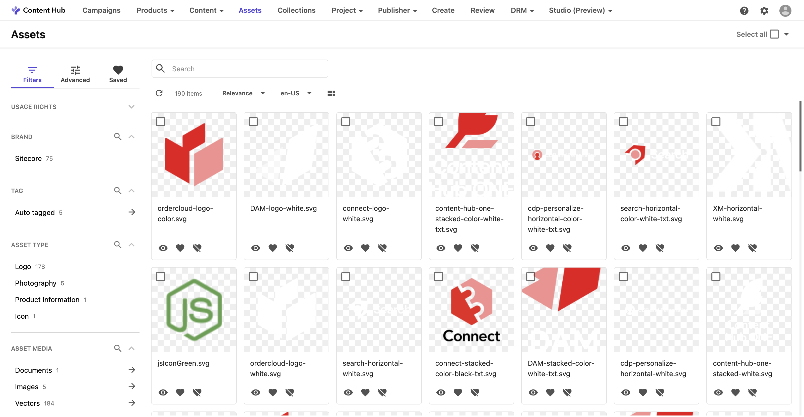

import { Badge } from '@astrojs/starlight/components';

Sitecore Content Hub には AI と連携する複数の機能を利用することが可能となっています。このドキュメントでは、実際に提供されている Content Hub の Sitecore AI に関しての情報、設定方法に関して紹介をします。

なお、Content Hub で利用している AI の機能は Azure OpenAI Service を利用しており、望ましくないコンテンツをフィルタリングするように設計されています。また、GDPRに 準拠しており、Sitecoreのプライバシーポリシーに沿ったものです。Sitecoreは、お客様が送信したプロンプトや受信した応答を保存しません。

## 利用できる Sitecore AI 機能

Sitecore Content Hub は、アセットの登録の際に画像分析を利用してタグ付けを支援する機能、そして Video の分析をする機能について提供をしていました。これに対して新たに、画像や文章を利用して検索をする Visual Search 、コンテンツ制作をアシストするテキスト生成の機能が加わりました。

このドキュメントでは、以下の４つに関して紹介をします。

- 画像タグ付け
- Video 分析
- Visual Search <Badge text="新機能" variant="note" />
- テキストの生成 <Badge text="新機能" variant="note" />

:::tip
このドキュメントで紹介する設定の手順に関しては、管理者のみがアクセスできます
:::

## 画像タグ付け

この機能は Sitecore Content Hub DAM の基本機能として、古くから提供されている便利な機能です。
画像タグ付けの設定に関して紹介

## Video 分析

ビデオ分析に関して紹介

## Visual Search について

ここでは画像を利用して検索をする、Visual Search について紹介をします。

### 標準のアセット検索

Sitecore Content Hub のアセットのページに埋め込まれているアセット検索する機能は、画像に対して設定されているメタデータ、タグなどを利用して検索できる検索ボックスになります。デフォルトでは以下のような形です。

Visual Search を有効にする
早速ですが上記の検索ボックスを Visual Search を有効にするべく作業を進めていきます。このページの設定を開くために、管理画面の Pages から Assets のページを開きます。

visualsearch02.png
Search コンポーネントを選択して、Functionality の項目に Visual Search の機能がこの環境ではオフになっていることがわかります。

visualsearch03.png
この項目をチェック、Save and Close で変更を保存してください。設定変更が完了したあと、アセットのページに移動をすると、以下のように検索ボックスが更新されて AI のボタンが追加されました。

visualsearch04.png
Sitecore AI を有効にする
早速、画像検索を実行してみます。しかしながら、上記の設定だけではエラーが発生しました。

visualsearch05.png
これは Sitecore AI の機能を有効にしていないためです。Sitecore AI に関しては管理画面から Sitecore AI を選択をして設定をします。

visualsearch06.png
画面を開くと以下のように Visual Search の項目が用意されています。

visualsearch07.png
Enable をクリックすると以下のようなダイアログが表示されます。

visualsearch08.png
いくつかの選択肢が表示されています。今回は、All Asset を選択して実行をします。以下の画面はアセットに対して複数回トライしている状況の画面となります。

visualsearch09.png
インデックスが完了したところで、Visual Search が機能することになります。

動作検証
それでは実際に画像の一部を利用して、画像検索を実行したいと思います。今回は一部だけくり抜いた画像を AI の検索ボックスで指定をして、検索を実行する形です。結果は以下のとおりです。

visualsearch10.png
１つ目に表示されている画像が、元の画像になります。なお、文章を利用して検索をすることもできます。

visualsearch12.png
対象となるアセットを開くと、似たような素材というボタンも追加されます。

visualsearch11.png
まとめ
今回は Sitecore Content Hub のアセット検索において、Visual Search を利用して画像検索や文章を利用してアセット検索ができるようにしました。Sitecore AI の機能はいくつか今後増えていきますが、今回は Content Hub に搭載された機能を紹介しました。

## テキストの生成

生成 AI を利用して文章を登録する方法に関して紹介をします

## 参考情報

- [Image analysis](https://doc.sitecore.com/ch/en/users/content-hub/image-analysis.html)
- [Video AI analysis](https://doc.sitecore.com/ch/en/users/content-hub/video-ai-analysis.html)

