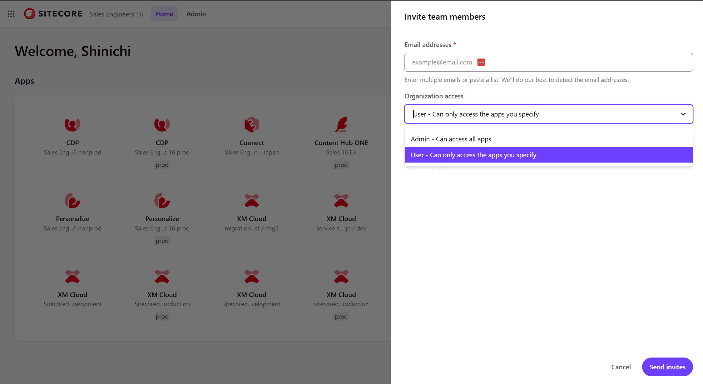
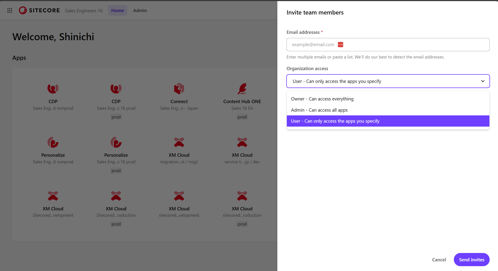
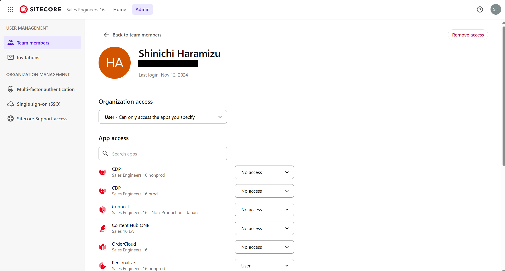

import { LinkCard } from '@astrojs/starlight/components';

ここでは Sitecore Cloud Portal で管理することができるユーザーのロールのタイプ、および割り当てができる権限の内容について紹介をしていきます。

## ロールに関して

Sitecore Cloud Portal において、ロールは３種類のロールを提供しています。

| Role  | Description                                                                                                 |
| ----- | ----------------------------------------------------------------------------------------------------------- |
| User  | 割り当てれたアプリの利用。上限 25 アプリまで。                                                              |
| Admin | Organization に対してユーザーの招待  SSO や MFA の設定 XM Cloud Deploy の利用 サポートの利用 |
| Owner | Admin と同じ権限を持ちます   Organizatiopn Owner の追加・削除ができます                                |

以下の画面は、User に対して１つのアプリの利用ができるように設定した場合のポータルの画面になります。

下記の画面は Admin でログインをした時の画面になります。全てのツール、ポータルの管理画面の機能に関してすべてアクセスすることが可能となっています。しかしながら、Organization Owner の招待をすることができないことが分かります。

Organization Owner でログインをしている場合、Invitation にて Owner を追加することができるようになっています。

上記のように、３つのタイプのロールを活用して、運用の際にユーザーの追加などをスムーズにできるように、管理者の設定および Organization Owner を決めるのが重要となります。

より詳細のロールの違いに関しては、以下のページで違いを確認することができます。

<LinkCard
  title="Organization role capabilities"
  href="https://doc.sitecore.com/portal/en/developers/sitecore-cloud-portal/roles.html#organization-role-capabilities"
  target="_blank"
/>

## アプリの権限に関して

ここでは Sitecore Cloud Portal に User として登録されているユーザーに対する権限設定を確認していきます。ユーザーに対してアプリの利用は招待をするとき以外にも、ユーザーの詳細を確認することができます。メニューの Admin - Team members から対象となるユーザーを選択してください。

この画面で、各アプリに対する権限の設定が可能となっています。

### 製品別ユーザー権限

各製品によって割り当てることが可能なユーザーの権限が異なります。以下、各製品における設定可能なロールについて記載しています。なお、デフォルトでは `No access` が割り当てられており、アプリを利用することができない形となっています。

- CDP
  - User
  - Admin
  - Analytics user
  - Developer
  - Read only
- Connect
  - User
  - Admin
- Content Hub ONE
  - User
  - Admin
- Personalize
  - User
  - Admin
  - Analytics user
  - Developer
  - Read only
- XM Cloud
  - User
  - Admin

## まとめ

ここではユーザー管理をするために理解している必要のあるロールについて、またユーザーが利用できるアプリの権限に関しての内容を紹介しています。一般のユーザーは基本的には User の権限でアプリを割り当てる形で問題なく、必要に応じて Admin を割り当てる形が良いです。また、Organization Owner に関しては必ず１名設定されていますが、複数の人数を割り当てて何かがあったときに対応できるような運用をお勧めとさせていただきます。

## 参考情報

<LinkCard
  title="Invite team members to your Sitecore Cloud Portal organization"
  href="https://doc.sitecore.com/portal/en/developers/sitecore-cloud-portal/invite-team-members-to-your-sitecore-cloud-portal-organization.html"
  target="_blank"
/>
<LinkCard
  title="Manage the access of a team member"
  href="https://doc.sitecore.com/portal/en/developers/sitecore-cloud-portal/manage-the-access-of-a-team-member.html"
  target="_blank"
/>
<LinkCard
  title="Roles"
  href="https://doc.sitecore.com/portal/en/developers/sitecore-cloud-portal/roles.html"
  target="_blank"
/>
