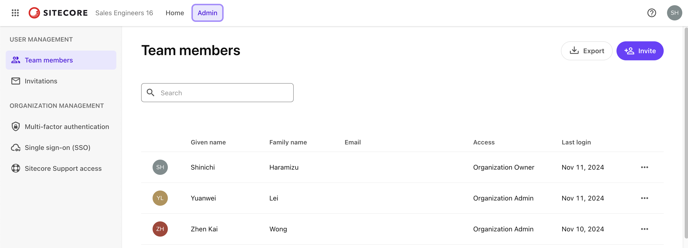
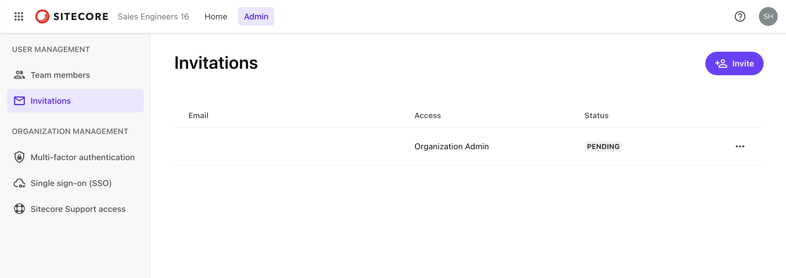
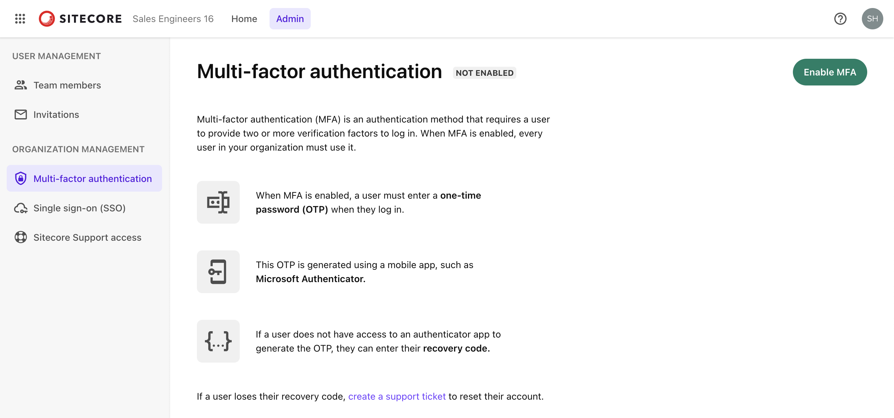

import { LinkCard } from '@astrojs/starlight/components';

Sitecore Cloud Portal は、Sitecore の SaaS 製品を利用するためのポータルサイトです。このポータルを通じて、SaaS 製品の設定や管理を行うことができます。ここでは、Sitecore Cloud Portal の役割と基本的な機能について説明します。

## Sitecore Cloud Portal の紹介

Sitecore の SaaS 製品にアクセスするための最初のアクセスポイントとして提供されている Sitecore Cloud Portal は、契約しているすべての SaaS 製品にアクセスできる統合ポータルです。このポータルを通じて、ユーザーは各種 SaaS 製品の設定や管理を一元的に行うことができます。ログインすると、契約している SaaS 製品のダッシュボードが表示され、各製品の利用状況や設定オプションに簡単にアクセスできます。これにより、複数の製品を効率的に管理し、運用することが可能になります。

以下の製品を利用する際に、利用することが可能となっています。

- Sitecore XM Cloud
- Sitecore Content Hub ONE
- Sitecore CDP
- Sitecore Personalize
- Sitecore Send
- Sitecore OrderCloud

なお、Sitecore XM Cloud の契約をした際には、XM Cloud Deploy というツールも追加されます。このツールを利用することで、CMS のインスタンスを立ち上げることが可能となります。

続いて、Sitecore Cloud Portal を利用をするに当たって、理解してほしい用語を紹介します。

### Organization （組織）

Sitecore Cloud Portal を利用する際の一番大きな組織の単位を Organization と表現しています。この Organization に対して、契約をしている SaaS 製品のロゴが一覧で表示されるようになります。例えば、以下の画面は Sales Engineers 16 という Organization に対して割り当てられている全てのツールが表示されています。

本番、非本番環境という形で提供している製品に関しては、本番環境に対して `prod` という記述がアイコンの下に表示されています。

この Organization に関しては複数所属することが可能です。実際に複数の Organization に所属しているアカウントでログインをすると、左上のアイコンをクリックすることで Organization を切り替えることが可能です。

### チームメンバー

チームメンバーは、組織の一員であるユーザーのことを指し示します。チームメンバーの組織内での役割とアプリの役割によって、アクセスできるアプリや実行できる作業が決まります。これらの設定に関しては、別のトピックで紹介する予定です。

## Quick Links

Sitecore Cloud Portal にアクセスをした時には、右側に Quick Links が表示されています。実際に表示されている項目を１つづつ確認をしていきましょう。

### XM Cloud Deploy

このメニュー項目は Sitecore XM Cloud を契約した時にのみ表示される項目となります。このメニューをクリックすると、XM Cloud Deploy のサイトに移動をして、新しく立ち上げるインスタンス、既存のインスタンスに関する情報を確認することができます。このツールに関しては、別の記事を追加して紹介したいと考えています。

### Invite team members

このリンクをクリックすると、ユーザーを追加するためのポップアップが右側から表示されます。以下がクリックをした時の画面になります。

ここから登録をしたいメールアドレスの追加（複数同時に設定可能）、利用する権限やユーザーであればアプリの設定が可能となっています。管理者であればこの項目を利用して、ユーザーを素早く追加することができます。

### Help

ヘルプはまさに公式のドキュメントを参照することができるリンク一覧になっています。公式の手順を確認したい時に、素早くアクセスができる便利なリンク集です。

### Create support ticket

この項目をクリックすると、問い合わせフォームが表示されます。この画面から問い合わせをすると、サイトコアのサポートに対しての問い合わせが可能となっており、登録後すぐに問い合わせ番号などの連絡がメールで届きます。サポートとのやりとりに関しては、その後全てメールで進めることできます。設定に関してわからない、正しく動かない、などの課題が出た場合は、ここから問い合わせをすることになります。

## 管理画面

Sitecore Cloud Portal のトップメニューには Admin という項目が用意されています。これをクリックすることで、ユーザーの管理や Sitecore Cloud Portal の設定に関する画面にアクセスすることが可能となります。

それではそれぞれの項目を確認していきます。

### Team member

この画面は上記に表示しているように、現在アクセスをしている Organization に対するユーザーの情報を確認することができるようになっています。右上にある `Export` のボタンをクリックすると、CSV 形式のファイルで全ての登録ユーザーに関する情報を取得することができます。

また右上の `Invite` のボタンは Quick Links で提供されていた `Invite team members` と同じくユーザーを追加することができるようになっています。

### Invitations

この画面では、すでに送信した招待メールに関するステータスを確認することができます。例えば、下の画面は翔太メールを送信したが、まだ反応がない状況ということで、`Pending` として表示されています。

### Organization management

この項目は、Sitecore Cloud Portal の Organization に対しての管理者が確認をすることが可能な項目が並んでいます。例えば、Sitecore Cloud Portal 単体でも多要素認証（ MFA ）の仕組みを提供しており、ユーザーのログインの際に利用したい場合は、有効にすることで利用が可能となります。

これ以外に、Sitecore Cloud Portal に対するシングルサインオン（ SSO ）を有効にするための項目もあります。SSO の設定に関しては、[別のトピック](/cloud-portal/sso/)で紹介をしています。詳しくはそちらをご覧ください。

## まとめ

今回は Sitecore Cloud Portal にアクセスをした際に利用できる機能について紹介をしました。このポータルへのアクセスが最初のステップであり、かつ日頃からこのポータルから利用したいツールに対してアクセスをする形となります。

## 参考情報

<LinkCard
  title="Introduction to the Sitecore Cloud Portal"
  href="https://doc.sitecore.com/portal/en/developers/sitecore-cloud-portal/introduction-to-the-sitecore-cloud-portal.html"
  target="_blank"
/>
<LinkCard
  title="Switch your organization"
  href="https://doc.sitecore.com/portal/en/developers/sitecore-cloud-portal/switch-your-organization.html"
  target="_blank"
/>
<LinkCard
  title="Sitecore Cloud Portal terminology"
  href="https://doc.sitecore.com/portal/en/developers/sitecore-cloud-portal/sitecore-cloud-portal-terminology.html"
  target="_blank"
/>

