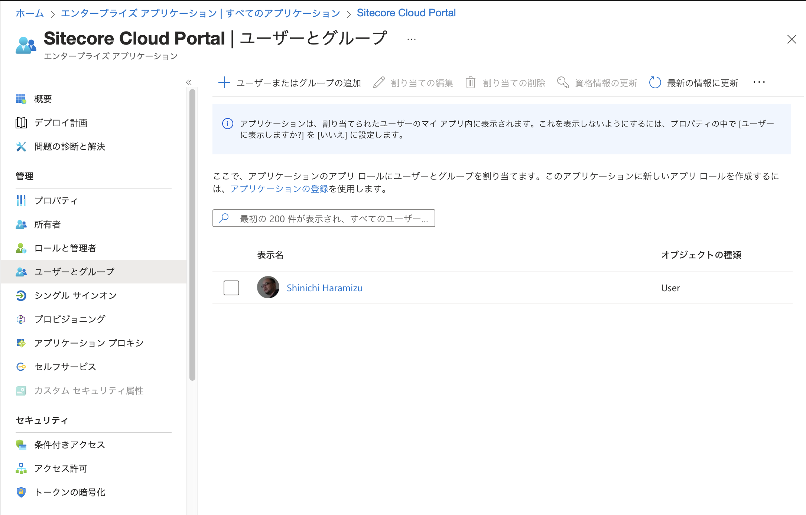
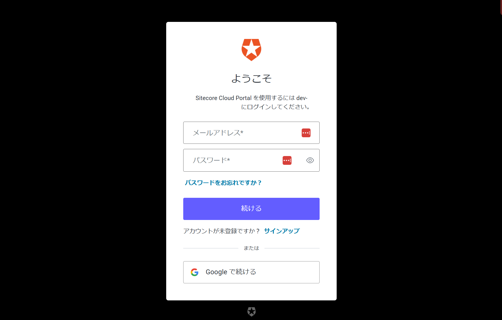

import { LinkCard } from '@astrojs/starlight/components';

Sitecore Cloud Portal は SSO に対応しており、Owner もしくは Admin の権限を持っていれば設定をすることが可能です。ここでは、Entra ID との連携、および Auth0 との連携に関して紹介をしています。

## SSO の設定について

Sitecore Cloud Portal にアクセスし、Admin メニューを開き、左側にある Single sign-on (SSO) をクリックすると、以下のようにシングルサインオンの設定画面が開きます。

Sitecore Cloud Portal は、OpenID Connect（OIDC）プロトコルまたは Security Assertion Markup Language（SAML）プロトコルを使用するIDプロバイダをサポートしています。組織は最大5つの SSO 接続を持つことができ、各接続は最大50ドメインをサポートします。

## Microsoft Entra ID の連携

### ドメインを追加する

Microsoft Entra ID （旧 Azure Active Directory ）との接続を、SAML を利用して設定します。何も設定をしていない場合は、画面に表示されている Add SSO Connection のボタンをクリックしてください。ドメインを入力する画面が表示されます。

ドメインを入力すると、以下のように SAML 認証を設定するための項目が表示されます。

上記の項目は、後ほど Entra ID の管理画面で利用する値となります。一度この画面を閉じると、以下のように設定中の画面が表示されます。

一覧の画面で、`Configure` のボタンをクリックすることで、先ほどの設定の値をいつでも参照することができます。

Entra ID の設定に移動する前に、ドメイン認証を進めていきます。この設定は、DNS の設定権限が必要となります。Verify domains のボタンをクリックすると、DNS に対して追加するレコードの情報が表示されます。

この値を DNS で設定する際には、TXT @ 上記の文字列 という形で TXT レコードでこの文字列が認識できるようにしてください。DNS のレコードに反映されたあと、Verify Domain をクリックすると、以下のようにドメインの認証が完了します。

この段階で、他のボタンでの作業はできないため Close ボタンをクリックします。

これで Sitecore Cloud Portal 側の初期設定は完了です。

### Entra ID の環境を整備する

設定を進めるにあたって、Microsoft Entra ID から各種パラメーターを取得して、上記の項目を埋めていく必要があります。まずは [Microsoft Entra 管理センター](https://entra.microsoft.com/) にアクセスします。

左側のメニューから アプリケーション - エンタープライズアプリケーション を選択します。

画面に表示されている、+ 新しいアプリケーションをクリック、下の画面で表示されている独自のアプリケーションの作成をクリックしてください。

アプリケーションの名前を今回は Sitecore Cloud Portal と名前をつけて作成します。

しばらくすると以下のようにアプリケーションが作成されます。

続いてメニューからシングルサインオンを選択します。以下のように設定をするシングルサインオンの選択画面が表示されます。

今回は SAML 認証を追加するため、右上のボタンをクリックします。クリックをすると以下の画面に切り替わります。

基本的な SAML 構成の項目で、必須の項目が２つ用意されています。この項目は、Sitecore Cloud Portal にて提供された２つの項目になります。識別子および ACS URL の項目を以下のように設定します（以下の画面は値に関してマスクしています）。

保存をすると、テストを実行するか？というダイアログが表示されますが、これに関しては今回は実施しません。

最後に、このアプリケーションを利用することができるユーザーを、左側のメニューのユーザーとグループの項目をクリック、追加してください。追加した結果は以下のような画面です。

これで、Entra ID 側の設定は完了です。

### Sitecore Cloud Portal の追加設定

Entra ID での設定は完了しており、改めて Sitecore Cloud Portal 側の設定に戻ります。まず、ドメインの認証が完了している設定画面を表示してください。

`Configure` のボタンをクリックすると、Step 2 で meta データに関して設定をする項目があります。

ここに設定するデータは、Entra ID の管理画面から取得することが可能です。すでに設定をしているシングルサインオンの設定の画面で、Federation Metadata XML という項目があり、ここをクリックすると XML のデータをダウンロードします（下画面）。

ここで取得した XML のデータを Step 2 の項目に設定をして保存をすることで、設定は終了です。

### サインイン テスト

設定画面から Test のボタンをクリックしてください。以下のように、Start test のボタンが表示されます。

今回対象となるアカウントを利用して、ログインのテストを実行する形です。Entra ID のユーザーとグループで指定したアカウントでログインに成功すると、以下の画面が表示されます。

これでログインが可能になりました。Enable SSO Connection のボタンをクリックして、SSO の設定を有効にします。

以下のように有効になれば、SSO の設定は完了です。

### ログイン状況の確認

SSO でログインをしている情報は、Entra ID 側で情報をとることができます。まず Microsoft Entra 管理センターにアクセスをして、今回設定をしたアプリケーションを選択します。アプリケーションには、サインインログの項目があります。

ブラウザのプライベートモードで Sitecore Cloud Portal に SSO で該当するアカウントでサインインをしたあと、ログを確認すると増えていることを確認できます。

最新のサインインに関しての詳細は、該当レコードをクリックすると参照できます。

なお、Entra ID のサインインデータの保存期間は以下のページに記載されています。

<LinkCard
  title="Microsoft Entra のデータ保持"
  href="https://learn.microsoft.com/ja-jp/entra/identity/monitoring-health/reference-reports-data-retention#how-long-does-microsoft-entra-id-store-the-data"
  target="_blank"
/>

30日間のデータは保持され、またそのデータをストレージに保存することでより長期間のデータを保持することが可能となります。

## Auth0 との連携

Auth0 と連携する SSO の設定に関しては、OpenID Connect を利用して接続する手順を紹介します。

### Auth0 側の設定

今回は Auth0 の評価版（無料）を利用して設定を進めていきます。まず、ログインをするテストユーザーとそれが所属する組織を作成します。

- Organization を作成する
- User Management - Users でログインが可能なユーザーを作成します
- 作成をした Organization に作成をしたユーザーを割り当てます

続いてアプリケーションを追加します。左側のメニューの Applications - Applications を選択します。今回は以下のように表示されています。

右上の `Create application` のボタンをクリックして、アプリケーションの名前を設定します。

Continue のボタンをクリックして、アプリケーションを作成します。必要な設定は以下の通りです。

- Domain および Client ID は Sitecore Cloud Portal の設定に必要となります
- Application Type は Regular Web Application を設定します
- Allowed Callback URLs の項目には `https://auth.sitecorecloud.io/login/callback` を設定します

これで Auth0 の最初の準備は完了です。

### Sitecore Cloud Portal での作業

続いて Sitecore Cloud Portal 側の設定を進めていきます。前回と同様に Admin メニューから左側に表示されている Single sign-on ( SSO ) を選択してください。

SSO の設定として OpenID Connection を開くと以下のような画面に切り替わります。

ここでは３つの項目を設定します。

- Email domains
- Issuer URL には Auth0 が利用しているドメイン名を利用して、 `https://your-tenant.auth0.com/.well-known/openid-configuration` という形で設定をします。
- Client ID を取得して設定する

保存をすると、ドメインの認証の画面が表示されます。

表示されているキーを DNS のテキストレコードとして実装してドメイン認証を済ませてください。以下は、 GoDaddy のサービスで DNS のレコードを追加した一例です。

キーが反映された後、認証が終わるとダイアログが以下のように切り替わります。

続いて Test SSO Connection を実行します。このボタンをクリックすると、以下のように Auth0 のログイン画面が表示されました。

ログインに成功すると以下の画面が表示されます。

無事成功しているのを確認して、Enable SSO connection のボタンを押して有効にします。画面は以下のように変わります。

Enable Now のボタンをクリックして、SSO の設定が進み設定中のアイコンが回ります。

しばらくして、以下のように表示されれば SSO の設定は完了となります。

### 該当ドメインのユーザーを追加する

今回は Entra ID の時に比べて作業の説明が短く済んでいることもあり、ユーザーの追加を実行します。まず、招待をするユーザーのメールアドレスを追加します。

該当するメールアドレスにメールが届きます。

クリックをすると、Web サイトに移動をして招待されていることが確認できます。

無事、Auth0 のアカウントでログインをすることができました。

## まとめ

Microsoft Entra （旧 Active Directory ）と Auth0 とは SAML 認証でログインができるように設定をしました。この２つの認証に対応していれば、多くの認証サービスと連携することができます。

DNS でのドメイン認証、またサービス間で必要な値を相互に設定する必要がどちらもありますが、一度設定をすれば認証側でユーザーの管理ができるようになるので、なるべく SSO を利用して運用したいところです。

## 参考情報

<LinkCard
  title="Sitecore authentication"
  href="https://doc.sitecore.com/portal/en/developers/sitecore-cloud-portal/sitecore-authentication.html"
  target="_blank"
/>
<LinkCard
  title="Single sign-on (SSO)"
  href="https://doc.sitecore.com/portal/en/developers/sitecore-cloud-portal/single-sign-on--sso-.html"
  target="_blank"
/>
<LinkCard
  title="Configuring OpenID Connect (OIDC)"
  href="https://doc.sitecore.com/portal/en/developers/sitecore-cloud-portal/configuring-openid-connect--oidc-.html"
  target="_blank"
/>
<LinkCard
  title="Configuring SAML single sign-on"
  href="https://doc.sitecore.com/portal/en/developers/sitecore-cloud-portal/configuring-saml-single-sign-on.html"
  target="_blank"
/>

