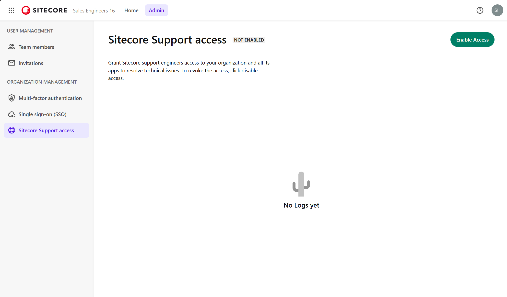
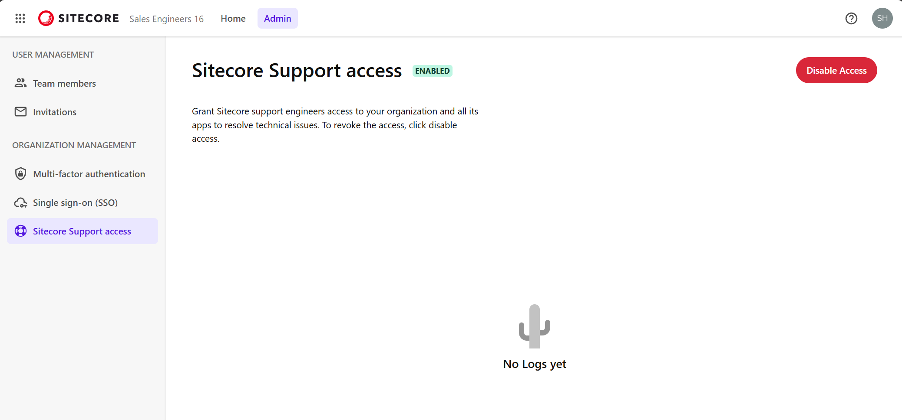

import { LinkCard } from '@astrojs/starlight/components';

Sitecore サポートエンジニアに、技術的な問題を解決するために組織およびすべてのアプリへのアクセスを許可します。アクセスを取り消すには、「アクセスを無効にする」をクリックします。

## Sitecore Support Access

この機能は、Sitecore Cloud Portal で Owner もしくは Admin が作業の権限を持っています。管理画面を開くと、デフォルトでは無効になっています。

右上のボタンをクリックすると、サポートがアクセスできるようになります。

この機能はいつでも有効、無効が可能となっているため、サポートによる技術的な調査が必要な場合は有効にして、サポートチケットを作成するという流れになります。

## 参考情報

<LinkCard
  title="Manage Sitecore Support access"
  href="https://doc.sitecore.com/portal/en/developers/sitecore-cloud-portal/manage-sitecore-support-access.html"
  target="_blank"
/>
<LinkCard
  title="Create a support case"
  href="https://doc.sitecore.com/portal/en/developers/sitecore-cloud-portal/create-a-support-case.html"
  target="_blank"
/>

