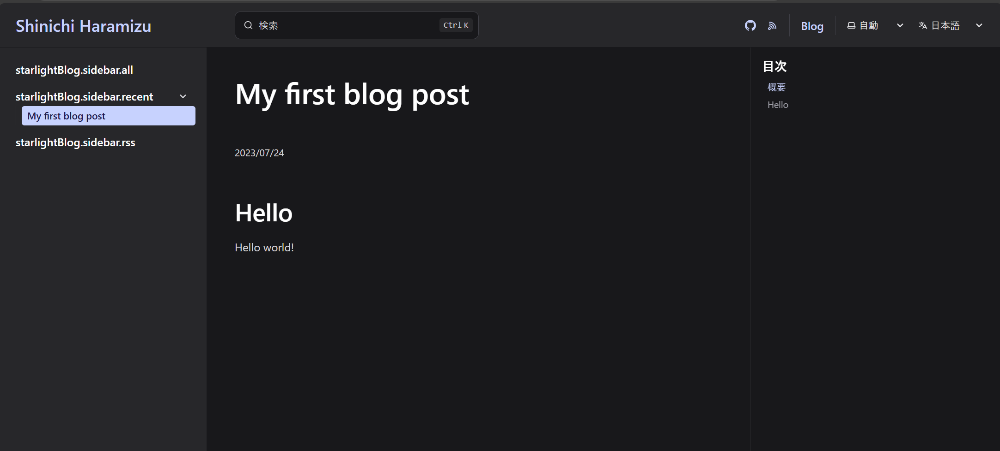
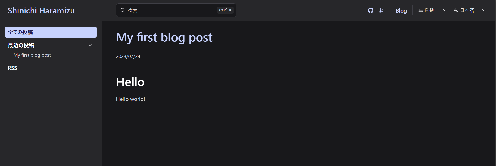

import { Steps, LinkCard } from '@astrojs/starlight/components';

This document introduces the steps to add a blog to a site set up with Starlight. The blog we are adopting this time uses a plugin provided by the community.

<LinkCard
  title="Plugins and Integrations"
  href="https://starlight.astro.build/en/resources/plugins/"
  target="_blank"
/>

## Installing the Plugin

The installation steps are introduced on the following site.

<LinkCard
  title="Starlight Blog - Getting Started"
  href="https://starlight-blog-docs.vercel.app/getting-started/"
  target="_blank"
/>

<Steps>

1.  First, install the plugin for the Starlight documentation site.

    ```bash title="Install Plugin"
    npm i starlight-blog
    ```

2.  Add the installed plugin to `astro.config.mjs`.

    ```diff lang="js"
    // astro.config.mjs
    import starlight from '@astrojs/starlight'
    import { defineConfig } from 'astro/config'
    +import starlightBlog from 'starlight-blog'

    export default defineConfig({
       integrations: [
          starlight({
    +      plugins: [starlightBlog()],
             title: 'My Docs',
          }),
       ],
    })
    ```

3.  Next, add the blog schema to `src/content/config.ts`.

    ```diff lang="ts"
    // src/content/config.ts
    import { defineCollection } from 'astro:content';
    import { docsSchema } from '@astrojs/starlight/schema';
    +import { blogSchema } from 'starlight-blog/schema'

    export const collections = {
       docs: defineCollection({
          schema: docsSchema({
    +      extend: (context) => blogSchema(context)
          })
       }),
    };
    ```

4.  Finally, create the file `src/content/docs/blog/my-first-blog-post.md`.

        ```md
        // src/content/docs/blog/my-first-blog-post.md
        ---
        title: My first blog post
        date: 2023-07-24
        ---

        ## Hello

        Hello world!
        ```

</Steps>

This completes the plugin installation. When you access the site, a Blog menu will be added at the top, allowing you to view blog posts.



## Adding Japanese Resources

Looking at the screen above, you can see that there are insufficient Japanese resources in the left menu. The method to address this is posted on the following page.

<LinkCard
  title="Internationalization (i18n)"
  href="https://starlight-blog-docs.vercel.app/guides/i18n"
  target="_blank"
/>

The procedure is to use the i18n managed by Starlight.

<LinkCard
  title="Internationalization (i18n) - Translate Starlight’s UI"
  href="https://starlight.astro.build/guides/i18n/#translate-starlights-ui"
  target="_blank"
/>

The steps to enable this feature are as follows.

<Steps>

1. Add `i18nSchema` to the configuration file `src/content/config.ts`.

   ```diff lang="js" ins=/, (i18nSchema)/
   // src/content/config.ts
   import { defineCollection } from 'astro:content';
   import { docsSchema, i18nSchema } from '@astrojs/starlight/schema';

   export const collections = {
   docs: defineCollection({ schema: docsSchema() }),
   +	i18n: defineCollection({ type: 'data', schema: i18nSchema() }),
   };
   ```

2. Create the directory `src/content/i18n` and create the file `ja.json`.

   ```json
   {
     "starlightBlog.authors.count_one": "{{count}} 投稿 by {{author}}",
     "starlightBlog.authors.count_other": "{{count}} 投稿 by {{author}}",
     "starlightBlog.pagination.prev": "新しい投稿",
     "starlightBlog.pagination.next": "古い投稿",
     "starlightBlog.post.lastUpdate": " - 最終更新日: {{date}}",
     "starlightBlog.post.draft": "下書き",
     "starlightBlog.post.featured": "注目",
     "starlightBlog.post.tags": "タグ:",
     "starlightBlog.rss.imageFallback": "オリジナルの画像はブログに掲載",
     "starlightBlog.sidebar.all": "全ての投稿",
     "starlightBlog.sidebar.featured": "注目の投稿",
     "starlightBlog.sidebar.recent": "最近の投稿",
     "starlightBlog.sidebar.tags": "タグ",
     "starlightBlog.sidebar.authors": "編集者",
     "starlightBlog.sidebar.rss": "RSS",
     "starlightBlog.tags.count_one": "“{{tag}}” の投稿: {{count}} 件",
     "starlightBlog.tags.count_other": "{{tag}}” の投稿: {{count}} 件"
   }
   ```

</Steps>

Successfully added Japanese resources.



## Summary

By using the standard plugin, you can now write a blog within Starlight. The position of the blog on this site will be used to provide information about site updates rather than offering tips.

## References

<LinkCard
  title="HiDeoo / starlight-blog"
  href="https://github.com/HiDeoo/starlight-blog"
  target="_blank"
/>

