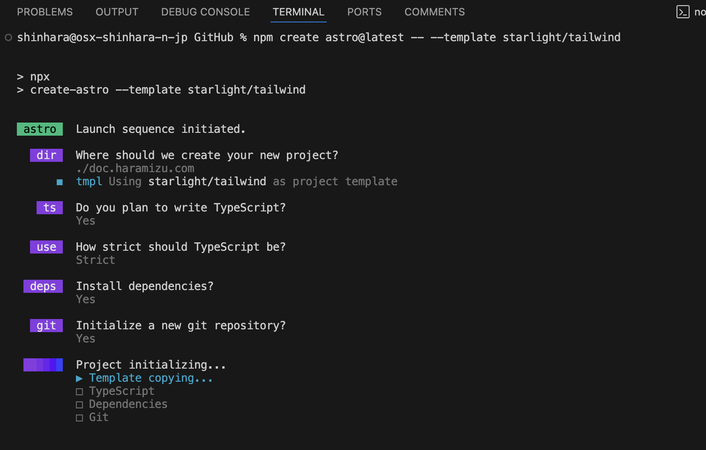
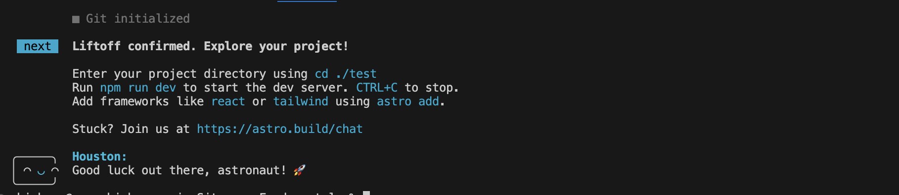
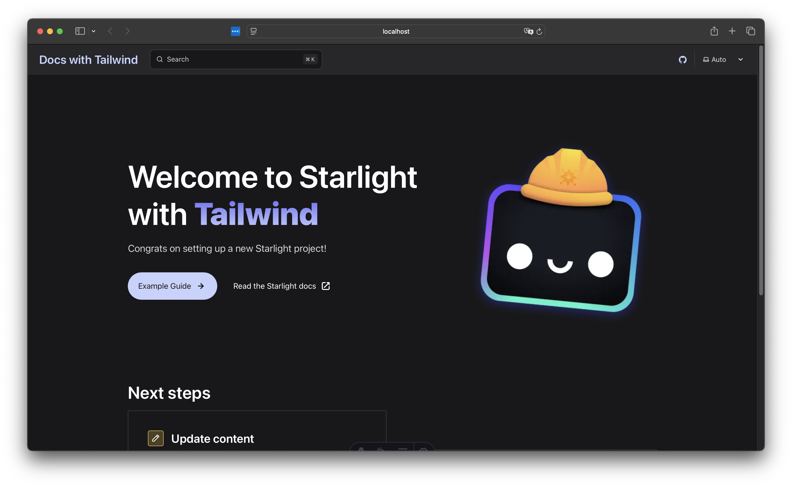
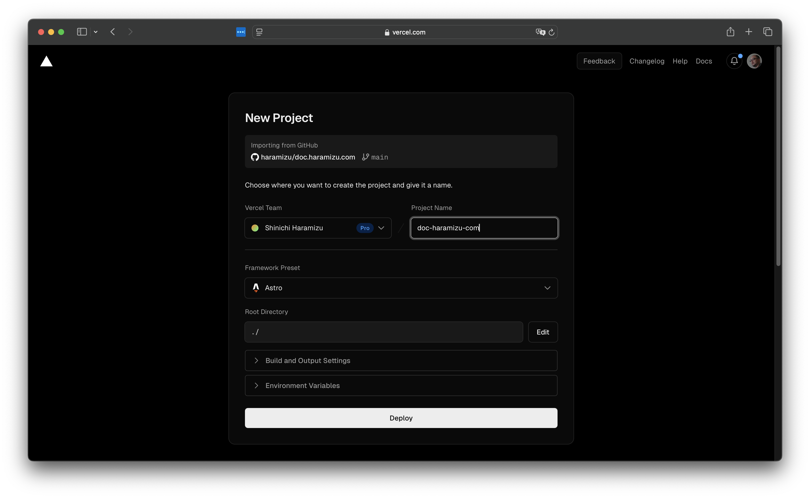
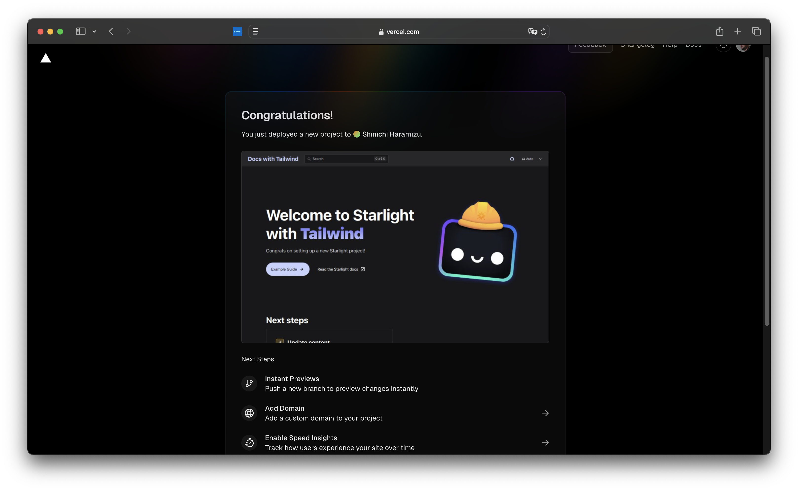
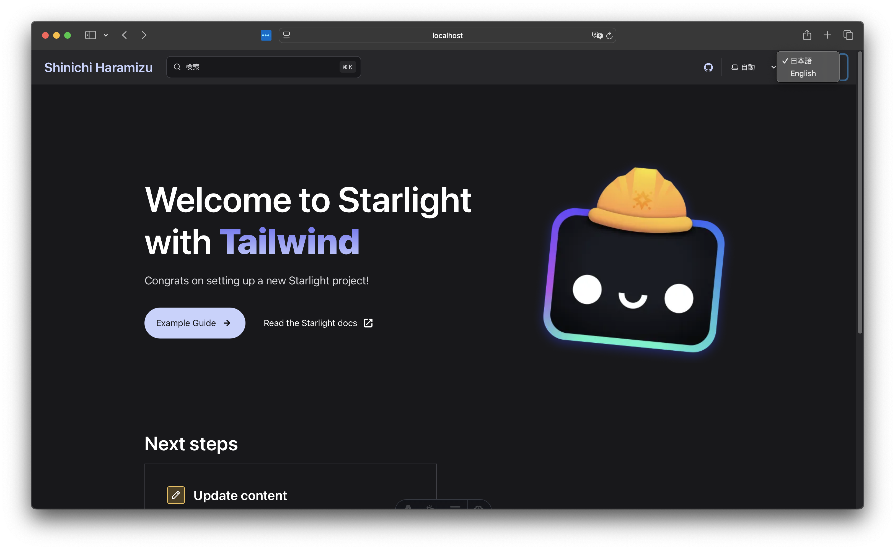

import { Steps, LinkCard } from '@astrojs/starlight/components';

I created a blog using Next.js, but I wanted to create a documentation site that can be easily written in Markdown, published on GitHub, and receive feedback. Therefore, I considered several frameworks. In particular, I thought a framework that supports SSG and is easy to customize would be good, and I considered the following candidates:

- [Gatsby](https://www.gatsbyjs.com): Gatsby is a React-based static site generator that is a framework for building fast and scalable websites and applications. Gatsby uses GraphQL to fetch data and generates static HTML files at build time. This improves page load speed and provides excellent performance for SEO.
- [Docusaurus](https://docusaurus.io): Docusaurus is an open-source static site generator developed by Facebook, mainly designed to easily create project documentation sites. It is built on React and allows you to create modern and interactive documentation sites.
- [Astro](https://astro.build): Astro is a static site generator that leverages the latest web technologies to build fast and optimized static sites. Astro adopts a component-based architecture and is compatible with frameworks like React, Vue, Svelte, and Solid. [Japanese](https://docs.astro.build/ja/) information is also well provided.

After reconsidering various options, I decided to create this documentation site using Astro, which I had been interested in for a while, in addition to the Next.js blog.

While referring to the Astro site, I thought it would be good to output in this document format, and I found that the following documentation site is provided:

<LinkCard title="Starlight" href="https://starlight.astro.build" target="_blank" />

As a result, I decided to create this site using Starlight.

## Setting up a Starlight site

To set up the site, configure the project you want to create and the current environment as follows:

- Astro 4.16.10
- Starlight 0.29.0
- Tailwind CSS 3.4.4
- Node.js 20.15.0
- Visual Studio Code
- macOS or Windows 11

This time, I will set it up using Tailwind CSS, which I am familiar with.

### Creating the project

Let's proceed with creating the project. Refer to the following page to start the creation.

<LinkCard
  title="CSS and Styling - Tailwind CSS"
  href="https://starlight.astro.build/ja/guides/css-and-tailwind/#tailwind-css"
  target="_blank"
/>

<Steps>

1. Create the project with the following command:

   ```bash title="Creating the project"
   npm create astro@latest -- --template starlight/tailwind
   ```

2. A wizard will start and ask for the project settings. Set them as follows:

   - dir: ./doc.haramizu.com
   - ts: Yes (Typescript)
   - use: Strict
   - Install dependencies?: Yes
   - Initialize a new git repository?: Yes

3. After the above settings, the project initialization will proceed automatically.

   

4. Once the setup is complete, the following message will be displayed.

   

</Steps>

The project is complete. As shown on the screen, move to the path and start it, and you will see that it is set up with sample content.



### Deploying to Vercel

Deploy the created project to GitHub and follow the steps to publish the site to Vercel. Assume that the project's code is already uploaded to GitHub.

<Steps>

1. Log in to Vercel

2. Click New project, create a new project, and specify the GitHub repository where the code is uploaded.

   

3. It is already specified as an Astro project. Click the Deploy button to execute the site's Build. After a while, the site will be up.

   

</Steps>

From now on, updating the main repository will update this site.

### Linking the environment with Vercel CLI

Use the Vercel CLI to link this project with the Vercel environment. If you haven't installed the Vercel CLI, run the following command (add sudo if necessary).

```bash title="Installing Vercel CLI"
npm i -g vercel
```

If the CLI is available, log in with the following command at the project's top.

<Steps>

1. First, a confirmation screen will appear asking which account to log in with.

   ```bash title="Logging in with Vercel CLI"
   doc.haramizu.com % vercel login
   Vercel CLI 37.14.0
   ? Log in to Vercel (Use arrow keys)
   ❯ Continue with GitHub
     Continue with GitLab
     Continue with Bitbucket
     Continue with Email
     Continue with SAML Single Sign-On
   ─────────────────────────────────
     Cancel
   ```

   Since we are using GitHub, the browser will launch, and logging in will complete the Vercel CLI login.

2. Link with the Vercel project.

   ```bash title="Linking with Vercel project"
   doc.haramizu.com % vercel link
   Vercel CLI 37.14.0
   ? Set up “~/GitHub/doc.haramizu.com”? yes
   ? Which scope should contain your project? Shinichi Haramizu
   ? Found project “haramizu/doc-haramizu-com”. Link to it? yes
     Linked to haramizu/doc-haramizu-com (created .vercel and added it to .gitignore)
   ```

</Steps>

The `.vercel` is added to the `.gitignore` file, and you can now use `vercel env pull` to retrieve development environment variables.

## Multilingual site

For providing information on this site, we plan to expand in Japanese and English (using machine translation). Since Starlight includes multilingual functionality, we will proceed with language settings.

<LinkCard
  title="Internationalization (i18n)"
  href="https://starlight.astro.build/ja/guides/i18n/"
  target="_blank"
/>

This setting is added to the `astro.config.mjs` file. This time, the root will be Japanese, and English will be displayed at `/en`.

```ts {5-16}
// astro.config.mjs
export default defineConfig({
  integrations: [
    starlight({
      title: "Shinichi Haramizu",
      defaultLocale: "root",
      locales: {
        root: {
          label: "日本語",
          lang: "ja",
        },
        en: {
          label: "English",
          lang: "en",
        },
      },
```

After the above settings, copy the existing files to `/content/docs/en`. Adjust the paths for images and links in `/en/index.mdx`.

After deploying the files, a dropdown menu will appear, allowing you to switch languages.



## Creating Sitemap / robots.txt

To make the created site's sitemap available, enable the Sitemap feature. This setting is introduced on the following page.

<LinkCard
  title="Customizing Starlight - Enabling Sitemap"
  href="https://starlight.astro.build/guides/customization/#enable-sitemap"
  target="_blank"
/>

The setting is added to the `site` in the `astro.config.mjs` file.

```ts {2}
export default defineConfig({
  site: "https://doc.haramizu.com",
  integrations: [
    starlight({
```

After this setting, run the site's Build once.

```bash title="Building the site"
npm run build
```

After running the build, the following two files are created.

- dist/sitemap-index.xml
- dist/sitemap-0.xml

The `sitemap-index.xml` file needs to be set in `robots.txt`. Create a `public/robots.txt` file and write the following.

```txt
User-agent: *
Allow: /

Sitemap: https://doc.haramizu.com/sitemap-index.xml
```

This completes the sitemap and robots.txt settings.

## Implementing Google Tag Manager

Here, we will guide you on how to implement Google Tag Manager. This is a setting used throughout the site, so it is written using the head in `astro.config.mjs`.

<Steps>

1. Create a `.env.local` file to manage the Google Tag Manager value as an environment variable and add the following definition.

   ```ts
   // .env.local
   GTM_ID=Your GTM ID
   ```

2. Update the configuration file. Load the environment variable and assign it to the tag.

   ```ts {2,7-25}
   // astro.config.mjs
   const GTM_ID = process.env.GTM_ID;

   export default defineConfig({
     integrations: [
       starlight({
         head: [
           {
             tag: 'script',
             attrs: {
               async: true,
               src: `https://www.googletagmanager.com/gtm.js?id=${GTM_ID}`,
             },
           },
           {
             tag: 'script',
             content: `
               (function(w,d,s,l,i){w[l]=w[l]||[];w[l].push({'gtm.start':
               new Date().getTime(),event:'gtm.js'});var f=d.getElementsByTagName(s)[0],
               j=d.createElement(s),dl=l!='dataLayer'?'&l='+l:'';j.async=true;j.src=
               'https://www.googletagmanager.com/gtm.js?id='+i+dl;f.parentNode.insertBefore(j,f);
               })(window,document,'script','dataLayer','${GTM_ID}');
             `,
           },
         ],
       }),
     ],
   });
   ```

</Steps>

This enables Google Tag Manager.

## Installing various tools

To continue maintenance, it is important to install several essential tools.

### Prettier

Prettier is a tool that automatically formats code. This helps maintain code consistency and improves readability. Install Prettier with the following command.

```bash
npm install --save-dev prettier prettier-plugin-astro
```

Add Tailwind CSS settings as well.

```bash
npm install --save-dev prettier-plugin-tailwindcss
```

After installing the above packages, create a `.prettierrc.json` file in the project's root directory and add the settings.

```json
// .prettierrc.json
{
  "endOfLine": "crlf",
  "semi": true,
  "singleQuote": true,
  "tabWidth": 2,
  "trailingComma": "es5",
  "printWidth": 100,
  "plugins": ["prettier-plugin-astro", "prettier-plugin-tailwindcss"],
  "overrides": [
    {
      "files": "*.astro",
      "options": {
        "parser": "astro"
      }
    }
  ]
}
```

This prepares Prettier to unify the code format.

## Summary

This time, we introduced the steps to set up a site using Astro / Starlight. Basically, we just followed the guidance on the official site.

## References

<LinkCard title="Astro" href="https://astro.build/" target="_blank" />

<LinkCard title="Starlight" href="https://starlight.astro.build/" target="_blank" />

<LinkCard
  title="Starlight on GitHub"
  href="https://github.com/withastro/starlight"
  target="_blank"
/>

