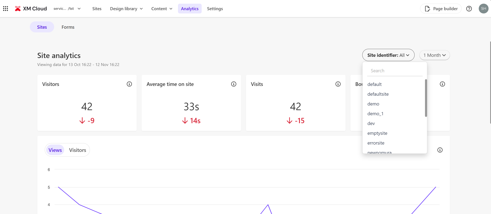
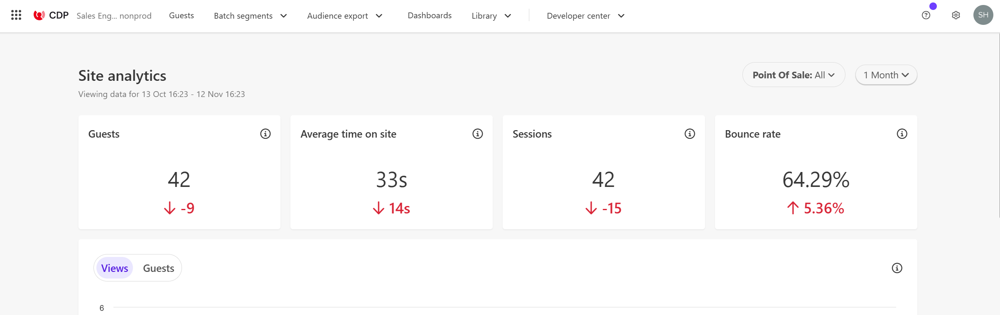

import { LinkCard } from '@astrojs/starlight/components';

Introducing Sitecore CDP, a platform provided by Sitecore for centralized management of customer data, and Sitecore Personalize, a tool for improving customer experiences using the information accumulated in CDP.

## Overview of Sitecore CDP + Personalize

Sitecore CDP + Personalize can be used as individual products or in combination. Originally, this service was provided by a company called Boxever until March 2021, and it could be used as a single product. Currently, it is offered as two separate products.

Sitecore CDP (Customer Data Platform) is a platform for centralized management of customer data and creating integrated guest - customer profiles. This allows companies to deeply understand customer behaviors and preferences and provide personalized experiences.

On the other hand, Sitecore Personalize is a tool for providing real-time personalized content and offers using the data accumulated in CDP. This enhances customer engagement and improves conversion rates.

By combining these tools, companies can provide consistent personalized experiences throughout the entire customer lifecycle.

## Sitecore CDP Features

When you log in to Sitecore CDP, the following screen appears. The information displayed immediately after logging in refers to the site's Analytics information.

From the menu displayed above, you can access the following information:

- **Guest**: View guest - profile information of anonymous and authenticated users
- **Batch segments**: Create custom segments that combine real-time behavior and past customer data
- **Data Browser**: Select fields to view data
- **Audience export**: Use the data accumulated in Sitecore CDP externally
- **Dashboard**: View reports on access status and guests - profiles accumulated on the site
- **Developer center**: Access information for developers

The screen below shows the list displayed in Guest.

## Sitecore Personalize Features

When you log in to Sitecore Personalize, the same Analytics information as CDP is displayed. The environment introduced this time is contracted for both Sitecore CDP + Personalize, so the same data is displayed for both.

From the menu displayed above, you can access the following information:

- **Experiences**: Configure settings related to personalization
- **Experiments**: Configure settings required for A/B testing
- **Decisioning**: Create segmentations used for personalization, etc.
- **Developer center**: Access information for developers

If you contract Personalize alone, you can use it for rules for anonymous users.

## Differences Between Production and Non-Production Environments

When you access the Sitecore Cloud Portal, you will see "Prod" under the icons for CDP and Personalize. This indicates that it operates as a production environment.

For example, when you access the non-production environment of CDP, completely different results are displayed for Analytics.

Basically, it is desirable to use the non-production environment for development and testing, and apply the tested items to the production environment, excluding test data from the production environment.

## What is Point of Sale?

In the upper right corner of the management screen, there is a menu for environment settings when using CDP and Personalize. When you click this menu, the following items are displayed.

What is the Point of Sale displayed here? In the tool, it is positioned as a store where the organization sells products, and as a channel, it is a website, and if the language is different, it is used as a different Point of Sale.

For example, the following screen shows the list of Points of Sale used in the production environment.

When you log in to CDP, the Analytics displayed can also be filtered by Point of Sale.

## Integration with XM Cloud

How are Sitecore XM Cloud and CDP + Personalize, deployed in the same organization, integrated? This will be confirmed from the following three perspectives.

### Analytics

Sitecore XM Cloud provides Analytics functionality as standard. When you refer to the actual Analytics screen, it looks like this.

When you refer to the list of Points of Sale, you can see that the items shared with CDP and Personalize are inherited as they are. In fact, when you add a Point of Sale on the XM Cloud side, the Point of Sale item is also added to CDP and Personalize.

### Personalize

Sitecore XM Cloud provides Personalize functionality as standard, and you can configure Personalize settings from the left menu of the Page builder.

When you refer to the actual Personalize settings screen, the rules are lined up on the right side as out-of-the-box rules.

In fact, these items are displayed in a list when you click `Developer center` - `conditions` in the Personalize menu.

Also, the settings related to Personalize created in XM Cloud are managed separately from the Experiences created in Personalize under `Experiences` - `XM Cloud experiences`.

This shows that the information used in XM Cloud is managed in Sitecore Personalize.

### Production and Non-Production

XM Cloud, CDP, and Personalize provide both production (prod) and non-production environments. Let's access the non-production environment of XM Cloud and check the Analytics screen. The following screen shows the Point of Sale dropdown displayed at this time.

Next, access the non-production environment of CDP. The actual screen looks like this.

This confirms that the Point of Sale items are shared in the non-production environments of XM Cloud, CDP, and Personalize. In fact, when a new Point of Sale is created, the added items are displayed in each environment.

In other words, the production environments of XM Cloud, CDP, and Personalize are linked by default, and the same applies to the non-production environments.

## Summary

This time, we introduced the basic functions and configuration of Sitecore CDP + Personalize when starting to use it. In this environment, XM Cloud, CDP, and Personalize are deployed within a single organization, so we could refer to the linked parts.

In fact, XM Cloud comes with a simplified version of CDP (Analytics part) and Personalize (limited functionality for anonymous users) as standard, and if you contract additionally, you can use the full-spec products without additional development.

## References

<LinkCard
  title="Introduction to Sitecore CDP"
  href="https://doc.sitecore.com/cdp/en/users/sitecore-cdp/introduction-to-sitecore-cdp.html"
  target="_blank"
/>
<LinkCard
  title="Manage a point of sale"
  href="https://doc.sitecore.com/cdp/en/users/sitecore-cdp/manage-a-point-of-sale.html"
  target="_blank"
/>
<LinkCard
  title="Introduction to Sitecore Personalize"
  href="https://doc.sitecore.com/personalize/en/users/sitecore-personalize/introduction-to-sitecore-personalize.html"
  target="_blank"
/>
<LinkCard
  title="Manage a point of sale in Sitecore Personalize"
  href="https://doc.sitecore.com/personalize/en/users/sitecore-personalize/manage-a-point-of-sale-in-sitecore-personalize.html"
  target="_blank"
/>

