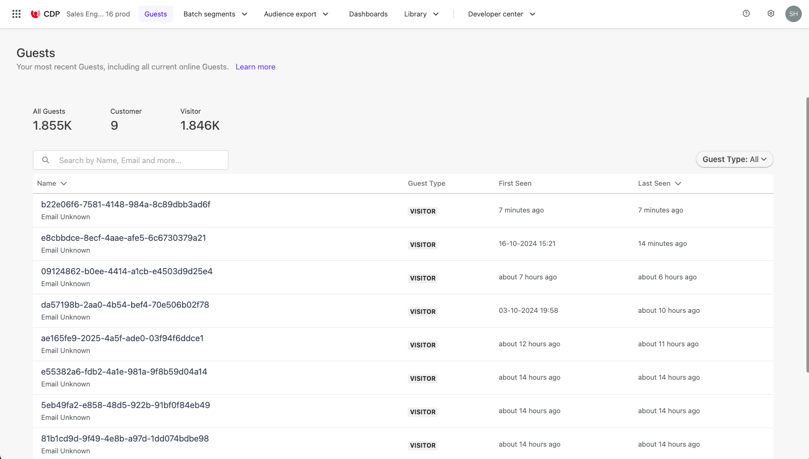
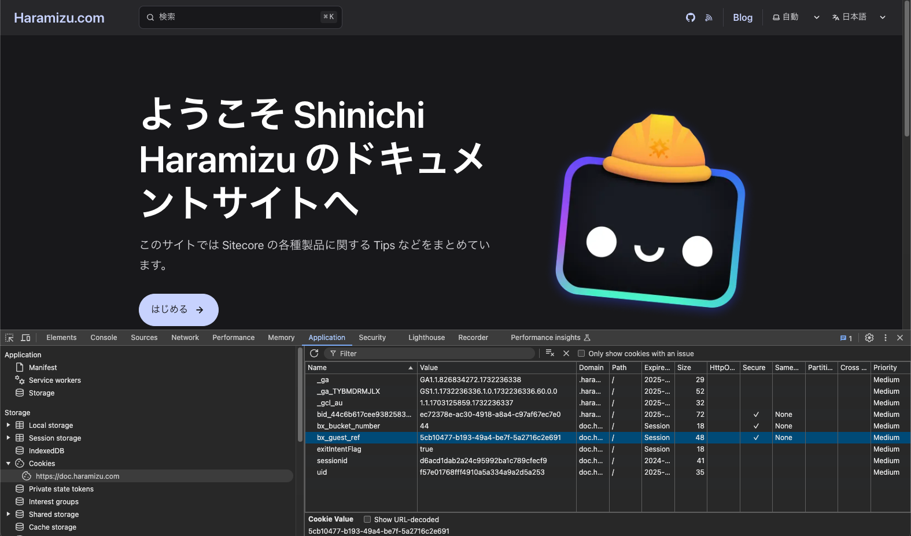
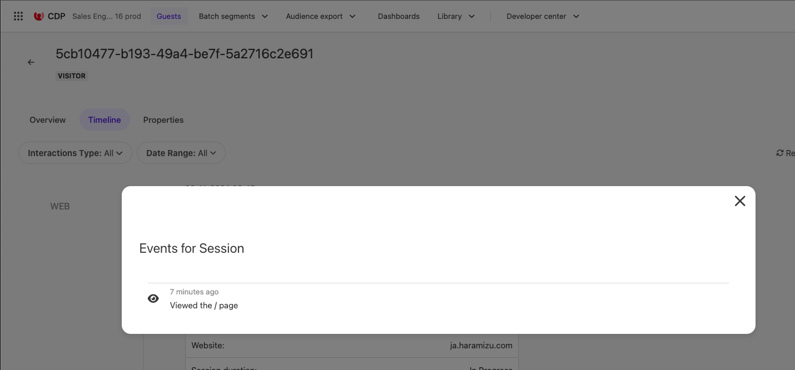

import { LinkCard } from '@astrojs/starlight/components';

This document explains how to track the information of visitors to a website integrated with Sitecore CDP as guests while browsing the pages.

## Guest Profile

When you access Sitecore CDP, the `Guest` menu is displayed at the top. Here, you can check the actual movements of guests. In this screen, the **Guest Type** displayed on the right side of the list is set to **All**.



When you check any guest, an overview is displayed as shown below. Here, you can see the time periods with the most access and the types of devices used. When tracking anonymous users, the browser's cookies are used, so the device is fixed to some extent. In the case of the guest below, it is shown that the first visit was 2 months ago and the last access was 1 day ago.


Switching to the Timeline tab, you can see a list of information about past sessions. This time it is only for the web, but the following channels can be linked to the CDP guest:

- Web
- Email
- SMS
- Mobile Web
- Mobile App
- Call Center

It is not automatically tracked, but you can also include the results of integration with other systems (Email, SMS, and Call Center).


Regarding web sessions, you can check which pages were referenced by clicking View Session Details.


Opening the Properties tab allows you to view user information. Since there is no data linked to this guest, only the first and last visit dates are displayed.


## Visiting the Site as a New Guest

The above guest has already accessed the site multiple times. So what happens when you access the site as a new guest? First, access the site in the browser's InPrivate mode.

After actually accessing, open the developer tools and check the cookie information used by the site, as shown below.



The same guest as the value of bx_guest_ref is created as a Guest in Sitecore CDP.


In this screen, it is currently displayed as **Online**. The session has not yet ended, and it is confirmed that the site is being referenced. Switching to the Timeline tab, the first web session has been created.


The above screen confirms the following:

- Visited as a web session
- Accessed with Desktop, Chrome 131, macOS, and the website ja.haramizu.com (Japanese content of haramizu.com)
- Session is still In Progress

Click `View Session Details` to view the contents.



Only the top page has been referenced so far. Now, let's browse several pages in the browser. Also, browse the sample pages of Sitecore Personalize. After that, check the guest session information again, and the session content is updated as follows.


- The referenced pages are accessed from bottom to top
- Several Personalize samples were referenced
- Finally, the Corner Popup sample page was referenced
- The Corner popup sends an event to CDP
  - You can check the content of the event by opening it

Regarding visits to the site, URLs are obtained for all pages, and any events are recorded. This code is actually part of the JavaScript code for the Corner Popup.

```js {16,23}
// CornerPopup.js
// Adds a unique variant identifier to CSS when deployed to ensure CSS does not impact styling of other elements.
var compiledCSS = Engage.templating.compile(variant.assets.css)(variant);
var styleTag = document.getElementById('style-' + variant.ref);
if (styleTag) {
  styleTag.innerHTML = compiledCSS;
}
// End Adds a unique variant identifier to CSS when deployed to ensure CSS does not impact styling of other elements.

// make space in the body for the experience
insertHTMLAfter('body', 'pers-');
var persContent = document.querySelector('#pers-' + variant.ref + ' #pers-transition-card');

setTimeout(function () {
  persContent.classList.add('open');
  sendInteractionToPersonalize('VIEWED');
});

var persCardClose = document.body.querySelector(
  '#pers-' + variant.ref + ' #pers-transition-card--secondary'
);
persCardClose.onclick = function () {
  sendInteractionToPersonalize('DISMISSED');
  persContent.classList.remove('open');
};

var persCardCta = persContent.querySelector(
  '#pers-' + variant.ref + ' #pers-transition-card--primary'
);
persCardCta.onclick = function () {
  sendInteractionToPersonalize('CLICKED');
  window.location.href = '[[CTA destination URL | string || {required:true, group: CTA Button}]]';
};

function sendInteractionToPersonalize(interactionType) {
  const type = '[[ Experience ID | String | CORNER_POPUP | {required: true}]]_INTERACTION';
  const eventData = {
    channel: 'WEB',
    pointOfSale: Engage.settings.pointOfSale,
    interactionID: 'PERS_CORNER_POPUP',
    interactionType: interactionType,
  };

  window.engage.event(type, eventData);
}
```

In this way, after executing Personalize or sending events on the page using JavaScript, you can record events as actions rather than just page references for the guest.

## References

<LinkCard
  title="Identifying guests in Sitecore CDP"
  href="https://doc.sitecore.com/cdp/en/users/sitecore-cdp/identifying-guests-in-sitecore-cdp.html"
  target="_blank"
/>

