import { LinkCard } from '@astrojs/starlight/components';

This document demonstrates how to access and update guest information using Postman. These steps can be referenced when integrating with external systems via API.

## Postman Setup

### About Endpoint

The API for processing data against Sitecore CDP varies depending on the environment where the instance is running. For this demonstration, we will access the CDP running in the Japan region using `https://api-engage-jpe.sitecorecloud.io`. Currently, instances can be started in the following four regions:

| Environment | Base URL                                  |
| ----------- | ----------------------------------------- |
| AP Region   | `https://api-engage-ap.sitecorecloud.io​` |
| EU Region   | `https://api-engage-eu.sitecorecloud.io`  |
| JP Region   | `https://api-engage-jpe.sitecorecloud.io` |
| US Region   | `https://api-engage-us.sitecorecloud.io`  |

### Authentication

Basic authentication is provided for server authentication, and you need to obtain an API key from the CDP management screen. Click `API access` from the administrator screen.


You can check the `Client Key` and `API Token` on the next screen. The `Client Key` is used as the username, and the `API Token` is used as the password.


### Creating a Collection

Launch Postman and set up the environment. To create a new workspace for CDP, select `Workspaces` - `Create workspace` to switch to the workspace creation screen.

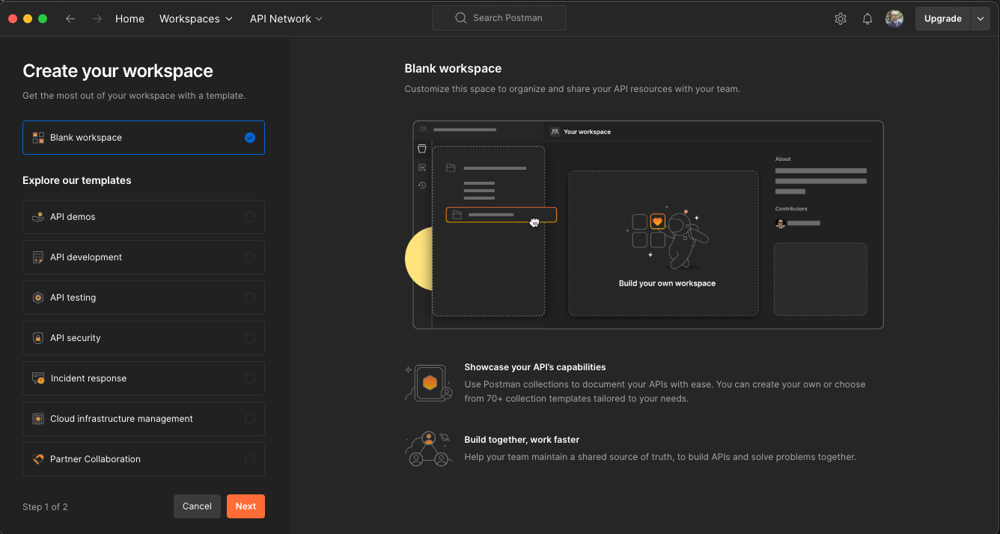

Click the Next button with the Blank workspace, set the name to `Sitecore CDP`, and create a workspace with the group setting as `Only me`.

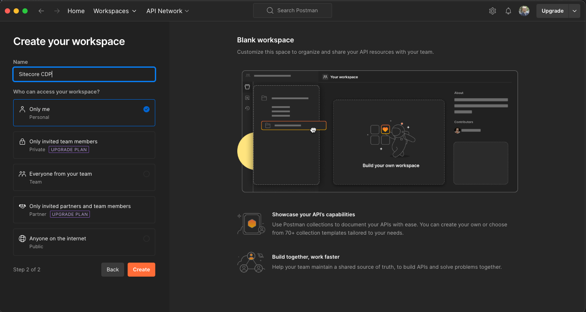

A new Workspace is created as shown below.

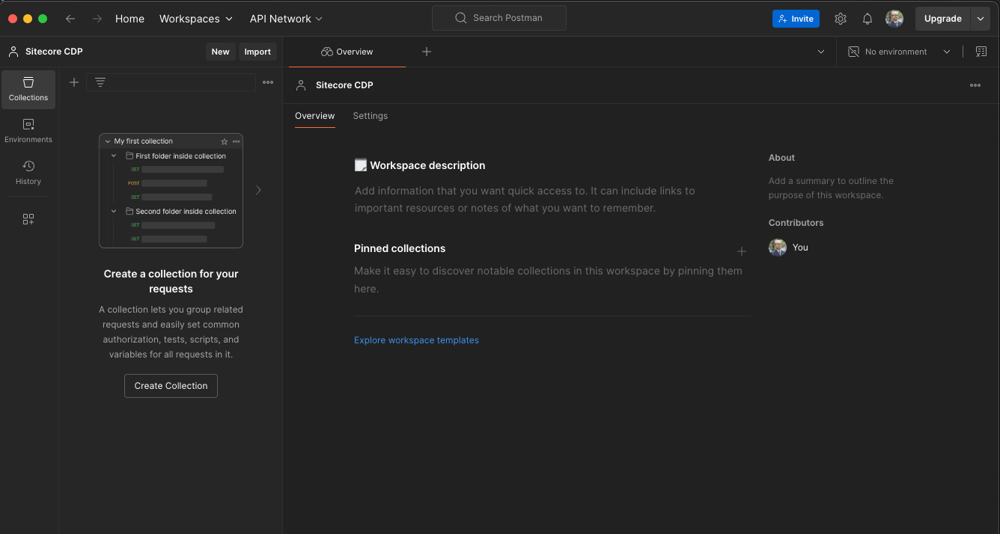

Click the `Create Collection` button to create a new collection for the created Workspace. Name the collection `Profile`.

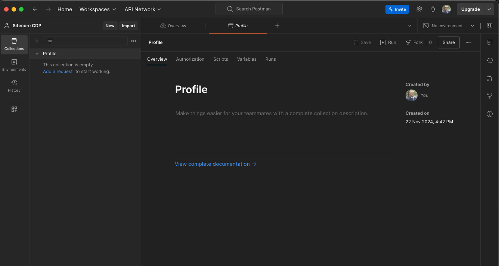

### Creating an Environment

The Profile collection has an Authorization tab. Click this to set up authentication. For basic authentication, proceed with the following settings:

- Auth Type: Basic Auth
- Username: Client Key
- Password: API Token

Since the Client Key and API Token vary by environment and are sensitive data, click the Environment button at the top right of the Postman window to use the environment management feature. Click the `Create Environment` button.


Set two environment variables for the created environment:

- CDP_ENDPOINT: Set the server endpoint
- CDP_CLIENT_KEY: Set the CDP Client Key
- API_TOKEN: Set the CDP API Token


Now the environment variables are set. Set these as the Username and Password in the Profile's authentication.


### Testing

To verify the above settings, proceed with testing in Postman. Click Add a request for the Sitecore CDP collection to create a new HTTP request. To display an existing guest, set it as follows:

For the Guest ID, use `{guestRef}`.

- Method: GET
- URL: `{{CDP_ENDPOINT}}/v2/guests/{guestRef}`

The settings are complete. The screen is as follows.

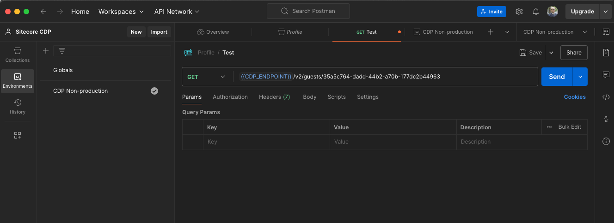

Executing it returns the following JSON data.

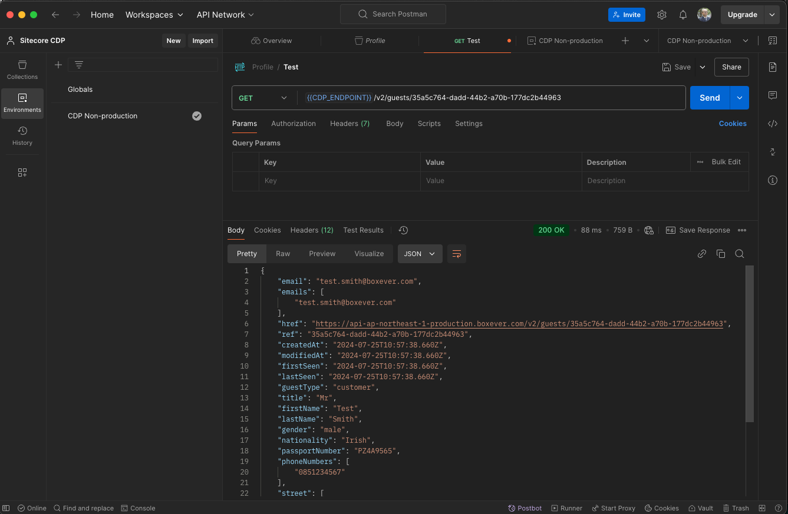

Postman setup is now complete.

## Managing Guests

The API documentation for creating, updating, and deleting guests is available at:

<LinkCard
  title="Sitecore CDP Guest REST API (v2.1)"
  href="https://api-docs.sitecore.com/cdp/guest-rest-api"
  target="_blank"
/>

We will use this to verify guest creation, updating, and deletion.

### Creating

To create a new guest, perform the following:

- Method: POST
- URL: `{{CDP_ENDPOINT}}/v2/guests/`
- BODY: Set the JSON data for creation

Create a new HTTP request in Postman and fill in the JSON data as follows:

```json title="JSON"
{
  "guestType": "Customer",
  "title": "Mr",
  "firstName": "Shinichi",
  "lastName": "Haramizu",
  "gender": "male",
  "dateOfBirth": "1971-12-08T00:00:00.000Z",
  "emails": ["haramizu@outlook.com"],
  "phoneNumbers": ["0345236900"],
  "nationality": "Japan",
  "city": "Minato-ku",
  "country": "JP",
  "postCode": "1070062",
  "state": "Tokyo"
}
```

The setup screen is as follows.

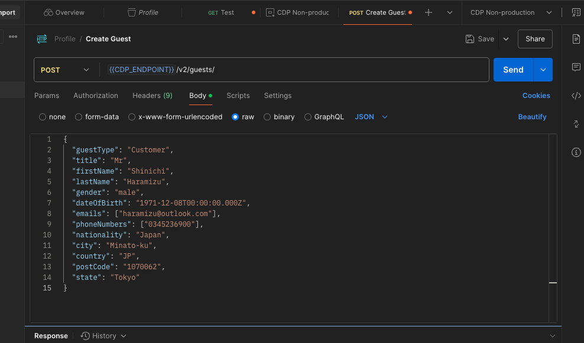

Executing it in Postman returns the following result.

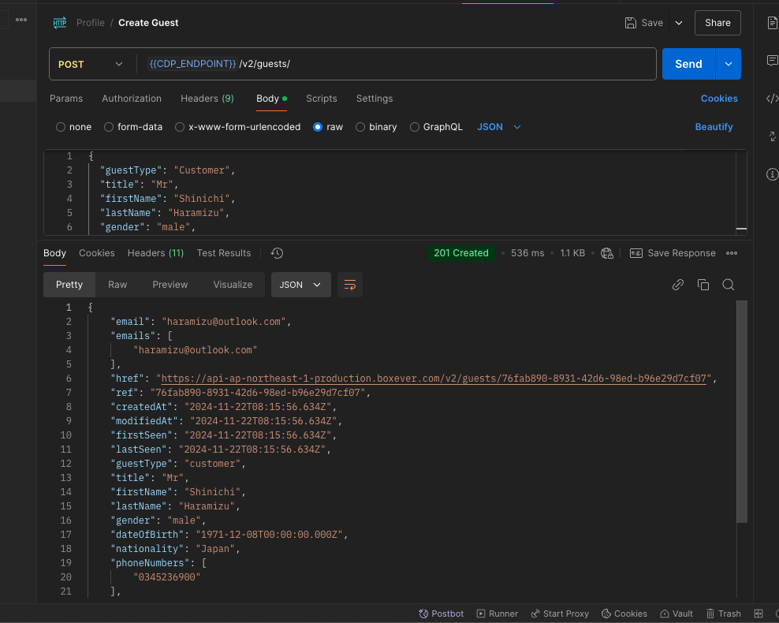

The returned JSON data is as follows:

```json title="JSON"
{
  "email": "haramizu@outlook.com",
  "emails": ["haramizu@outlook.com"],
  "href": "https://api-ap-northeast-1-production.boxever.com/v2/guests/76fab890-8931-42d6-98ed-b96e29d7cf07",
  "ref": "76fab890-8931-42d6-98ed-b96e29d7cf07",
  "createdAt": "2024-11-22T08:15:56.634Z",
  "modifiedAt": "2024-11-22T08:15:56.634Z",
  "firstSeen": "2024-11-22T08:15:56.634Z",
  "lastSeen": "2024-11-22T08:15:56.634Z",
  "guestType": "customer",
  "title": "Mr",
  "firstName": "Shinichi",
  "lastName": "Haramizu",
  "gender": "male",
  "dateOfBirth": "1971-12-08T00:00:00.000Z",
  "nationality": "Japan",
  "phoneNumbers": ["0345236900"],
  "city": "Minato-ku",
  "country": "JP",
  "postCode": "1070062",
  "state": "Tokyo",
  "identityStatus": "customer",
  "zipCode": "1070062"
}
```

The following data has been added:

- href
- ref
- createdAt
- modifiedAt
- firstSeen
- lastSeen
- identityStatus
- zipCode

The created guest includes automatically generated data. Accessing CDP shows the new guest.

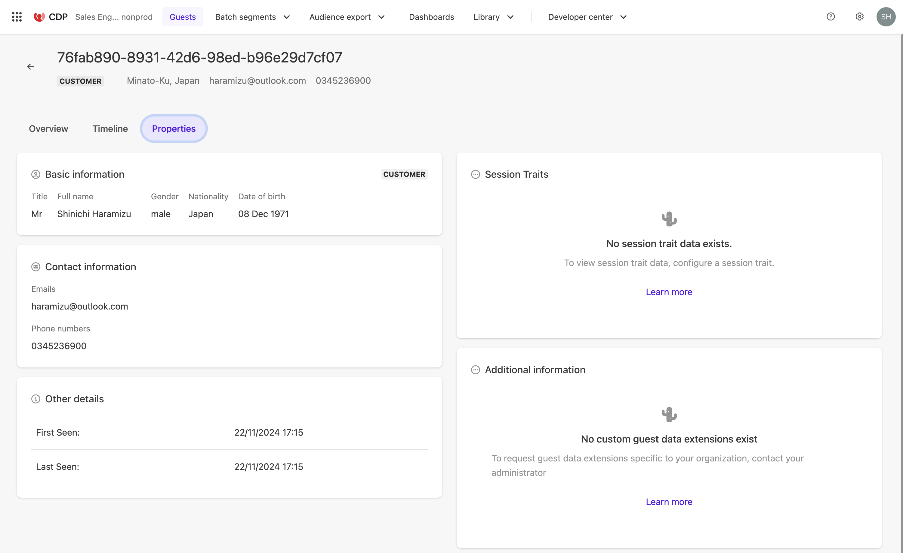

### Retrieve

When testing Postman, we used the ID from the CDP management screen. In actual operation, you may need to check for guest information using an email address. We will use the API to check guest data.

First, search by email address.

- Method: GET
- URL: `{{CDP_ENDPOINT}}/v2/guests/` Use email= in the QueryString

The execution screen is as follows.


The result is the following JSON data.

```json TITLE="JSON"
{
  "href": "https://api-ap-northeast-1-production.boxever.com/v2/guests/?offset=0&limit=10&email=yourmail@example.com",
  "offset": 0,
  "limit": 10,
  "first": {
    "href": "https://api-ap-northeast-1-production.boxever.com/v2/guests/?offset=0&limit=10&email=yourmail@example.com"
  },
  "last": {
    "href": "https://api-ap-northeast-1-production.boxever.com/v2/guests/?offset=0&limit=10&email=yourmail@example.com"
  },
  "items": [
    {
      "href": "https://api-ap-northeast-1-production.boxever.com/v2/guests/aaaaaaaa-bbbb-cccc-dddd-eeeeeeee"
    }
  ]
}
```

We searched by email address and got one item. The `items` : `href` field shows the URL with `{guestRef}`, which can be used to get detailed information about this user.

### Updating

To update the guest information created earlier, follow these steps:

- Method: PUT
- URL: `{{CDP_ENDPOINT}}/v2/guests/{guestRef}`
- Body: JSON data for updating

We will update the firstname, LastName, and postCode, along with other related keys.

```json
{
  "guestType": "customer",
  "title": "Mr",
  "firstName": "真一",
  "lastName": "原水",
  "postCode": "107-0062",
  "gender": "male",
  "identityStatus": "customer",
  "dateOfBirth": "1971-12-08T00:00:00.000Z",
  "emails": ["haramizu@outlook.com"],
  "phoneNumbers": ["0345236900"],
  "nationality": "Japan",
  "city": "Minato-ku",
  "country": "JP",
  "state": "Tokyo"
}
```

The result after execution is shown below.


The management screen confirms the name has been updated.

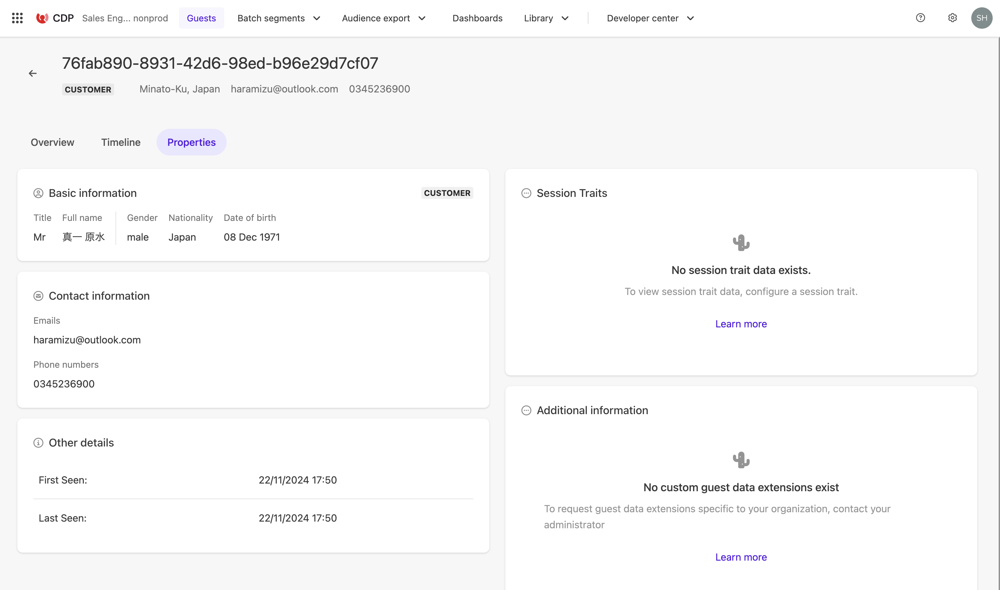

### Deleting

To delete the test guest profile, send a request from Postman as follows:

- Method: DELETE
- URL: `{{CDP_ENDPOINT}}/v2/guests/{guestRef}`

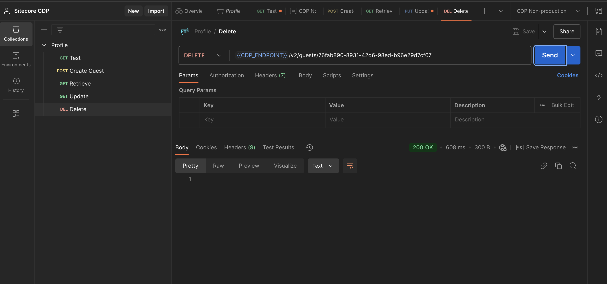

If a 200 result is displayed, the data has been deleted.

## Summary

We used Postman to control guests via API. Understanding these basic operations allows smooth integration with external data using Sitecore Connect.

## References

<LinkCard
  title="Sitecore CDP Guest REST API (v2.1)"
  href="https://api-docs.sitecore.com/cdp/guest-rest-api"
  target="_blank"
/>

<LinkCard
  title="SitecoreNA / Sitecore-CDP-Scripts"
  href="https://github.com/SitecoreNA/Sitecore-CDP-Scripts"
  target="_blank"
/>

