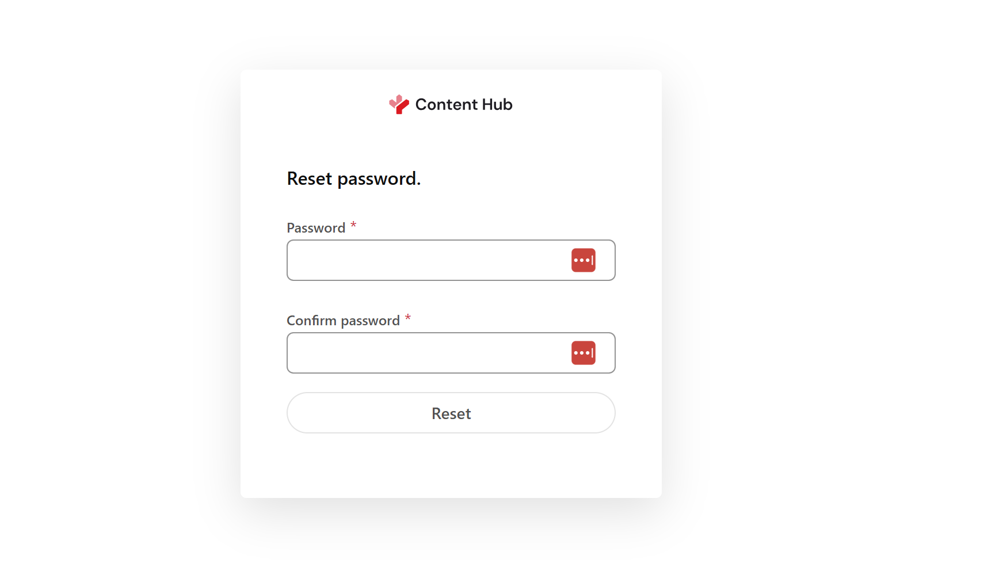
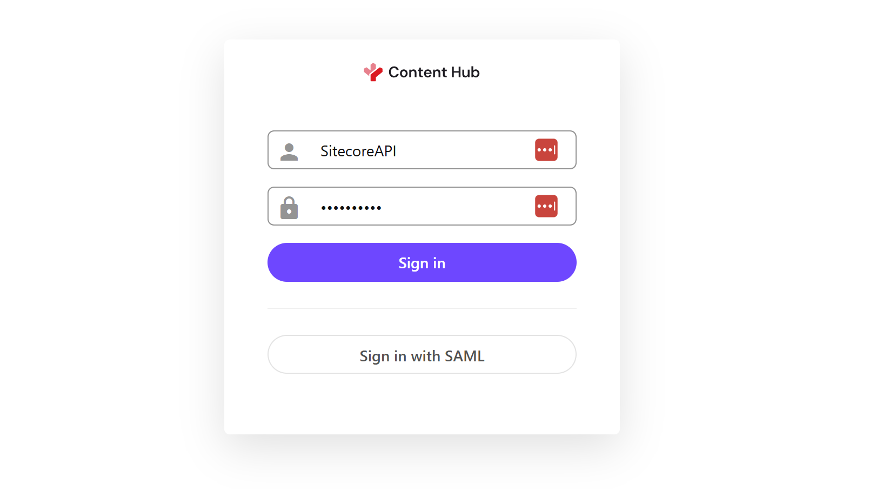

import { Steps, LinkCard } from '@astrojs/starlight/components';

This document introduces the steps to integrate Sitecore Content Hub in a Sitecore XM Cloud environment. This time, we will introduce the installation and initial setup of the module.

## Prerequisites

This time, we will introduce the steps to integrate Sitecore XM Cloud and Content Hub DAM in two environments.

- Sitecore XM Cloud + Sitecore Content Hub
- Docker environment + Sitecore Content Hub

Since the settings for Sitecore XM Cloud, which is a SaaS environment, and the Docker version, which is a local environment, differ, please add the necessary settings to your project as needed.

## Preparing Content Hub

To integrate Sitecore XM Cloud and Content Hub, you need to configure Content Hub. The required items are the `URI` of the server to be integrated and the following items.

- `client_id`
- `client_secret`
- `username`
- `password`

### Client Information

The `client_id` and `client_secret` required for integration can be obtained from the OAuth clients screen of the Content Hub management tool. This time, we will prepare a new OAuth Client. Name it XmCloud and create it as follows (assign a GUID to the Client Secret to make it effective as a key).


This completes the creation of the OAuth Client with the necessary two keys.

### Login Authentication

To make the user created in the next step available for Sitecore authentication, you need to change the authentication mode. The steps are as follows.

<Steps>

1. Click `Settings` in the management tool

2. Select `PortalConfiguration` - `Authentication`

3. Change `authentication_mode` of `ExternalAuthenticationProviders` - `saml` from Active to Passive.

   

4. Click the `Save` button to apply the settings

</Steps>

This allows you to log in with a local Sitecore account.

### User Information

To create a connection string, you need a username and password that can log in. Follow the steps below to create a user.

<Steps>

1. Select `Users` from the management screen.

2. Click the `+ User` button to create a new user. Set `Media` for Modules.

   

3. After creating the user, you will be taken to the user information page. The default role cannot be used, so add the following roles to the target account.

   - M.Builtin.ContentAdministrators
   - M.Builtin.SitecoreDAM.Everyone
   - M.Builtin.Editors
   - M.Builtin.Readers
   - M.Builtin.DRM.Everyone

4. To specify a password, you need an email address for password reset, so click Edit Profile and set the email address.

   

   After setting the email address, click the `Reset password` button.

5. After a while, you will receive an email. The email may be in the spam folder as it is sent from a domain that is not usually used. If it is not in your inbox, check your spam folder.

   

6. Set a new password.

   

7. If you can log in with the username, the user account creation is complete.

</Steps>

Once created, check if you can log in with the username and password.



With the above settings, the `username` and `password` are ready.

### CORS Settings

The Sitecore Content Hub page has CORS - Cross-Origin Resource Sharing settings enabled, and it only works as an application on permitted sites. Here, specify the URL of the tools used by Sitecore XM Cloud and set the Connector to work.

<Steps>

1. Open `Settings` in the Content Hub management tool

2. Open `PortalConfiguration` - `CORSConfiguration`

3. Add `https://pages.sitecorecloud.io/` and the URL of the XM Cloud instance as sites

   

</Steps>

This completes the preparation on the Sitecore Content Hub side.

## Sitecore XM Cloud

Using the values prepared in advance, proceed with the settings on the Sitecore XM Cloud side.

### Enabling the Connector

When integrating XM Cloud and Content Hub, the connector integration is not in the form of installing a module as in the traditional environment. The integration with Sitecore Content Hub's DAM and CMP is provided as a standard feature, and enabling this feature is just a matter of setting environment variables.

The official instructions are as follows.

<LinkCard
  title="Walkthrough: Enabling the DAM connector in XM Cloud on Sitecore Cloud Portal"
  href="https://doc.sitecore.com/xmc/en/developers/xm-cloud/walkthrough--enabling-the-dam-connector-in-an-environment-deployed-to-xm-cloud.html"
  description="To use Sitecore DAM in an environment deployed to XM Cloud, you must configure and enable the DAM connector."
  target="_blank"
/>

First, select the environment you want to configure in XM Cloud Deploy, and then select Variables from the tab menu items. Then, add the following four items. When setting, specify the URI of the DAM you want to connect to (e.g., `https://frutifuljp.sitecoresandbox.cloud/`) for `uri`, and the URL + asset page for Sitecore Content Hub search page URI (e.g.,

| Name                                                     | Value                                                                                                  |
| -------------------------------------------------------- | ------------------------------------------------------------------------------------------------------ |
| `SITECORE_AppSettings_damEnabled__define`                | Yes                                                                                                    |
| `Sitecore_ConnectionStrings_DAM_dot_ContentHub`          | `ClientId={client_id};ClientSecret={client_secret};UserName={username};Password={password};URI={uri};` |
| `Sitecore_ConnectionStrings_DAM_dot_SearchPage`          | `{Sitecore Content Hub search page URI}`                                                               |
| `Sitecore_ConnectionStrings_DAM_dot_ExternalRedirectKey` | `Sitecore`                                                                                             |

When you change the environment variables, you need to Rebuild, but you also need to change the settings on the XM Cloud project side. Proceed to the next step.

### Updating the Content Security Policy

In the XM Cloud environment, as a security measure, not all tools you want to use on the management screen are displayed in an iFrame. Therefore, you need to change the settings for the
First, create a patch file to change the settings. This time, create a file in `authoring\platform\xdts\Web.config.xdt`.

```xml title="authoring\platform\xdts\Web.config.xdt"
<?xml version="1.0" encoding="utf-8"?>
<configuration xmlns:xdt="http://schemas.microsoft.com/XML-Document-Transform">
  <location path="sitecore">
    <system.webServer>
      <httpProtocol>
        <customHeaders>
          <add xdt:Transform="SetAttributes" xdt:Locator="Match(name)" name="Content-Security-Policy" value="default-src 'self' 'unsafe-inline' 'unsafe-eval' https://apps.sitecore.net https://*.sitecorecloud.io https://*.stylelabs.io https://*.stylelabs.cloud https://*.stylelabsdemo.com https://*.stylelabsqa.com https://*.stylelabsdev.com https://*.sitecoresandbox.cloud https://*.azureedge.net https://stylelabs.eu.auth0.com https://login.windows.net https://login.microsoftonline.com https://*.boxever.com https://*.xmcloudcm.localhost wss://www.xmcloudcm.localhost https://ipv4.jsonip.com; img-src 'self' data: https://s.gravatar.com https://*.wp.com/cdn.auth0.com/avatars https://*.sitecorecloud.io https://*.stylelabs.io https://*.stylelabs.cloud https://*.stylelabsdemo.com https://*.stylelabsqa.com https://*.stylelabsdev.com https://*.sitecoresandbox.cloud https://*.azureedge.net https://*.xmcloudcm.localhost; style-src 'self' 'unsafe-inline' https://fonts.googleapis.com https://*.sitecorecloud.io; font-src 'self' 'unsafe-inline' https://fonts.gstatic.com https://*.sitecorecloud.io; frame-ancestors 'self' pages.sitecorecloud.io pages.sitecore.io symphony.sitecorecloud.io explorer.sitecorecloud.io https://pages.sitecorecloud.io https://*.xmcloudcm.localhost https://*.sitecoredemo.com; block-all-mixed-content"/>
        </customHeaders>
      </httpProtocol>
    </system.webServer>
  </location>
</configuration>
```

Next, modify the `authoring\platform\Platform.csproj` file to import the above file as a necessary file when deploying in XM Cloud.

```diff lang="xml" title="authoring\platform\Platform.csproj"
  <ItemGroup>
  <Content Include="App_Config\Include\zzz\languagefallback.config" />
  <Content Include="App_Data\items\core\localization\cmp.items.core.ja-JP.dat" />
  <Content Include="App_Data\items\core\localization\dam.items.core.ja-JP.dat" />
  <Content Include="App_Data\items\core\localization\items.core.ja-JP.dat" />
  <Content Include="App_Data\items\core\localization\items.core.jss.ja-JP.dat" />
  <Content Include="App_Data\items\core\localization\items.core.sxa.ja-JP.dat" />
  <Content Include="App_Data\items\master\localization\cmp.items.master.ja-JP.dat" />
  <Content Include="App_Data\items\master\localization\dam.items.master.ja-JP.dat" />
  <Content Include="App_Data\items\master\localization\items.master.ja-JP.dat" />
  <Content Include="App_Data\items\master\localization\items.master.jss.ja-JP.dat" />
  <Content Include="App_Data\items\master\localization\items.master.sxa.ja-JP.dat" />
  <Content Include="App_Data\localization\cmp.texts.ja-JP.xml" />
  <Content Include="App_Data\localization\dam.texts.ja-JP.xml" />
  <Content Include="App_Data\localization\texts.ja-JP.xml" />
  <Content Include="App_Data\localization\texts.jss.ja-JP.xml" />
  <Content Include="App_Data\localization\texts.sxa.ja-JP.xml" />
+    <Content Include="xdts\Web.config.xdt" />
```

Finally, specify the application of the above xdt file in the xmcloud.build.json configuration file used by XM Cloud.

```diff lang="json"
{
  "renderingHosts": {
  "xmcloudpreview": {

    ..

    "type": "sxa",
    "buildCommand": "build",
    "runCommand": "next:start"
  }
  },
+  "transforms": [
+    {
+      "xdtPath": "/xdts/",
+      "targetPath": "/"
+    }
+  ],
```

After adding the above settings, reflect the code in GitHub and redeploy the XM Cloud instance with Rebuild.

### Operation Check

Check if you can access the Content Hub environment from XM Cloud Pages.

<Steps>

1. Open Pages

2. Select the Image component

   

3. Click the `Change` button to switch to the media selection screen

4. Open the `Content Hub` tab. At this time, the login authentication will be displayed, so log in with the account specified this time.

   

5. If the image is displayed as shown below, the settings are complete.

   

</Steps>

This time, we created an account and set it up so that you can log in. If SSO is enabled and you can access Content Hub, the login will not be displayed.

## Docker

This time, we will enable Sitecore Connect for Sitecore Content Hub for the local docker environment. The official procedure is introduced on the following page.

<LinkCard
  title="Walkthrough: Enabling the DAM connector in a local development environment"
  href="https://doc.sitecore.com/xmc/en/developers/xm-cloud/walkthrough--enabling-the-dam-connector-in-a-local-development-environment.html"
  target="_blank"
/>

### Updating the Content Security Policy

The Docker environment of XM Cloud, like the cloud server, does not display all the tools you want to use on the management screen in an iFrame for security reasons. Therefore, you need to change the settings for the Content Security Policy.

Create a patch file to change this setting. This time, create a file in `local-containers\docker\build\cm\xdts\Web.config.xdt`.

```xml title="local-containers\docker\build\cm\xdts\Web.config.xdt"
<?xml version="1.0" encoding="utf-8"?>
<configuration xmlns:xdt="http://schemas.microsoft.com/XML-Document-Transform">
  <location path="sitecore">
    <system.webServer>
      <httpProtocol>
        <customHeaders>
          <add xdt:Transform="SetAttributes" xdt:Locator="Match(name)" name="Content-Security-Policy" value="default-src 'self' 'unsafe-inline' 'unsafe-eval' https://apps.sitecore.net https://*.sitecorecloud.io https://*.stylelabs.io https://*.stylelabs.cloud https://*.stylelabsdemo.com https://*.stylelabsqa.com https://*.stylelabsdev.com https://*.sitecoresandbox.cloud https://*.azureedge.net https://stylelabs.eu.auth0.com https://login.windows.net https://login.microsoftonline.com https://*.boxever.com https://*.xmcloudcm.localhost wss://www.xmcloudcm.localhost https://ipv4.jsonip.com; img-src 'self' data: https://s.gravatar.com https://*.wp.com/cdn.auth0.com/avatars https://*.sitecorecloud.io https://*.stylelabs.io https://*.stylelabs.cloud https://*.stylelabsdemo.com https://*.stylelabsqa.com https://*.stylelabsdev.com https://*.sitecoresandbox.cloud https://*.azureedge.net https://*.xmcloudcm.localhost; style-src 'self' 'unsafe-inline' https://fonts.googleapis.com https://*.sitecorecloud.io; font-src 'self' 'unsafe-inline' https://fonts.gstatic.com https://*.sitecorecloud.io; frame-ancestors 'self' pages.sitecorecloud.io pages.sitecore.io symphony.sitecorecloud.io explorer.sitecorecloud.io https://pages.sitecorecloud.io https://*.xmcloudcm.localhost https://*.sitecoredemo.com; block-all-mixed-content"/>
        </customHeaders>
      </httpProtocol>
    </system.webServer>
  </location>
</configuration>
```

To apply this file when creating the Docker image, modify the `local-containers\docker\build\cm\Dockerfile` file as follows.

```diff lang="dockerfile" title="local-containers\docker\build\cm\Dockerfile"
# Copy developer tools and entrypoint
COPY --from=tools C:\tools C:\tools

+# Copy Xdts
+COPY .\Xdts\ .\Xdts

+# Perform transforms
+RUN (Get-ChildItem -Path 'C:\\inetpub\\wwwroot\\xdts\\web*.xdt' -Recurse ) | `
+    ForEach-Object { & 'C:\\tools\\scripts\\Invoke-XdtTransform.ps1' -Path 'C:\\inetpub\\wwwroot\\web.config' -XdtPath $_.FullName `
+    -XdtDllPath 'C:\\tools\\bin\\Microsoft.Web.XmlTransform.dll'; };
```

This completes the changes to the CSP.

### Setting Environment Variables

Next, add the same settings as in the cloud to the local Docker environment. The following values are:

```.env title="local-containers.env"
SITECORE_DAM_ENABLED=Yes
Sitecore_DAM_ContentHub=ClientId={client_id};ClientSecret={client_secret};UserName={username};Password={password};URI={uri};
Sitecore_DAM_SearchPage={Sitecore Content Hub search page URI}
Sitecore_DAM_ExternalRedirectKey=true
```

Add the above values to the `local-containers\docker-compose.yml` to make them available in the docker cm image.

```diff lang="yml"
//local-containers\docker-compose.yml
    SITECORE_FedAuth_dot_Auth0_dot_ClientSecret: ${SITECORE_FedAuth_dot_Auth0_dot_ClientSecret}
    SITECORE_FedAuth_dot_Auth0_dot_Domain: ${SITECORE_FedAuth_dot_Auth0_dot_Domain}
    SITECORE_FedAuth_dot_Auth0_dot_Audience: ${SITECORE_FedAuth_dot_Auth0_dot_Audience}
    SITECORE_FedAuth_dot_Auth0_dot_LogoutRedirect: ${SITECORE_FedAuth_dot_Auth0_dot_LogoutRedirect}
+      # Sitecore Connect for Content Hub
+      Sitecore_ConnectionStrings_DAM_dot_ContentHub: ${Sitecore_DAM_ContentHub}
+      Sitecore_ConnectionStrings_DAM_dot_SearchPage: ${Sitecore_DAM_SearchPage}
+      Sitecore_ConnectionStrings_DAM_dot_ExternalRedirectKey: ${Sitecore_DAM_ExternalRedirectKey}
+      SITECORE_AppSettings_damEnabled__define: ${SITECORE_DAM_ENABLED}
  healthcheck:
```

This will enable the Connector. When you click on the image of the sample site, you can see that the icon to use DAM is displayed second from the left.


After clicking this, an error screen will be displayed.


### Adding CORS

The reason for the above error is that the Docker instance is not specified in the CORS settings on the Content Hub DAM side. Therefore, change the CORS settings of Content Hub with the following steps.

<Steps>

1. Open `Settings` in the Content Hub management tool

2. Open `PortalConfiguration` - `CORSConfiguration`

3. Add `https://xmcloudcm.localhost/` and the URL of the XM Cloud instance as sites

   

</Steps>

This completes the settings. After logging in, you will be able to select DAM assets as shown below.


## Reference Information

<LinkCard
  title="Enabling Sitecore CMP and DAM in XM Cloud"
  href="https://doc.sitecore.com/xmc/en/developers/xm-cloud/enabling-sitecore-cmp-and-dam-in-xm-cloud.html"
  target="_blankd"
/>

<LinkCard
  title="Walkthrough: Enabling the DAM connector in a local development environment"
  href="https://doc.sitecore.com/xmc/en/developers/xm-cloud/walkthrough--enabling-the-dam-connector-in-a-local-development-environment.html"
  target="_blank"
/>

