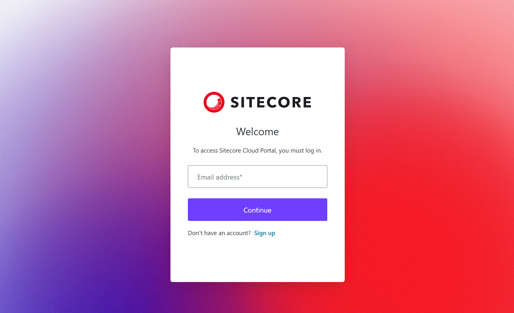
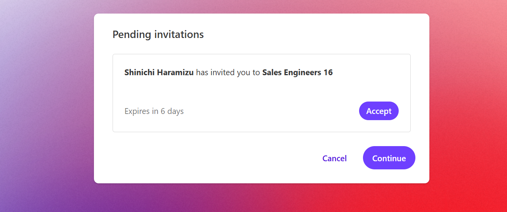
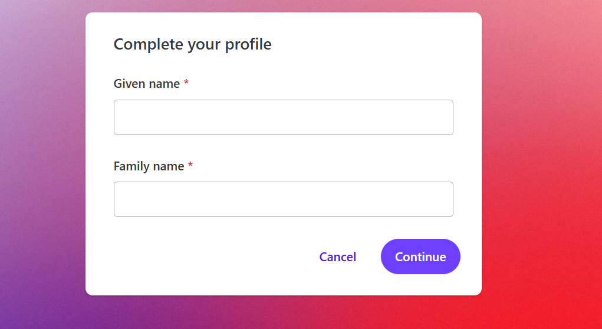
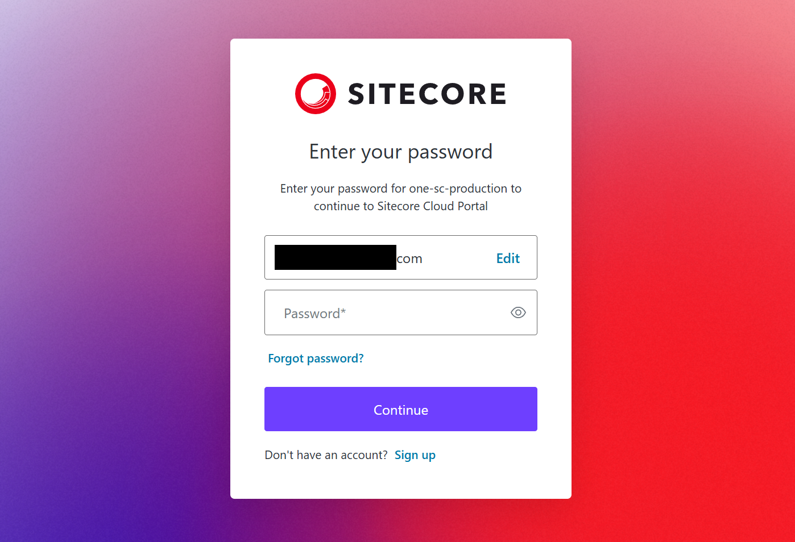
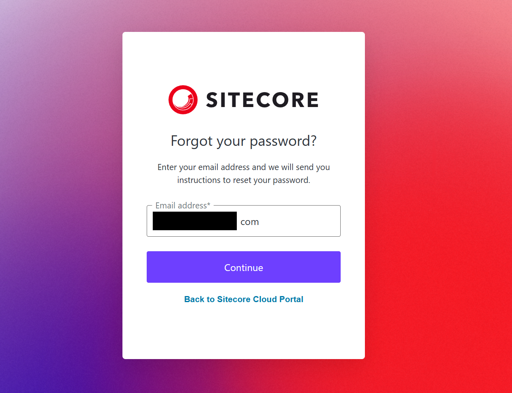
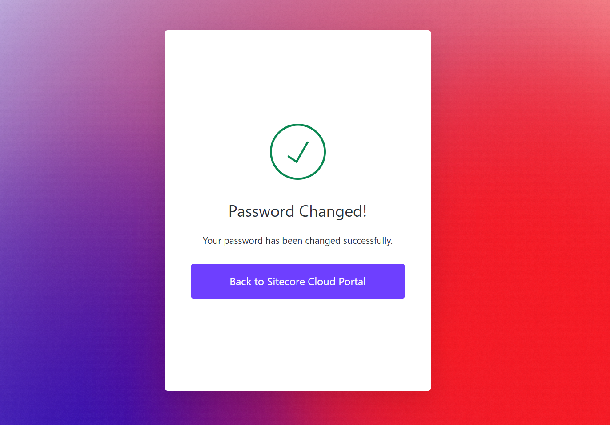

import { LinkCard } from '@astrojs/starlight/components';

This section introduces the steps to join the Sitecore Cloud Portal after receiving an invitation email from the administrator.

## Receiving the Invitation Email

The email you receive from the administrator will be sent to the email address you will use to log in. A sample of the actual email you receive is shown below.

You need to act on this email within 7 days of receiving it. The administrator can check the status of the invitation from the [Invitations](/cloud-portal/overview/#invitations) screen.

Click `Go To Portal` in the invitation email to proceed with logging into the portal. When you click it, the login screen will appear as shown below.

### First Time Use

If you are using the Sitecore Cloud Portal for the first time, click `Sign up` under Continue on the accessed screen to proceed with creating an account.

After entering the invited email address, you will be taken to a screen to set a new account password.

The password rules are as follows:

- At least 8 characters
- Contains at least three of the following:
  - Uppercase letters (A-Z)
  - Lowercase letters (a-z)
  - Numbers (0-9)
  - Symbols (!@#$%^&\* etc.)

After setting a password that meets these rules, click `Continue`. If the account is created, information about the invited organization will be displayed.

Confirm the invited organization and click the `Accept` button to send a confirmation email.

A confirmation email will be sent to the email address you are logged in with.

Click `Verify account` in the received email to complete the email address verification.

As the final setting item, enter the name to be displayed in the Sitecore Cloud Portal.

Then, the Sitecore Terms and Conditions will be displayed.

After reviewing and accepting the terms, you will be able to log in to the Sitecore Cloud Portal.

### If You Already Have an Account

If you already have an account with another organization, please log in with your existing account.

After logging in, a confirmation screen will appear showing which organization has invited you.

The steps from here are the same as when creating a new account, so they are omitted here.

### Forgot Password

If you already have an account but forgot your password, click `Forgot password?` on the login screen.

You can reset your password if you forget it. Enter the email address of the relevant account to reset it.

The screen will switch, and a password reset email will be sent to the specified email address. You can also click Resend email to receive a new reset email.

After a while, a reset email will be sent to the specified email address. Click the `Set a new password` button in this email.

The screen will switch to a screen to set a new password. Set a new password according to the password rules.

When the new password and the confirmation password match, the password change is complete.

## Summary

This page summarizes the steps to follow when receiving an invitation email to the Sitecore Cloud Portal. Initially, only the Organization Owner is present, so let's add other users to use it.

## References

<LinkCard
  title="Access the portal for the first time"
  href="https://doc.sitecore.com/portal/en/developers/sitecore-cloud-portal/access-the-portal-for-the-first-time.html"
  target="_blank"
/>
<LinkCard
  title="Log in to the Sitecore Cloud Portal"
  href="https://doc.sitecore.com/portal/en/developers/sitecore-cloud-portal/log-in-to-the-sitecore-cloud-portal.html"
  target="_blank"
/>

