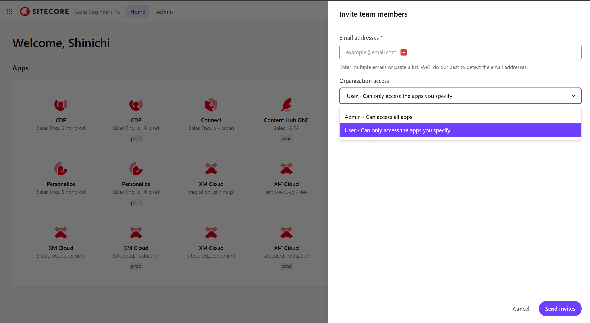
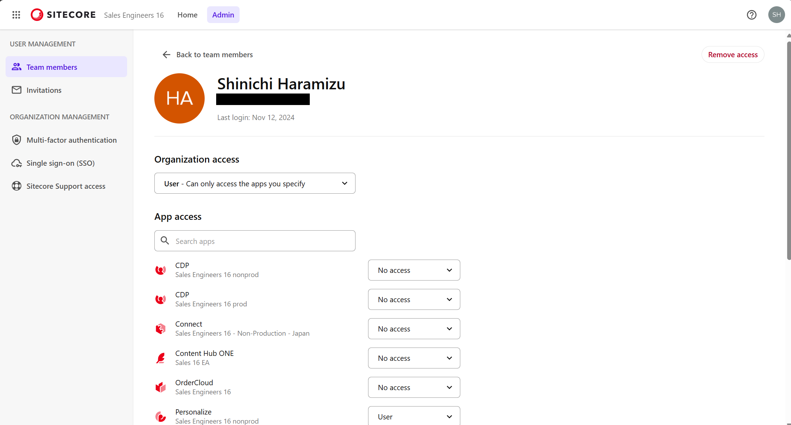

import { LinkCard } from '@astrojs/starlight/components';

This section introduces the types of user roles that can be managed in the Sitecore Cloud Portal and the permissions that can be assigned.

## About Roles

The Sitecore Cloud Portal provides three types of roles.

| Role  | Description                                                                                             |
| ----- | ------------------------------------------------------------------------------------------------------- |
| User  | Use of assigned applications. Up to 25 applications.                                                    |
| Admin | Invite users to the organization  Set up SSO and MFA Use XM Cloud Deploy  Access support |
| Owner | Has the same permissions as Admin  Can add or remove Organization Owners                           |

The following screen shows the portal when a User is set to use one application.

The screen below shows the view when logged in as an Admin. All tools and portal management features are accessible. However, it is noted that inviting an Organization Owner is not possible.

When logged in as an Organization Owner, it is possible to add an Owner via Invitation.

As shown above, utilizing the three types of roles is important for smooth user addition and management during operations, as well as setting up administrators and determining Organization Owners.

For more details on the differences between roles, you can check the following page.

<LinkCard
  title="Organization role capabilities"
  href="https://doc.sitecore.com/portal/en/developers/sitecore-cloud-portal/roles.html#organization-role-capabilities"
  target="_blank"
/>

## About Application Permissions

This section reviews the permission settings for users registered as Users in the Sitecore Cloud Portal. In addition to inviting users to use applications, you can also check user details. Select the target user from the Admin - Team members menu.

In this screen, you can set permissions for each application.

### User Permissions by Product

The permissions that can be assigned to users vary by product. Below are the roles that can be set for each product. By default, `No access` is assigned, and the application cannot be used.

- CDP
  - User
  - Admin
  - Analytics user
  - Developer
  - Read only
- Connect
  - User
  - Admin
- Content Hub ONE
  - User
  - Admin
- Personalize
  - User
  - Admin
  - Analytics user
  - Developer
  - Read only
- XM Cloud
  - User
  - Admin

## Summary

This section introduces the roles that need to be understood for user management and the permissions for applications that users can use. Generally, users should be assigned the User role for applications, and Admin should be assigned as needed. There is always one Organization Owner, but it is recommended to assign multiple people to handle any issues that may arise.

## References

<LinkCard
  title="Invite team members to your Sitecore Cloud Portal organization"
  href="https://doc.sitecore.com/portal/en/developers/sitecore-cloud-portal/invite-team-members-to-your-sitecore-cloud-portal-organization.html"
  target="_blank"
/>
<LinkCard
  title="Manage the access of a team member"
  href="https://doc.sitecore.com/portal/en/developers/sitecore-cloud-portal/manage-the-access-of-a-team-member.html"
  target="_blank"
/>
<LinkCard
  title="Roles"
  href="https://doc.sitecore.com/portal/en/developers/sitecore-cloud-portal/roles.html"
  target="_blank"
/>

