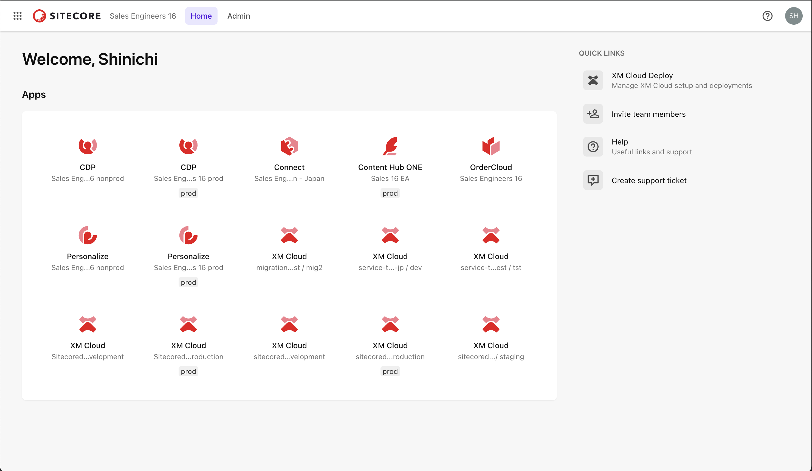
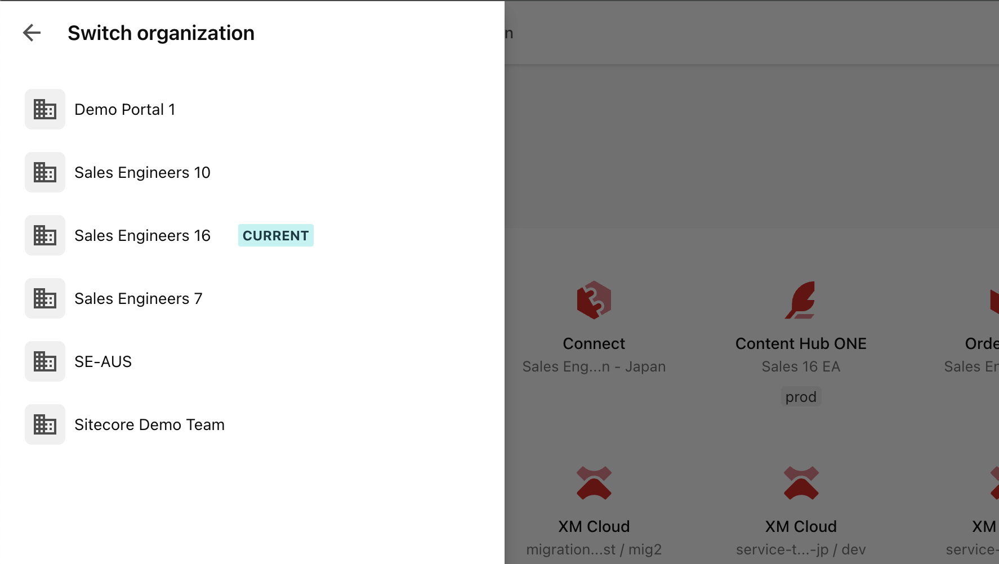
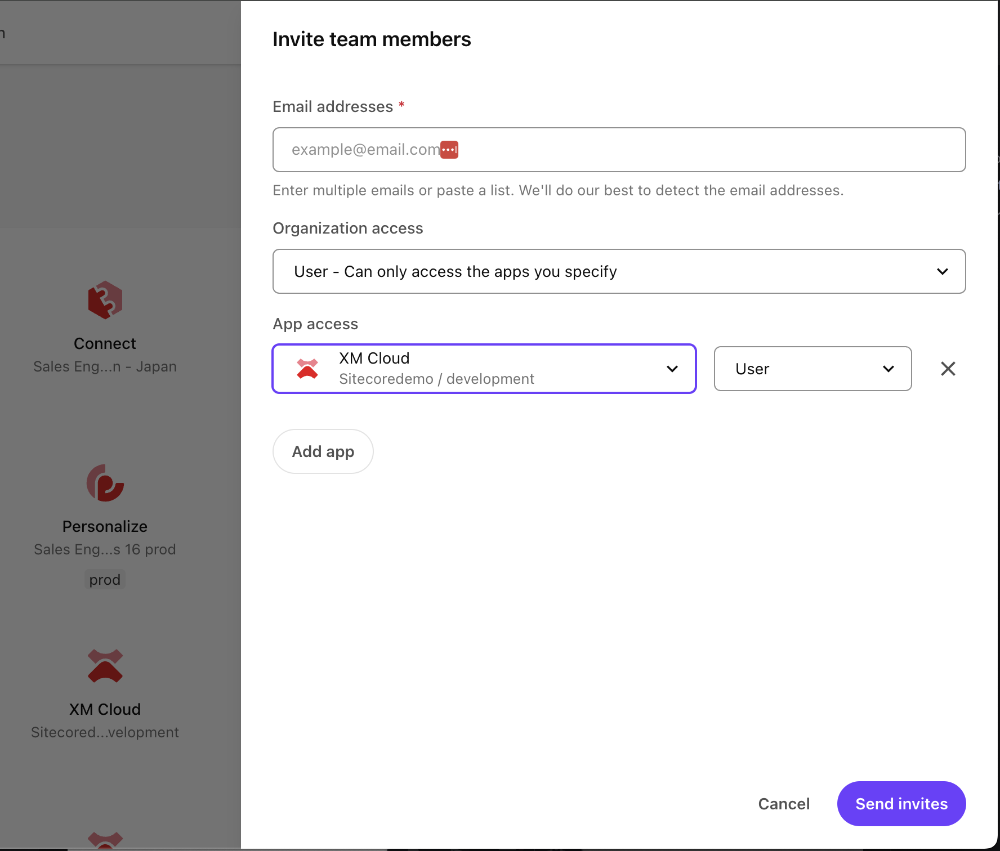
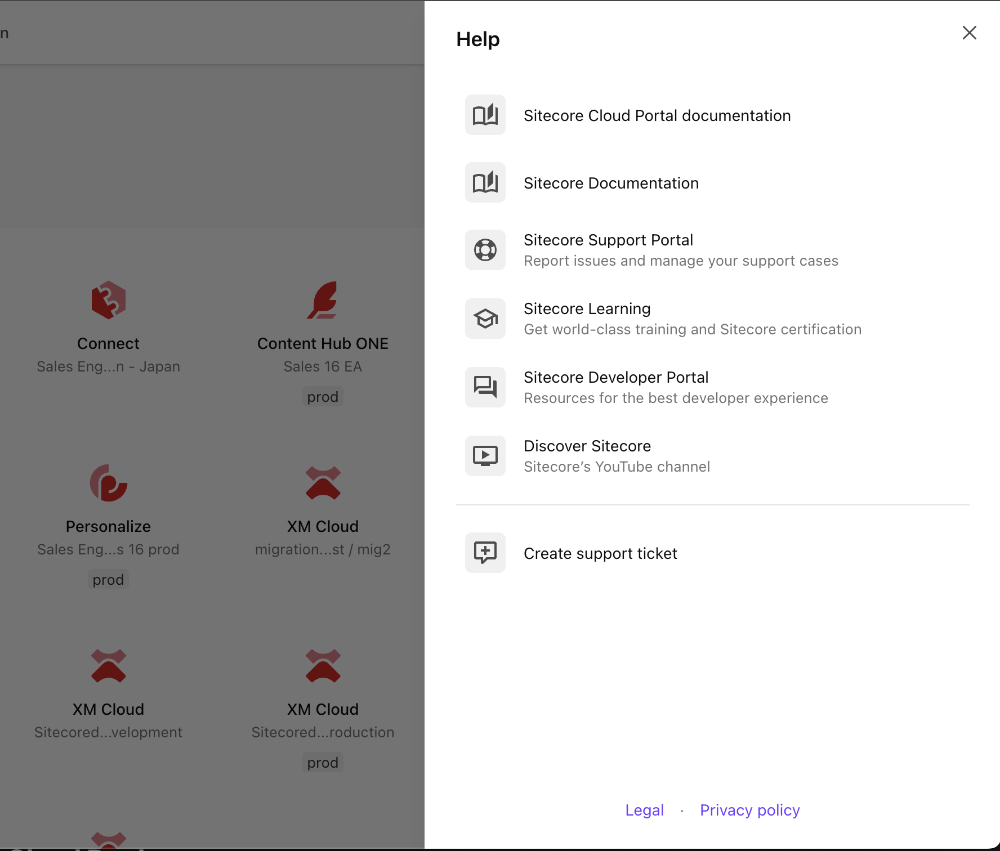
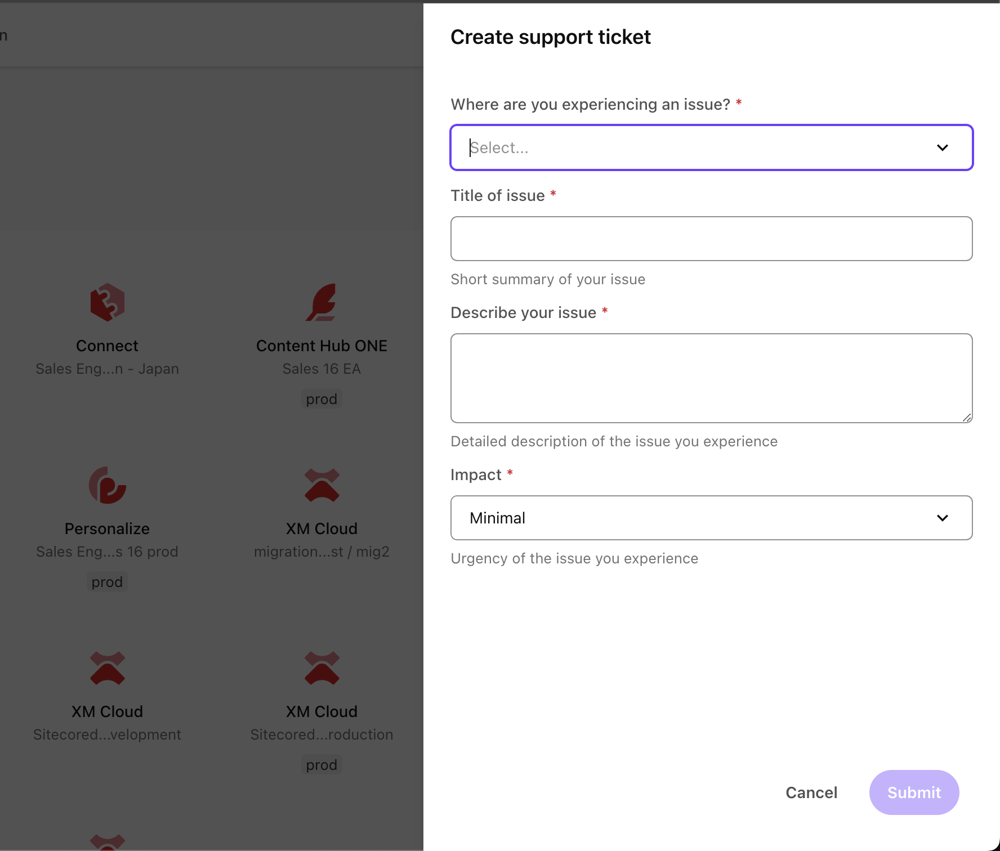
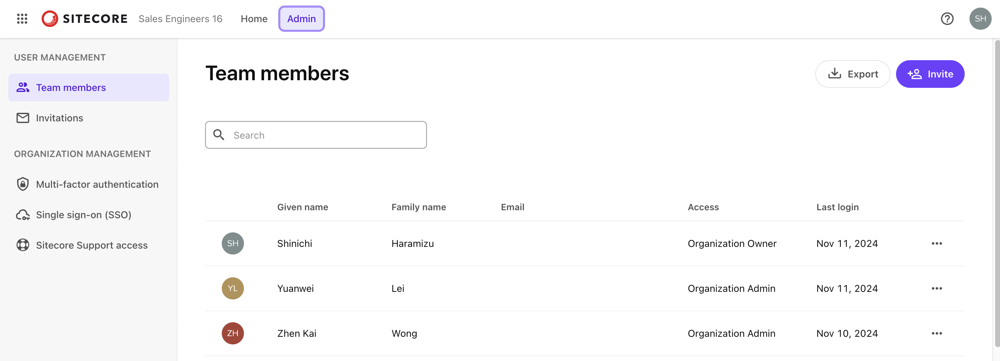
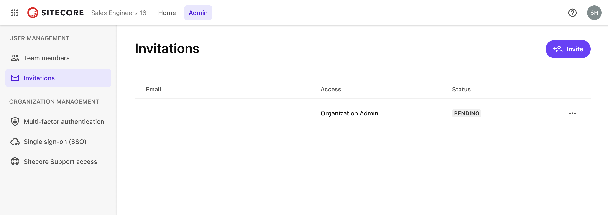
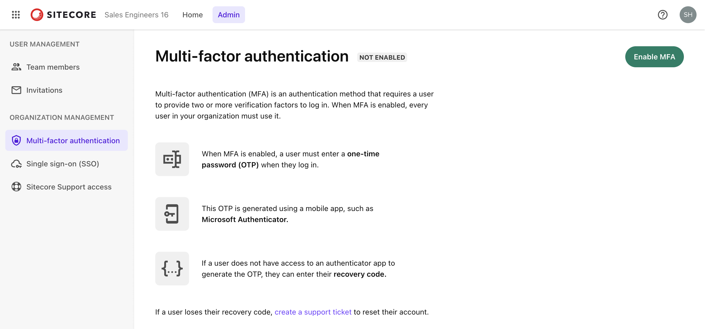

import { LinkCard } from '@astrojs/starlight/components';

The Sitecore Cloud Portal is a portal site for using Sitecore's SaaS products. Through this portal, you can configure and manage SaaS products. This section explains the role and basic functions of the Sitecore Cloud Portal.

## Introducing Sitecore Cloud Portal

The Sitecore Cloud Portal, provided as the first access point for Sitecore's SaaS products, is an integrated portal that allows access to all contracted SaaS products. Through this portal, users can centrally configure and manage various SaaS products. Upon logging in, a dashboard of the contracted SaaS products is displayed, allowing easy access to usage and configuration options for each product. This enables efficient management and operation of multiple products.

The following products can be used through the portal:

- Sitecore XM Cloud
- Sitecore Content Hub ONE
- Sitecore CDP
- Sitecore Personalize
- Sitecore Send
- Sitecore OrderCloud

Additionally, when you contract Sitecore XM Cloud, a tool called XM Cloud Deploy is added. This tool allows you to launch CMS instances.

Next, we will introduce the terms you need to understand when using the Sitecore Cloud Portal.

### Organization

The largest organizational unit when using the Sitecore Cloud Portal is referred to as an Organization. The logos of the contracted SaaS products are displayed in a list for this Organization. For example, the following screen shows all the tools assigned to the Organization named Sales Engineers 16.

For products provided in both production and non-production environments, `prod` is displayed under the icon for the production environment.

You can belong to multiple Organizations. When logged in with an account that belongs to multiple Organizations, you can switch Organizations by clicking the icon in the upper left corner.

### Team Members

Team members refer to users who are part of an organization. The apps they can access and the tasks they can perform are determined by their roles within the organization and the app. These settings will be introduced in another topic.

## Quick Links

When you access the Sitecore Cloud Portal, Quick Links are displayed on the right side. Let's check each item displayed.

### XM Cloud Deploy

This menu item is displayed only when you contract Sitecore XM Cloud. Clicking this menu takes you to the XM Cloud Deploy site, where you can check information about new and existing instances. This tool will be introduced in another article.

### Invite Team Members

Clicking this link displays a popup from the right side for adding users. The following screen appears when clicked.

From here, you can add email addresses (multiple addresses can be set simultaneously) and configure permissions for users. Administrators can use this item to quickly add users.

### Help

Help provides a list of links to official documentation. It is a convenient link collection for quickly accessing official procedures when needed.

### Create Support Ticket

Clicking this item displays a contact form. From this screen, you can contact Sitecore support, and you will receive an inquiry number and other details via email immediately after registration. All subsequent interactions with support will be conducted via email. If you encounter issues such as configuration problems or malfunctions, you can contact support from here.

## Admin Panel

The top menu of the Sitecore Cloud Portal includes an Admin item. Clicking this allows access to screens for user management and Sitecore Cloud Portal settings.

Let's check each item.

### Team Member

This screen allows you to view information about users in the currently accessed Organization. Clicking the `Export` button in the upper right allows you to obtain information about all registered users in CSV format.

The `Invite` button in the upper right allows you to add users, similar to the `Invite team members` provided in Quick Links.

### Invitations

This screen allows you to check the status of already sent invitation emails. For example, the following screen shows that an invitation email has been sent to Shota but has not yet been responded to, indicated as `Pending`.

### Organization Management

This item includes options that administrators can check for the Sitecore Cloud Portal Organization. For example, the Sitecore Cloud Portal provides a multi-factor authentication (MFA) mechanism, which can be enabled for user login.

Additionally, there are items for enabling single sign-on (SSO) for the Sitecore Cloud Portal. SSO settings are introduced in [another topic](/en/cloud-portal/sso/). Please refer to that for details.

## Summary

This time, we introduced the functions available when accessing the Sitecore Cloud Portal. Accessing this portal is the first step, and you will use this portal to access the tools you want to use daily.

## References

<LinkCard
  title="Introduction to the Sitecore Cloud Portal"
  href="https://doc.sitecore.com/portal/en/developers/sitecore-cloud-portal/introduction-to-the-sitecore-cloud-portal.html"
  target="_blank"
/>
<LinkCard
  title="Switch your organization"
  href="https://doc.sitecore.com/portal/en/developers/sitecore-cloud-portal/switch-your-organization.html"
  target="_blank"
/>
<LinkCard
  title="Sitecore Cloud Portal terminology"
  href="https://doc.sitecore.com/portal/en/developers/sitecore-cloud-portal/sitecore-cloud-portal-terminology.html"
  target="_blank"
/>

