import { LinkCard } from '@astrojs/starlight/components';

Sitecore Cloud Portal supports SSO, and if you have Owner or Admin privileges, you can configure it. This document introduces integration with Entra ID and Auth0.

## About SSO Configuration

Access the Sitecore Cloud Portal, open the Admin menu, and click Single sign-on (SSO) on the left side to open the SSO configuration screen as shown below.

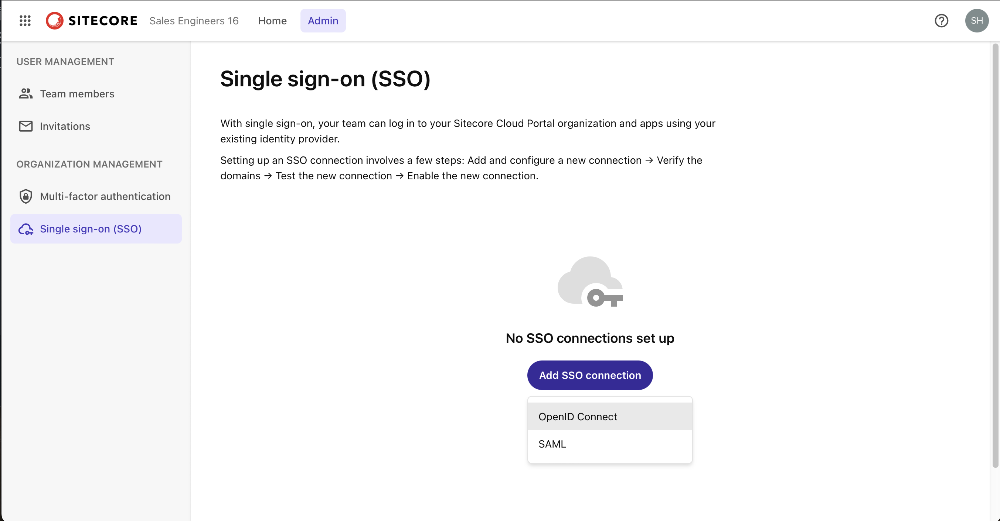

Sitecore Cloud Portal supports ID providers using the OpenID Connect (OIDC) protocol or the Security Assertion Markup Language (SAML) protocol. Organizations can have up to 5 SSO connections, each supporting up to 50 domains.

## Microsoft Entra ID

### Adding a Domain

Set up a connection with Microsoft Entra ID (formerly Azure Active Directory) using SAML. If nothing is configured, click the Add SSO Connection button displayed on the screen. A screen to enter the domain will appear.

When you enter the domain, the items for configuring SAML authentication will be displayed as shown below.

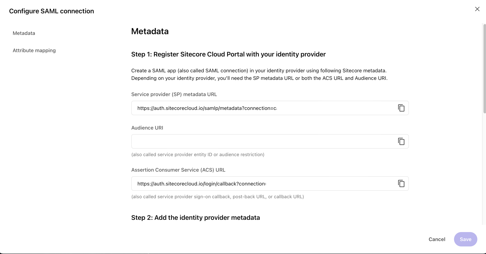

The above items will be used later in the Entra ID management screen. Once you close this screen, the configuration screen will be displayed as shown below.

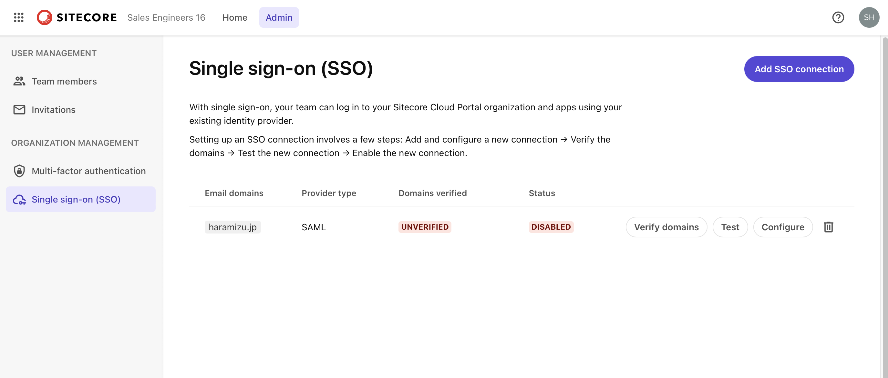

You can refer to the configuration values at any time by clicking the `Configure` button on the list screen.

Before moving to the Entra ID settings, proceed with domain verification. This setting requires DNS configuration permissions. Click the Verify domains button to display the information for adding records to DNS.

When setting this value in DNS, make sure the string is recognized as a TXT record in the format TXT @ above string. After reflecting it in the DNS record, click Verify Domain to complete the domain verification as shown below.

At this stage, you cannot perform other tasks, so click the Close button.

This completes the initial setup on the Sitecore Cloud Portal side.

### Preparing the Entra ID Environment

To proceed with the configuration, obtain various parameters from Microsoft Entra ID and fill in the above items. First, access the [Microsoft Entra Admin Center](https://entra.microsoft.com/).

Select Applications - Enterprise Applications from the menu on the left.

Click + New Application displayed on the screen, and then click Create your own application on the screen below.

Name the application Sitecore Cloud Portal and create it.

After a while, the application will be created as shown below.

Next, select Single sign-on from the menu. The screen for selecting the single sign-on to configure will be displayed as shown below.

This time, to add SAML authentication, click the button on the top right. The screen will switch as shown below.

In the basic SAML configuration items, there are two required items. These items are provided by Sitecore Cloud Portal. Set the Identifier and ACS URL items as shown below (the values are masked in the screen below).

After saving, a dialog will appear asking if you want to run the test, but we will not do this for now.

Finally, add the users who can use this application by clicking Users and groups from the menu on the left. The result of adding is shown below.

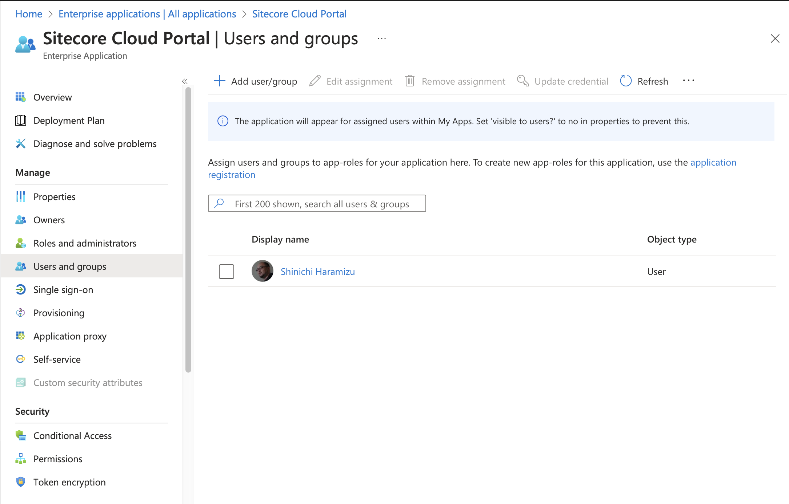

This completes the settings on the Entra ID side.

### Additional Settings on Sitecore Cloud Portal

The settings on Entra ID are complete, and we return to the settings on the Sitecore Cloud Portal side. First, display the configuration screen where domain verification is complete.

Click the `Configure` button, and in Step 2, there is an item to configure the metadata.

The data to be set here can be obtained from the Entra ID management screen. In the single sign-on configuration screen that is already set, there is an item called Federation Metadata XML, and clicking here will download the XML data (screen below).

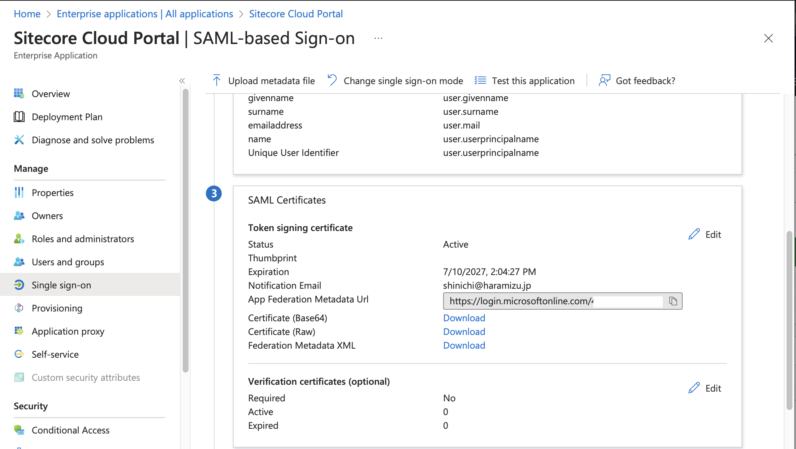

By setting the XML data obtained here in Step 2 and saving it, the configuration is complete.

### Sign-in Test

Click the Test button on the configuration screen. The Start test button will be displayed as shown below.

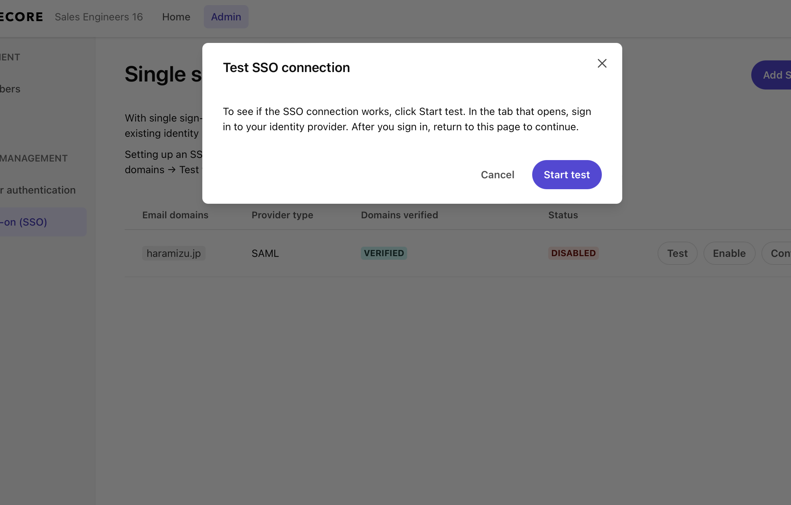

Use the account to be tested this time to execute the login test. If you successfully log in with the account specified in Entra ID's Users and groups, the screen below will be displayed.

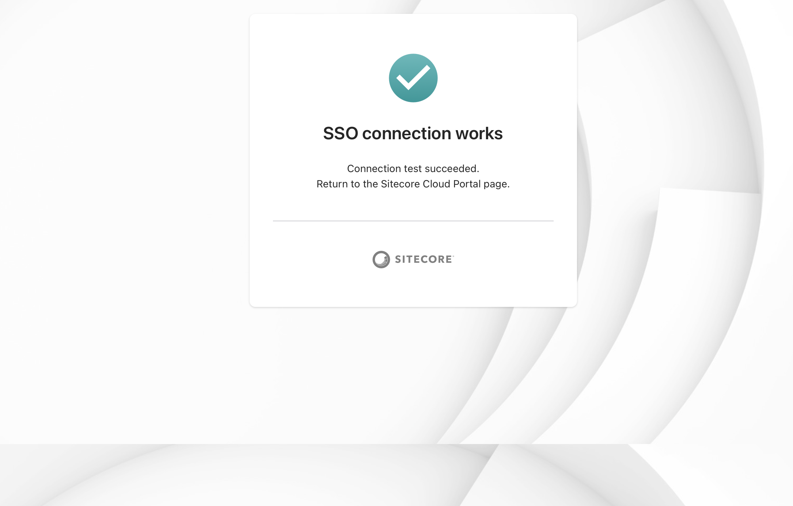

Now you can log in. Click the Enable SSO Connection button to enable the SSO configuration.

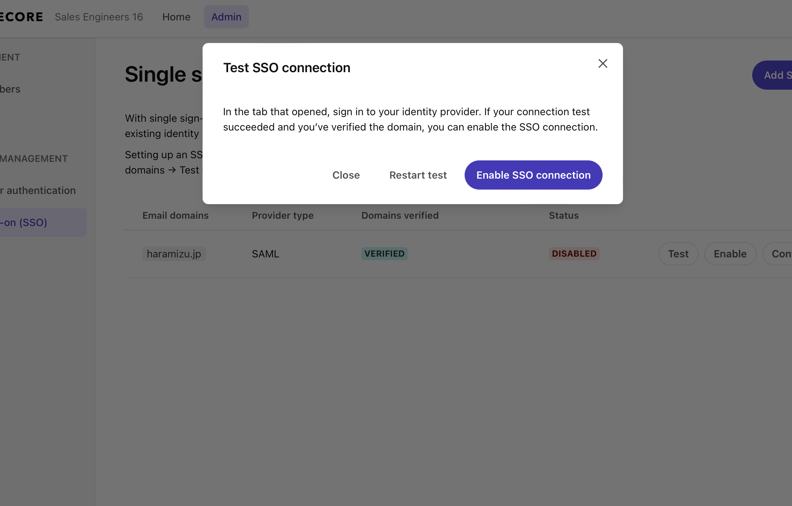

If it is enabled as shown below, the SSO configuration is complete.

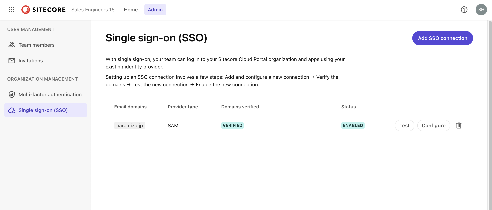

### Checking Login Status

You can obtain information about logging in with SSO from the Entra ID side. First, access the Microsoft Entra Admin Center and select the application you configured this time. The application has a sign-in log item.

After signing in to the Sitecore Cloud Portal with the corresponding account in SSO using the browser's private mode, you can check the logs to see if they have increased.

You can refer to the details of the latest sign-in by clicking the corresponding record.

The retention period for Entra ID sign-in data is described on the following page:

<LinkCard
  title="Microsoft Entra Data Retention"
  href="https://learn.microsoft.com/en-us/entra/identity/monitoring-health/reference-reports-data-retention#how-long-does-microsoft-entra-id-store-the-data"
  target="_blank"
/>

Data is retained for 30 days, and by storing that data in storage, it is possible to retain data for a longer period.

## Auth0

For SSO integration with Auth0, we introduce the procedure to connect using OpenID Connect.

### Auth0 Configuration

This time, we will use the evaluation version (free) of Auth0 to proceed with the configuration. First, create a test user who can log in and the organization to which they belong.

- Create an Organization
- Create a user who can log in under User Management - Users
- Assign the created user to the created Organization

Next, add an application. Select Applications - Applications from the menu on the left. This time, it is displayed as shown below.

Click the `Create application` button on the top right and set the application name.

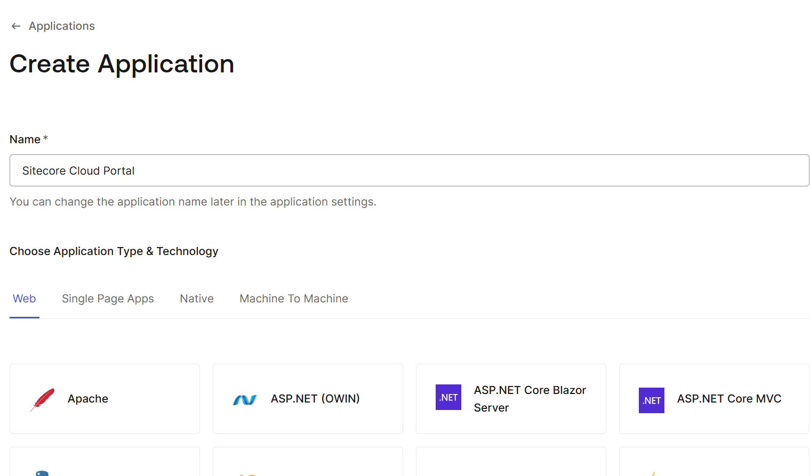

Click the Continue button to create the application. The necessary settings are as follows:

- Domain and Client ID are required for Sitecore Cloud Portal configuration
- Set Application Type to Regular Web Application
- Set `https://auth.sitecorecloud.io/login/callback` in the Allowed Callback URLs item

This completes the initial preparation for Auth0.

### Work on Sitecore Cloud Portal

Next, proceed with the configuration on the Sitecore Cloud Portal side. As before, select Single sign-on (SSO) from the Admin menu on the left.

Open the OpenID Connection configuration for SSO, and the screen will switch as shown below.

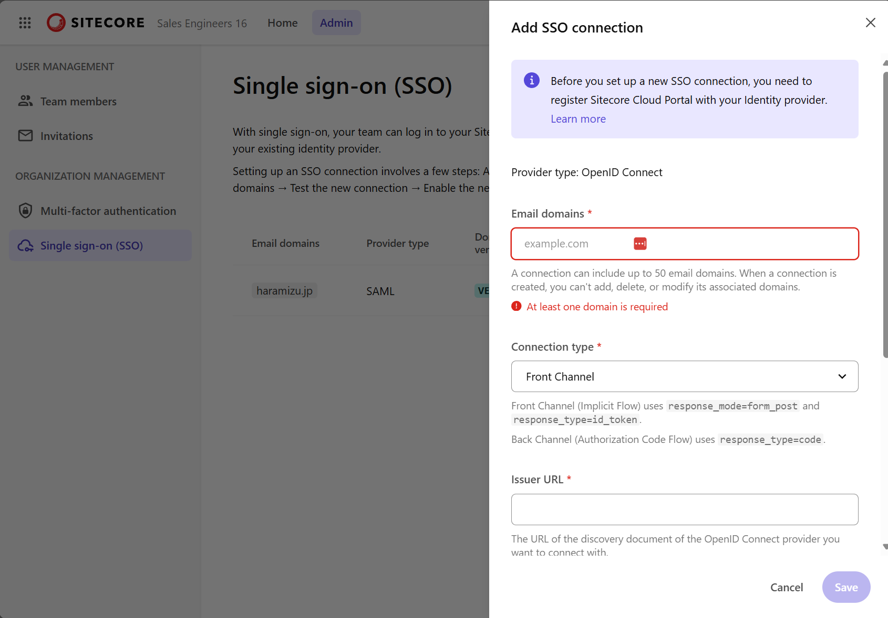

Set the following three items here:

- Email domains
- Set the Issuer URL using the domain name used by Auth0 in the format `https://your-tenant.auth0.com/.well-known/openid-configuration`
- Obtain and set the Client ID

After saving, the domain verification screen will be displayed.

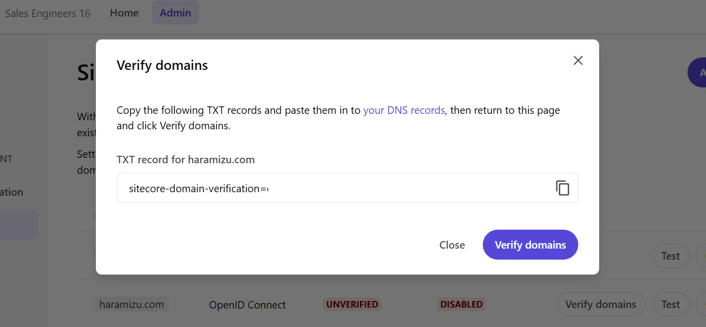

Implement the displayed key as a DNS text record and complete the domain verification. Below is an example of adding a DNS record using GoDaddy's service.

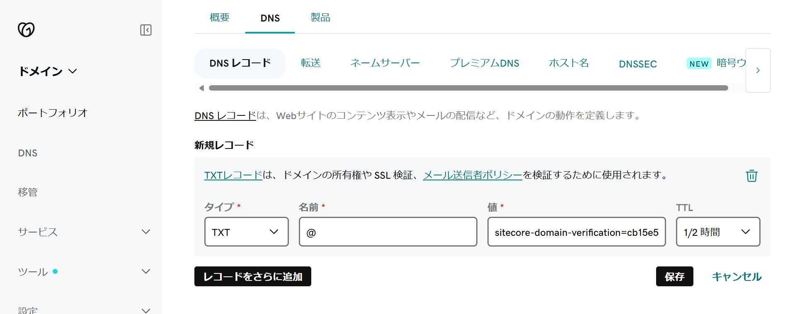

After the key is reflected, the dialog will switch as shown below after verification is complete.

Next, execute Test SSO Connection. Clicking this button will display the Auth0 login screen as shown below.

If you successfully log in, the screen below will be displayed.

Confirm that it is successful, and click the Enable SSO connection button to enable it. The screen will change as shown below.

Click the Enable Now button to proceed with the SSO configuration, and the setting icon will rotate.

After a while, if it is displayed as shown below, the SSO configuration is complete.

### Adding Users for the Domain

This time, since the explanation of the work is shorter than for Entra ID, we will add users. First, add the email address of the user to be invited.

An email will be sent to the corresponding email address.

Clicking it will move to the website and confirm that you are invited.

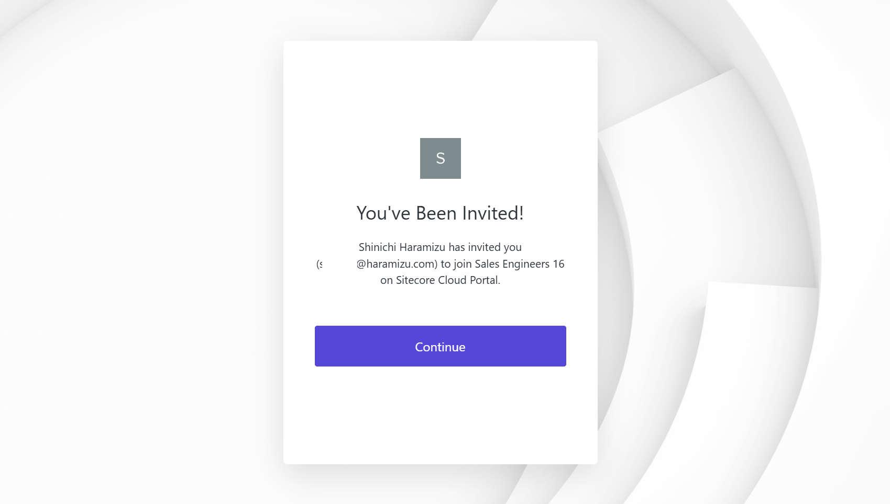

Successfully logged in with the Auth0 account.

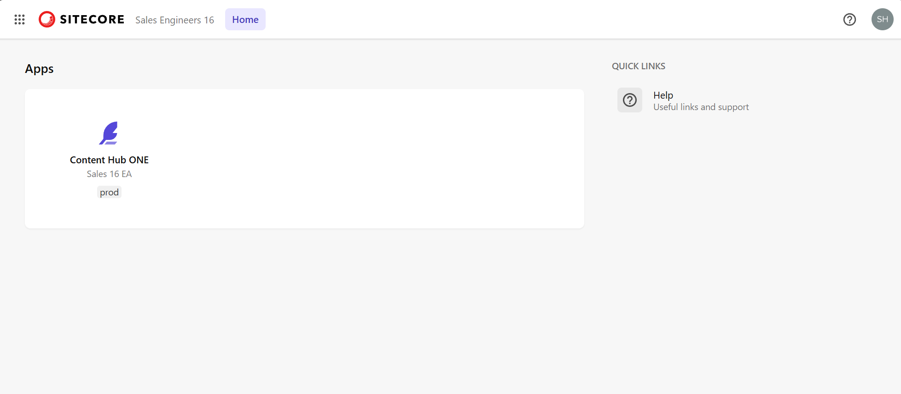

## Summary

We configured SAML authentication to log in with Microsoft Entra (formerly Active Directory) and Auth0. If you support these two authentications, you can integrate with many authentication services.

Both require domain verification with DNS and mutual configuration of necessary values between services, but once set up, user management can be done on the authentication side, so it is desirable to use SSO as much as possible.

## References

<LinkCard
  title="Sitecore authentication"
  href="https://doc.sitecore.com/portal/en/developers/sitecore-cloud-portal/sitecore-authentication.html"
  target="_blank"
/>
<LinkCard
  title="Single sign-on (SSO)"
  href="https://doc.sitecore.com/portal/en/developers/sitecore-cloud-portal/single-sign-on--sso-.html"
  target="_blank"
/>
<LinkCard
  title="Configuring OpenID Connect (OIDC)"
  href="https://doc.sitecore.com/portal/en/developers/sitecore-cloud-portal/configuring-openid-connect--oidc-.html"
  target="_blank"
/>
<LinkCard
  title="Configuring SAML single sign-on"
  href="https://doc.sitecore.com/portal/en/developers/sitecore-cloud-portal/configuring-saml-single-sign-on.html"
  target="_blank"
/>

