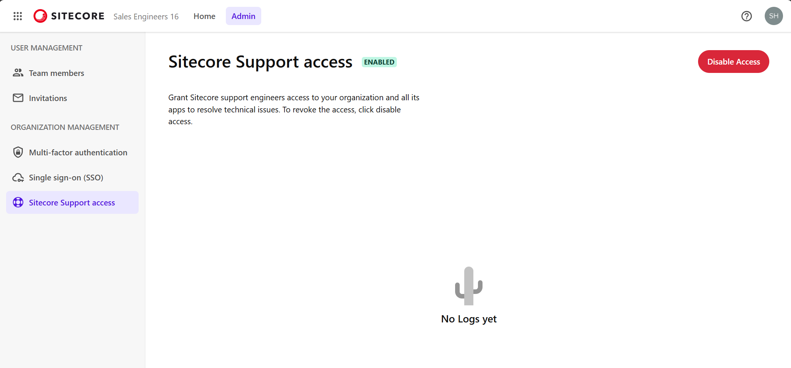

import { LinkCard } from '@astrojs/starlight/components';

Allow Sitecore support engineers to access your organization and all apps to resolve technical issues. To revoke access, click "Disable Access."

## Sitecore Support Access

This feature can be managed by Owners or Admins in the Sitecore Cloud Portal. By default, it is disabled when you open the management screen.

Click the button in the top right corner to enable support access.

This feature can be enabled or disabled at any time, so enable it when technical investigation by support is needed and create a support ticket.

## Reference Information

<LinkCard
  title="Manage Sitecore Support access"
  href="https://doc.sitecore.com/portal/en/developers/sitecore-cloud-portal/manage-sitecore-support-access.html"
  target="_blank"
/>
<LinkCard
  title="Create a support case"
  href="https://doc.sitecore.com/portal/en/developers/sitecore-cloud-portal/create-a-support-case.html"
  target="_blank"
/>

