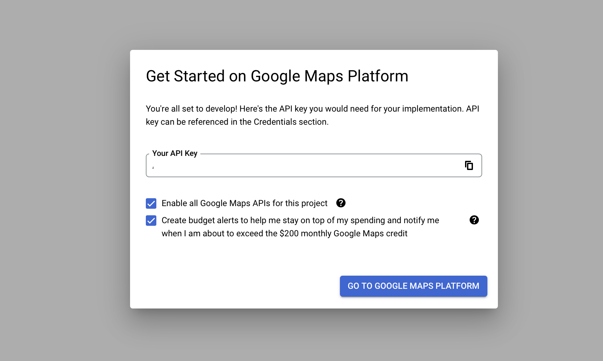
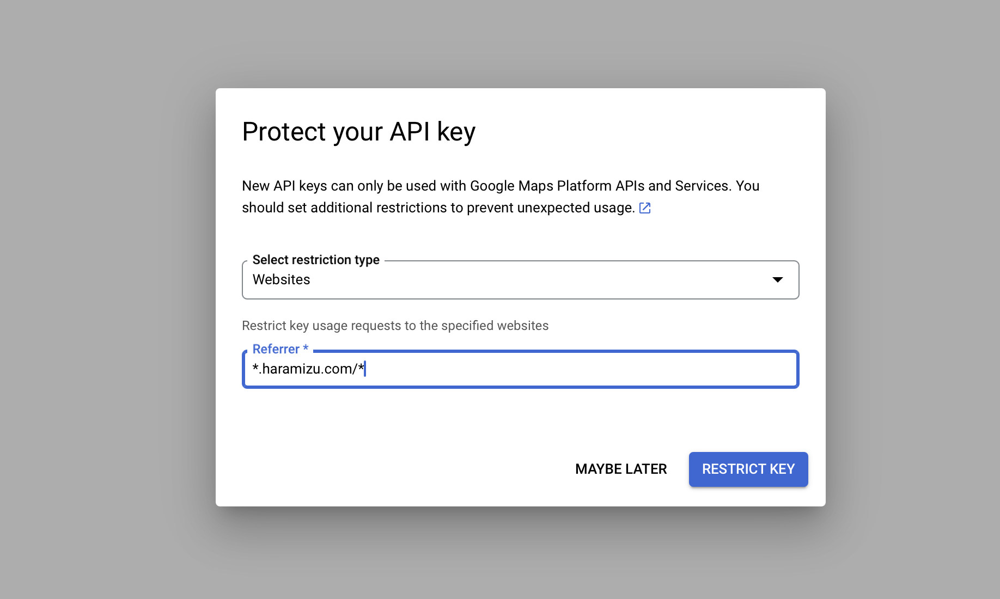
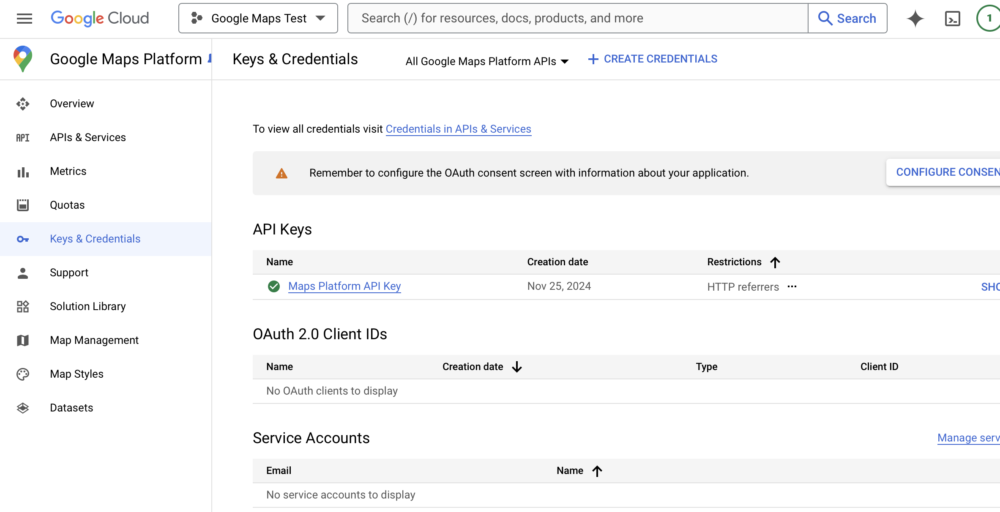
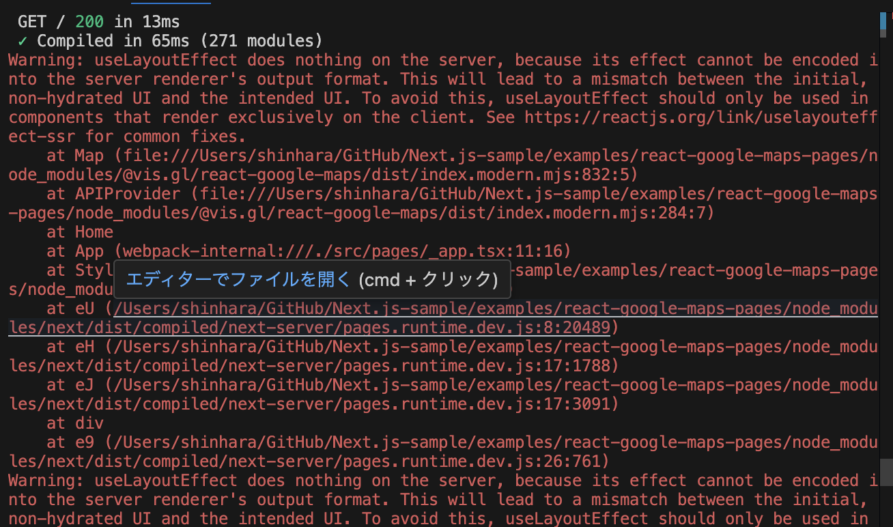
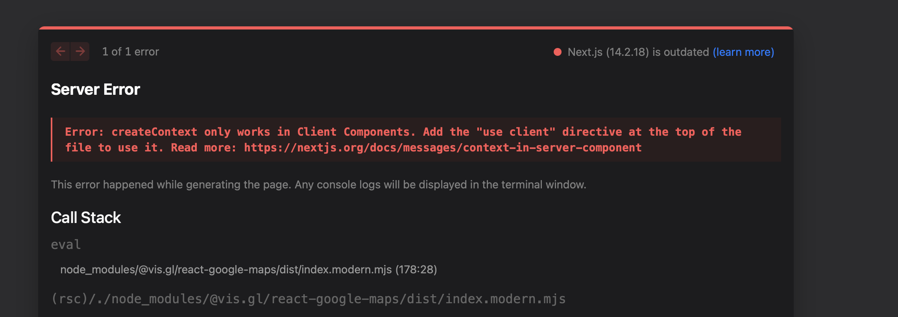

import { Steps, LinkCard } from '@astrojs/starlight/components';

Google released a React library for Google Maps Platform on May 21, 2024.

<LinkCard
  title="Google Maps Platform Graduates React Integration Library to 1.0"
  href="https://mapsplatform.google.com/resources/blog/google-maps-platform-graduates-react-integration-library-to-1-0/"
  target="_blank"
/>

By using this react-google-maps, it becomes easy to use Google Maps on your website. This time, we will check how to use this library with Next.js.

## Obtaining a Google Maps API Key

To use Google Maps, you need to obtain an API key. Basically, you need to subscribe to a paid plan to use the Google Maps API key, but you can use it for free up to $200 per month. This amount is sufficient for verification and testing.

<LinkCard
  title="Google Maps Pricing"
  href="https://mapsplatform.google.com/intl/pricing/"
  target="_blank"
/>

As a prerequisite for obtaining an API key, you need to already have a Google Cloud developer account. After ensuring you can access the developer site, proceed with the following steps.

Access the following site with administrator privileges.

<LinkCard
  title="Google Maps Platform"
  href="https://console.cloud.google.com/google/maps-apis/home"
  target="_blank"
/>


Create a new project.


Switch to the created project, and the API key will be displayed as shown below. We will use this key this time.



Next, a dialog will be displayed to confirm the purpose of using this API key. Select `Website` this time, and for the Referrer, target your own domain.



The screen will change, but click Skip now in the upper right corner to skip the remaining steps. The screen will change as follows.


You can obtain the key again by clicking the `Keys & Credentials` menu on the left side of this screen.



Click Edit API Key on the far right menu of the relevant key to display the API key settings. Since it needs to work locally this time, add http://localhost:3000/\* to `Website restrictions`.


Now the preparation is complete.

## Pages Router

Let's enable the use of Google Maps in a Next.js Pages Router project.

### Running the Sample

<Steps>

1. Create a Next.js project

   First, create a base Next.js project.

   ```bash
   npx create-next-app@14.2.18
   ```

   - **Typescript**: Yes
   - **ESLint**: Yes
   - **Tailwind CSS**: Yes
   - **src/ directory**: Yes
   - **App Router**: No
   - **Import alias**: No

   It will look like this.

   

   Now a new Next.js project has been created.

2. Install the Google Maps package

   Add the React Google Maps package to the project.

   ```bash
   npm install @vis.gl/react-google-maps
   ```

3. Set up the API

   Since the Google Maps API key is already prepared, prepare the `.env` file to hold the environment variable as follows.

   ```text Title=".env"
   NEXT_PUBLIC_GOOGLE_MAPS_API_KEY=<your API key here>
   ```

4. Change to the sample code

   Rewrite the code of the top page as follows.

   ```tsx
   // src/pages/index.tsx
   import { APIProvider, Map } from '@vis.gl/react-google-maps';

   export default function Home() {
     return (
       <APIProvider apiKey={process.env.NEXT_PUBLIC_GOOGLE_MAPS_API_KEY as string}>
         <Map
           style={{ width: '100vw', height: '100vh' }}
           defaultCenter={{ lat: 35.682839, lng: 139.759455 }}
           defaultZoom={10}
           gestureHandling={'greedy'}
           disableDefaultUI={true}
         />
       </APIProvider>
     );
   }
   ```

5. Run

   Start the sample with the following command.

   ```bash
   npm run dev
   ```

</Steps>

As a result, the maps was displayed as follows.


### Error Handling

When running the above code, the following error is actually displayed.



This error occurs because useLayoutEffect is being used in a server-side rendering (SSR) environment. useLayoutEffect is a hook that only works on the client side and has no effect on the server side.

Therefore, add the following code.

```diff lang="tsx"
// src/pages/index.tsx
+import { useEffect, useState } from "react";
import { APIProvider, Map } from "@vis.gl/react-google-maps";

export default function Home() {
+  const [isClient, setIsClient] = useState(false);
+
+  useEffect(() => {
+    setIsClient(true);
+  }, []);

+  if (!isClient) {
+    return null;
+  }

  return (
   <APIProvider apiKey={process.env.NEXT_PUBLIC_GOOGLE_MAPS_API_KEY as string}>
    <Map
      style={{ width: "100vw", height: "100vh" }}
      defaultCenter={{ lat: 35.682839, lng: 139.759455 }}
      defaultZoom={10}
      gestureHandling={"greedy"}
      disableDefaultUI={true}
    />
   </APIProvider>
  );
}
```

Now, the error is no longer displayed.

You can find the sample code below.

<LinkCard
  title="haramizu / Next.js-sample - React Google Maps Pages Router"
  href="https://github.com/haramizu/Next.js-sample/tree/main/examples/react-google-maps-pages"
  target="_blank"
/>

## App Router

Let's enable the use of Google Maps in a Next.js App Router project.

### Running the Sample

<Steps>

1. Create a Next.js project

   First, create a base Next.js project.

   ```bash
   npx create-next-app@14.2.18
   ```

   - **Typescript**: Yes
   - **ESLint**: Yes
   - **Tailwind CSS**: Yes
   - **src/ directory**: Yes
   - **App Router**: Yes
   - **Import alias**: No

   It will look like this.

   

   Now a new Next.js project has been created.

2. Install the Google Maps package

   Add the React Google Maps package to the project.

   ```bash
   npm install @vis.gl/react-google-maps
   ```

3. Set up the API

   Since the Google Maps API key is already prepared, prepare the `.env` file to hold the environment variable as follows.

   ```text Title=".env"
   NEXT_PUBLIC_GOOGLE_MAPS_API_KEY=<your API key here>
   ```

4. Change to the sample code

   Rewrite the code of the top page as follows.

   ```tsx
   // src/app/page.tsx
   import { APIProvider, Map } from '@vis.gl/react-google-maps';

   export default function Home() {
     return (
       <APIProvider apiKey={process.env.NEXT_PUBLIC_GOOGLE_MAPS_API_KEY as string}>
         <Map
           style={{ width: '100vw', height: '100vh' }}
           defaultCenter={{ lat: 35.682839, lng: 139.759455 }}
           defaultZoom={10}
           gestureHandling={'greedy'}
           disableDefaultUI={true}
         />
       </APIProvider>
     );
   }
   ```

5. This time, an error will be displayed. The screen will look like this.

   

   As with the Pages Router, add the following code to make it work on the client side.

   ```diff lang="tsx"
   // src/app/page.tsx
   +"use client";

   import { APIProvider, Map } from "@vis.gl/react-google-maps";

   export default function Home() {
     return (
      <APIProvider apiKey={process.env.NEXT_PUBLIC_GOOGLE_MAPS_API_KEY as string}>
       <Map
         style={{ width: "100vw", height: "100vh" }}
         defaultCenter={{ lat: 35.682839, lng: 139.759455 }}
         defaultZoom={10}
         gestureHandling={"greedy"}
         disableDefaultUI={true}
       />
      </APIProvider>
     );
   }
   ```

</Steps>

The same result as the Pages Router will be displayed.


You can find the sample code below.

<LinkCard
  title="haramizu / Next.js-sample - React Google Maps App Router"
  href="https://github.com/haramizu/Next.js-sample/tree/main/examples/react-google-maps-app"
  target="_blank"
/>

## Summary

This time, I created a sample to use the new React Google Maps library with Next.js. It is a form of pure Next.js operation check, but I think it is convenient in terms of preparing an environment that works.

## References

<LinkCard
  title="Get Started"
  href="https://visgl.github.io/react-google-maps/docs/get-started"
  target="_blank"
/>
<LinkCard
  title="haramizu / Next.js-sample - React Google Maps Pages Router"
  href="https://github.com/haramizu/Next.js-sample/tree/main/examples/react-google-maps-pages"
  target="_blank"
/>
<LinkCard
  title="haramizu / Next.js-sample - React Google Maps App Router"
  href="https://github.com/haramizu/Next.js-sample/tree/main/examples/react-google-maps-app"
  target="_blank"
/>

