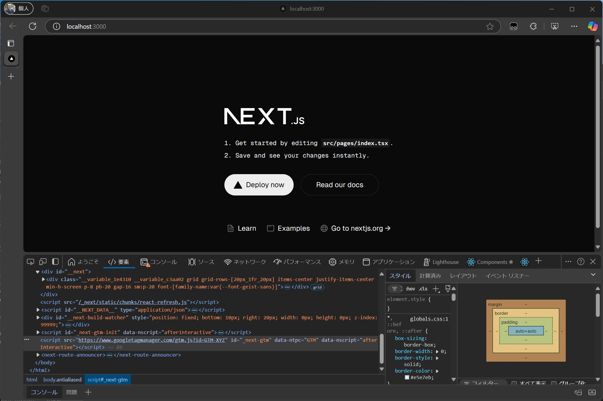
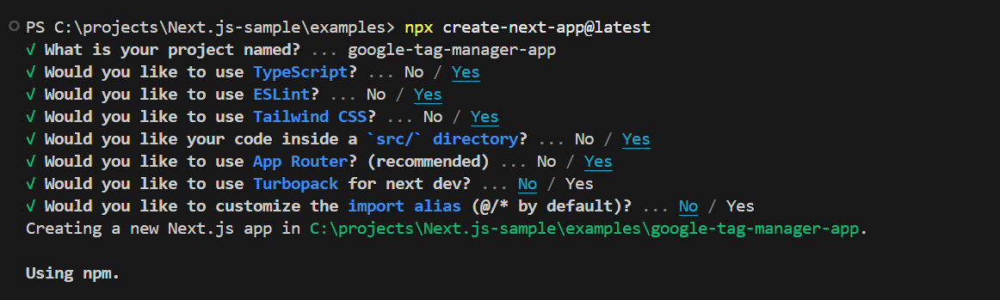
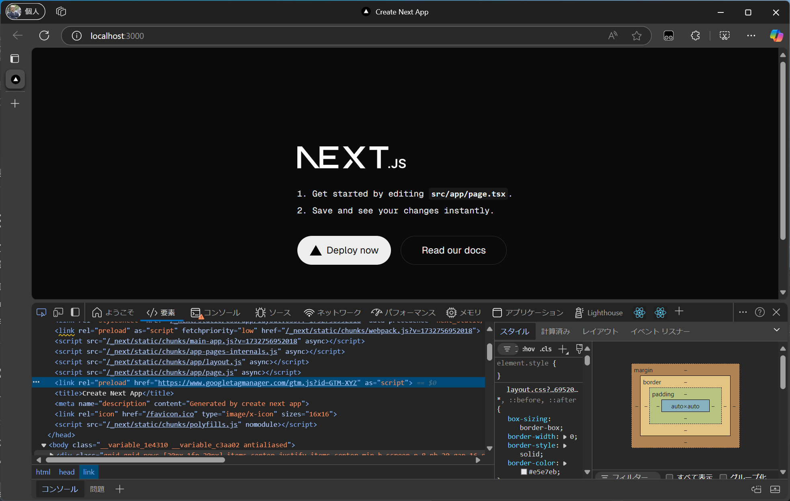

import { Steps, LinkCard } from '@astrojs/starlight/components';

When running a website, it is essential to utilize various tools. Applying these tools often requires adding meta data or JavaScript to the site. While it is possible to manage this using a CMS, using a versatile tool like Google Tag Manager allows for more flexible and efficient operations.

This document outlines the steps to apply Google Tag Manager to a Next.js project.

## Next.js Pages Router

Here, we introduce a sample using the Next.js Page Router. For the latest information, please refer to the Next.js official site.

<LinkCard
  title="Third Party Libraries - Google Tag Manager - Pages Router"
  href="https://nextjs.org/docs/pages/building-your-application/optimizing/third-party-libraries#google-tag-manager"
  target="_blank"
/>

Let's create a sample project.

<Steps>

1. Create a Next.js project.

   ```bash
   npx create-next-app@latest
   ```

   Answer the prompts to create a Pages Router project as shown below.

   

2. Next, install the package `@next/third-parties@latest`.

   ```bash
   npm install @next/third-parties@latest
   ```

3. Add code to `/pages/_app.tsx` to make it available globally.

   ```tsx {4,7-10}
   // /pages/_app.tsx
   import '@/styles/globals.css';
   import type { AppProps } from 'next/app';
   import { GoogleTagManager } from '@next/third-parties/google';

   export default function App({ Component, pageProps }: AppProps) {
     return (
       <>
         <Component {...pageProps} />
         <GoogleTagManager gtmId="GTM-XYZ" />
       </>
     );
   }
   ```

4. When you start the project, you can confirm that the Google Tag Manager code has been added.

   

5. To manage the GTM key using environment variables, create a `.env.local` file and write the following:

   ```text
   // /.env.local
   NEXT_PUBLIC_GOOGLE_TAG_MANAGER=<your API key here>
   ```

6. To load the key written in `.env.local`, modify the following file:

   ```tsx {5}
   // /pages/_app.tsx
   export default function App({ Component, pageProps }: AppProps) {
     return <>
      <Component {...pageProps} />
      <GoogleTagManager gtmId={process.env.NEXT_PUBLIC_GOOGLE_TAG_MANAGER || ""} />
    </>
   ```

</Steps>

The sample code introduced above can be referenced from the following repository.

<LinkCard
  title="haramizu / Next.js-sample - google-tag-manager-pages"
  href="https://github.com/haramizu/Next.js-sample/tree/main/examples/google-tag-manager-pages"
  target="_blank"
/>

## Next.js App Router

Here, we introduce a sample using the Next.js App Router. For the latest information, please refer to the Next.js official site.

<LinkCard
  title="Third Party Libraries - Google Tag Manager - App Router"
  href="https://nextjs.org/docs/app/building-your-application/optimizing/third-party-libraries#google-tag-manager"
  target="_blank"
/>

<Steps>

1. Create a Next.js project.

   ```bash
   npx create-next-app@latest
   ```

   Answer the prompts to create a Pages Router project as shown below.

   

2. Next, install the package `@next/third-parties@latest`.

   ```bash
   npm install @next/third-parties@latest
   ```

3. Add code to `/app/layout.tsx` to make it available globally.

   ```tsx {2,30}
   // /app/layout.tsx
   import { GoogleTagManager } from '@next/third-parties/google';
   import type { Metadata } from 'next';
   import localFont from 'next/font/local';
   import './globals.css';

   const geistSans = localFont({
     src: './fonts/GeistVF.woff',
     variable: '--font-geist-sans',
     weight: '100 900',
   });
   const geistMono = localFont({
     src: './fonts/GeistMonoVF.woff',
     variable: '--font-geist-mono',
     weight: '100 900',
   });

   export const metadata: Metadata = {
     title: 'Create Next App',
     description: 'Generated by create next app',
   };

   export default function RootLayout({
     children,
   }: Readonly<{
     children: React.ReactNode;
   }>) {
     return (
       <html lang="en">
         <GoogleTagManager gtmId="GTM-XYZ" />
         <body className={`${geistSans.variable} ${geistMono.variable} antialiased`}>
           {children}
         </body>
       </html>
     );
   }
   ```

4. When you start the project, you can confirm that the Google Tag Manager code has been added.

   

5. To manage the GTM key using environment variables, create a `.env.local` file and write the following:

   ```text
   // /.env.local
   NEXT_PUBLIC_GOOGLE_TAG_MANAGER=<your API key here>
   ```

6. To load the key written in `.env.local`, modify the following file:

   ```tsx {4}
   // /app/layout.tsx
   return (
     <html lang="en">
       <GoogleTagManager gtmId={process.env.NEXT_PUBLIC_GOOGLE_TAG_MANAGER || ""} />
       <body
         className={`${geistSans.variable} ${geistMono.variable} antialiased`}
       >
         {children}
   ```

</Steps>

The sample code introduced above can be referenced from the following repository.

<LinkCard
  title="haramizu / Next.js-sample - google-tag-manager-app"
  href="https://github.com/haramizu/Next.js-sample/tree/main/examples/google-tag-manager-app"
  target="_blank"
/>

## Other Implementations

Previously, I introduced the implementation of GTM in Next.js using a package called `react-gtm-module`.

<LinkCard
  title="react-gtm-module"
  href="https://www.npmjs.com/package/react-gtm-module"
  target="_blank"
/>

There are other packages available for integrating GTM, but the steps provided by Next.js are the simplest, so I will omit the details of other implementations.

## Summary

The implementation of Google Tag Manager is already provided in the official Next.js documentation. Please refer to the official steps in addition to this document.

## References

<LinkCard
  title="Third Party Libraries - Google Tag Manager - Pages Router"
  href="https://nextjs.org/docs/pages/building-your-application/optimizing/third-party-libraries#google-tag-manager"
  target="_blank"
/>
<LinkCard
  title="Third Party Libraries - Google Tag Manager - App Router"
  href="https://nextjs.org/docs/app/building-your-application/optimizing/third-party-libraries#google-tag-manager"
  target="_blank"
/>

