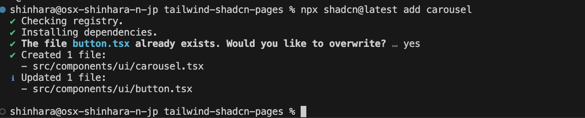

import { Steps, LinkCard } from '@astrojs/starlight/components';

In this document, we will evaluate the UI component library shadcn/ui, which has been gaining attention recently. shadcn/ui offers a wide range of customizable components and is not provided as an npm package, making it easy to use.

The main benefits are as follows:

- **Increased development speed**: Utilizing existing components can shorten UI development time.
- **Consistent design**: Following unified design guidelines ensures consistency across the entire application.
- **Ease of maintenance**: The component-based architecture enhances code reusability and simplifies maintenance.

In this document, we will evaluate its use as a Pages Router based on a Next.js project.

## Create a Project

First, let's create a Next.js project. Refer to the following page for the steps.

<LinkCard
  title="shadcn/ui - Instructions Next.js"
  href="https://ui.shadcn.com/docs/installation/next"
  target="_blank"
/>

Let's create the project right away.

<Steps>

1. Create a new Next.js project.

   - **Next.js**: 14.2.18
   - **TypeScript**: Yes
   - **Tailwind CSS**: Yes
   - **App Router**: No

   The created project is as follows.

   

2. Initialize for using shadcn

   ```bash
   npx shadcn@latest init
   ```

   During initialization, the following questions will be displayed. We will mostly answer with the default options.

   - **Style**: New York
   - **base color**: Neutral
   - **CSS variables**: yes

   

</Steps>

Check the files that have changed after initialization.

- New files **components.json** and `src/lib/utils.ts` added
- Multiple new packages added to **package.json**
  ```tsx {3-6,9-10}
  // package.json
    "dependencies": {
      "class-variance-authority": "^0.7.1",
      "clsx": "^2.1.1",
      "lucide-react": "^0.464.0",
      "next": "14.2.18",
      "react": "^18",
      "react-dom": "^18",
      "tailwind-merge": "^2.5.5",
      "tailwindcss-animate": "^1.0.7"
    },
  ```
- Update `tailwind.config.ts`
  - Add Darkmode
  - Update Colors
  - Add plugin (tailwindcss-animate)
- Update `globals.css`

Now we are ready.

## Add Components

Let's add some components right away.

### Button

Add the button as described in the installation steps.

```bash
npx shadcn@latest add button
```

Check the project updates as follows.

- Component file `src/components/ui/button.tsx` added
- Package `@radix-ui/react-slot` added

The component is now available. We updated the top page as follows.

```tsx
// src/pages/index.tsx
import { Button } from '@/components/ui/button';

export default function Home() {
  return (
    <div className="m-10">
      <main>
        <Button>Click me</Button>
      </main>
    </div>
  );
}
```

The button is now displayed.


For more detailed usage of the Button, refer to the following page.

<LinkCard
  title="shadcn/ui Button"
  href="https://ui.shadcn.com/docs/components/button"
  target="_blank"
/>

### Carousel

Next, let's add a Carousel, which is often used for practice when creating websites.

```bash
npx shadcn@latest add carousel
```

A question will be displayed asking if you want to overwrite button.tsx.



Select overwrite, and the project update will be completed. Check the changes as follows.

- Component file `src/components/ui/carousel.tsx` added
- Package `embla-carousel-react` added

shadcn/ui's Carousel uses `embla-carousel-react`. The official site of this package is as follows.

<LinkCard
  title="Embla Carousel - React"
  href="https://www.embla-carousel.com/get-started/react/"
  target="_blank"
/>

Place the created component on the top page as before.

```tsx
// src/pages/index.tsx
import { Button } from '@/components/ui/button';
import {
  Carousel,
  CarouselContent,
  CarouselItem,
  CarouselNext,
  CarouselPrevious,
} from '@/components/ui/carousel';

export default function Home() {
  return (
    <div>
      <main>
        <div className="m-20">
          <Carousel>
            <CarouselContent>
              <CarouselItem>Item 1</CarouselItem>
              <CarouselItem>Item 2</CarouselItem>
              <CarouselItem>Item 3</CarouselItem>
            </CarouselContent>
            <CarouselPrevious />
            <CarouselNext />
          </Carousel>
        </div>
        <div className="m-10">
          <Button>Click me</Button>
        </div>
      </main>
    </div>
  );
}
```

The actual operation is as follows.


For more detailed usage of the Carousel, refer to the following page.

<LinkCard
  title="shadcn/ui Carousel"
  href="https://ui.shadcn.com/docs/components/carousel"
  target="_blank"
/>

## Summary

This time, we introduced only Button and Carousel, but various UIs are available, making it easier to use components for your site.

The Next.js project introduced here is published in the following repository.

<LinkCard
  title="haramizu / Next.js sample - tailwind-shadcn-pages"
  href="https://github.com/haramizu/Next.js-sample/tree/main/examples/tailwind-shadcn-pages"
  target="_blank"
/>

## References

<LinkCard title="chadcn/ui" href="https://ui.shadcn.com/" target="_blank" />

<LinkCard
  title="shadcn/ui - Instructions Next.js"
  href="https://ui.shadcn.com/docs/installation/next"
  target="_blank"
/>

<LinkCard
  title="shadcn/ui Button"
  href="https://ui.shadcn.com/docs/components/button"
  target="_blank"
/>

<LinkCard
  title="shadcn/ui Carousel"
  href="https://ui.shadcn.com/docs/components/carousel"
  target="_blank"
/>

