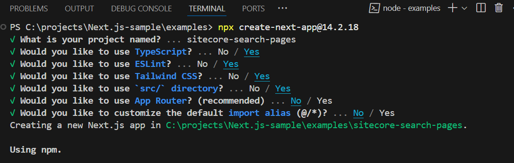
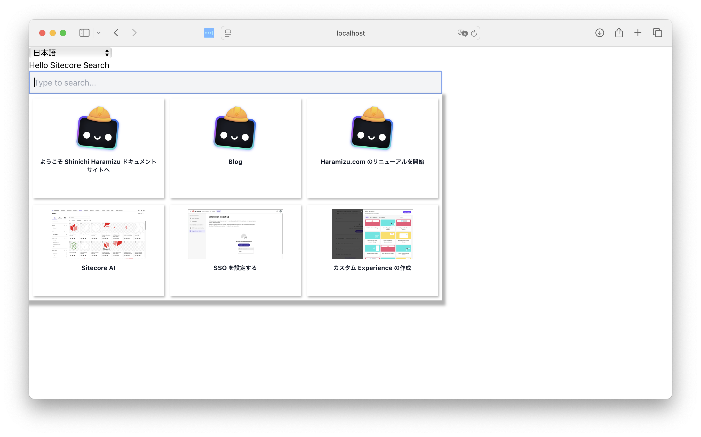
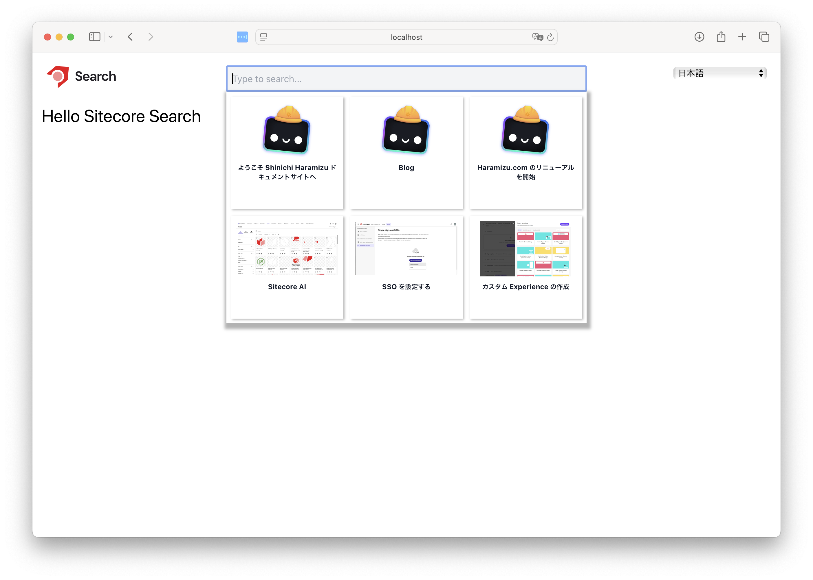
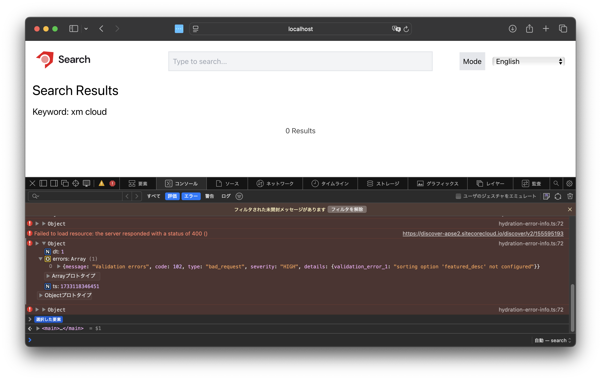
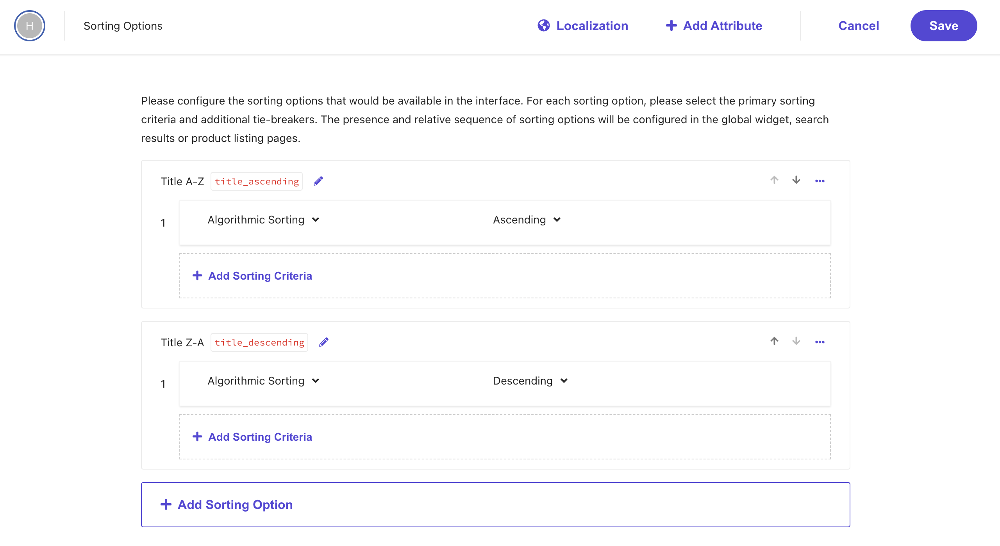
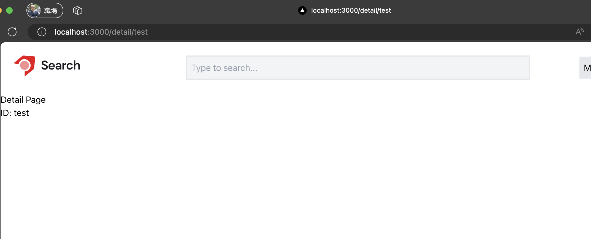

import { FileTree, Steps, LinkCard } from '@astrojs/starlight/components';

Here, we will build a sample of Sitecore Search from the initial setup of Next.js. Since XM Cloud's Headless SXA is currently provided based on the Next.js Pages Router, we will also create the sample here using the Pages router.

This time, we will create a search site for both Japanese and English content.

## Create a Next.js Project

This time, we will select version 14.2.18, which is as close as possible to the version of Next.js used by XM Cloud at the time of writing this document.

```bash
npx create-next-app@14.2.18
```



## Add Packages

Install the packages provided by the Sitecore Search SDK. The procedure for this is provided on the following pages.

<LinkCard
  title="Getting Started"
  href="https://developers.sitecorecloud.io/search-sdk/react/latest/storybook/index.html?path=/docs/introduction-getting-started--page"
  target="_blank"
/>
<LinkCard
  title="Install JS SDK and UI Components for React"
  href="https://doc.sitecore.com/search/en/developers/search-js-sdk-for-react/walkthrough--setting-up-the-react-project.html#install-js-sdk-and-ui-components-for-react"
  target="_blank"
/>
<LinkCard
  title="The basic preview search widget template"
  href="https://doc.sitecore.com/search/en/developers/search-js-sdk-for-react/the-basic-preview-search-widget-template.html"
  target="_blank"
/>

Refer to the documentation and proceed as follows.

<Steps>

1. Install the React package

   ```bash
   npm install --save @sitecore-search/react
   ```

2. Install the UI components package

   ```bash
   npm install --save @sitecore-search/ui
   ```

3. Add the package to create Widget components

   ```bash
   npm install --D @sitecore-search/cli
   ```

4. Create the .sc-search-settings.json file to define the folder where the Widget will be created

   ```json
   {
     "widgets-path": "src/widgets"
   }
   ```

5. Add the following command to the scripts in the package.json file.

   ```json {6}
   "scripts": {
     "dev": "next dev",
     "build": "next build",
     "start": "next start",
     "lint": "next lint",
     "create-widget": "sc-search new-widget"
   },
   ```

</Steps>

This completes the package settings required for Sitecore Search.

## Implement Language Switching

### Create a Language Switching Component

This sample will create a search service for English and Japanese content.

First, define the language definitions to be used on the site in the `src/data/locales.ts` file.

```ts
// src/data/locales.ts
export type Language = 'en' | 'ja';

export interface LanguageInfo {
  country: string;
  language: Language;
  label: string;
}

const languages: Record<Language, LanguageInfo> = {
  en: { country: 'us', language: 'en', label: 'English' },
  ja: { country: 'jp', language: 'ja', label: '日本語' },
};

export default languages;
```

Next, create the `src/contexts/languageContext.ts` file to share the context so that language settings can be shared across the application.

```ts
// src/contexts/languageContext.ts
import { createContext } from 'react';
import type { Language } from '@/data/locales';

export const LanguageContext = createContext({
  language: '',
  setLanguage: (l: Language) => {
    console.log(`Language set to: ${l}`);
  },
});

export interface ILanguageContext {
  language: string;
  setLanguage: (t: Language) => void;
}
```

Also, create the `src/lib/useLocalStorage.ts` file to store language information using the browser's local storage.

```ts
// src/lib/useLocalStorage.ts
import { useState } from 'react';

export default function useLocalStorage<T>(
  key: string,
  initialValue: T | (() => T)
): [T, (value: T | ((val: T) => T)) => void] {
  const [storedValue, setStoredValue] = useState<T>(() => {
    try {
      const item = typeof window !== 'undefined' && window.localStorage.getItem(key);
      return item
        ? JSON.parse(item)
        : typeof initialValue === 'function'
          ? (initialValue as () => T)()
          : initialValue;
    } catch {
      return typeof initialValue === 'function' ? (initialValue as () => T)() : initialValue;
    }
  });

  const setValue = (value: T | ((val: T) => T)) => {
    try {
      const valueToStore =
        value instanceof Function ? (value as (val: T) => T)(storedValue) : value;
      setStoredValue(valueToStore);
      window.localStorage.setItem(key, JSON.stringify(valueToStore));
    } catch (error) {
      console.error(error);
    }
  };
  return [storedValue, setValue];
}
```

Finally, create the `src/components/LocaleSelector.tsx` file as a language

```tsx
import { useEffect, useContext } from 'react';
import languages, { Language } from '@/data/locales';
import { LanguageContext, ILanguageContext } from '@/contexts/languageContext';

export default function LocaleSelector() {
  const { language, setLanguage } = useContext<ILanguageContext>(LanguageContext);

  useEffect(() => {
    const savedLanguage = window.localStorage.getItem('lang') as Language | null;
    if (savedLanguage && languages[savedLanguage]) {
      setLanguage(savedLanguage);
    }
  }, [setLanguage]);

  const handleLanguageChange = (event: React.ChangeEvent<HTMLSelectElement>) => {
    const newLanguage = event.target.value as Language;
    setLanguage(newLanguage);

    window.localStorage.setItem('lang', newLanguage);
  };

  return (
    <div>
      <select onChange={handleLanguageChange} value={language || ''}>
        <option value="">Select a language</option>
        {Object.keys(languages).map((key) => (
          <option key={key} value={key}>
            {languages[key as Language].label}
          </option>
        ))}
      </select>
      <p></p>
    </div>
  );
}
```

With this, the component setup is complete.

### Implementing the Component

Next, we will implement the created language switcher component to make it functional. First, we will implement the created components in `src/pages/_app.tsx`. Below is the modified code.

```tsx
// src/pages/_app.tsx
import '@/styles/globals.css';
import { useEffect, useState } from 'react';
import type { AppProps } from 'next/app';
import { LanguageContext } from '@/contexts/languageContext';
import useStorage from '@/lib/useLocalStorage';
import { Language } from '@/data/locales';
import LocaleSelector from '@/components/LocaleSelector';

export default function App({ Component, pageProps }: AppProps) {
  const [storageLanguage, setStorageLanguage] = useStorage('lang', 'en' as Language);
  const [language, setLanguage] = useState<Language>(storageLanguage);

  useEffect(() => {
    setStorageLanguage(language);
  }, [language, setStorageLanguage]);
  return (
    <LanguageContext.Provider value={{ language, setLanguage }}>
      <LocaleSelector />
      <Component {...pageProps} />
    </LanguageContext.Provider>
  );
}
```

To display it on the actual page, change the content of the top page to the following code.

```tsx
// src/pages/index.tsx
import Head from 'next/head';

export default function Home() {
  return (
    <>
      <Head>
        <title>Create Next App</title>
        <meta name="description" content="Generated by create next app" />
        <meta name="viewport" content="width=device-width, initial-scale=1" />
        <link rel="icon" href="/favicon.ico" />
      </Head>
      <main>
        <h1>Hello Sitecore Search</h1>
      </main>
    </>
  );
}
```

The execution result will be as follows, and when you switch the language, the selected language information will be saved in the local storage under `lang`.


## Adding the First Widgets

Now that the Next.js side is ready, we will create a search using the Widget.

### Adding PreviewSearch

First, we will implement the `PreviewSearch` Widget on the top page.

<Steps>

1. Run the following command to create the Widget.

   ```bash
   npm run create-widget
   ```

   Answer as follows:

   - **What language do you want to support?**: Typescript
   - **What entity do you want to implement?**: Content
   - **What kind of template do you want to create?**: PreviewSearchBasic
   - **What version do you want?**: Tailwind
   - **Save to the folder specified in .sc-search-settings.json?**: Yes
   - **Please enter the name of the component to create**: Press Enter without entering anything

   

2. The following files will be created

   <FileTree>

   - src
     - widgets
       - components
         - Spinner
           - index.tsx
     - PreviewSearchBasic
       - index.tsx

   </FileTree>

3. To enable Tailwind CSS for the added widget, add the following line to `tailwind.config.ts`.

   ```diff lang="tsx"
   import type { Config } from "tailwindcss";

   const config: Config = {
     content: [
       "./src/pages/**/*.{js,ts,jsx,tsx,mdx}",
      "./src/components/**/*.{js,ts,jsx,tsx,mdx}",
       "./src/app/**/*.{js,ts,jsx,tsx,mdx}",
   +    "./src/widgets/**/*.{js,ts,jsx,tsx,mdx}",
     ],
   ```

</Steps>

With this, the PreviewSearch Widget is ready.

### Adding Widget Settings

To use the created Widget in Next.js, proceed with the following code changes.

Create a `.env.local` file and set the values as environment variables to connect to Sitecore Search.

```text
// .env.local
NEXT_PUBLIC_SEARCH_ENV=
NEXT_PUBLIC_SEARCH_CUSTOMER_KEY=
NEXT_PUBLIC_SEARCH_API_KEY=
NEXT_PUBLIC_SEARCH_PATH=/
```

Once the file is ready, add the necessary code to `src/pages/_app.tsx`.

- Import `WidgetsProvider`, `PageController`, and `Environment` required by the Widget
- Add `Locales` for the language used by `PageController`
- Import environment variables used by `WidgetsProvider` from `@/data/search`
- Add processing for `PageController`
- Add `WidgetsProvider` to be used with `LanguageContext`

The result is as follows.

```diff lang="tsx" ins=/(locales,)/
//src/pages/_app.tsx
import '@/styles/globals.css';
import { useEffect, useState } from 'react';
import type { AppProps } from 'next/app';
import { LanguageContext } from '@/contexts/languageContext';
import useStorage from '@/lib/useLocalStorage';
import locales, { Language } from '@/data/locales';
import LocaleSelector from '@/components/LocaleSelector';
+import { PageController, WidgetsProvider } from '@sitecore-search/react';
+import { SEARCH_ENV, SEARCH_CUSTOMER_KEY, SEARCH_API_KEY } from '@/data/search';
+import type { Environment } from '@sitecore-search/data';

export default function App({ Component, pageProps }: AppProps) {
  const [storageLanguage, setStorageLanguage] = useStorage('lang', 'en' as Language);
  const [language, setLanguage] = useState<Language>(storageLanguage);

+  PageController.getContext().setLocaleLanguage(language);
+  PageController.getContext().setLocaleCountry(locales[language].country);

  useEffect(() => {
+    PageController.getContext().setLocaleLanguage(language);
+    PageController.getContext().setLocaleCountry(locales[language].country);
    setStorageLanguage(language);
  }, [language, setStorageLanguage]);
  return (
    <LanguageContext.Provider value={{ language, setLanguage }}>
+      <WidgetsProvider
+        env={SEARCH_ENV as Environment}
+        customerKey={SEARCH_CUSTOMER_KEY}
+        apiKey={SEARCH_API_KEY}
+      >
        <LocaleSelector />
        <Component {...pageProps} />
+      </WidgetsProvider>
    </LanguageContext.Provider>
  );
}
```

With this, the widget is ready to be placed. First, place the widget in `src/pages/index.tsx`.

```diff lang="tsx"
// src/pages/index.tsx
import Head from "next/head";
+import PreviewSearch from "@/widgets/PreviewSearchBasic";

export default function Home() {
  return (
    <>
      <Head>
        <title>Create Next App</title>
        <meta name="description" content="Generated by create next app" />
        <meta name="viewport" content="width=device-width, initial-scale=1" />
        <link rel="icon" href="/favicon.ico" />
      </Head>
      <main>
        <h1>Hello Sitecore Search</h1>
+        <div>{<PreviewSearch rfkId="rfkid_6"></PreviewSearch>}</div>
      </main>
    </>
  );
}
```

The execution result is as follows. Since no stylesheets have been adjusted, the search results are displayed vertically, but they are working correctly.



## Creating the Header

To create the header for this sample site, we will place a logo on the top left, a search box in the center, and a language switcher on the right.

### Adding the Header Component

First, we will place the following component for the header.

```tsx
// src/components/Header.tsx
import LocaleSelector from '@/components/LocaleSelector';
import PreviewSearch from '@/widgets/PreviewSearchBasic';
import Image from 'next/image';

export default function Header() {
  return (
    <>
      <header className="m-6 flex flex-wrap">
        <div className="w-6/12 md:w-3/12">
          <Image
            src="/search-horizontal-color-black-txt.svg"
            alt="Search Logo"
            width="120"
            height="40"
          />
        </div>
        <div className="hidden md:flex md:w-6/12 md:justify-center">
          <div className="w-full">
            <PreviewSearch rfkId="rfkid_6"></PreviewSearch>
          </div>
        </div>
        <div className="flex w-6/12 justify-end md:w-3/12">
          <LocaleSelector />
        </div>
      </header>
    </>
  );
}
```

Next, we will modify the Next.js file to load the `Header` in `src/pages/_app.tsx`.

```diff lang="tsx"
// src/pages/_app.tsx
import '@/styles/globals.css';
import { useEffect, useState } from 'react';
import type { AppProps } from 'next/app';
import { LanguageContext } from '@/contexts/languageContext';
import useStorage from '@/lib/useLocalStorage';
import locales, { Language } from '@/data/locales';
-import LocaleSelector from '@/components/LocaleSelector';
import { PageController, WidgetsProvider } from '@sitecore-search/react';
import { SEARCH_ENV, SEARCH_CUSTOMER_KEY, SEARCH_API_KEY } from '@/data/search';
import type { Environment } from '@sitecore-search/data';
+import Header from "@/components/Header";

export default function App({ Component, pageProps }: AppProps) {
  const [storageLanguage, setStorageLanguage] = useStorage('lang', 'en' as Language);
  const [language, setLanguage] = useState<Language>(storageLanguage);

  PageController.getContext().setLocaleLanguage(language);
  PageController.getContext().setLocaleCountry(locales[language].country);

  useEffect(() => {
    PageController.getContext().setLocaleLanguage(language);
    PageController.getContext().setLocaleCountry(locales[language].country);
    setStorageLanguage(language);
  }, [language, setStorageLanguage]);
  return (
    <LanguageContext.Provider value={{ language, setLanguage }}>
      <WidgetsProvider
        env={SEARCH_ENV as Environment}
        customerKey={SEARCH_CUSTOMER_KEY}
        apiKey={SEARCH_API_KEY}
      >
-        <LocaleSelector />
+        <Header />
        <Component {...pageProps} />
      </WidgetsProvider>
    </LanguageContext.Provider>
  );
}
```

Next, we will remove the `PreviewSearch` added to the `src/pages/index.tsx` page.

```diff lang="tsx"
// src/pages/index.tsx
import Head from "next/head";
-import PreviewSearch from "@/widgets/PreviewSearchBasic";

export default function Home() {
  return (
    <>
      <Head>
        <title>Create Next App</title>
        <meta name="description" content="Generated by create next app" />
        <meta name="viewport" content="width=device-width, initial-scale=1" />
        <link rel="icon" href="/favicon.ico" />
      </Head>
      <main>
        <h1>Hello Sitecore Search</h1>
-        <div>{<PreviewSearch rfkId="rfkid_6"></PreviewSearch>}</div>
      </main>
    </>
  );
}
```

Finally, we will change the width of the `PreviewSearch` from a fixed 800 to a flexible size.

```diff lang="tsx" ins=/(w-full)/
// src/widgets/PreviewSearchBasic/index.tsx
  return (
    <PreviewSearch.Root>
      <PreviewSearch.Input
        className="w-full box-border py-2 px-2 focus:outline-solid focus:outline-1 focus:outline-gray-500 border-2 bg-gray-100 dark:bg-gray-700 dark:text-gray-100"
```



### Adding Dark Mode

The Sitecore Search Widget supports dark mode. Therefore, we will also enable dark mode for this Next.js sample.

<Steps>

1. Install the next-themes package.

   ```bash
   npm install next-themes
   ```

2. Add one line to the Tailwind CSS configuration file `tailwind.config.ts` to enable dark mode.

   ```diff lang="ts"
   // tailwind.config.ts
   import type { Config } from "tailwindcss";

   const config: Config = {
     content: [
       "./src/pages/**/*.{js,ts,jsx,tsx,mdx}",
       "./src/components/**/*.{js,ts,jsx,tsx,mdx}",
       "./src/app/**/*.{js,ts,jsx,tsx,mdx}",
       "./src/widgets/**/*.{js,ts,jsx,tsx,mdx}",
     ],
   +  darkMode: 'class',
     plugins: [],
   };
   export default config;
   ```

3. Modify `src/pages/_app.tsx` to enable dark mode switching throughout the Next.js application. The added lines are highlighted, and some parts of the code are omitted for clarity.

   ```diff lang="tsx"
   // src/pages/_app.tsx
   import type { Environment } from "@sitecore-search/data";
   import Header from "@/components/Header";
   + import { ThemeProvider } from "next-themes";

   export default function App({ Component, pageProps }: AppProps) {

     return (
   +    <ThemeProvider attribute="class" defaultTheme="system" enableSystem>
         <LanguageContext.Provider value={{ language, setLanguage }}>
           <WidgetsProvider
             env={SEARCH_ENV as Environment}
             customerKey={SEARCH_CUSTOMER_KEY}
             apiKey={SEARCH_API_KEY}
           >
             <Header />
             <Component {...pageProps} />
           </WidgetsProvider>
         </LanguageContext.Provider>
   +    </ThemeProvider>
     );
   }
   ```

4. Create a component for mode switching in `src/components/mode.tsx`.

   ```tsx
   // src/components/mode.tsx
   import { useState, useEffect } from 'react';

   export default function DarkModeToggle() {
     const [isDarkMode, setIsDarkMode] = useState(false);

     useEffect(() => {
       const darkModeClass = 'dark';
       const element = document.documentElement;

       if (isDarkMode) {
         element.classList.add(darkModeClass);
         element.style.colorScheme = 'dark';
       } else {
         element.classList.remove(darkModeClass);
         element.style.colorScheme = 'light';
       }
     }, [isDarkMode]);

     const toggleDarkMode = () => {
       setIsDarkMode(!isDarkMode);
     };

     return (
       <button
         onClick={toggleDarkMode}
         className="mr-4 bg-gray-200 p-2 text-black dark:bg-gray-800 dark:text-white"
       >
         Mode
       </button>
     );
   }
   ```

5. Add the above component to the header before the language switcher component. Also, adjust the height to align them.

   ```diff lang="tsx" ins=/(items-center)/
   // src/components/Header.tsx
   import Image from "next/image";
   +import DarkModeToggle from "./mode";

   export default function Header() {
     return (
       <>
         <header className="flex flex-wrap m-6">

           <div className="w-6/12 md:w-3/12 flex justify-end items-center">
             <DarkModeToggle />
   +          <LocaleSelector />
           </div>
         </header>
       </>
     );
   }
   ```

</Steps>

The button now toggles the mode as shown below.


## Creating the Search Results Page

We will add a page to display the search results instead of using the PreviewSearch search box. We will copy the `src/pages/index.tsx` file and create `src/pages/search/index.tsx`.

### Modifying PreviewSearch

The PreviewSearch widget we implemented so far displays search results using the keywords entered in the input box. We will change this to navigate to the next page using a form tag.

First, add the form tag.

```diff lang="tsx"
// src/widgets/PreviewSearchBasic/index.tsx
  return (
    <PreviewSearch.Root>
+      <form onSubmit={handleSubmit}>
        <PreviewSearch.Input
          className="w-full box-border py-2 px-2 focus:outline-solid focus:outline-1 focus:outline-gray-500 border-2 bg-gray-100 dark:bg-gray-700 dark:text-gray-100"
          onChange={keyphraseHandler}
          autoComplete="off"
          placeholder="Type to search..."
        />
+      </form>
      <PreviewSearch.Content
```

Next, implement the handleSubmit function to handle form submission as follows. Note that some imports are added, so the code is shown with those parts as well.

```diff lang="tsx" ins=/(SyntheticEvent)/
// src/widgets/PreviewSearchBasic/index.tsx
import type { ChangeEvent, SyntheticEvent } from "react";
+import { useRouter } from "next/router";

//

export const PreviewSearchBasicComponent = ({ defaultItemsPerPage = 6 }) => {
+  const router = useRouter();

  //

+  const handleSubmit = (e: SyntheticEvent): void => {
+    e.preventDefault();
+    const target = (e.target as HTMLFormElement).querySelector(
+      "input"
+    ) as HTMLInputElement;
+    router.push(`/search?q=${target.value}`);
+    target.value = "";
+  };

  return (
```

With the above changes, we can now pass the keyword to the search results page. To confirm the search keyword, modify the copied file `src/pages/search/index.tsx`.

```tsx
// src/pages/search/index.tsx
import Head from 'next/head';
import { useRouter } from 'next/router';
import { useEffect, useState } from 'react';

export default function Home() {
  const router = useRouter();
  const [keyword, setKeyword] = useState('');

  useEffect(() => {
    if (router.isReady) {
      const query = router.query.q as string;
      setKeyword(query || '');
    }
  }, [router.isReady, router.query.q]);

  return (
    <>
      <Head>
        <title>Sitecore Search: Results</title>
        <meta name="description" content="Generated by create next app" />
        <meta name="viewport" content="width=device-width, initial-scale=1" />
        <link rel="icon" href="/favicon.ico" />
      </Head>
      <main>
        <h1 className="m-4 text-3xl">Search Results</h1>
        <p className="m-4 text-xl">Keyword: {keyword}</p>
      </main>
    </>
  );
}
```

We can now retrieve the keyword on the /search page.


### Adding SearchResult

In this sample page, we will add the `Basic Search Results` widget provided by the SDK.

<LinkCard
  title="Basic Search Results"
  href="https://developers.sitecorecloud.io/search-sdk/react/latest/storybook/index.html?path=/docs/widget-templates-content-search-results-basic--page"
  target="_blank"
  description="A search results widget allows visitors to run keyword searches. The response is displayed in a paginated grid or list."
/>

To add the widget, run the following command.

```bash
npm run create-widget
```

Select the `SearchResults` widget.


The widget and the necessary files for the widget will be added.

<FileTree>

- src
  - widgets
    - components
      - ArticleHorizontalCard
        - index.tsx
      - Filter
        - index.tsx
      - QueryResultsSummary
        - index.tsx
      - ResultsPerPage
        - index.tsx
      - SearchFacets
        - index.tsx
      - SearchPagination
        - index.tsx
      - SortOrder
        - index.tsx
  - SearchResults
    - index.tsx

</FileTree>
To use the added widget on the Search page, modify the code as follows:

```diff lang="tsx"
// src/pages/search/index.tsx
import Head from 'next/head';
import { useRouter } from 'next/router';
import { useEffect, useState } from 'react';
+import SearchResults from '@/widgets/SearchResults';

export default function Home() {
  const router = useRouter();
  const [keyword, setKeyword] = useState('');

  useEffect(() => {
    if (router.isReady) {
      const query = router.query.q as string;
      setKeyword(query || '');
    }
  }, [router.isReady, router.query.q]);

  return (
    <>
      <Head>
        <title>Sitecore Search: Results</title>
        <meta name="description" content="Generated by create next app" />
        <meta name="viewport" content="width=device-width, initial-scale=1" />
        <link rel="icon" href="/favicon.ico" />
      </Head>
      <main>
        <h1 className="m-4 text-3xl">Search Results</h1>
        <p className="m-4 text-xl">Keyword: {keyword}</p>
+        <SearchResults key={`${keyword}-search`} rfkId="rfkid_7" defaultKeyphrase={keyword} />
      </main>
    </>
  );
}
```

Actually, enter the keyword and execute it. At this stage, the result is 0. The error screen shows the message `sorting option 'featured_desc' not configured`.



The reason is that the Sitecore Search display order does not include this `featured order` setting, so the results cannot be retrieved.



Since the purpose is to make it work before creating a new one, we will change the order to `title_ascending`.

```diff lang="tsx" ins=/(title_ascending)/
// src/widgets/SearchResults/index.tsx
export const SearchResultsComponent = ({
  defaultSortType = "title_ascending",
  defaultPage = 1,
  defaultKeyphrase = "",
  defaultItemsPerPage = 24,
}: ArticleSearchResultsProps) => {
  const {
```

After making the change, the search results were displayed.


### Fixing Build Errors

The search is now working as above, but when you run the build, an error is displayed.


This is because the widget interface provided by default uses `any`. We will fix the following files.

```diff lang="tsx"
// src/widgets/components/ArticleHorizontalCard/index.tsx
type ArticleCardItemCardProps = {
  className?: string;
  displayText?: boolean;
-  article: any;
+  article: {
+    id: string;
+    image_url?: string;
+    url: string;
+    name?: string;
+    title?: string;
+    author?: string;
+    description?: string;
+    source_id: string;
+  };
  onItemClick: ActionProp<ItemClickedAction>;
  index: number;
};
```

```diff lang="tsx" ins=/(SelectedFacet)/ del=/(any)/
// src/widgets/components/Filter/index.tsx
const buildRangeLabel = (min: number | undefined, max: number | undefined): string => {
  return typeof min === 'undefined' ? `< $${max}` : typeof max === 'undefined' ? ` > $${min}` : `$${min} - $${max}`;
};

+interface SelectedFacet {
+  facetId: string;
+  facetLabel?: string;
+  valueLabel?: string | undefined;
+  min?: number;
+  max?: number;
+}

const buildFacetLabel = (selectedFacet: any SelectedFacet) => {
  if ('min' in selectedFacet || 'max' in selectedFacet) {
    return `${buildRangeLabel(selectedFacet.min, selectedFacet.max)}`;
  }
  return `${selectedFacet.valueLabel}`;
};
```

```diff lang="tsx"
// examples/sitecore-search-pages/src/widgets/components/SortOrder/index.tsx
      <SortSelect.Content className="bg-gray-100 dark:bg-gray-700 shadow-[2px_2px_4px_#CFCFCF] z-[100] absolute top-8 focus-within:border-gray-700 min-w-[150px] rounded-md">
-          {options.map((option: any) => (
+          {options.map((option: SearchResponseSortChoice) => (
            <SortSelect.Option
```

After making the above changes, when you run the build again, this time an error occurs in the SearchResults widget. This can be resolved by making `url` and `source_id` required values.

```diff lang="tsx"
// src/widgets/SearchResults/index.tsx
type ArticleModel = {
  id: string;
  type?: string;
  title?: string;
  name?: string;
  subtitle?: string;
-  url?: string;
+  url: string;
  description?: string;
  content_text?: string;
  image_url?: string;
-  source_id?: string;
+  source_id: string;
};
```

This resolves the error and completes the build successfully.

## Creating Content Pages

In the search site, we will configure it to display the target page when clicking on the search results. For this sample site, we will prepare a page to check the information held by Sitecore Search for the target page.

### Preparing the Search Results Page

To configure the page to display using the ID, we first created the following page.

```tsx
// src/pages/detail/[id]/index.tsx
import { useRouter } from 'next/router';

export default function Detail() {
  const router = useRouter();
  const { id } = router.query;

  return (
    <div>
      <h1>Detail Page</h1>
      <p>ID: {id}</p>
    </div>
  );
}
```

When accessing the URL `http://localhost:3000/detail/test`, the following result is displayed.



### Retrieving Search Results

This time, we will create the detail page by referring to the code of the Sitecore Search SDK. The sample code for the widget is as follows.

<LinkCard
  title="Article Detail"
  href="https://github.com/Sitecore/Sitecore-Search-TS-SDK-Starter-Kit/blob/main/src/widgets/ArticleDetail/index.tsx"
  target="_brank"
/>

We have rewritten the page as follows.

```tsx
// src/pages/detail/[id]/index.tsx
import { useRouter } from 'next/router';
import Image from 'next/image';
import type { ArticleModel } from '@/widgets/SearchResults';
import type { SearchResultsInitialState } from '@sitecore-search/react';
import { FilterEqual, WidgetDataType, useSearchResults, widget } from '@sitecore-search/react';
import Link from 'next/link';

type ArticleDetailProps = {
  id: string;
};

type InitialState = SearchResultsInitialState<'itemsPerPage'>;

const ArticleDetailComponent = ({ id }: ArticleDetailProps): JSX.Element => {
  const {
    queryResult: { data: { content: articles = [] } = {} },
  } = useSearchResults<ArticleModel, InitialState>({
    query: (query) => {
      const equalFilter = new FilterEqual('id', id);
      query.getRequest().setSearchFilter(equalFilter);
    },
    state: {
      itemsPerPage: 1,
    },
  });

  useEffect(() => {
    refetch();
  }, [id, refetch]);

  let mainArticle: ArticleModel = {
    id: '',
    title: '',
    url: '',
    source_id: '',
  };
  if (articles.length > 0) {
    mainArticle = articles[0];
  }

  return (
    <div className="m-7 flex">
      <div className="flex-shrink-0">
        <Image
          className="max-w-[300px]"
          src={mainArticle.image_url || '/search-horizontal-color-black-txt.svg'}
          alt={mainArticle.title || 'Article Image'}
          width={500}
          height={300}
        />
      </div>
      <div className="ml-4">
        <h1 className="mb-5 w-full text-xl font-bold text-gray-700 dark:text-gray-100">
          Title: {mainArticle.name}
        </h1>
        <div className="mb-5 text-left text-gray-700 dark:text-gray-100">
          Description: {mainArticle?.description}
        </div>
        <div>
          <Link href={mainArticle?.url || '/'} target="_blank">
            <button className="float-right rounded bg-blue-500 px-4 py-2 text-white hover:bg-blue-700">
              More detail
            </button>
          </Link>
        </div>
      </div>
    </div>
  );
};

const ArticleDetailWidget = widget(
  ArticleDetailComponent,
  WidgetDataType.SEARCH_RESULTS,
  'content'
);

export default function Detail() {
  const router = useRouter();
  const { id } = router.query;

  if (!id) {
    return <div>Loading...</div>;
  }

  return (
    <div>
      <h1 className="m-4 text-3xl font-bold">Detail Page</h1>
      <p className="m-4">ID: {id}</p>
      <ArticleDetailWidget id={id as string} rfkId="rfkid_7" />
    </div>
  );
}
```

Additionally, we added an export to `ArticleModel` to use it as an interface for search results on this page.

```diff lang="tsx" ins=/(export)/
// src/widgets/SearchResults/index.tsx
export type ArticleModel = {
  id: string;
  type?: string;
  title?: string;
  name?: string;
  subtitle?: string;
  url: string;
  description?: string;
  content_text?: string;
  image_url?: string;
  source_id: string;
};
```

To use the search result images in Next.js, we added the following code to the `next.config.mjs` file.

```diff lang="json"
// next.config.mjs
const nextConfig = {
  reactStrictMode: true,
+  images: {
+    remotePatterns: [
+      {
+        protocol: "https",
+        hostname: "doc.haramizu.com",
+        port: "",
+        pathname: "/**",
+      },
+    ],
+  },
};
```

As a result of the above work, it is now possible to display the results using the ID.

### Adjusting Links

To access the result page, we will add the page transition when clicking on the items displayed in `PreviewSearch` and the same behavior to `ArticleHorizontalCard` displayed in `SearchResults`.

```diff lang="tsx"
// src/widgets/PreviewSearchBasic/index.tsx
                      <PreviewSearch.Item key={article.id} asChild>
                        <PreviewSearch.ItemLink
                          href={article.url}
                          onClick={() => {
                            onItemClick({
                              id: article.id,
                              index,
                              sourceId: article.source_id,
+                            window.location.href = `/detail/${article.id}`;
                          }}
                          className="flex box-border no-underline w-full text-black focus:shadow-md"
                        >
```

```diff lang="tsx"
// src/widgets/components/ArticleHorizontalCard/index.tsx

+import { useRouter } from "next/router";

//

}: ArticleCardItemCardProps) => {
+  const router = useRouter();

  return (

//

        <a
          className="focus:outline-indigo-500"
          href={article.url}
          onClick={(event) => {
            event.preventDefault();
            onItemClick({
              id: article.id,
              index,
              sourceId: article.source_id,
+            router.push(`/detail/${article.id}`);
          }}
        >
```

With this, we were able to add links to the pages displaying the search results.

## Summary

This time, we confirmed the steps to display the search results of Sitecore Search in a vanilla Next.js + Tailwind CSS environment. We proceeded with the steps to add widgets and display them in Next.js.

Regarding the code introduced here, there are parts where a footer is added, etc., but all the code is shared on the following site.

<LinkCard
  title="GitHub Sample"
  href="https://github.com/haramizu/Next.js-sample/tree/main/examples/sitecore-search-pages"
  target="_brank"
/>

Also, the code used this time is running on the following site for you to experience.

<LinkCard
  title="Sample site: https://search.haramizu.com/"
  href="https://search.haramizu.com/"
  target="_brank"
/>

## References

<LinkCard
  title="Getting Started"
  href="https://developers.sitecorecloud.io/search-sdk/react/latest/storybook/index.html?path=/docs/introduction-getting-started--page"
  target="_blank"
/>
<LinkCard
  title="Install JS SDK and UI Components for React"
  href="https://doc.sitecore.com/search/en/developers/search-js-sdk-for-react/walkthrough--setting-up-the-react-project.html#install-js-sdk-and-ui-components-for-react"
  target="_blank"
/>
<LinkCard
  title="The basic preview search widget template"
  href="https://doc.sitecore.com/search/en/developers/search-js-sdk-for-react/the-basic-preview-search-widget-template.html"
  target="_blank"
/>

<LinkCard
  title="Sitecore / Sitecore-Search-TS-SDK-Starter-Kit"
  href="https://github.com/Sitecore/Sitecore-Search-TS-SDK-Starter-Kit"
  target="_brank"
/>

