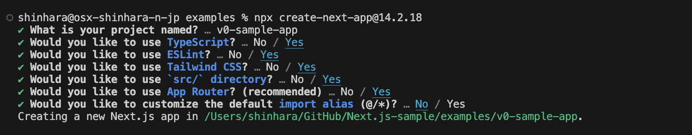
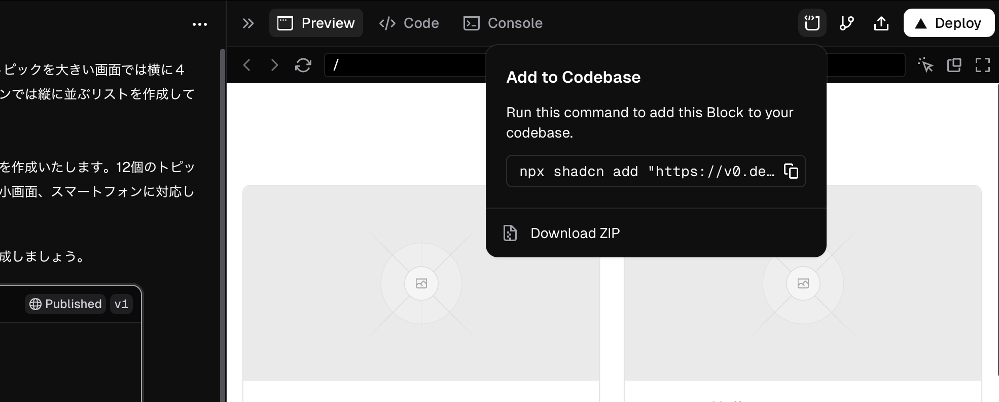
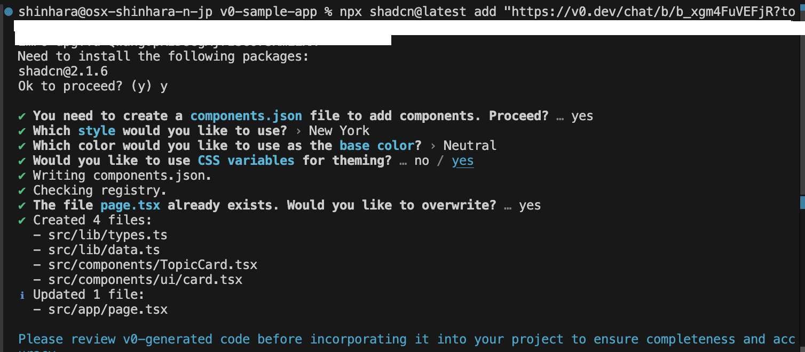
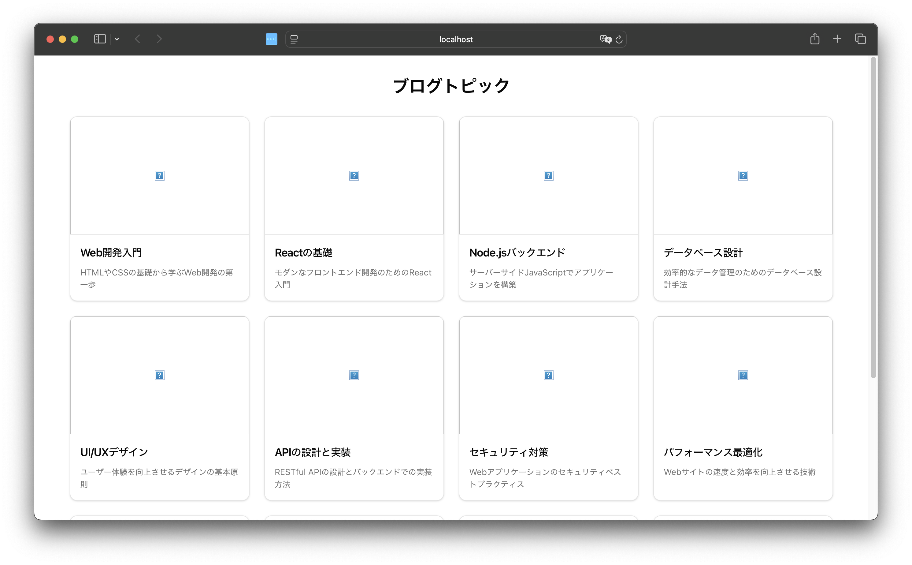
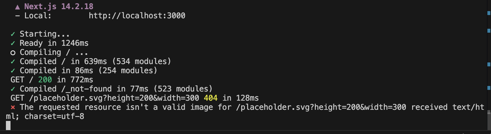
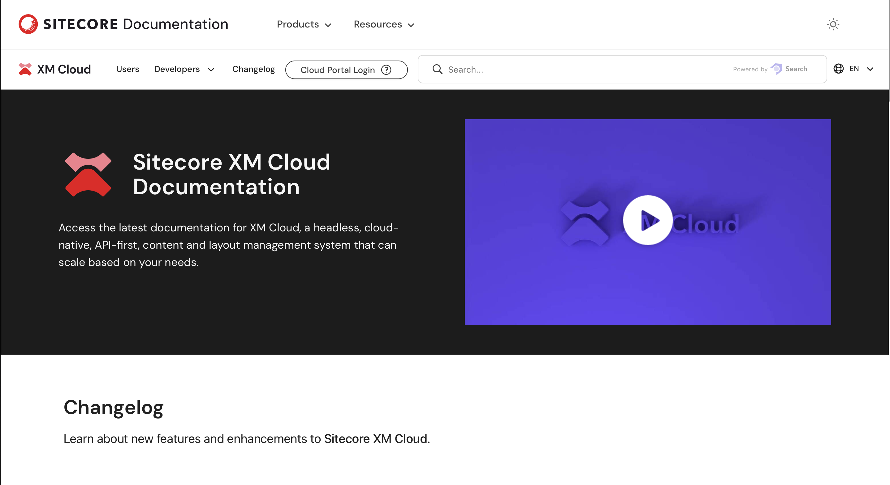
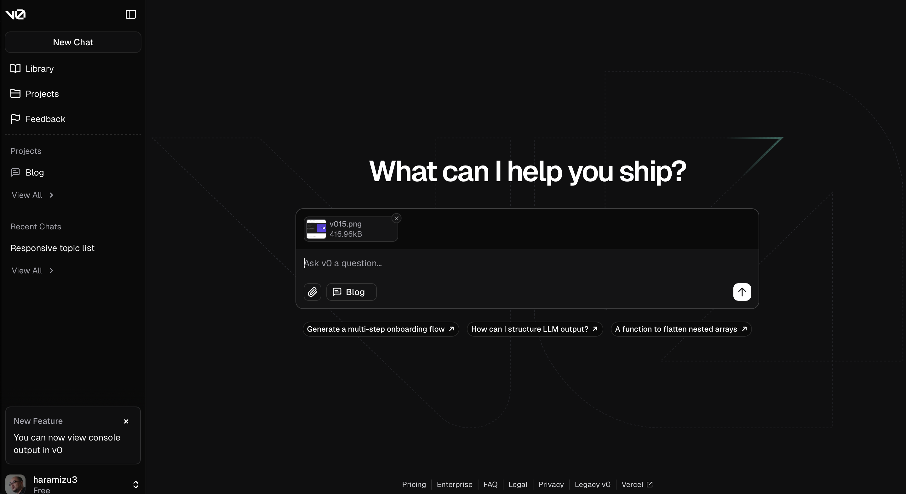
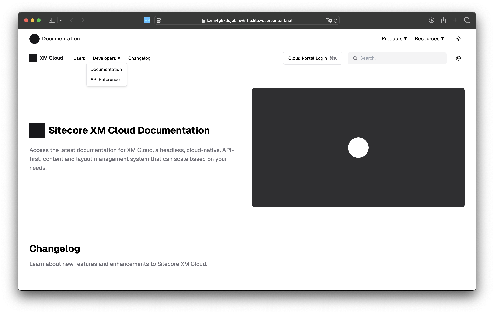

import { FileTree, Steps, LinkCard } from '@astrojs/starlight/components';

Vercel offers a new service called v0. By using this service, you can easily develop web components using generative AI. This document introduces the standard procedure for using v0.

## Introducing v0

Vercel is a company that provides services for hosting various applications. They also offer Next.js, a useful tool for building websites.

The v0 service, which we will cover this time, allows you to create web components using generative AI.

### v0 by Vercel

When you access the site, a simple page where you just need to enter commands is displayed as shown below.


You can input prompts on this screen to generate various UIs. Japanese UI is also available in the preview.


### About Pricing Plans

There are plans for using v0, ranging from a free plan with limited usage and features to a subscription plan. For evaluation purposes, you can use the free plan to test it out.

Refer to the following page for pricing plans.

<LinkCard title="Plans and Pricing" href="https://v0.dev/pricing" target="_blank" />

## Creating Components

### Generating with Chat

This time, we specified the following prompt in the chatbox in Japanese.

_Create a list of 12 topics for the top page of a blog site, arranged in 4 columns on large screens, 2 columns on small screens, and vertically on smartphones._

The generated screen is as follows.


Add a project to save the generated component. Select Project from the menu on the left, and create a new project with New Project. This time, name it Blog.


After creating the project, go back to the component you created earlier and click the Deploy button in the upper right corner. The project to deploy will be displayed, so specify Blog.


After a while, the component you created will be deployed to Vercel.


As a result, you can check the page as shown below.


### Checking the Generated Code

You can check the code from the screen above by clicking the tab on the right.


The generated code is as follows.

```tsx
// /app/page.tsx
import { topics } from '@/lib/data';
import { TopicCard } from '@/components/TopicCard';

export default function Home() {
  return (
    <main className="container mx-auto px-4 py-8">
      <h1 className="mb-8 text-center text-3xl font-bold">Blog Topics</h1>
      <div className="grid grid-cols-1 gap-6 sm:grid-cols-2 lg:grid-cols-4">
        {topics.map((topic) => (
          <TopicCard key={topic.id} topic={topic} />
        ))}
      </div>
    </main>
  );
}
```

```tsx
// /components/TopicCard.tsx
import Image from 'next/image';
import { Card, CardContent, CardHeader, CardTitle } from '@/components/ui/card';
import { Topic } from '@/lib/types';

export function TopicCard({ topic }: { topic: Topic }) {
  return (
    <Card className="h-full">
      <CardHeader className="p-0">
        <Image
          src={topic.imageUrl}
          alt={topic.title}
          width={300}
          height={200}
          className="h-48 w-full rounded-t-lg object-cover"
        />
      </CardHeader>
      <CardContent className="p-4">
        <CardTitle className="mb-2 text-lg">{topic.title}</CardTitle>
        <p className="text-muted-foreground text-sm">{topic.description}</p>
      </CardContent>
    </Card>
  );
}
```

```ts
// /lib/data.ts
import { Topic } from './types';

export const topics: Topic[] = [
  {
    id: 1,
    title: 'Introduction to Web Development',
    description: 'Learn the basics of HTML and CSS for web development',
    imageUrl: '/placeholder.svg?height=200&width=300',
  },
  {
    id: 2,
    title: 'Basics of React',
    description: 'Introduction to React for modern frontend development',
    imageUrl: '/placeholder.svg?height=200&width=300',
  },
  {
    id: 3,
    title: 'Node.js Backend',
    description: 'Build applications with server-side JavaScript',
    imageUrl: '/placeholder.svg?height=200&width=300',
  },
  {
    id: 4,
    title: 'Database Design',
    description: 'Techniques for efficient data management',
    imageUrl: '/placeholder.svg?height=200&width=300',
  },
  {
    id: 5,
    title: 'UI/UX Design',
    description: 'Basic principles of design to enhance user experience',
    imageUrl: '/placeholder.svg?height=200&width=300',
  },
  {
    id: 6,
    title: 'API Design and Implementation',
    description: 'Design and implement RESTful APIs',
    imageUrl: '/placeholder.svg?height=200&width=300',
  },
  {
    id: 7,
    title: 'Security Measures',
    description: 'Best practices for web application security',
    imageUrl: '/placeholder.svg?height=200&width=300',
  },
  {
    id: 8,
    title: 'Performance Optimization',
    description: 'Techniques to improve website speed and efficiency',
    imageUrl: '/placeholder.svg?height=200&width=300',
  },
  {
    id: 9,
    title: 'Cloud Computing',
    description: 'Utilize cloud services like AWS and Azure',
    imageUrl: '/placeholder.svg?height=200&width=300',
  },
  {
    id: 10,
    title: 'Introduction to Machine Learning',
    description: 'Basics and applications of machine learning for programmers',
    imageUrl: '/placeholder.svg?height=200&width=300',
  },
  {
    id: 11,
    title: 'Mobile App Development',
    description: 'Cross-platform development for iOS and Android',
    imageUrl: '/placeholder.svg?height=200&width=300',
  },
  {
    id: 12,
    title: 'DevOps Practices',
    description: 'Achieving continuous integration and delivery',
    imageUrl: '/placeholder.svg?height=200&width=300',
  },
];
```

```ts
// /lib/types.ts
export type Topic = {
  id: number;
  title: string;
  description: string;
  imageUrl: string;
};
```

## Using Components in Next.js

### Creating a Next.js Project

We will use the created components directly in Next.js. Let's prepare a vanilla Next.js project and display the components. First, create a Next.js project.

```bash
npx create-next-app@14.2.18
```

Create the project as follows.



To make it a Next.js project without sample content, delete the sample data. The changes are as follows.

```ts
// /src/app/page.tsx
export default function Home() {
  return (
    <main>
      <h1>Next.js Sample</h1>
    </main>
  );
}
```

```css
// /src/app/globals.css
@tailwind base;
@tailwind components;
@tailwind utilities;
```

Now, Next.js is ready.

### Adding Created Components

To use the components created with v0, there is a command provided in the management screen's upper right corner to add the code.



Execute the provided command at the top of the Next.js project. For the initial installation, the following prompts will appear.

- Install shadcn@2.1.6: Yes
- Create Components.json: Yes
- Style: New York
- Base color: Neutral
- CSS Variables: Yes
- Overwrite page.tsx: Yes

After the above settings, the project will be automatically updated.



The following files will be added or updated. The added files are highlighted.

<FileTree>

- **components.json**
- package-lock.json
- package.json
- tailwind.config.ts
- src
  - app
    - globals.css
    - page.tsx
  - components
    - ui
      - **card.tsx**
    - **TopicCard.tsx**
  - lib
    - **data.ts**
    - **types.ts**
    - **utils.ts**

</FileTree>

### Running the Project

Now the created components have been added to the project. Run the following command.

```bash
npm run dev
```

The result is as follows, displaying the screen created with v0.



When executed, the component generation is successful, but errors are also displayed.



This occurs because the images are not available in the public directory. Create the following SVG file.

```xml
// /public/placeholder.svg
<svg width="300" height="200" xmlns="http://www.w3.org/2000/svg">
  <rect width="100%" height="100%" fill="#ddd" />
  <text x="50%" y="50%" dominant-baseline="middle" text-anchor="middle" fill="#aaa" font-size="20">
    Placeholder
  </text>
</svg>
```

After placing the above file, the following error message appears.

```bash
The requested resource "/placeholder.svg?height=200&width=300" has type "image/svg+xml" but dangerouslyAllowSVG is disabled
```

To enable the use of SVG files, apply the following settings to next.config.js.

```js {3-15}
// next.config.msj
/** @type {import('next').NextConfig} */
const nextConfig = {
  images: {
    dangerouslyAllowSVG: true,
    remotePatterns: [
      {
        protocol: 'http',
        hostname: 'localhost',
        port: '',
        pathname: '/**',
      },
    ],
  },
};

export default nextConfig;
```

Now the created image is displayed.


The sample code up to this point is available on GitHub.

<LinkCard
  title="haramizu / Next.js-sample - v0-sample-app"
  href="https://github.com/haramizu/Next.js-sample/tree/main/examples/v0-sample-app"
  target="_blank"
/>

## Generating UI from Images

This time, we will access the top page of the Sitecore XM Cloud documentation site and proceed with creating components from its screenshot.

<Steps>

1. Prepare the image

   

2. Upload it to the v0 prompt

   

3. Execute the component generation. After a while, the component will be generated, and you can check the component information and preview as shown below.

   

4. Open the preview to see that items like dropdown menus are also generated.

   

</Steps>

Thus, it is possible to create components using images.

## Summary

This time, we confirmed the procedure for generating sample components for use in Next.js using v0. It is very convenient to be able to generate not only from prompts but also from images.

## References

<LinkCard title="v0 by Vercel" href="https://v0.dev/" target="_blank" />

<LinkCard
  title="haramizu / Next.js-sample - v0-sample-app"
  href="https://github.com/haramizu/Next.js-sample/tree/main/examples/v0-sample-app"
  target="_blank"
/>

