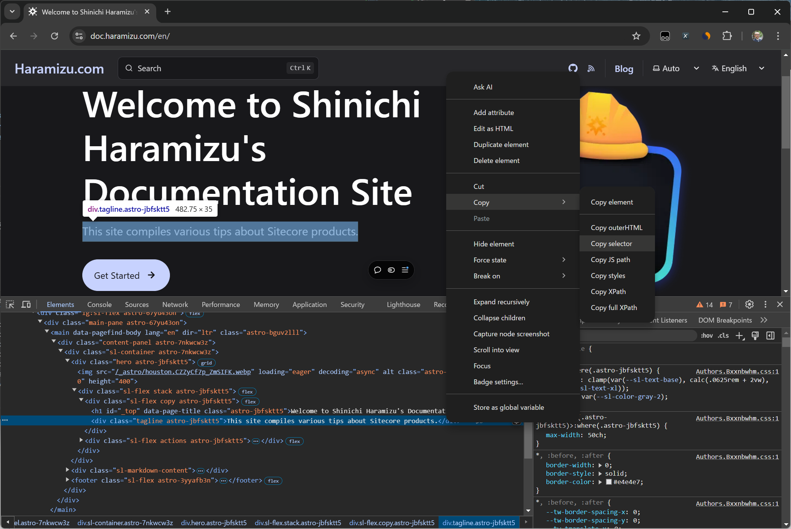
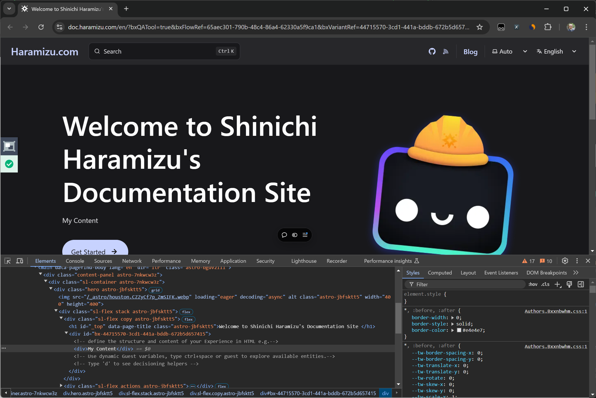
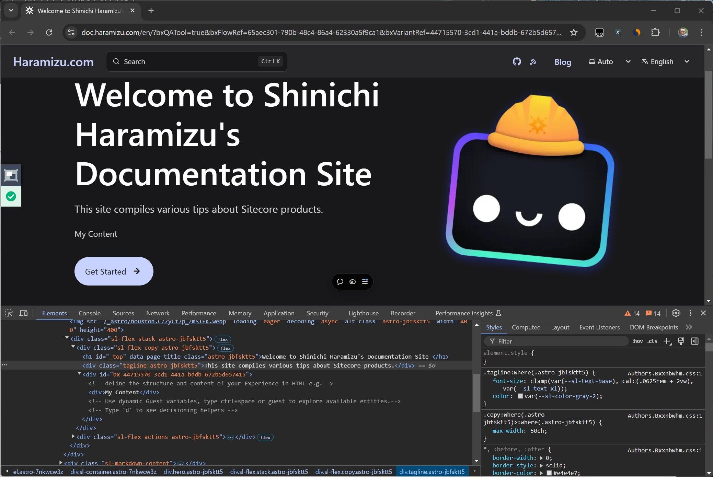
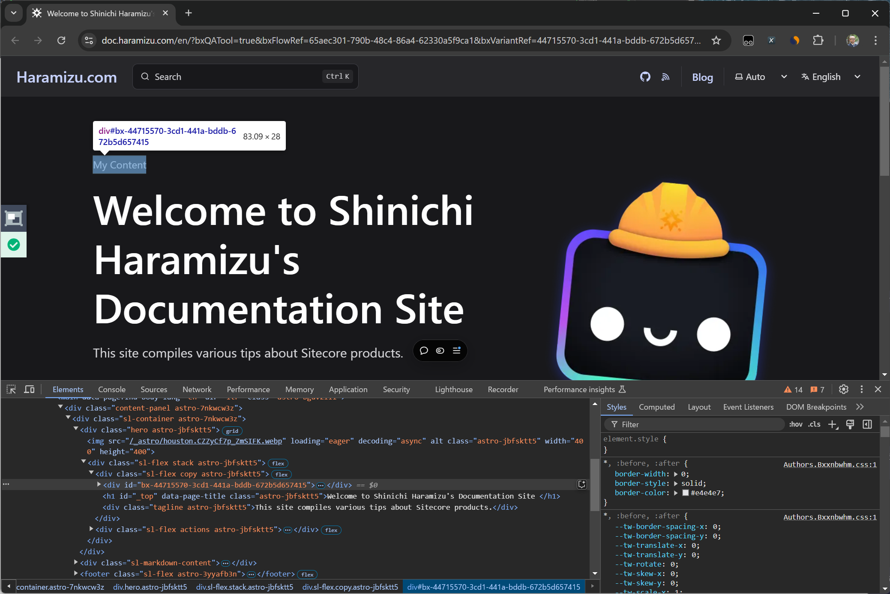
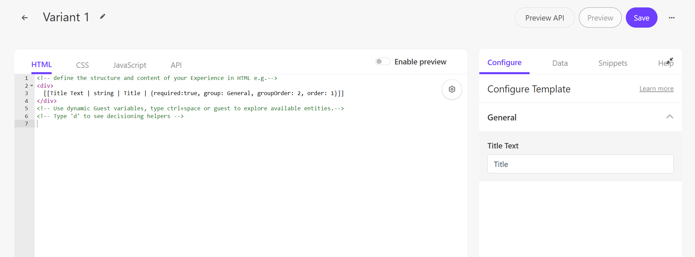
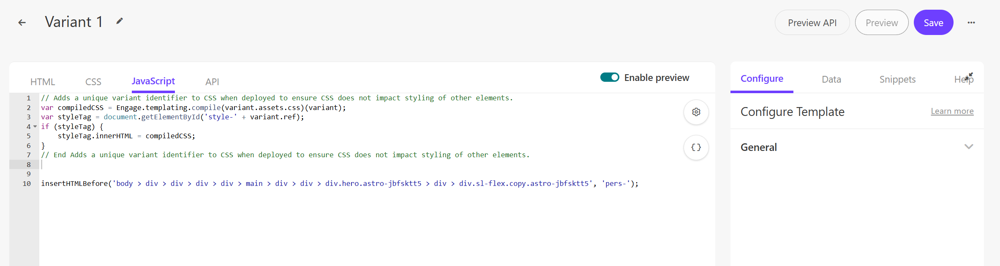
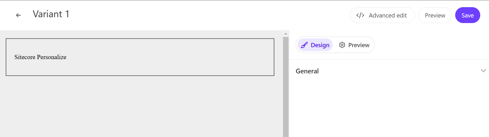
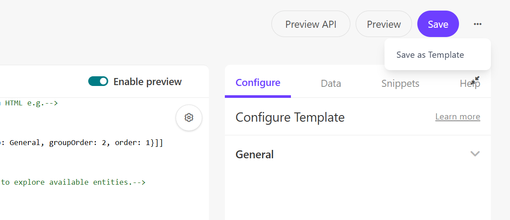

import { LinkCard } from '@astrojs/starlight/components';

When you want to provide various personalized experiences with Sitecore Personalize, you may encounter personalization scenarios beyond the standard templates. This document introduces the steps to create a custom template while checking the operation of the code created with the template.

## Controlling the Template

This sample implementation targets the English top page of this site.

- [Haramizu.com](https://doc.haramizu.com/en/)

### Creating a New Template

Assume that a new Experience is already prepared and the Variant is blank. Click the `Create variant` button to display the template list as shown below.


Click the `Custom template` button at the top right of the screen. This will create an empty Variant.

Since we will be writing code, click the `Advanced Edit` button displayed on the screen to refer to each code. The following code is set by default when newly created.

```html title="HTML"
<!-- define the structure and content of your Experience in HTML e.g.-->
<div>My Content</div>
<!-- Use dynamic Guest variables, type ctrl+space or guest to explore available entities.-->
<!-- Type 'd' to see decisioning helpers -->
```

```css title="CSS"
/** style your Experience with CSS */
```

```js title="JavaScript"
// You can choose how you want to add your HTML by using insertHTMLBefore, insertHTMLAfter, or replaceHTML methods
// e.g insertHTMLAfter('.someClassName'); or insertHTMLAfter('body'); or replaceHTML('#myPageId')

/*

(function () {
  // Add statements here
})();

*/
```

```js title="API"
<#-- Construct the API request body using Freemarker -->
<#-- For your Experience to run your API tab must have, at a minimum, open and closing brackets -->
{  <#-- Freemarker will go here -->   }
```

### Replacing Content

First, we will implement a pattern to replace content. The above JavaScript code includes the `replaceHTML('#myPageId')` method, which is used to replace HTML.

To specify the location to replace, use the browser's developer tools to select the target content's code, choose Copy selector, and specify the location to change.



The following value will be copied to the clipboard.

```txt title="Selector"
body > div > div > div > div > main > div > div > div.hero.astro-jbfsktt5 > div > div.sl-flex.copy.astro-jbfsktt5 > div
```

Add the following line of code to the JavaScript.

```js title="replaceHTML"
replaceHTML(
  'body > div > div > div > div > main > div > div > div.hero.astro-jbfsktt5 > div > div.sl-flex.copy.astro-jbfsktt5 > div'
);
```

After setting this, click the Preview button to check the result of the personalization.



In the preview screen, you can confirm the following points:

- The page content has been changed.
- The Variant HTML is displayed as is when referring to the developer tools code.
- The QA Tool is working without issues, indicated by the green color.

This confirms the method to replace the specified range of HTML with code.

### Adding Content

In the above sample, we simply replaced HTML. We will now verify using the `insertHTMLAfter()` and `insertHTMLBefore()` methods introduced in the initial JavaScript code.

Change the function in the above code and remove the last `div` since it is not an element replacement. First, change to `insertHTMLAfter()`.

```js title="insertHTMLAfter"
insertHTMLAfter(
  'body > div > div > div > div > main > div > div > div.hero.astro-jbfsktt5 > div > div.sl-flex.copy.astro-jbfsktt5'
);
```

After changing the code, save it and check again in Preview to see the changes.



You can confirm that the HTML prepared in this Variant has been inserted below the target content. Next, change the method while keeping the same selector.

```js title="insertHTMLBefore"
insertHTMLBefore(
  'body > div > div > div > div > main > div > div > div.hero.astro-jbfsktt5 > div > div.sl-flex.copy.astro-jbfsktt5'
);
```

Convert the code, save it, and check again in Preview to see that it is displayed above the specified location.



This confirms that it is possible to insert the HTML specified in the Variant at the desired position using these methods.

## Controlling HTML

At this stage, the code inserted into the HTML is simply replaced or inserted by JavaScript. The standard components provided allow you to change the strings inside by specifying the component. To make it more user-friendly, we will add additional work to the HTML.

### Specifying as Text

First, let's review the initial code, which is simply a `div` tag with a string.

```html title="HTML"
<!-- define the structure and content of your Experience in HTML e.g.-->
<div>My Content</div>
<!-- Use dynamic Guest variables, type ctrl+space or guest to explore available entities.-->
<!-- Type 'd' to see decisioning helpers -->
```

We want to make this My Content part changeable through a dialog. The description method is fixed, so change it as follows.

```diff lang="html"
<!-- define the structure and content of your Experience in HTML e.g.-->
- <div>My Content</div>
+ <div>
+   [[Title Text | string | Title | {required:true, group: General, groupOrder: 2, order: 1}]]
+ </div>
<!-- Use dynamic Guest variables, type ctrl+space or guest to explore available entities.-->
<!-- Type 'd' to see decisioning helpers -->
```

When you save this change, the screen will update, and Title will be added under Configure Template.



Enter the text "Sitecore Personalize" in the added Title Text textbox and execute Preview.


The specified text is now displayed. This allows you to specify parts of the text to change, similar to the already implemented templates.

### Specifying Styles

Next, we will control the CSS. The standard templates always execute the following code in the JavaScript.

```js
// Adds a unique variant identifier to CSS when deployed to ensure CSS does not impact styling of other elements.
var compiledCSS = Engage.templating.compile(variant.assets.css)(variant);
var styleTag = document.getElementById('style-' + variant.ref);
if (styleTag) {
  styleTag.innerHTML = compiledCSS;
}
// End Adds a unique variant identifier to CSS when deployed to ensure CSS does not impact styling of other elements.
```

To check what `variant.assets.css` retrieves, add the following line and execute.

```diff lang="js"
// Adds a unique variant identifier to CSS when deployed to ensure CSS does not impact styling of other elements.
var compiledCSS = Engage.templating.compile(variant.assets.css)(variant);
+ console.log("Variant Assets CSS:", variant.assets.css);
var styleTag = document.getElementById('style-' + variant.ref);
if (styleTag) {
    styleTag.innerHTML = compiledCSS;
}
// End Adds a unique variant identifier to CSS when deployed to ensure CSS does not impact styling of other elements.
```

The console output shows the following line.


This code displays the data defined in the CSS.

```css title="CSS"
/** style your Experience with CSS */
```

This part compiles the CSS of the variant and applies it to a specific style tag. Then, it retrieves the style tag with the specified ID and applies the compiled CSS to it.

We rewrote the HTML to display the specified title as follows.

```html title="HTML"
<div id="pers-custom">
  <div class="pers-custom__body">
    <p>
      [[Title Text | string | Title | {required:true, group: General, groupOrder: 2, order: 1}]]
    </p>
  </div>
</div>
```

Next, rewrite the stylesheet as follows.

```css title="CSS"
/** style your Experience with CSS */
#pers-{{ref}} #pers-custom {
  border: 2px solid #808080;
  margin: 20px;
}
#pers-{{ref}} #pers-custom p {
    font-weight: 400;
    line-height: 1.2;
}
#pers-{{ref}} #pers-custom .pers-custom__body {
    padding: 20px 20px;
}
```

The role of `ref` in the above code is to assign a unique identifier to specific elements or components, allowing them to be distinguished from others. This is used to apply different styles or dynamically manipulate them with JavaScript for each variation or instance.

Finally, add the second variable `pers-` to the insertHTMLBefore call in JavaScript.

```diff lang="js" ins=/, ('pers-')/
insertHTMLBefore('body > omission .sl-flex.copy.astro-jbfsktt5', 'pers-');
```

Now the setup is complete. When you check in Preview, you can see that the stylesheet is applied.


When you check the source code through the browser's developer tools, the stylesheet is also inserted.

## Enabling Preview

After completing the three settings, enable the preview of the created Variant. Click the `Enable preview` button displayed in `Advanced Edit` mode.



You can now preview the created Variant.



## Saving as a Template

To save the created Variant as a template, click the button at the top right in Advanced Edit mode to display the `Save as Template` button.



Click this to specify the template name and save it.


If you plan to reuse it, you can save the custom Variant as a template for effective use.

## References

<LinkCard
  title="Inserting a web experience in your HTML"
  href="https://doc.sitecore.com/personalize/en/users/sitecore-personalize/inserting-a-web-experience-in-your-html.html"
  target="_blank"
/>

