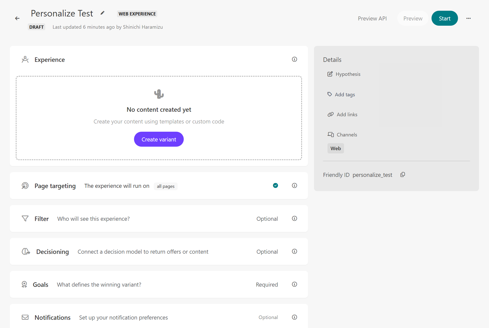
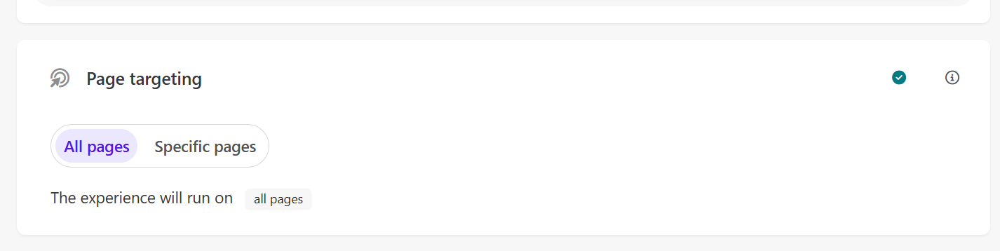
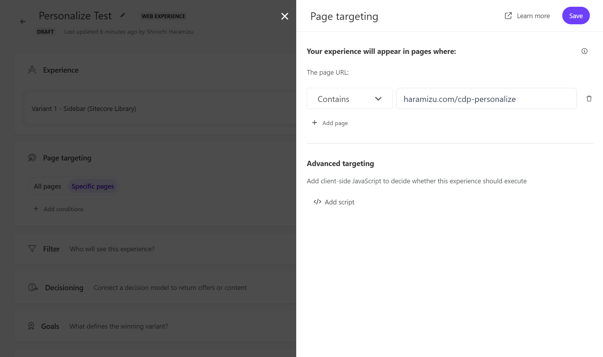
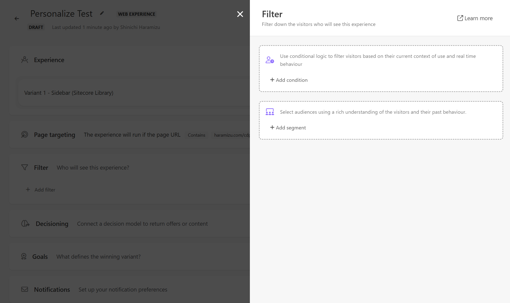
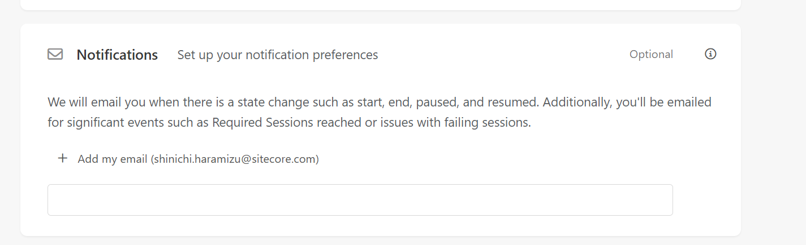
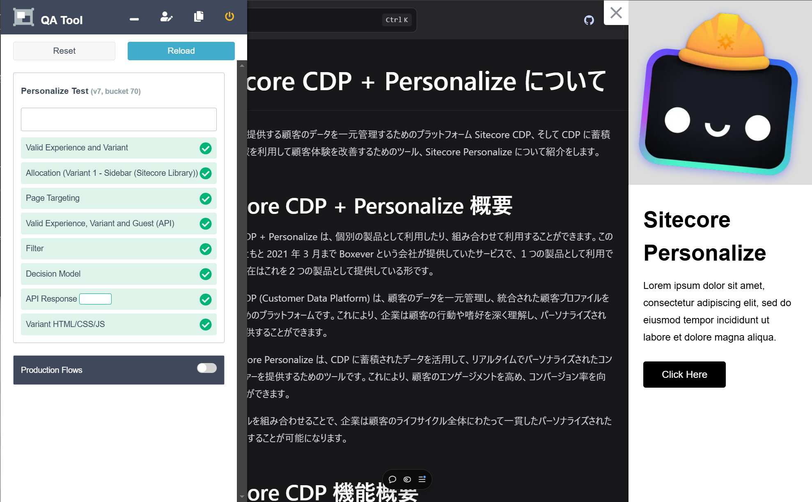
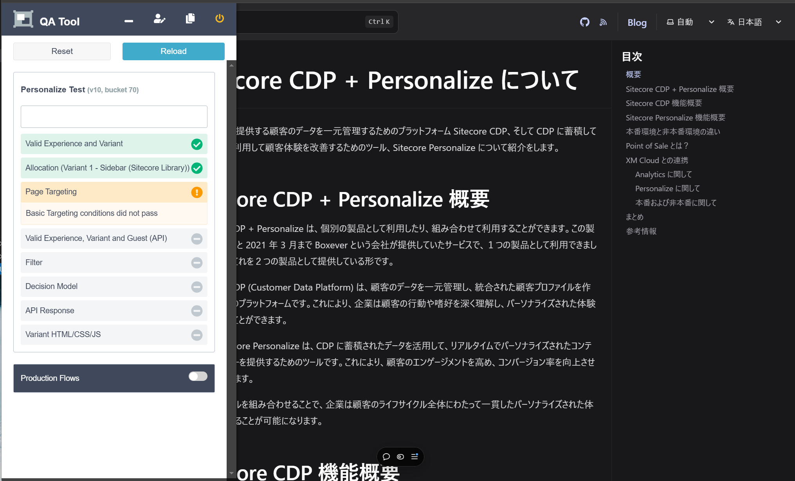

In previous explanations, we introduced how to create a sample Experience. In this document, we will again introduce the steps to create a new personalization setting in Sitecore Personalize using an existing template.

## Creating a New Experience

This time, we will review the content while creating a new Experience. First, log in to Sitecore Personalize and navigate to the Experiences screen, where you will see a list of created Experiences. Since this is a new environment, nothing has been provided yet.

To create a new Experience, click the `Create` button in the upper right corner. You will then be prompted to choose one of three types of Experiences.

- **Web**: Create Personalize for a website
- **Interactive**: API-based content delivery, app integration, etc.
- **Triggered**: Specific events for emails or texts

This site will mainly introduce Web samples. Therefore, select Web and name the Experience "Personalize Test."

The newly created Experience will look like this:

Let's review the settings for each item.

### Experience (Required)

In this section, you will describe the related code for displaying Personalize. You will set up the HTML, CSS, and JavaScript to be used, and APIs if necessary. There are seven types of templates provided by default:

- Alert Bar
- Corner Popup
- Email Capture Bar
- Email Capture Corner
- Notification Widget
- Popup takeover
- Slidebar

You can check samples of the above templates on the following page:

- [Samples](/cdp-personalize/sample/)

This time, we will select Sidebar (Sitecore Library). The main settings are as follows:

| Variable    | Format | Description  |
| ----------- | ------ | ------------ |
| Image URL   | string | Image        |
| Title Text  | string | Title        |
| Button Link | string | URL          |
| Button Text | string | Button label |

The following screen shows the settings for the Sidebar we created this time.

### Page Targeting

Set the rules for displaying. When you expand this item, `All Pages` is the default value. With this setting, it will be displayed on all pages that meet the conditions set outside of Page Targeting.

When you click `Specific pages`, `+ Add conditions` will appear below, allowing you to specify the target pages. Clicking it will pop up a sidebar for input from the right.

Several methods are available for specifying:

- Contains
- Does not contain
- Does not end with
- Does not equal
- Does not match Regex(ignore Case)
- Does not match Regex
- Does not start with
- Ends with
- Equals
- Matches Regex (Ignore Case)
- Matches Regex
- Start with

Set the rules you want to use with the above items to fix the target pages.

You can also add multiple conditions, so if you want to run on multiple pages, click `+ Add Page` to add them.

You can also include client-side JavaScript. For more details, refer to the following page:

- [Target a webpage in a web experience](https://doc.sitecore.com/personalize/en/users/sitecore-personalize/target-a-webpage-in-a-web-experience.html)

### Filter

This item allows you to add rules to execute personalization based on certain conditions. You can use user conditions or segments for this rule.

This time, we will review the conditions. Click the `+ Add Condition` button to display the available rules.

The `Out of the box` rules include the following:

- Country Region
- Date and time (organization time zone)
- Time of day (organization time zone)
- Point of sale
- Region
- Country
- Visit day of the month (organization time zone)
- Day of the week (organization time zone)
- Month of visit (organization time zone)
- First referrer
- UTM value
- Operating system
- Device
- Number of page views
- First page
- Page view
- New or returning visitor

Select the rule you want to use (click the + button) and add the necessary information. The following screen specifies `Japan` for `Country`.

For more details, refer to the following page:

- [Apply a condition to a web experience](https://doc.sitecore.com/personalize/en/users/sitecore-personalize/apply-a-condition-to-a-web-experience.html)

### Decisioning

By using this Decisioning, you can create rules for the model to be displayed, not just a filter, and execute personalization based on the results.

This Decisioning is introduced in another document.

- [Decisioning](/cdp-personalize/decisioning/)

### Goal (Required)

Set the goal items for conversions after executing personalization. There are five types of goals available.

- Order revenue
- Page views
- Bounce rate
- Exit rate
- Custom goal

Goals are detailed on the following page:

- [Introduction to experience goals](https://doc.sitecore.com/personalize/en/users/sitecore-personalize/introduction-to-experience-goals.html)

### Notifications

This item works slightly differently from the above personalization settings. It notifies you by email when there is a status change such as start, end, pause, or resume of the target Experience. It also notifies you by email when important events occur, such as reaching the required session or encountering session failure issues.

## Preview

A Preview function is provided to test the created Experience before publishing.

The prerequisites for Preview to work are one of the following:

- The Sitecore Engage SDK code is implemented on the target site, and Sitecore Personalize is running
- Using Tampermonkey to execute the script when opening the preview domain

You can use Preview under either of the above conditions.

### Show Preview

When you run the Preview, the personalization you set (in this case, Sidebar) will work as shown below.

You can check if it is displayed on the target page.

### QA Tools

While the above Preview is displayed, the QA Tool will appear on the left side of the screen after a while. Click the icon on the left to check the operating environment.

For example, if the target page specification is incorrect, you can confirm that Page Targeting is not set correctly.

This QA Tool can be used for various tests, such as specifying a user. This time, there is no problem if it is displayed without errors.

## References

- [Target a webpage in a web experience](https://doc.sitecore.com/personalize/en/users/sitecore-personalize/target-a-webpage-in-a-web-experience.html)
- [Apply a condition to a web experience](https://doc.sitecore.com/personalize/en/users/sitecore-personalize/apply-a-condition-to-a-web-experience.html)
- [Use a decision model in a web experience](https://doc.sitecore.com/personalize/en/users/sitecore-personalize/use-a-decision-model-in-a-web-experience.html)
- [Preview a web experience](https://doc.sitecore.com/personalize/en/users/sitecore-personalize/preview-a-web-experience.html)
- [Introduction to experience goals](https://doc.sitecore.com/personalize/en/users/sitecore-personalize/introduction-to-experience-goals.html)

