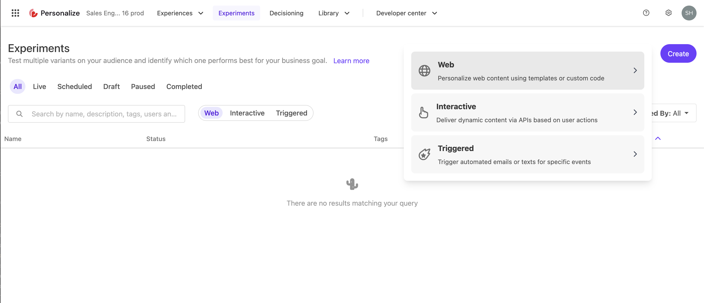
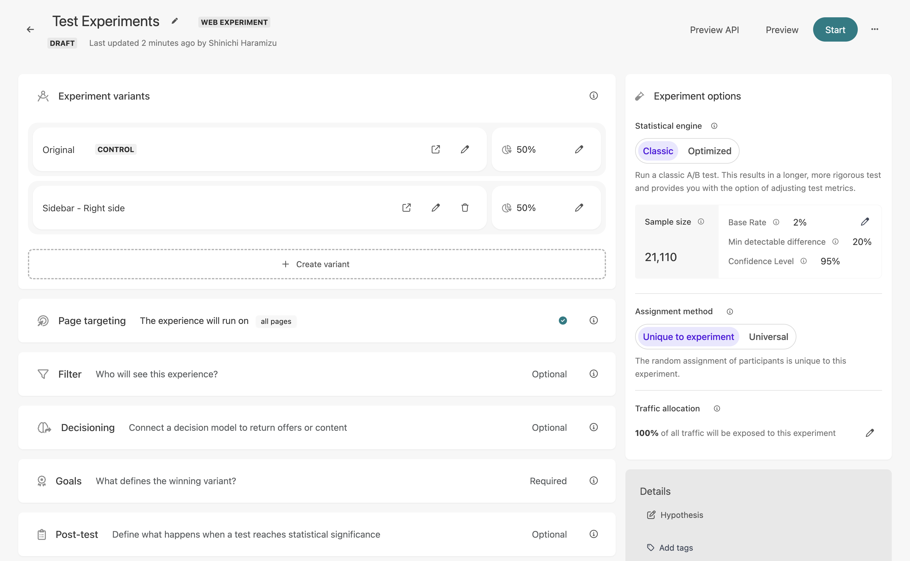
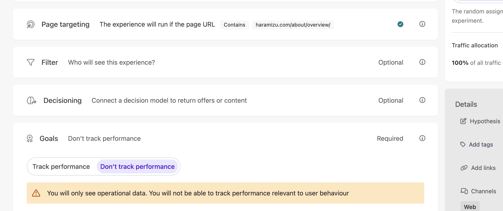
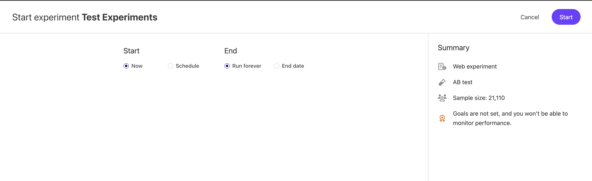

This document introduces the Experiments feature of Sitecore Personalize for conducting A/B tests. The web templates that can be used are created in the same way as Experience. In this page, we will paste several templates on one page and check the results.

## Creating Experiments

This time, we will create a new Experiment and check its operation. After logging into Sitecore Personalize, access Experiments. When accessing for the first time, nothing is displayed. Click the Create button in the upper right corner to select what to create. Here, select Web.

This time, we will create `Test Experiments`. The creation screen is similar to that of creating a regular Experience.

### Adding Variants

As with Experience, create a Variant. This time, select Slidebar (Sitecore Library). The screen of the created slidebar looks like this. Name the Variant `Sidebar - Right side`.

After saving, return to the Experiments settings screen, and you will see that two Variants are set.

`Original` is not created, but it is displayed as the original page without personalization. Here, create one more and use Corner Popup (Sitecore Library) to add `Corner Popup - Right bottom` displayed at the bottom right. Then, set each display to 33% (set original to 34%). Below is the completed settings screen.

### Setting Targets and Goals

To run the preview, set the target page and goals. Specify the target by URL so that it works when the corresponding page is displayed.

For goals, select Don't track performance to skip setting for this A/B test confirmation. Normally, setting goals is necessary to obtain test results, so be sure to set this item.

## Preview

Before actually publishing the created Experiment, confirm it. After displaying the corresponding page in the preview, the QA Tool icon will appear from the left side after a while. You can check which Variant is currently displayed on the opened screen.

Switch the QA Toolbox option to `Sidebar - Right side` and execute Reload. The page reloads, and the Sidebar is displayed. No errors are displayed in the QA Toolbox.

In this way, A/B/n tests can be realized using Experiments.

## Start

To reflect the created Experiments in the production environment, click the Start button. You can also specify the start and end dates.

## Sample Page

The A/B test created this time is actually running as a sample on the following page.

- [A/B Test Sample](/en/sample/test-experiment/)

## References

- [Getting started with web experiments](https://doc.sitecore.com/personalize/en/users/sitecore-personalize/getting-started-with-web-experiments.html)
- [Create a web experiment](https://doc.sitecore.com/personalize/en/users/sitecore-personalize/create-a-web-experiment.html)
- [Create a variant for a web experiment using a web template](https://doc.sitecore.com/personalize/en/users/sitecore-personalize/create-a-variant-for-a-web-experiment-using-a-web-template.html)

