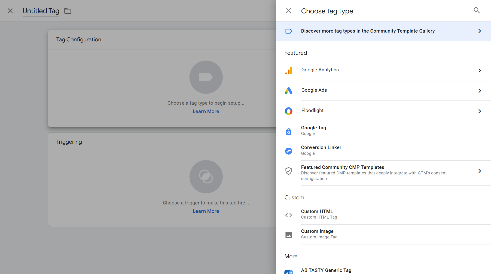
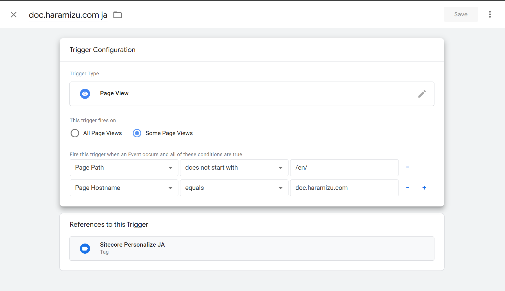
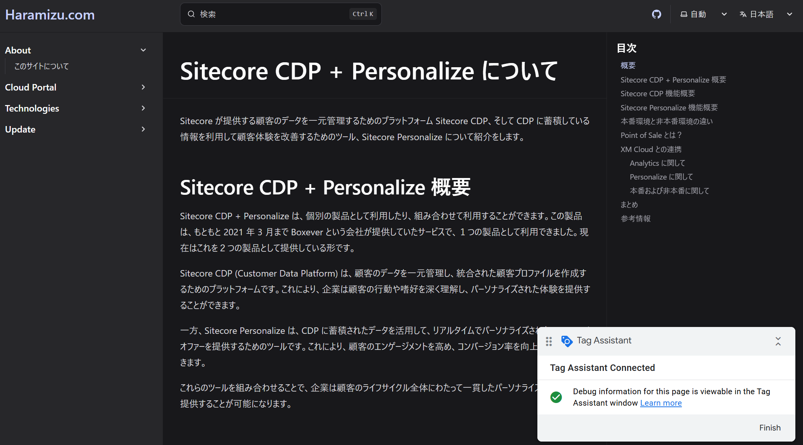
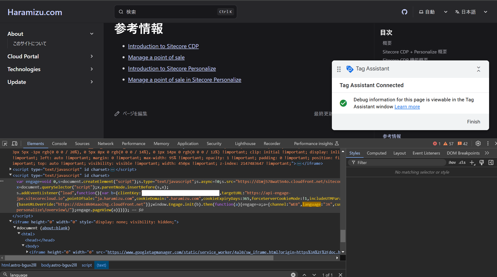
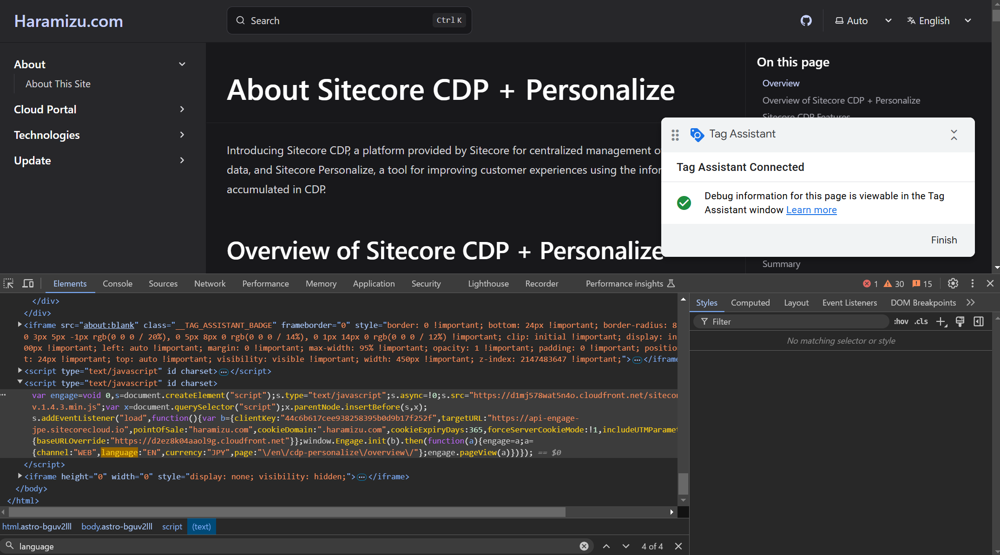
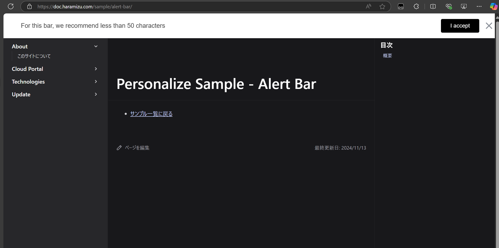

import { Steps } from '@astrojs/starlight/components'

We have confirmed how to operate without embedding tags on the site using Tampermonkey. This time, we will proceed with the settings to apply JavaScript using Google Tag Manager for actual site use.

## Prerequisites

At the time of posting this article, we are providing information on two domains.

- [Blog site - blog.haramizu.com](https://blog.haramizu.com/en-US/)
- [Documentation site - doc.haramizu.com](https://doc.haramizu.com/en/)

Both sites post documents in Japanese and English (machine translation), but the URL structures are different.

- blog.haramizu.com
  - /ja-JP: Japanese content
  - /en-US: English content
- doc.haramizu.com
  - /en: English content
  - /: Japanese content (root is Japanese)

Here, we want to prepare two Points of Sale for Sitecore CDP + Personalize.

- haramizu.com - English content
- ja.haramizu.com - Japanese content

Therefore, we will prepare two tags in Google Tag Manager due to the differences in Points of Sale and languages, and implement them by switching triggers depending on the site.

## Integration with Google Tag Manager

There is actually a page introducing the steps to integrate with Google Tag Manager when using CDP + Personalize.

- [Integrate using the Engage SDK script and Google Tag Manager](https://doc.sitecore.com/personalize/en/developers/api/integrate-engage-sdk-and-google-tag-manager.html)

The code introduced on this page uses the Engage SDK and looks like this:

```js {16-19,23,31-33} title="JavaScript"
<script>
    // Initialize the engage variable
    var engage = undefined;

    // Create and inject the <script> tag into the HTML
    var s = document.createElement("script");
    s.type = "text/javascript";
    s.async = true;
    s.src = "https://d1mj578wat5n4o.cloudfront.net/sitecore-engage-v.1.4.3.min.js";
    var x = document.querySelector("script");
    x.parentNode.insertBefore(s, x);

    // Initialize the Engage SDK
    s.addEventListener("load", function () {
      var settings = {
        clientKey: "<client_key_PLACEHOLDER>",
        targetURL: "<stream_api_target_endpoint_PLACEHOLDER>",
        pointOfSale: "<point_of_sale_PLACEHOLDER>",
        cookieDomain: "<cookie_domain_PLACEHOLDER>",
        cookieExpiryDays: 365,
        forceServerCookieMode: false,
        includeUTMParameters: true,
        webPersonalization: true
    };

    window.Engage.init(settings).then(function (result) {
      engage = result;

      // Send a VIEW event
      var event = {
        channel: "<channel_PLACEHOLDER>",
        language: "<language_PLACEHOLDER>",
        currency: "<currency_PLACEHOLDER>",
        page: "{{Page Path}}"
      };
     engage.pageView(event);
    });
  });
</script>
```

The highlighted parts of the above code will be changed and registered in Google Tag Manager.

- **client_key_PLACEHOLDER**: Can be obtained from Sitecore Personalize's Company Information
- **stream_api_target_endpoint_PLACEHOLDER**: Set according to the region of the instance you are using
- **point_of_sale_PLACEHOLDER**: Specify the Point of Sale set in Sitecore Personalize
  - This time, for Japanese, it will be `ja.haramizu.com`, and for others, it will be `haramizu.com`
- **cookie_domain_PLACEHOLDER**: Set to `.haramizu.com` for both
- **channel_PLACEHOLDER**: Set to `WEB`
- **language_PLACEHOLDER**: Set the language
  - This time, for Japanese, it will be `JA`, and for others, it will be `EN`
- **currency_PLACEHOLDER**: Set to `JPY`

Refer to the following page for endpoints.

- [Collect required details - Stream API target endpoint](https://doc.sitecore.com/personalize/en/developers/api/collect-required-details.html#stream-api-target-endpoint)

:::caution
The above sample is configured for data centers outside of Japan. If you are using a data center in Japan, please assign the following value for webPersonalization.
```js
webPersonalization:  { baseURLOverride: 'https://d2ez8k04aaol9g.cloudfront.net' }
```
:::

### Registering the Tag

First, log in to Google Tag Manager and specify the target Workspace.


The above screen already includes settings for Sitecore Personalize. When creating, follow these steps.

<Steps>

1. Click New in the list of Tags

2. Click Tag Configuration

3. Select Custom HTML

</Steps>



In this Custom HTML area, add the code with the parameters changed based on the above code. For the two Tags, save only the Custom HTML at the initial stage without setting triggers, and then proceed to create triggers.

### Creating Triggers

When accessing the site, you can add a Tag if the Google Tag Manager tag matches. This is the trigger. The trigger screen looks like this.


The above screen already has multiple triggers prepared. Refer to one of them, and it looks like this.

- **Page Hostname**: doc.haramizu.com 
- **Page Path**: Does not start with /en/



This way, doc.haramizu.com/en is processed by a different trigger, and the rest is determined to be Japanese. For blog.haramizu.com, it is always displayed in either ja-JP or en-US. This time, we prepared a total of four triggers for two domains and two languages.

Next, assign the pre-created tags to each trigger. As long as the triggers for each language are set, there should be no problem.


### Confirming Operation

You can check if the set tags are working correctly from the Preview in the Google Tag Manager management screen. Click `Preview` displayed at the top of the screen.


Clicking it will launch Tag Assistant and display a dialog to set which URL to test. For the first time, set `https://doc.haramizu.com/cdp-personalize/overview/` and execute it.


You can confirm that Tag Assistant is connected by launching the browser.



By referring to the tags output using developer tools, it was confirmed that `ja.haramizu.com` is set for pointOfSale and `JA` is set for language.



Next, refer to the same page starting with /en/ at `https://doc.haramizu.com/en/cdp-personalize/overview/` and launch Tag Assistant again. By checking the code of the opened page with developer tools, it was confirmed that pointOfSale is set to `haramizu.com` and the language is set to `EN`.



By seeing the actual operation, it can be seen that the English trigger is executed.


After confirming that it is working correctly, publish it, and the Google Tag Manager procedure is complete.

## Publishing the Experience

This time, we will create an Experience using the new Alert Bar template. Refer to the following page for the creation steps. After creating, click Start for the Experience and assume it is already published.

- [Alert Bar](/en/sample/alert-bar/)


Turn off Tampermonkey and check that the personalized Alert Bar is displayed by actually displaying the above page.



## Summary

This time, we introduced how to apply JavaScript to the site using Google Tag Manager and display alerts on the website using that JavaScript code. For testing and demos, use Tampermonkey for local testing, apply JavaScript in a non-production environment for operation confirmation, and then operate in a production environment.

If you include tag distribution with Google Tag Manager, you can create and deploy Personalize afterward.

For settings and publication information using various templates, please refer to [Template List](/cdp-personalize/sample/).

## References

- [Integrate using the Engage SDK script and Google Tag Manager](https://doc.sitecore.com/personalize/en/developers/api/integrate-engage-sdk-and-google-tag-manager.html)