import { Steps } from '@astrojs/starlight/components';

This document introduces how to test JavaScript code implementation using a browser extension on websites that have not yet embedded Sitecore Personalize tags. By using this method, it becomes easier to verify personalization on development sites and non-production environments.

## About Tampermonkey

Tampermonkey is a browser extension for managing and executing user scripts. This allows users to customize or automate the behavior of web pages. Below are the main features of Tampermonkey.

### Supported Browsers

Tampermonkey is available on the following major browsers:

- Google Chrome
- Microsoft Edge
- Firefox
- Safari
- Opera

### Installation Method

Installing Tampermonkey is very simple. Download and install the version corresponding to your browser from the following link.

- [Tampermonkey Official Site](https://www.tampermonkey.net/)

In this document, we will proceed with installing and verifying the extension on Google Chrome or Microsoft Edge.

### Enabling Developer Mode

Simply installing the extension does not allow you to use Tampermonkey's features. To use it as an extension, you need to enable the browser's developer mode. If a warning is displayed after installing the extension, follow the necessary steps.

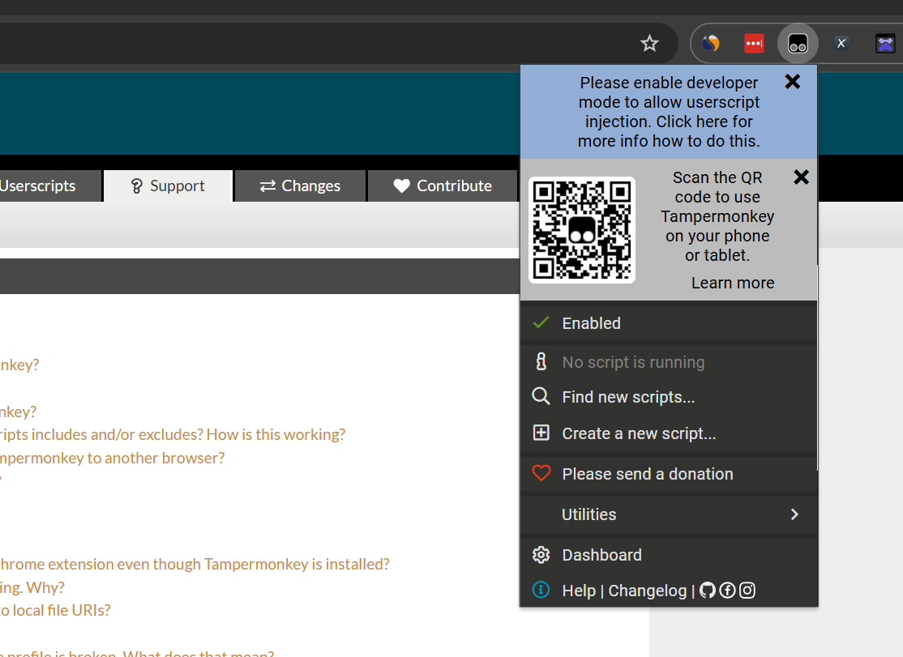

This procedure is introduced on the following pages.

- [Steps to Enable Developer Mode](https://www.tampermonkey.net/faq.php#Q209)

Let's check the steps and enable developer mode. First, click `Extensions` - `Manage Extensions` from the menu to refer to the extension settings.

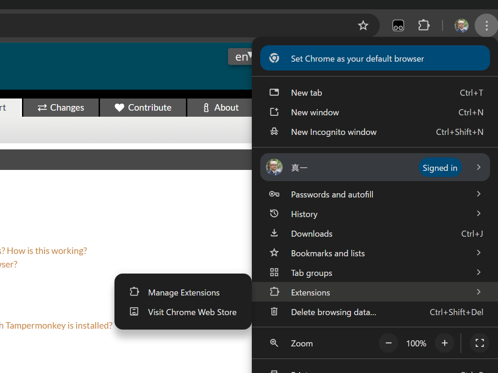

When you open the screen, a toggle for developer mode is displayed. By checking this, developer mode will be enabled.

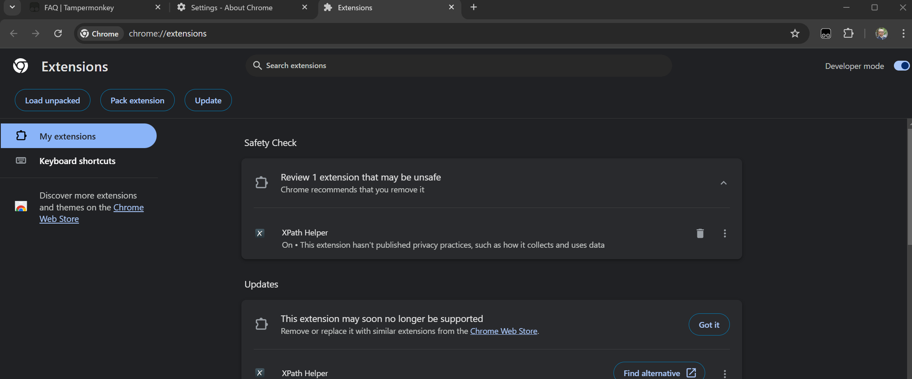

## Creating an Experience

This time, we will use a template to display a popup for testing. First, create a test on the Sitecore Personalize screen.

<Steps>

1. Move to the Experience list page

2. Click the Create button to create a Web Experience

3. Create an Experience named Personalize Test

4. Set the created Experience as follows:

   - Goal: Set to `Don't track performance`
   - Page Targeting: Standard `all pages`

5. Click Create variant

6. Select Corner Popup (Sitecore Library)

</Steps>

The settings for the Corner Popup are as follows:

- **General - Image URL**: `https://doc.haramizu.com/_astro/houston.CZZyCf7p_ZmSIFK.webp`
- **Title - Title**: Sitecore Personalize
- **CTA Button - CTA destination URL**: https://doc.haramizu.com/

The Experience for testing is completed as shown below.

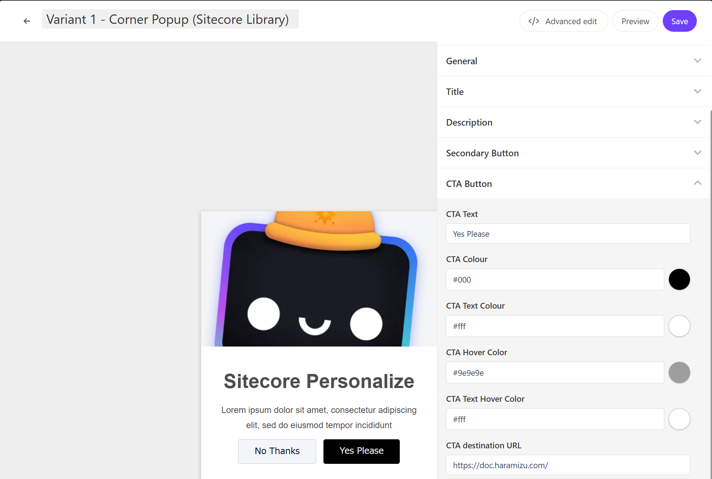

## Running Tests with Tampermonkey

The Experience for testing is completed. This time, we will use Tampermonkey to run the Experience on the Sitecore documentation site.

- https://doc.sitecore.com/personalize

With the extension already installed, access the above site and click the Tampermonkey icon to display the following menu. First, click Dashboard.

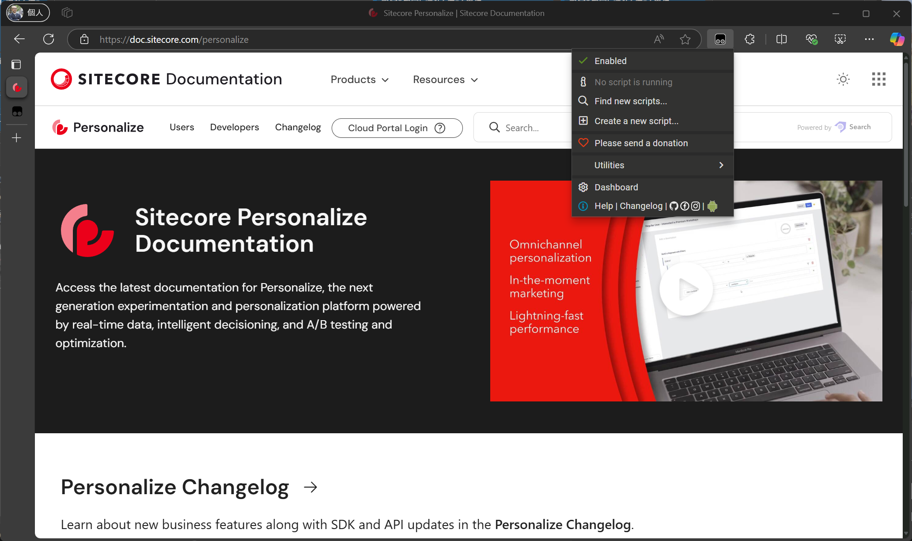

Since this is a new environment, no scripts are set.

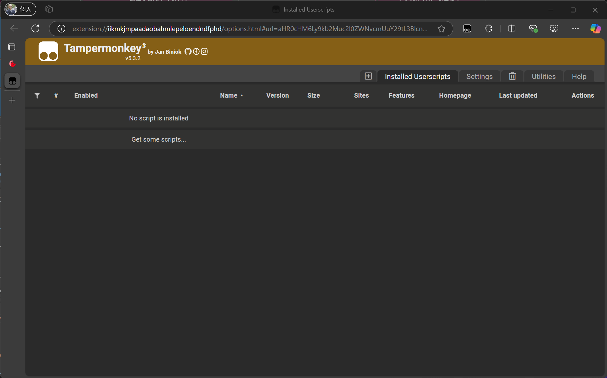

Currently, the **Installed Userscripts** tab is open. Click the **+** button on the left to create a new script.

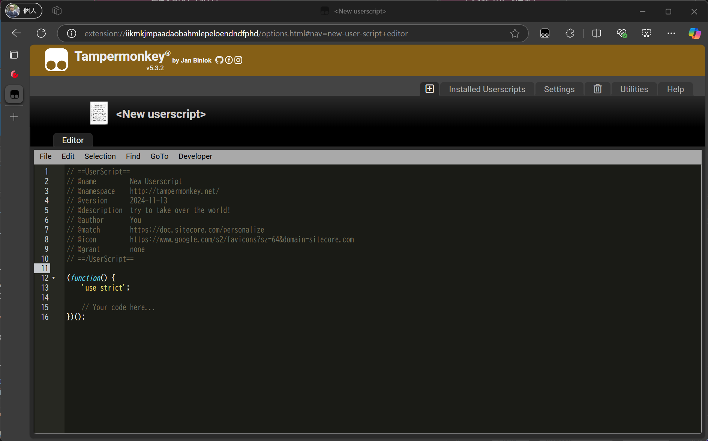

The default generated script is displayed. Let's modify the code slightly.

| Name  | Description                                            |
| ----- | ------------------------------------------------------ |
| name  | Script name                                            |
| match | Conditions for the script to be active, \* can be used |
| icon  | Icon used in the list                                  |

The prepared code is as follows:

```js {2,,6-7} title="JavaScript"
// ==UserScript==
// @name         Haramizu.com Sample 1
// @namespace    http://tampermonkey.net/
// @version      2024-11-14
// @description  try to take over the world!
// @author       You
// @match        https://doc.sitecore.com/*
// @icon         https://www.google.com/s2/favicons?sz=64&domain=www.sitecore.com
// @grant        none
// ==/UserScript==

(function () {
  'use strict';

  // Your code here...
})();
```

After saving the above settings, revisit the site to see that it is enabled as shown below.

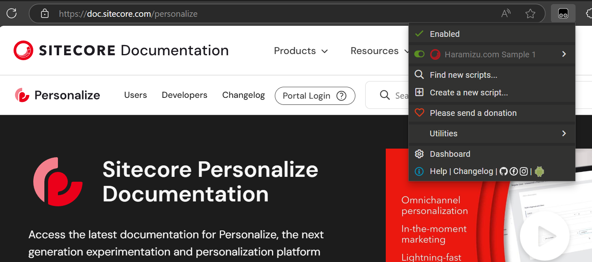

### Adding Engage SDK Script

This time, we will use the Sitecore Engage SDK for verification. The code created earlier contains nothing, only checking if it is enabled in Tampermonkey. Therefore, we will add standard JavaScript code. Below is the complete code.

```js {20,23,25-26,57} title="JavaScript"
// ==UserScript==
// @name         Haramizu.com Sample 1
// @namespace    http://tampermonkey.net/
// @version      2024-11-14
// @description  try to take over the world!
// @author       You
// @match        https://doc.sitecore.com/*
// @icon         https://www.google.com/s2/favicons?sz=64&domain=www.sitecore.com
// @grant        none
// ==/UserScript==

(function () {
  'use strict';

  // edit the {{cookieDomain}}, {{clientKey}}, {{pointOfSale}} and {{SiteName}} with your CDP/P environment values and website name
  // see https://doc.sitecore.com/cdp/en/developers/api/collect-required-details.html for where and how to get these values

  // Choose the API_TARGET that matches your API region (Europe, USA, or Asia)
  // https://doc.sitecore.com/personalize/en/developers/api/collect-required-details.html#stream-api-target-endpoint
  const API_TARGET = 'https://api-engage-ap.sitecorecloud.io';

  // Engage SDK settings
  const ENGAGE_COOKIE_DOMAIN = '.sitecore.com'; // e.g. ".myretailsite.com"
  const ENGAGE_API_TARGET = API_TARGET;
  const ENGAGE_CLIENT_KEY = '{{YOUR-CLIENT-KEY}}';
  const ENGAGE_POINT_OF_SALE = '{{YOUR-POINT-OF-SALE}}';

  const CURRENCY = 'USD';
  const CHANNEL = 'WEB';
  const LANG = 'EN';

  main();

  var engage = undefined;

  function main(engage) {
    console.log('Loading Sitecore Engage SDK...');

    // Create and inject the <script> tag into the HTML
    var s = document.createElement('script');
    s.type = 'text/javascript';
    s.async = true;
    s.src = 'https://d1mj578wat5n4o.cloudfront.net/sitecore-engage-v.1.4.3.min.js';
    var x = document.querySelector('script');
    x.parentNode.insertBefore(s, x);

    // Initialize the Engage SDK & send a VIEW event on each page load
    s.addEventListener('load', async () => {
      var settings = {
        clientKey: ENGAGE_CLIENT_KEY,
        targetURL: ENGAGE_API_TARGET,
        pointOfSale: ENGAGE_POINT_OF_SALE,
        cookieDomain: ENGAGE_COOKIE_DOMAIN,
        cookieExpiryDays: 365,
        forceServerCookieMode: false,
        includeUTMParameters: true,
        webPersonalization: true,
      };
      window.engage = await window.Engage.init(settings);

      var event = {
        channel: CHANNEL,
        language: LANG,
        currency: CURRENCY,
        page: window.location.pathname + window.location.search,
      };
      // Send VIEW event
      window.engage.pageView(event);
      console.log('Sitecore Engage SDK Sent VIEW event');

      // temp solution for demobars as the Engage.settings object does not expose the cookieDomain
      localStorage.setItem('scDemoBar_cookieDomain', settings.cookieDomain);
    });
  }
})();
```

You need to add the settings for Sitecore Personalize to the above code.

### Connecting with Sitecore Personalize

The above sample uses the endpoint of the AP Region. If you use other data centers, obtain the necessary endpoint URL from the following page and change it.

- [Collect required details - Stream API target endpoint](https://doc.sitecore.com/personalize/en/developers/api/collect-required-details.html#stream-api-target-endpoint)

:::caution
For data centers without Japan, setting `webPersonalization` to `true` will work. If you want to user Japan Region Instance, please change webPersonalization value to following.

```js
webPersonalization: {
  baseURLOverride: 'https://d2ez8k04aaol9g.cloudfront.net';
}
```

:::

Next, you need to obtain the values for `YOUR-CLIENT-KEY` and `YOUR-POINT-OF-SALE` from the Sitecore Personalize management screen.

`YOUR-CLIENT-KEY` is the key displayed at the bottom of the Company Information screen in Sitecore Personalize.

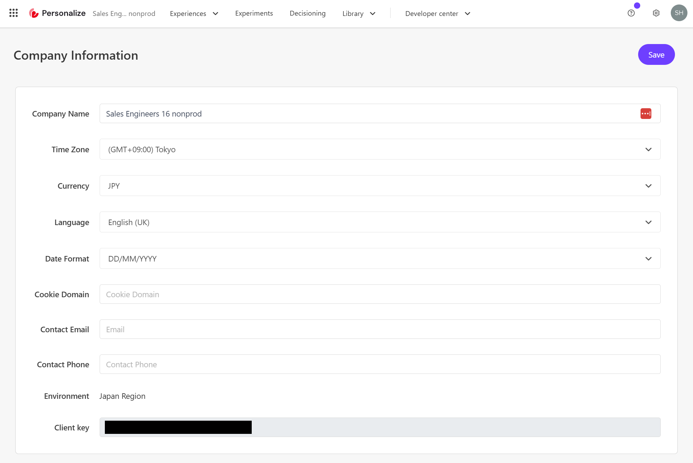

For `YOUR-POINT-OF-SALE`, select the point of sale to use from the list.

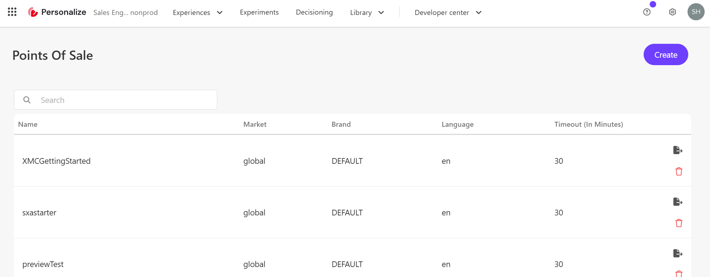

This completes the settings on the Tampermonkey side.

### Preview in Sitecore Personalize

Move to the Sitecore Personalize screen again and open the test Experience created earlier.

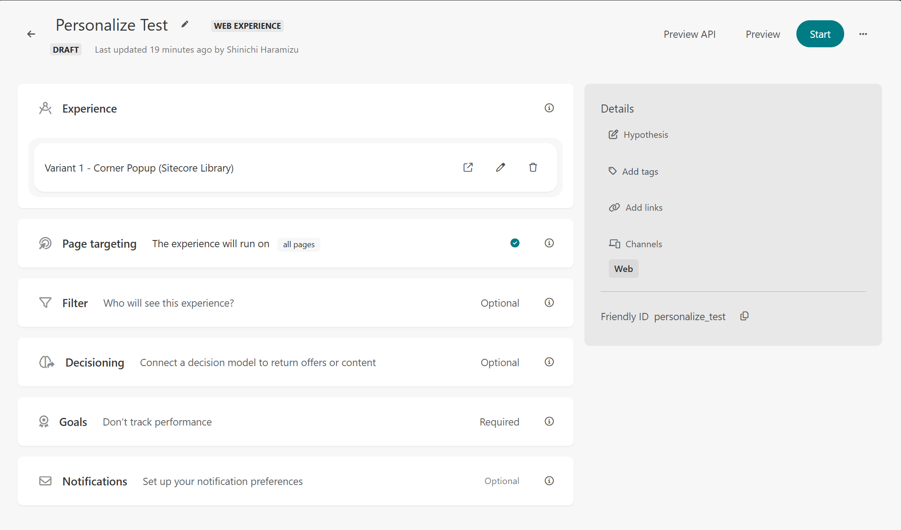

In the upper right menu, there is a `Preview` button. Click this and specify the URL `https://doc.sitecore.com/personalize`.

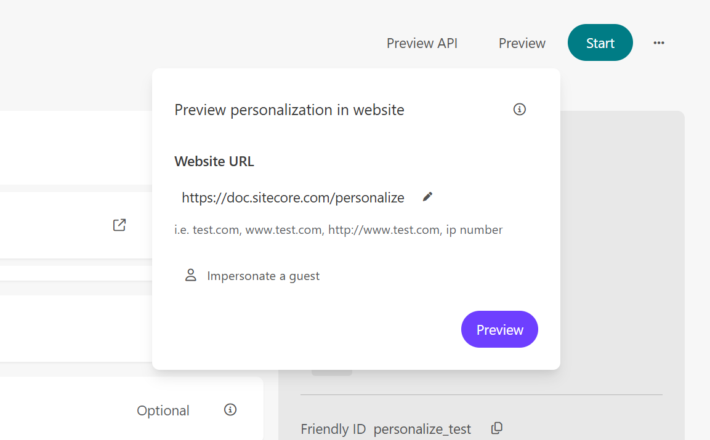

Clicking the Preview button confirms that a popup appears from the bottom right.


Opening the developer tools confirms that the Sitecore Engage SDK Sent VIEW event has occurred.

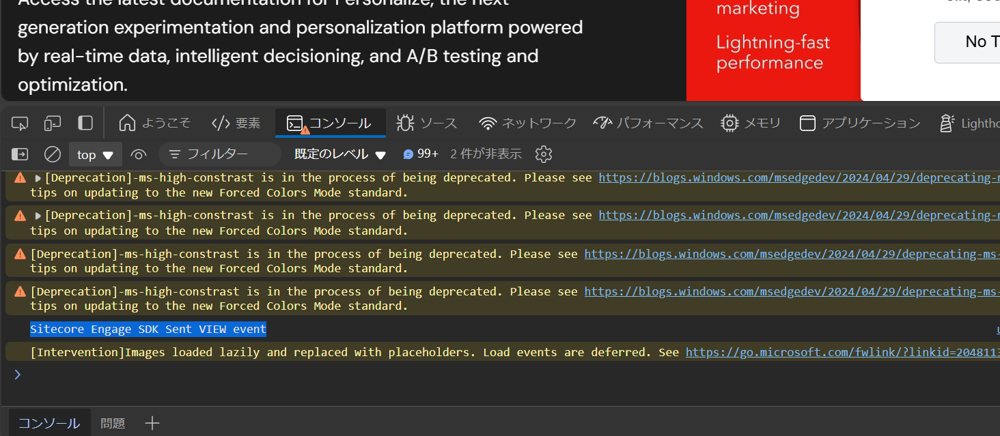

When using the Preview in Sitecore Personalize, a QA Tool button is prepared. Opening this tool allows you to check if it is working correctly.

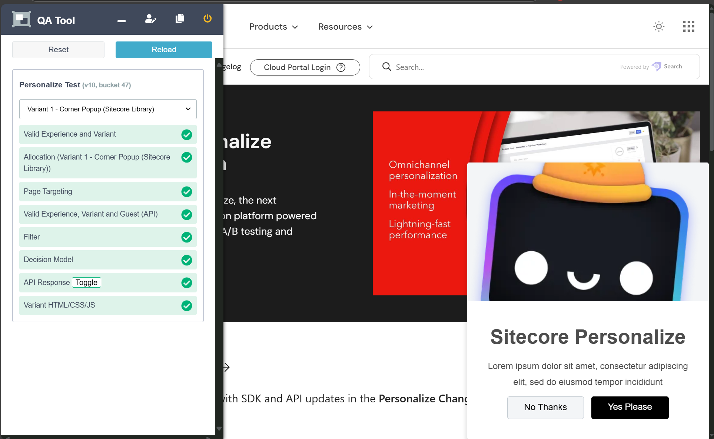

## Summary

This time, we used Tampermonkey to verify if personalization can be executed using browser-side scripts. After confirming that it works with Tampermonkey, it will proceed smoothly to apply it to the website.

## References

- [Collect required details - Stream API target endpoint](https://doc.sitecore.com/personalize/en/developers/api/collect-required-details.html#stream-api-target-endpoint)
- [SitecoreNA / Sitecore-CDP-Scripts](https://github.com/SitecoreNA/Sitecore-CDP-Scripts)
