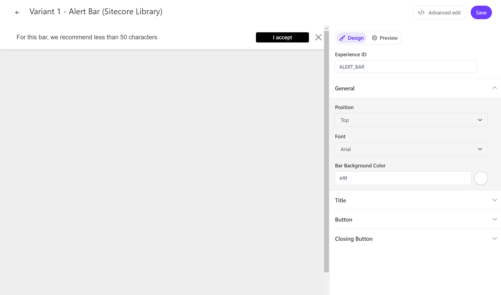
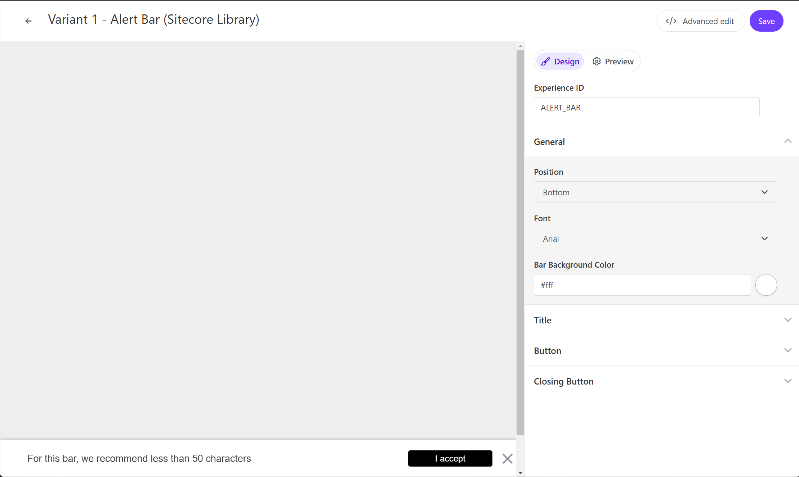

On this page, you can check out a demo of the standard Alert Bar template provided by Sitecore Personalize.

### Display Position

The Alert Bar can be displayed at the top or bottom of the page. The setting item is `General` - `Position`.





### Text

You can change the text used in the Alert Bar. The setting item is `Title` - `Title Text`.

### Button

You can change the button used in the Alert Bar. The setting item is `Button` - `Button Text` for the display text, and `Button Link` for the link destination.

## Code Review

The variables included in the HTML are as follows:

| Variable    | Format | Description   |
| ----------- | ------ | ------------- |
| Title Text  | string | Alert message |
| Button Link | string | URL           |
| Button Text | string | Button label  |

### HTML Code

The HTML for the Alert Bar is set as follows.

```html
// AlertBar.html
<!-- Use dynamic Guest variables, type ctrl+space or guest to explore available entities.-->
<!-- Type "d" to see decisioning helpers -->
<div id="pers_TopBanner">
  <div class="pers_TopBanner__banner">
    <p class="pers_TopBanner__p">
      <span class="pers_TopBanner__p--span" style="display: inline;"
        >[[Title Text | string | For this bar, we recommend less than 50 characters| {max: 50 ,
        group: Title, groupOrder: 2, order: 1 }]]</span
      >
      <a
        id="pers_TopBanner-button"
        class="pers_TopBanner__p--button"
        href="[[Button Link | string |https://www.example.com/ | { group: Button , required: false, order: 2 } ]]"
        >[[Button Text | string | I accept | { group: Button, order: 1 }]]</a
      >
    </p>
    <div class="pers__btn-close"></div>
  </div>
</div>
```

### JavaScript Code

The JavaScript for the Alert Bar is set as follows.

```js
// AlertBar.js
// Adds a unique variant identifier to CSS when deployed to ensure CSS does not impact styling of other elements.
var compiledCSS = Engage.templating.compile(variant.assets.css)(variant);
var styleTag = document.getElementById('style-' + variant.ref);
if (styleTag) {
  styleTag.innerHTML = compiledCSS;
}
// End Adds a unique variant identifier to CSS when deployed to ensure CSS does not impact styling of other elements.

// make space in the body for the experience
document.body.classList.add('show-TopBanner');
insertHTMLBefore('body', 'pers-');

// Declarations
const persButton = document.querySelector('#pers-' + variant.ref + ' #pers_TopBanner-button');
const persCloseButton = document.querySelector('#pers-' + variant.ref + ' .pers__btn-close');
const persExperience = document.querySelector('#pers-' + variant.ref + ' #pers_TopBanner');

// Declare Pers function event
const sendInteractionToPersonalize = function (interactionType) {
  const type = '[[ Experience ID | String | ALERT_BAR | {required: true}]]_' + interactionType;
  const eventData = {
    channel: 'WEB',
    pointOfSale: Engage.settings.pointOfSale,
  };
  window.engage.event(type, eventData);
};

//Listen on X button
persCloseButton.addEventListener('click', function () {
  persExperience.style.display = 'none';
  document.body.classList.remove('show-TopBanner');
  sendInteractionToPersonalize('DISMISSED');
});

// Listen on CTA button
persButton.onclick = function () {
  sendInteractionToPersonalize('CLICKED');
  location.href = '[[Button Link]]';
};
```

- [Back to Sample List](/en/personalize/sample/)

